# KẾ HOẠCH CHI TIẾT 16 TUẦN

## NỀN TẢNG CHIA SẺ VÀ TÌM KIẾM VIỆC LÀM VIỆT NAM
## Kiến trúc Microservices - Web (React + Vite) + Mobile (Flutter)

---

## 1. THÔNG TIN DỰ ÁN

### 1.1. Mục tiêu
Xây dựng nền tảng kết nối nhà tuyển dụng và người tìm việc tại Việt Nam, sử dụng kiến trúc microservices, hỗ trợ cả web và mobile.

**Mục tiêu học tập:**
- Thực hành kiến trúc microservices với Spring Boot
- Làm quen với message broker (Kafka) và event-driven architecture
- Thực hành containerization với Docker
- Xây dựng crawler dữ liệu với Python/Scrapy
- Phát triển ứng dụng web với React + Vite (SPA)
- Phát triển ứng dụng mobile với Flutter

### 1.2. Đội ngũ
- 4 thành viên
- Thời gian: 16 tuần

### 1.3. Công nghệ sử dụng

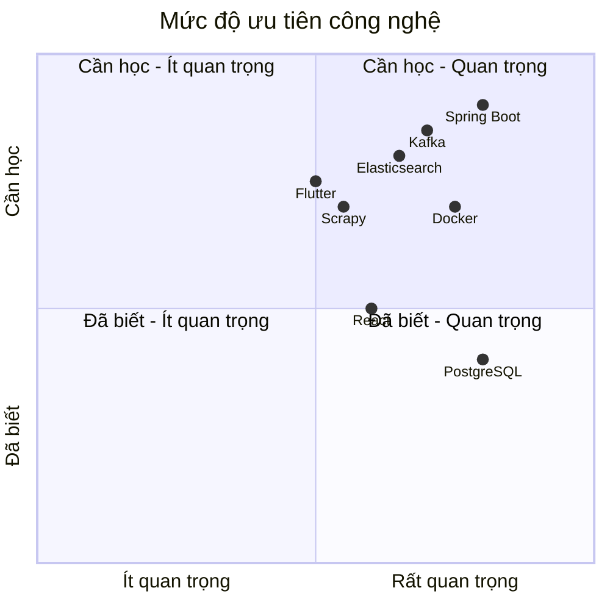

| Thành phần | Công nghệ | Mục đích học tập |
|:---|:---|:---|
| **Backend Framework** | Spring Boot 4.x (Spring Framework 7, Java 25 LTS) | Microservices, REST API, Dependency Injection |
| **API Gateway** | Spring Cloud Gateway | Routing, Rate Limiting, Authentication |
| **Service Discovery** | Eureka (Spring Cloud Netflix) | Service registration và discovery (lưu ý 2026: Eureka ở chế độ maintenance — khi chạy trên Kubernetes ưu tiên dùng K8s Service/DNS) |
| **Message Broker** | Apache Kafka 4.x (KRaft mode — ZooKeeper đã bị loại bỏ từ Kafka 4.0, 03/2025) | Event-driven architecture, Async communication |
| **Database** | PostgreSQL | ACID, Database per service |
| **Search Engine** | Elasticsearch | Full-text search, Indexing |
| **Cache** | Redis | Caching, Rate limiting, Session storage |
| **Crawler** | Python + Scrapy | Web scraping, Data pipeline |
| **Web Frontend** | React 19 + Vite | SPA, Component-based architecture |
| **Mobile** | Flutter | Cross-platform development |
| **Container** | Docker + Docker Compose | Containerization, Environment setup |
| **CI/CD** | GitHub Actions | Automated build, test, deploy |
| **API Doc** | Swagger/OpenAPI | API documentation |

---

## 2. PHÂN CÔNG THÀNH VIÊN

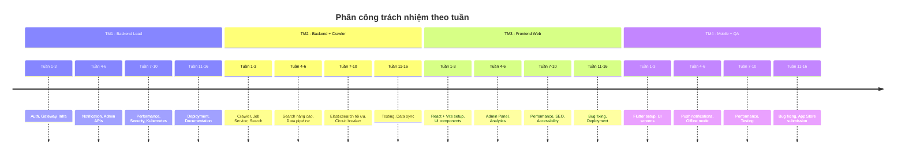

| Mã | Vai trò | Kỹ năng cần có | Trách nhiệm chính |
|:---|:---|:---|:---|
| **TM1** | Backend Lead + DevOps | Spring Boot, Docker, Kafka | Auth Service, API Gateway, Infrastructure, CI/CD |
| **TM2** | Backend + Crawl Specialist | Python, Java, Elasticsearch | Crawler Service, Search Service, Job Service |
| **TM3** | Frontend Web | React, TypeScript, Tailwind | Web application, Admin Dashboard, API integration |
| **TM4** | Mobile + QA | Flutter, Testing | Mobile app, Integration testing, Bug tracking |

---

## 3. KẾ HOẠCH CHI TIẾT 16 TUẦN

---

### GIAI ĐOẠN 1: KHỞI TẠO VÀ HẠ TẦNG (Tuần 1-3)

---

#### TUẦN 1: THIẾT LẬP MÔI TRƯỜNG & KIẾN TRÚC

**Mục tiêu**: Thiết lập môi trường phát triển, kiến trúc microservices cơ bản.

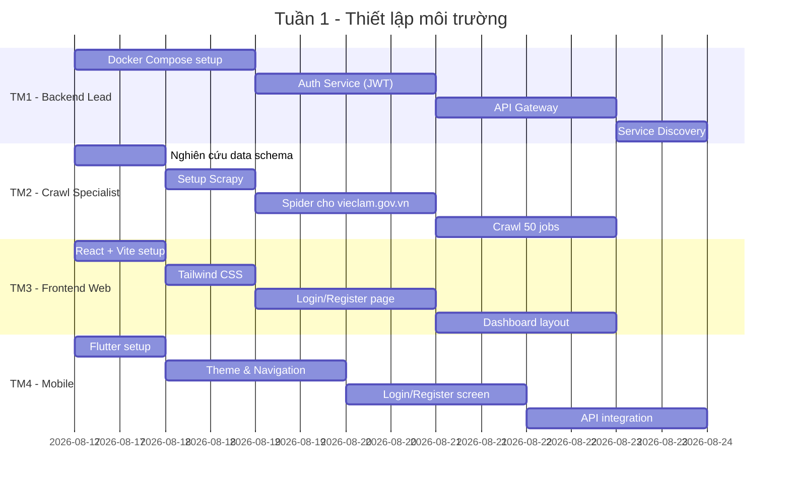

**Công việc chi tiết:**

**Thứ 2**
- Tất cả: Họp kickoff, thống nhất yêu cầu, luồng dữ liệu
- TM1: Tạo repository, thiết kế kiến trúc tổng thể
- TM2: Nghiên cứu các trang tuyển dụng Việt Nam, xác định data schema
- TM3: Khởi tạo React + Vite project, setup Tailwind CSS
- TM4: Khởi tạo Flutter project, thiết kế theme

**Thứ 3**
- TM1: Docker Compose setup: PostgreSQL, Redis, Elasticsearch, Kafka 4.x (KRaft mode, không cần ZooKeeper)
- TM2: Setup Scrapy project, phân tích cấu trúc vieclam.gov.vn
- TM3: Thiết kế hệ thống màu, typography, layout base
- TM4: Setup navigation, color scheme cho mobile

**Thứ 4**
- TM1: Xây dựng Auth Service cơ bản (JWT, login, register)
- TM2: Viết spider cho vieclam.gov.vn, crawl thử 10 jobs
- TM3: Xây dựng trang login/register với form validation
- TM4: Xây dựng màn hình login/register

**Thứ 5**
- TM1: API Gateway setup, route auth requests
- TM2: Xử lý làm sạch dữ liệu, lưu vào PostgreSQL
- TM3: Xây dựng dashboard layout, sidebar navigation
- TM4: Thiết kế home page với bottom navigation

**Thứ 6**
- TM1: Service Discovery (Eureka), Config Server
- TM2: Crawl 50 jobs từ vieclam.gov.vn
- TM3: Tối ưu responsive web
- TM4: Tích hợp API login/register

**Thứ 7**
- Tất cả: Kiểm tra tích hợp, review code, giải quyết lỗi

**Kết quả đầu ra tuần 1:**
- Docker chạy được 4 services hạ tầng (PostgreSQL, Redis, Elasticsearch, Kafka KRaft)
- Auth Service hoàn chỉnh (đăng ký/đăng nhập/JWT)
- Crawl được 50+ jobs từ vieclam.gov.vn
- Web có trang login + dashboard cơ bản
- Mobile có login + home page

---

#### TUẦN 2: PHÁT TRIỂN CORE SERVICES

**Mục tiêu**: Xây dựng Job Service, Search Service, hoàn thiện crawler.

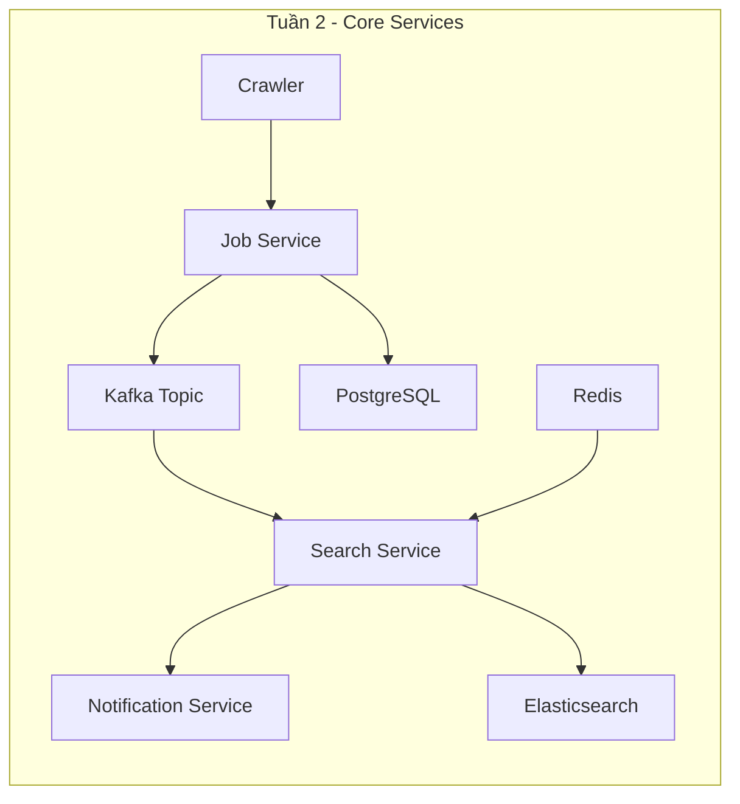

**Công việc chi tiết:**

**Thứ 2**
- TM1: Cấu hình Kafka (KRaft mode), tạo topic `job-events`
- TM2: Tối ưu crawler, thêm retry mechanism
- TM3: Xây dựng trang danh sách job với pagination
- TM4: Thiết kế màn hình danh sách job

**Thứ 3**
- TM1: Xây dựng Job Service (CRUD operations)
- TM2: Crawl bổ sung 200 jobs, xử lý duplicate
- TM3: Xây dựng trang chi tiết job
- TM4: Xây dựng màn hình chi tiết job

**Thứ 4**
- TM1: Tích hợp Job Service với Kafka (publish event khi có job mới)
- TM2: Xây dựng Search Service với Elasticsearch
- TM3: Xây dựng trang tạo tin tuyển dụng (form cơ bản)
- TM4: Xây dựng form ứng tuyển cơ bản

**Thứ 5**
- TM1: Xây dựng Notification Service (gửi email)
- TM2: Đồng bộ dữ liệu PostgreSQL → Elasticsearch
- TM3: Tích hợp API tạo job
- TM4: Tích hợp API ứng tuyển

**Thứ 6**
- TM1: Tích hợp Redis cache cho search results
- TM2: Tối ưu crawler, crawl thêm 300 jobs từ các nguồn khác
- TM3: Xây dựng trang quản lý job của nhà tuyển dụng
- TM4: Xây dựng màn hình lịch sử ứng tuyển

**Thứ 7**
- Tất cả: Kiểm thử tích hợp Job + Search + Application flow

**Kết quả đầu ra tuần 2:**
- Job Service hoàn chỉnh (CRUD + Kafka events)
- Search Service với Elasticsearch
- Notification Service gửi email
- Crawl được 550+ jobs
- Web và mobile có đầy đủ flow: đăng tin → tìm kiếm → ứng tuyển

---

#### TUẦN 3: APPLICATION & PROFILE SERVICES

**Mục tiêu**: Xây dựng Application Service, Profile Service, File Storage.

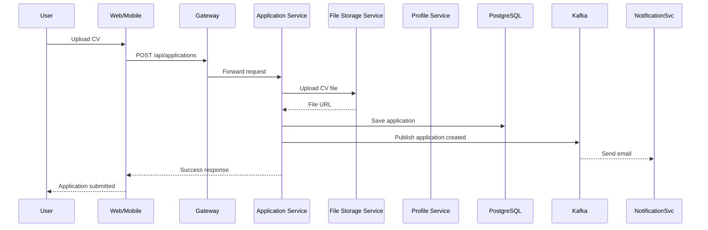

**Công việc chi tiết:**

**Thứ 2**
- TM1: Xây dựng File Storage Service (upload CV, avatar) với MinIO
- TM2: Xây dựng Application Service (tạo đơn ứng tuyển)
- TM3: Xây dựng trang upload CV và ứng tuyển
- TM4: Tích hợp upload CV trên mobile

**Thứ 3**
- TM1: Cấu hình bảo mật cho File Storage Service
- TM2: Xử lý trạng thái đơn ứng tuyển (pending → reviewed → accepted/rejected)
- TM3: Xây dựng trang quản lý đơn ứng tuyển (ứng viên)
- TM4: Xây dựng màn hình quản lý đơn ứng tuyển

**Thứ 4**
- TM1: Xây dựng User Profile Service (lấy/cập nhật thông tin)
- TM2: Tích hợp Application Service với Job Service
- TM3: Xây dựng trang hồ sơ cá nhân
- TM4: Xây dựng màn hình hồ sơ cá nhân

**Thứ 5**
- TM1: Tích hợp notification khi trạng thái đơn thay đổi
- TM2: Xây dựng API đánh giá nhà tuyển dụng
- TM3: Xây dựng trang quản lý ứng viên cho nhà tuyển dụng
- TM4: Tích hợp chức năng đánh giá công ty

**Thứ 6**
- TM1: Cấu hình rate limiting cho API Gateway
- TM2: Tối ưu query, thêm indexes cho database
- TM3: Tối ưu UI/UX web
- TM4: Tối ưu UI/UX mobile

**Thứ 7**
- Tất cả: Kiểm thử toàn bộ flow: đăng tin → tìm kiếm → ứng tuyển → phản hồi

**Kết quả đầu ra tuần 3:**
- Application Service hoàn chỉnh
- File Storage Service (upload CV/avatar)
- User Profile Service
- Web và mobile có toàn bộ user flow

---

### GIAI ĐOẠN 2: MỞ RỘNG TÍNH NĂNG (Tuần 4-6)

---

#### TUẦN 4: TÌM KIẾM NÂNG CAO & THÔNG BÁO REALTIME

**Mục tiêu**: Tìm kiếm nâng cao, thông báo realtime, gợi ý việc làm.

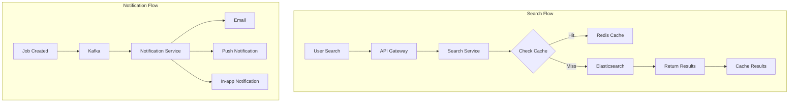

**Công việc chi tiết:**

**Thứ 2**
- TM1: Tích hợp WebSocket cho notification realtime
- TM2: Xây dựng search nâng cao (filter lương, địa điểm, kỹ năng)
- TM3: Xây dựng trang kết quả tìm kiếm với bộ lọc
- TM4: Tích hợp search với filter trên mobile

**Thứ 3**
- TM1: Xây dựng Notification Service gửi push notification
- TM2: Xây dựng tính năng gợi ý việc làm dựa trên kỹ năng
- TM3: Xây dựng trang gợi ý việc làm
- TM4: Tích hợp push notification trên mobile

**Thứ 4**
- TM1: Cache kết quả search phổ biến vào Redis
- TM2: Tối ưu Elasticsearch query, thêm analyzer cho tiếng Việt
- TM3: Xây dựng trang compare jobs
- TM4: Xây dựng màn hình thông báo

**Thứ 5**
- TM1: Cấu hình logging và monitoring (Prometheus + Grafana)
- TM2: Xây dựng API gợi ý kỹ năng cho nhà tuyển dụng
- TM3: Xây dựng trang analytics cho nhà tuyển dụng
- TM4: Tối ưu performance mobile

**Thứ 6**
- TM1: Setup ELK Stack cho centralized logging
- TM2: Viết script backup database
- TM3: Responsive toàn bộ web
- TM4: Test trên iOS và Android

**Thứ 7**
- Tất cả: Kiểm thử toàn hệ thống, sửa lỗi

**Kết quả đầu ra tuần 4:**
- Search nâng cao (nhiều bộ lọc, full-text)
- Notification realtime
- Gợi ý việc làm thông minh
- Analytics cơ bản

---

#### TUẦN 5: ADMIN PANEL & PHÂN QUYỀN

**Mục tiêu**: Xây dựng Admin Panel, phân quyền chi tiết, API management.

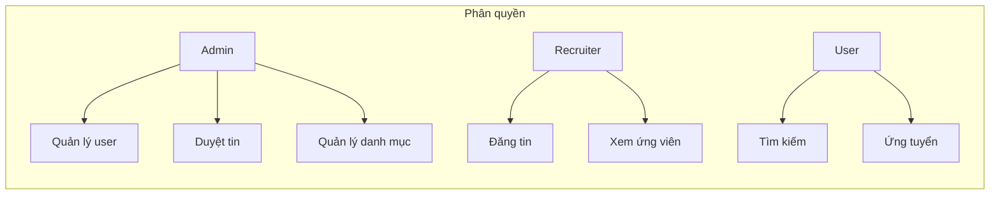

**Công việc chi tiết:**

**Thứ 2**
- TM1: Phân quyền chi tiết (User, Recruiter, Admin)
- TM2: Xây dựng API quản lý người dùng cho Admin
- TM3: Xây dựng Admin Panel (quản lý user, duyệt tin)
- TM4: Tối ưu navigation mobile

**Thứ 3**
- TM1: Xây dựng tính năng khóa/mở khóa tài khoản
- TM2: Xây dựng tính năng quản lý danh mục ngành nghề
- TM3: Xây dựng trang quản lý danh mục (Admin)
- TM4: Tích hợp tính năng lưu tìm kiếm

**Thứ 4**
- TM1: Cấu hình SSL, bảo mật API Gateway
- TM2: Viết unit test và integration test
- TM3: Xây dựng trang báo cáo thống kê (Admin)
- TM4: Tối ưu dark mode, accessibility

**Thứ 5**
- TM1: Setup CI/CD với GitHub Actions
- TM2: Tối ưu performance, connection pool
- TM3: Tối ưu SEO (document metadata native của React 19 — react-helmet đã ngừng bảo trì)
- TM4: Tối ưu kích thước APK/IPA

**Thứ 6**
- TM1: Viết script deploy lên cloud (AWS/GCP)
- TM2: Hoàn thiện API documentation (Swagger)
- TM3: Hoàn thiện trang landing page
- TM4: Hoàn thiện onboarding flow

**Thứ 7**
- Tất cả: User Acceptance Testing (UAT)

**Kết quả đầu ra tuần 5:**
- Admin Panel đầy đủ chức năng
- Phân quyền hoàn chỉnh
- CI/CD pipeline tự động
- API documentation hoàn chỉnh

---

#### TUẦN 6: DATA PIPELINE & CRAWLER NÂNG CAO

**Mục tiêu**: Hoàn thiện data pipeline, crawler tự động, xử lý data quality.

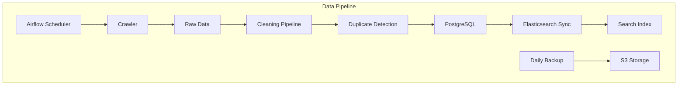

**Công việc chi tiết:**

**Thứ 2**
- TM1: Setup Airflow cho job scheduling
- TM2: Xây dựng pipeline làm sạch dữ liệu
- TM3: Cải thiện UI/UX theo feedback
- TM4: Cải thiện UI/UX mobile

**Thứ 3**
- TM1: Cấu hình backup tự động (daily)
- TM2: Tối ưu crawler (chỉ crawl data mới)
- TM3: Thêm loading states, error boundaries
- TM4: Tối ưu offline mode

**Thứ 4**
- TM1: Monitoring dashboard (Grafana)
- TM2: Xử lý lỗi và retry cho crawler
- TM3: Thêm animations, transitions
- TM4: Thêm animations, transitions

**Thứ 5**
- TM1: Cấu hình auto-scaling (Kubernetes/HPA)
- TM2: Data quality reports, duplicate detection
- TM3: Tối ưu bundle size
- TM4: Tối ưu memory usage

**Thứ 6**
- TM1: Load testing (k6/JMeter)
- TM2: Tối ưu Elasticsearch cluster
- TM3: Tối ưu error handling
- TM4: Tối ưu error handling

**Thứ 7**
- Tất cả: Kiểm thử toàn diện

**Kết quả đầu ra tuần 6:**
- Data pipeline hoàn chỉnh
- Auto-scaling configured
- Monitoring dashboard
- Load test report

---

### GIAI ĐOẠN 3: TỐI ƯU & BẢO MẬT (Tuần 7-10)

---

#### TUẦN 7: TỐI ƯU HIỆU NĂNG

**Mục tiêu**: Tối ưu hiệu năng toàn hệ thống.

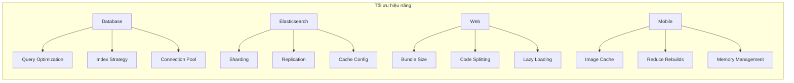

| Thành viên | Công việc |
|:---|:---|
| **TM1** | Database optimization (query optimization, indexing strategy) |
| **TM2** | Elasticsearch optimization (sharding, replication, caching) |
| **TM3** | Web optimization (bundle size, code splitting, lazy loading) |
| **TM4** | Mobile optimization (image caching, reduce rebuilds) |

**Kết quả đầu ra tuần 7:**
- Database query time < 50ms
- Search response < 200ms
- Web FCP < 1.5s
- Mobile app size < 30MB

---

#### TUẦN 8: TĂNG CƯỜNG BẢO MẬT

**Mục tiêu**: Đảm bảo an toàn dữ liệu và hệ thống.

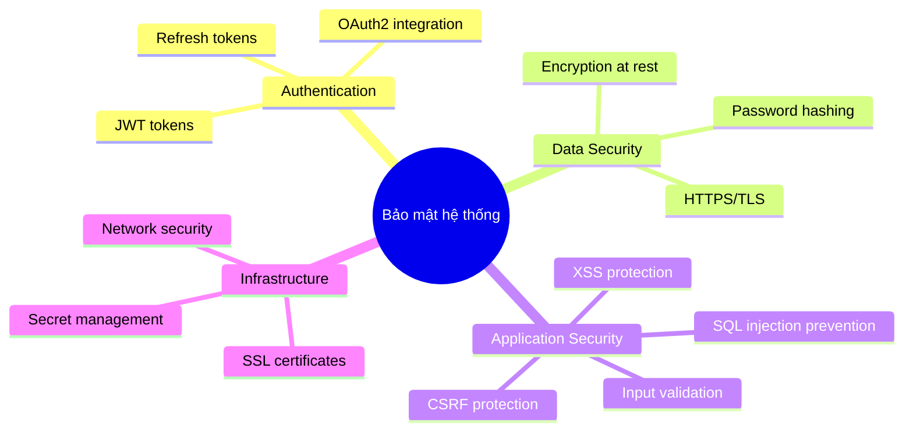

| Thành viên | Công việc |
|:---|:---|
| **TM1** | JWT security, OAuth2 integration, SSL/TLS configuration |
| **TM2** | SQL injection prevention, XSS protection, input validation |
| **TM3** | CSP, X-Frame-Options, secure cookies |
| **TM4** | Secure storage (token, sensitive data) |

**Kết quả đầu ra tuần 8:**
- Security scan không có lỗi critical
- HTTPS configured
- SQL injection test passed
- XSS test passed

---

#### TUẦN 9: MONITORING & LOGGING

**Mục tiêu**: Hệ thống monitoring và logging toàn diện.

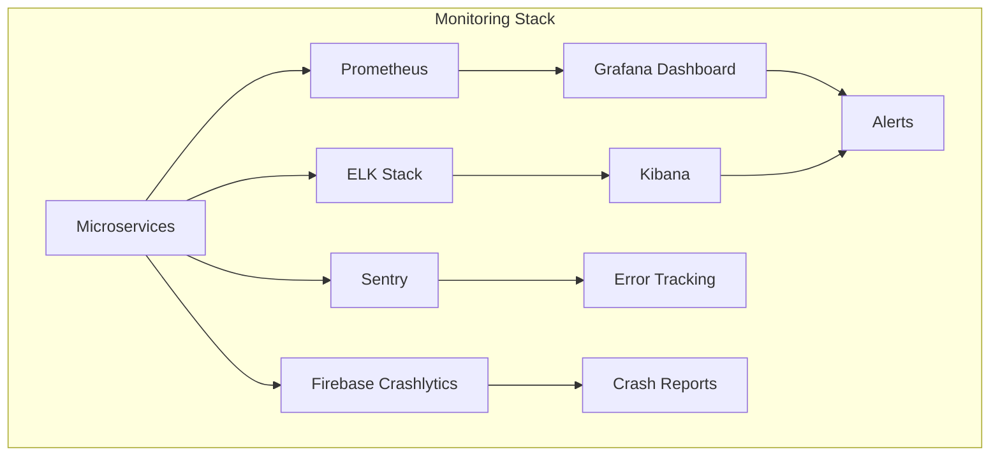

| Thành viên | Công việc |
|:---|:---|
| **TM1** | Prometheus + Grafana setup, alert rules |
| **TM2** | ELK Stack setup, log aggregation |
| **TM3** | Frontend monitoring (Sentry/LogRocket) |
| **TM4** | Mobile crash reporting (Firebase Crashlytics) |

**Kết quả đầu ra tuần 9:**
- Grafana dashboard real-time
- Alert when service down
- Logs centralized
- Crash reports collected

---

#### TUẦN 10: SCALING & RESILIENCE

**Mục tiêu**: Đảm bảo hệ thống có thể scale và resilient.

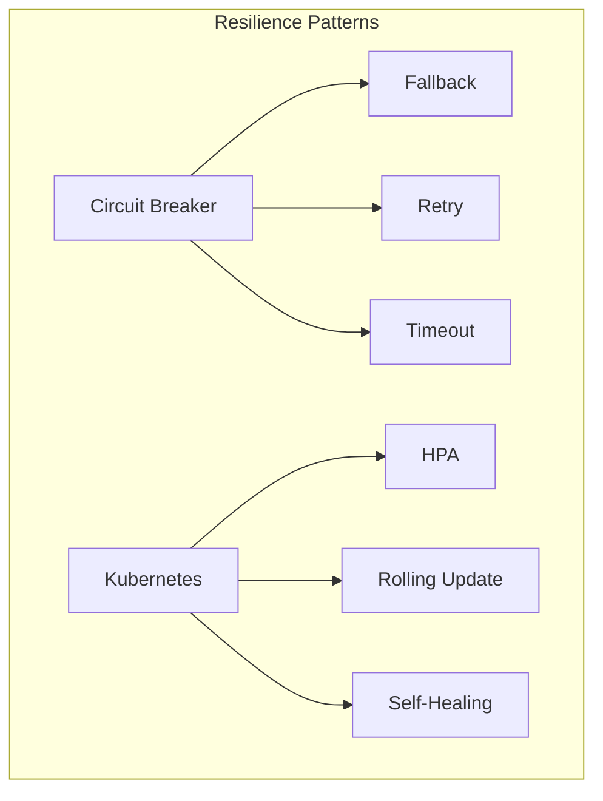

| Thành viên | Công việc |
|:---|:---|
| **TM1** | Kubernetes deployment, HPA (Horizontal Pod Autoscaler) |
| **TM2** | Circuit breaker implementation (Resilience4j) |
| **TM3** | CDN configuration, caching strategy |
| **TM4** | Mobile offline capabilities |

**Kết quả đầu ra tuần 10:**
- Kubernetes deployment ready
- Circuit breaker hoạt động
- CDN configured
- Mobile có thể hoạt động offline

---

### GIAI ĐOẠN 4: KIỂM THỬ & HOÀN THIỆN (Tuần 11-13)

---

#### TUẦN 11: KIỂM THỬ HỆ THỐNG

**Mục tiêu**: Kiểm thử toàn diện, đảm bảo chất lượng.

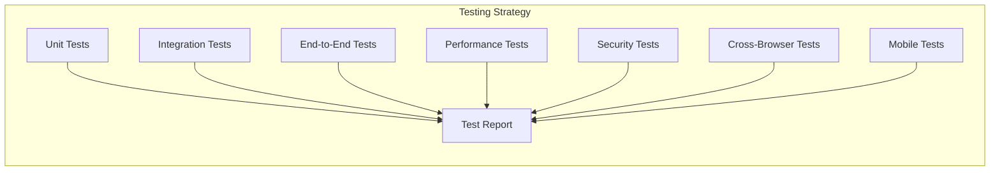

| Ngày | Hoạt động |
|:---|:---|
| Thứ 2 | TM1+TM2: Integration testing toàn bộ services |
| Thứ 3 | TM3: Cross-browser testing (Chrome, Firefox, Safari) |
| Thứ 4 | TM4: Mobile testing (iOS 16+, Android 12+) |
| Thứ 5 | Tất cả: Performance testing với k6 (100 concurrent users) |
| Thứ 6 | Tất cả: Bug fixing priority |
| Thứ 7 | Tất cả: Bug fixing tiếp tục |

**Kết quả đầu ra tuần 11:**
- Test report hoàn chỉnh
- 90% test cases passed
- Performance test passed

---

#### TUẦN 12: STAGING DEPLOYMENT

**Mục tiêu**: Triển khai staging, user testing.

| Thành viên | Công việc |
|:---|:---|
| **TM1** | Deploy lên staging (AWS/GCP) |
| **TM2** | Sync dữ liệu lên staging |
| **TM3** | Deploy web lên staging |
| **TM4** | Deploy mobile lên TestFlight/Play Console |

**Kết quả đầu ra tuần 12:**
- Staging environment live
- 5-10 users tested
- Feedback collected

---

#### TUẦN 13: BUG FIXING & POLISHING

**Mục tiêu**: Sửa lỗi từ user testing, hoàn thiện sản phẩm.

| Thành viên | Công việc |
|:---|:---|
| **TM1** | Sửa lỗi backend, điều chỉnh config |
| **TM2** | Sửa lỗi crawler, bổ sung data |
| **TM3** | Sửa lỗi web (UI/UX, responsive) |
| **TM4** | Sửa lỗi mobile (crashes, UI) |

**Kết quả đầu ra tuần 13:**
- 95% lỗi được sửa
- Sản phẩm sẵn sàng production

---

### GIAI ĐOẠN 5: TRIỂN KHAI & BÁO CÁO (Tuần 14-16)

---

#### TUẦN 14: PRODUCTION DEPLOYMENT

**Mục tiêu**: Triển khai production, go-live.

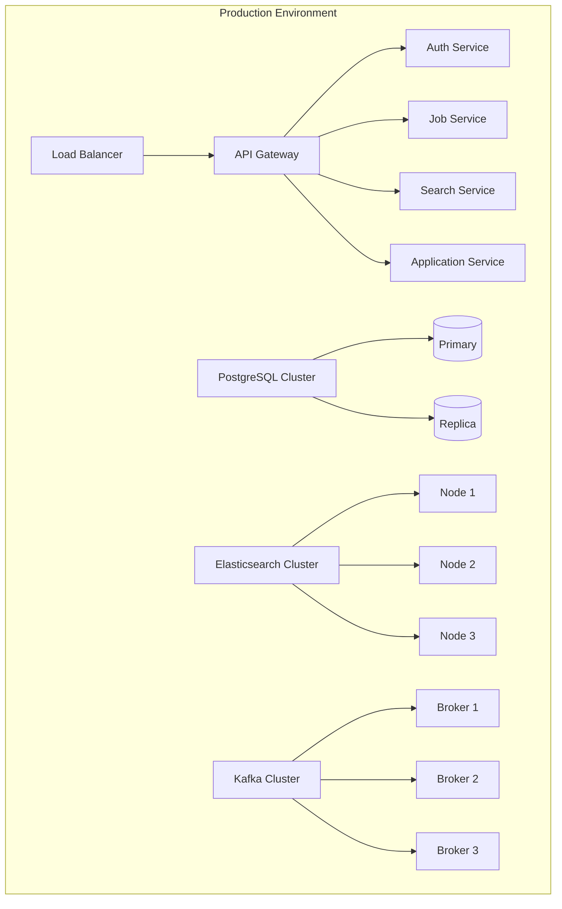

| Thành viên | Công việc |
|:---|:---|
| **TM1** | Deploy lên production, SSL, domain |
| **TM2** | Crawl data production, sync lần cuối |
| **TM3** | Build web production, deploy |
| **TM4** | Submit app lên App Store/Google Play |

**Kết quả đầu ra tuần 14:**
- Production live
- Monitoring active
- Backup configured

---

#### TUẦN 15: TÀI LIỆU & BÁO CÁO

**Mục tiêu**: Viết tài liệu đầy đủ cho dự án.

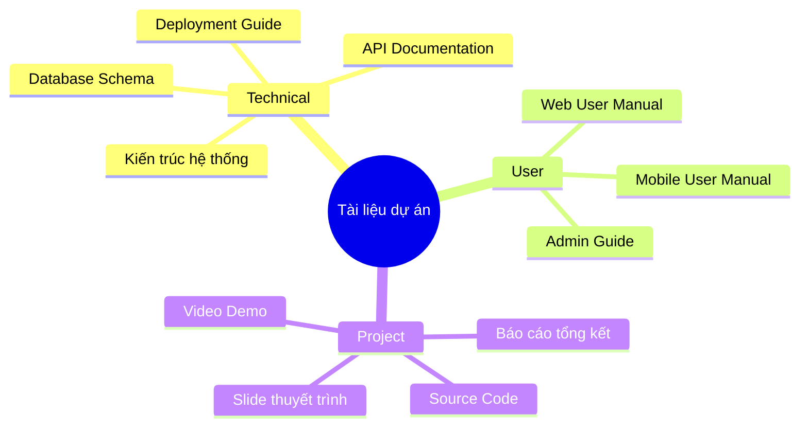

| Thành viên | Công việc |
|:---|:---|
| **TM1** | Technical documentation, deployment guide |
| **TM2** | Crawler documentation, data schema |
| **TM3** | User manual (web), API integration guide |
| **TM4** | User manual (mobile), installation guide |

**Kết quả đầu ra tuần 15:**
- Technical report hoàn chỉnh
- User manual (Web + Mobile)
- Deployment guide
- API documentation

---

#### TUẦN 16: TỔNG KẾT & THUYẾT TRÌNH

**Mục tiêu**: Chuẩn bị thuyết trình, final demo.

| Ngày | Hoạt động |
|:---|:---|
| Thứ 2 | Tất cả: Tổng hợp báo cáo cuối cùng |
| Thứ 3 | Tất cả: Chuẩn bị slide thuyết trình |
| Thứ 4 | Tất cả: Chuẩn bị kịch bản demo |
| Thứ 5 | Tất cả: Rehearsal presentation |
| Thứ 6 | Tất cả: Final presentation + Demo |
| Thứ 7 | Tất cả: Nộp báo cáo và source code |

**Kết quả đầu ra tuần 16:**
- Presentation slides
- Video demo (5-7 phút)
- Final report
- Source code submitted

---

## 4. KIẾN TRÚC MICROSERVICES CHI TIẾT

### 4.1. Sơ đồ kiến trúc tổng thể

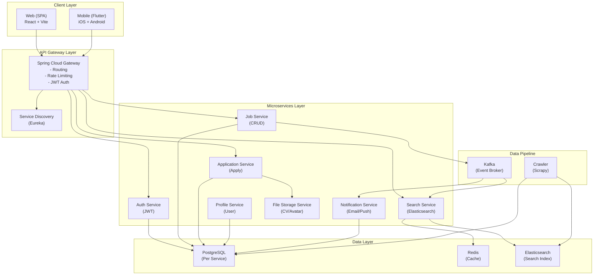

### 4.2. Database per Service

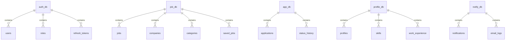

| Service | Database | Tables |
|:---|:---|:---|
| Auth Service | auth_db | users, roles, refresh_tokens |
| Job Service | job_db | jobs, companies, categories, saved_jobs |
| Application Service | app_db | applications, status_history |
| Profile Service | profile_db | profiles, skills, work_experience |
| Notification Service | notify_db | notifications, email_logs |

### 4.3. Event Flow (Kafka)

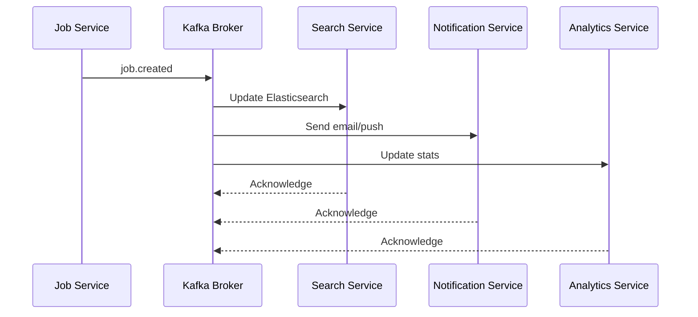

### 4.4. CI/CD Pipeline

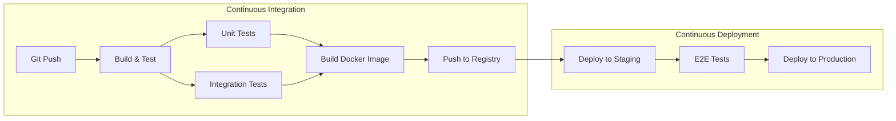

---

## 5. NGUỒN DỮ LIỆU CRAWL

### 5.1. Nguồn ưu tiên

| Nguồn | URL | Ưu tiên | Ghi chú |
|:---|:---|:---|:---|
| Sàn Giao dịch việc làm Quốc gia | vieclam.gov.vn | Cao | Nguồn mở, an toàn pháp lý |
| TopCV | topcv.vn | Trung bình | Có chống crawl, cần rate limit thấp |

### 5.2. Kiến trúc Crawler

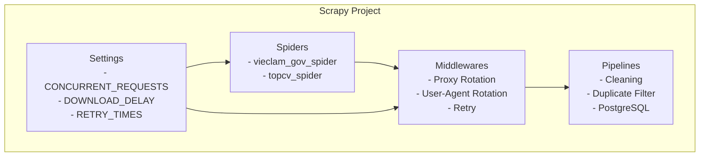

### 5.3. Schedule

| Tần suất | Nguồn | Thời điểm |
|:---|:---|:---|
| Hàng ngày | vieclam.gov.vn | 02:00 AM |
| 3 lần/tuần | TopCV | Thứ 2,4,6 03:00 AM |

---

## 6. TIMELINE TỔNG QUAN

```mermaid
gantt
    title Timeline tổng quan 16 tuần
    dateFormat  YYYY-MM-DD
    section Giai đoạn 1
    Tuần 1 - Setup & Auth           :a1, 2026-08-17, 7d
    Tuần 2 - Core Services          :a2, after a1, 7d
    Tuần 3 - App & Profile          :a3, after a2, 7d
    section Giai đoạn 2
    Tuần 4 - Search & Notification  :a4, after a3, 7d
    Tuần 5 - Admin & Security       :a5, after a4, 7d
    Tuần 6 - Data Pipeline          :a6, after a5, 7d
    section Giai đoạn 3
    Tuần 7 - Performance            :a7, after a6, 7d
    Tuần 8 - Security               :a8, after a7, 7d
    Tuần 9 - Monitoring             :a9, after a8, 7d
    Tuần 10 - Scaling               :a10, after a9, 7d
    section Giai đoạn 4
    Tuần 11 - Testing               :a11, after a10, 7d
    Tuần 12 - Staging               :a12, after a11, 7d
    Tuần 13 - Bug Fixing            :a13, after a12, 7d
    section Giai đoạn 5
    Tuần 14 - Production            :a14, after a13, 7d
    Tuần 15 - Documentation         :a15, after a14, 7d
    Tuần 16 - Final Presentation    :a16, after a15, 7d
```

### Tóm tắt theo tuần

| Tuần | Mục tiêu chính | Deliverable chính |
|:---|:---|:---|
| 1 | Setup environment, Auth Service | Docker, Auth API, 50 jobs |
| 2 | Job Service, Search Service | Search API, 550+ jobs |
| 3 | Application Service, Profile Service | Full flow ứng tuyển |
| 4 | Search nâng cao, Notification | Filter, Push notification |
| 5 | Admin Panel, Security | Admin web, CI/CD |
| 6 | Data pipeline, Crawler nâng cao | Airflow, Data quality |
| 7 | Performance optimization | Query < 50ms, FCP < 1.5s |
| 8 | Security hardening | Security scan passed |
| 9 | Monitoring & Logging | Grafana, ELK stack |
| 10 | Scaling & Resilience | Kubernetes, Circuit breaker |
| 11 | System testing | Test report |
| 12 | Staging deployment | Staging live, user feedback |
| 13 | Bug fixing | 95% bugs fixed |
| 14 | Production deployment | Production live |
| 15 | Documentation | Technical report, user manual |
| 16 | Final presentation | Slides, demo, report |

---

## 7. TIÊU CHÍ ĐÁNH GIÁ

### 7.1. Functional Requirements

```mermaid
mindmap
  root((Functional Requirements))
    Authentication
      Đăng ký tài khoản
      Đăng nhập
      Phân quyền
      Refresh token
    Job Management
      Đăng tin tuyển dụng
      Sửa/Xóa tin
      Lưu tin
      Danh mục ngành nghề
    Search
      Full-text search
      Filter theo lương
      Filter theo địa điểm
      Filter theo kỹ năng
      Gợi ý việc làm
    Application
      Ứng tuyển
      Upload CV
      Xem trạng thái
      Lịch sử ứng tuyển
    Notification
      Email thông báo
      Push notification
      In-app notification
    Admin
      Quản lý user
      Duyệt tin
      Thống kê
      Quản lý danh mục
```

- [ ] User đăng ký/đăng nhập được (Web + Mobile)
- [ ] Nhà tuyển dụng đăng tin được (Web)
- [ ] Ứng viên tìm kiếm được với filter (Web + Mobile)
- [ ] Ứng viên ứng tuyển và upload CV (Web + Mobile)
- [ ] Nhà tuyển dụng xem danh sách ứng viên (Web)
- [ ] Hệ thống gửi thông báo
- [ ] Admin quản lý người dùng và tin (Web)
- [ ] Search hoạt động với 1000+ jobs

### 7.2. Non-functional Requirements

- [ ] Response time < 2s cho 95% requests
- [ ] System uptime > 99%
- [ ] Support 100 concurrent users
- [ ] Security: HTTPS, JWT, password hashing
- [ ] Code coverage > 70%
- [ ] Tài liệu API đầy đủ

### 7.3. Deliverables

- [ ] Source code trên GitHub
- [ ] Docker Compose cho toàn bộ system
- [ ] Production deployment script
- [ ] API Documentation (Swagger)
- [ ] User manual (Web + Mobile)
- [ ] Technical report
- [ ] Presentation slides
- [ ] Video demo (5-7 phút)

---

## 8. QUẢN LÝ RỦI RO

### 8.1. Ma trận rủi ro

```mermaid
quadrantChart
    title Ma trận rủi ro
    x-axis "Ít ảnh hưởng" --> "Ảnh hưởng lớn"
    y-axis "Ít xảy ra" --> "Hay xảy ra"
    quadrant-1 "Cần theo dõi"
    quadrant-2 "Cần hành động"
    quadrant-3 "Chấp nhận được"
    quadrant-4 "Cần giám sát"
    Crawler bị chặn IP: [0.7, 0.8]
    Thiếu kỹ năng team: [0.6, 0.6]
    Tích hợp service lỗi: [0.5, 0.7]
    Thiếu thời gian: [0.8, 0.5]
    Dữ liệu không đủ: [0.3, 0.4]
```

### 8.2. Chi tiết rủi ro và cách xử lý

| Rủi ro | Mức độ | Cách xử lý |
|:---|:---|:---|
| Crawler bị chặn IP | Cao | Proxy rotation, delay, ưu tiên nguồn chính thống |
| Thành viên thiếu kỹ năng | Trung bình | Pair programming, training nội bộ |
| Tích hợp service lỗi | Trung bình | Sprint review hàng tuần, test sớm |
| Thiếu thời gian | Trung bình | Ưu tiên tính năng core, cắt scope nếu cần |
| Dữ liệu không đủ | Thấp | Tạo dữ liệu mẫu thay thế |

---

## 9. CÔNG CỤ & TÀI LIỆU THAM KHẢO

### 9.1. Công cụ phát triển

| Mục đích | Công cụ |
|:---|:---|
| Version Control | Git + GitHub |
| Project Management | Trello/Notion/Jira |
| API Testing | Postman |
| Code Review | GitHub Pull Requests |
| Documentation | Markdown, Swagger |
| Diagram | Mermaid.js |

### 9.2. Tài liệu tham khảo

| Công nghệ | Tài liệu |
|:---|:---|
| Spring Boot Microservices | https://spring.io/microservices |
| Apache Kafka | https://kafka.apache.org/documentation |
| Elasticsearch | https://www.elastic.co/guide |
| Scrapy | https://docs.scrapy.org |
| Docker | https://docs.docker.com |
| React | https://react.dev |
| Vite | https://vitejs.dev |
| Flutter | https://docs.flutter.dev |
| Kubernetes | https://kubernetes.io/docs |
| Prometheus | https://prometheus.io/docs |

---

**Ngày bắt đầu:** 17/08/2026 (Thứ Hai)
**Ngày kết thúc:** 06/12/2026 (Chủ Nhật, sau 16 tuần)
**Phiên bản:** 3.1 (cập nhật 17/08/2026 — timeline và công nghệ theo best practice 2026)
**Người lập:** Đội ngũ phát triển