# KẾ HOẠCH CHI TIẾT 16 TUẦN (PHIÊN BẢN N-LAYER + MONOREPO)

## NỀN TẢNG CHIA SẺ VÀ TÌM KIẾM VIỆC LÀM VIỆT NAM
## Kiến trúc N-Layer (Monolithic) - Web (React + Vite) + Mobile (Flutter)

---

## 1. THÔNG TIN DỰ ÁN

### 1.1. Mục tiêu
Xây dựng nền tảng kết nối nhà tuyển dụng và người tìm việc tại Việt Nam, sử dụng kiến trúc N-Layer (Monolithic với phân lớp rõ ràng), hỗ trợ cả web và mobile.

**Mục tiêu học tập:**
- Thực hành kiến trúc N-Layer (Presentation - Business - Data Access)
- Làm quen với monorepo và tổ chức code
- Thực hành containerization với Docker
- Xây dựng crawler dữ liệu với Python/Scrapy
- Phát triển ứng dụng web với React + Vite (SPA)
- Phát triển ứng dụng mobile với Flutter

### 1.2. So sánh với Microservices

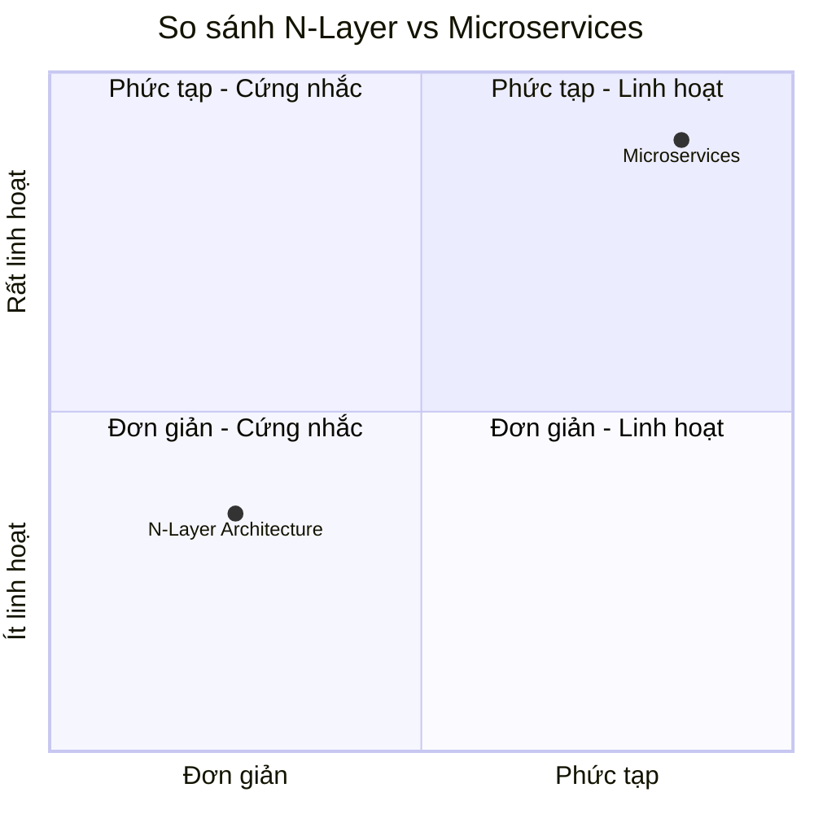

### 1.3. Đội ngũ
- 4 thành viên
- Thời gian: 16 tuần

### 1.4. Công nghệ sử dụng

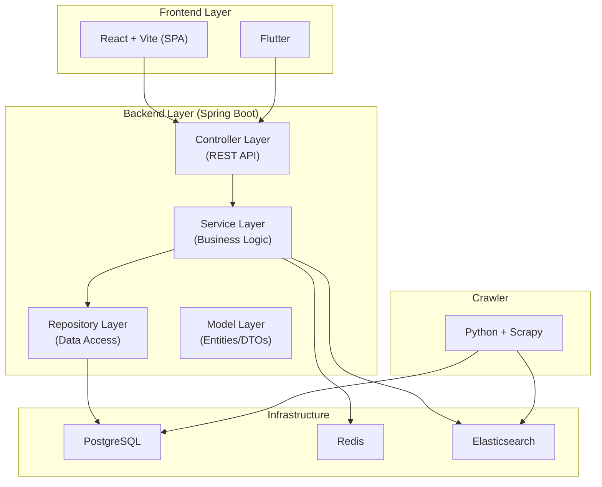

| Thành phần | Công nghệ | Mục đích học tập |
|:---|:---|:---|
| **Backend Framework** | Spring Boot 4.x (Spring Framework 7, Java 25 LTS) | N-Layer architecture, REST API, Dependency Injection |
| **Controller Layer** | Spring MVC | Xử lý request/response, validation |
| **Service Layer** | Spring Service | Business logic, transaction management |
| **Repository Layer** | Spring Data JPA | Database access, ORM |
| **Database** | PostgreSQL | ACID, Relational database |
| **Search Engine** | Elasticsearch | Full-text search, Indexing |
| **Cache** | Redis | Caching, Rate limiting, Session storage |
| **Crawler** | Python + Scrapy | Web scraping, Data pipeline |
| **Web Frontend** | React 19 + Vite | SPA, Component-based architecture |
| **Mobile** | Flutter | Cross-platform development |
| **Container** | Docker + Docker Compose | Containerization, Environment setup |
| **Monorepo** | Single Repository | Code organization, Shared modules |
| **CI/CD** | GitHub Actions | Automated build, test, deploy |

---

## 2. KIẾN TRÚC N-LAYER CHI TIẾT

### 2.1. Các tầng trong ứng dụng

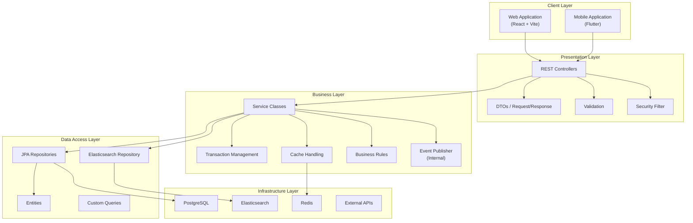

### 2.2. Package Structure (Monorepo)

```
job-platform/
├── backend/                           # Spring Boot Backend
│   └── src/main/java/com/jobplatform/
│       ├── config/                    # Configuration classes
│       │   ├── SecurityConfig.java
│       │   ├── RedisConfig.java
│       │   ├── ElasticsearchConfig.java
│       │   └── WebConfig.java
│       ├── controller/                # Presentation Layer
│       │   ├── AuthController.java
│       │   ├── JobController.java
│       │   ├── ApplicationController.java
│       │   ├── ProfileController.java
│       │   ├── AdminController.java
│       │   └── SearchController.java
│       ├── dto/                       # Data Transfer Objects
│       │   ├── request/
│       │   │   ├── LoginRequest.java
│       │   │   ├── JobRequest.java
│       │   │   └── ApplicationRequest.java
│       │   └── response/
│       │       ├── AuthResponse.java
│       │       ├── JobResponse.java
│       │       └── ApplicationResponse.java
│       ├── service/                   # Business Layer
│       │   ├── AuthService.java
│       │   ├── JobService.java
│       │   ├── ApplicationService.java
│       │   ├── ProfileService.java
│       │   ├── SearchService.java
│       │   ├── NotificationService.java
│       │   └── FileStorageService.java
│       ├── repository/                # Data Access Layer
│       │   ├── UserRepository.java
│       │   ├── JobRepository.java
│       │   ├── ApplicationRepository.java
│       │   ├── CompanyRepository.java
│       │   └── CategoryRepository.java
│       ├── entity/                    # JPA Entities
│       │   ├── User.java
│       │   ├── Job.java
│       │   ├── Application.java
│       │   ├── Company.java
│       │   └── Category.java
│       ├── model/                     # Elasticsearch Documents
│       │   └── JobDocument.java
│       ├── exception/                 # Exception Handling
│       │   ├── GlobalExceptionHandler.java
│       │   ├── BusinessException.java
│       │   └── ResourceNotFoundException.java
│       └── util/                      # Utility classes
│           ├── JwtUtil.java
│           └── FileUtil.java
├── crawler/                           # Python Scrapy Crawler
│   ├── spiders/
│   │   ├── vieclam_gov_spider.py
│   │   └── topcv_spider.py
│   ├── pipelines/
│   │   ├── cleaning_pipeline.py
│   │   ├── duplicate_filter.py
│   │   └── postgres_pipeline.py
│   ├── middlewares/
│   │   └── proxy_middleware.py
│   └── settings.py
├── web/                               # React + Vite Frontend
│   ├── src/
│   │   ├── api/                       # API integration
│   │   │   ├── authApi.js
│   │   │   ├── jobApi.js
│   │   │   ├── applicationApi.js
│   │   │   └── client.js
│   │   ├── components/                # Reusable components
│   │   │   ├── common/
│   │   │   ├── job/
│   │   │   ├── auth/
│   │   │   └── dashboard/
│   │   ├── pages/                     # Page components
│   │   │   ├── HomePage.jsx
│   │   │   ├── JobListPage.jsx
│   │   │   ├── JobDetailPage.jsx
│   │   │   ├── LoginPage.jsx
│   │   │   ├── RegisterPage.jsx
│   │   │   ├── Dashboard.jsx
│   │   │   ├── PostJobPage.jsx
│   │   │   └── AdminPanel.jsx
│   │   ├── hooks/                     # Custom hooks
│   │   ├── store/                     # State management (Zustand)
│   │   ├── utils/                     # Utility functions
│   │   └── styles/                    # CSS/Tailwind
│   ├── index.html
│   ├── package.json
│   └── vite.config.js
├── mobile/                            # Flutter Mobile App
│   ├── lib/
│   │   ├── screens/                   # UI Screens
│   │   │   ├── home/
│   │   │   ├── job/
│   │   │   ├── auth/
│   │   │   └── profile/
│   │   ├── widgets/                   # Reusable widgets
│   │   ├── services/                  # API services
│   │   ├── models/                    # Data models
│   │   ├── providers/                 # State management
│   │   └── utils/                     # Utility functions
│   ├── pubspec.yaml
│   └── android/ & ios/                # Platform-specific
├── docker/                            # Docker configurations
│   ├── docker-compose.yml
│   ├── Dockerfile.backend
│   ├── Dockerfile.crawler
│   └── Dockerfile.web
├── scripts/                           # Utility scripts
│   ├── backup.sh
│   ├── deploy.sh
│   └── init_db.sql
├── docs/                              # Documentation
│   ├── api/
│   ├── architecture/
│   └── user-guide/
├── .github/
│   └── workflows/
│       ├── ci.yml
│       └── cd.yml
├── README.md
└── Makefile
```

---

## 3. PHÂN CÔNG THÀNH VIÊN

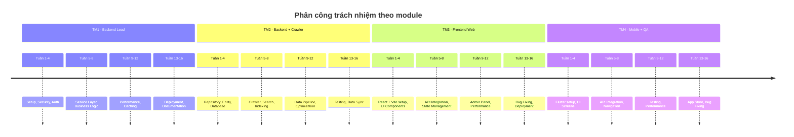

| Mã | Vai trò | Kỹ năng cần có | Trách nhiệm chính |
|:---|:---|:---|:---|
| **TM1** | Backend Lead + DevOps | Spring Boot, Security, Docker | Security, Business Services, Infrastructure |
| **TM2** | Backend + Crawler | Spring Data JPA, Python, Elasticsearch | Repository, Crawler, Search |
| **TM3** | Frontend Web | React, TypeScript, Tailwind | Web application, Admin Dashboard |
| **TM4** | Mobile + QA | Flutter, Testing | Mobile app, Integration testing |

---

## 4. KẾ HOẠCH CHI TIẾT 16 TUẦN

---

### GIAI ĐOẠN 1: KHỞI TẠO VÀ HẠ TẦNG (Tuần 1-3)

---

#### TUẦN 1: THIẾT LẬP MONOREPO & CẤU TRÚC N-LAYER

**Mục tiêu**: Thiết lập monorepo, cấu trúc N-Layer cơ bản.

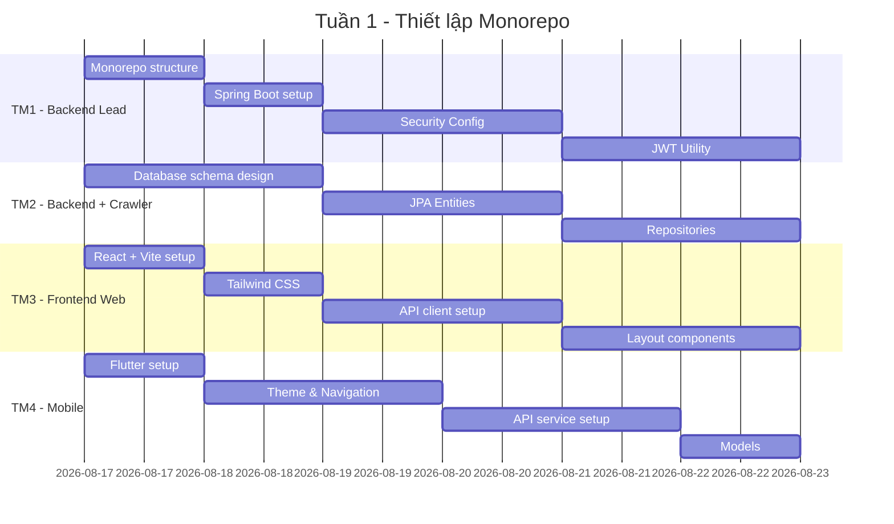

**Công việc chi tiết:**

**Thứ 2**
- Tất cả: Họp kickoff, thống nhất yêu cầu
- TM1: Tạo monorepo structure, thiết kế N-Layer architecture
- TM2: Thiết kế database schema, xác định entities
- TM3: Khởi tạo React + Vite project trong monorepo
- TM4: Khởi tạo Flutter project trong monorepo

**Thứ 3**
- TM1: Spring Boot setup, cấu hình application.properties
- TM2: Tạo JPA Entities (User, Job, Company, Category, Application)
- TM3: Setup Tailwind CSS, design system
- TM4: Setup theme, navigation

**Thứ 4**
- TM1: SecurityConfig, JWT Utility, BCrypt PasswordEncoder
- TM2: Tạo Repositories (UserRepository, JobRepository, ApplicationRepository)
- TM3: Component structure, Layout components
- TM4: Model classes, API service

**Thứ 5**
- TM1: Controller Layer cơ bản (AuthController)
- TM2: Service Layer cơ bản (UserService, JobService)
- TM3: Login/Register page
- TM4: Login/Register screen

**Thứ 6**
- TM1: CORS config, Exception Handling
- TM2: Custom queries, Native queries
- TM3: Dashboard layout, Sidebar
- TM4: Home page, Bottom navigation

**Thứ 7**
- Tất cả: Kiểm tra tích hợp, review code

**Kết quả đầu ra tuần 1:**
- Monorepo structure hoàn chỉnh
- Database schema thiết kế xong
- JPA Entities và Repositories sẵn sàng
- React + Vite project chạy được
- Flutter project chạy được

---

#### TUẦN 2: XÂY DỰNG CONTROLLER & SERVICE LAYER

**Mục tiêu**: Hoàn thiện các tầng Controller và Service cơ bản.

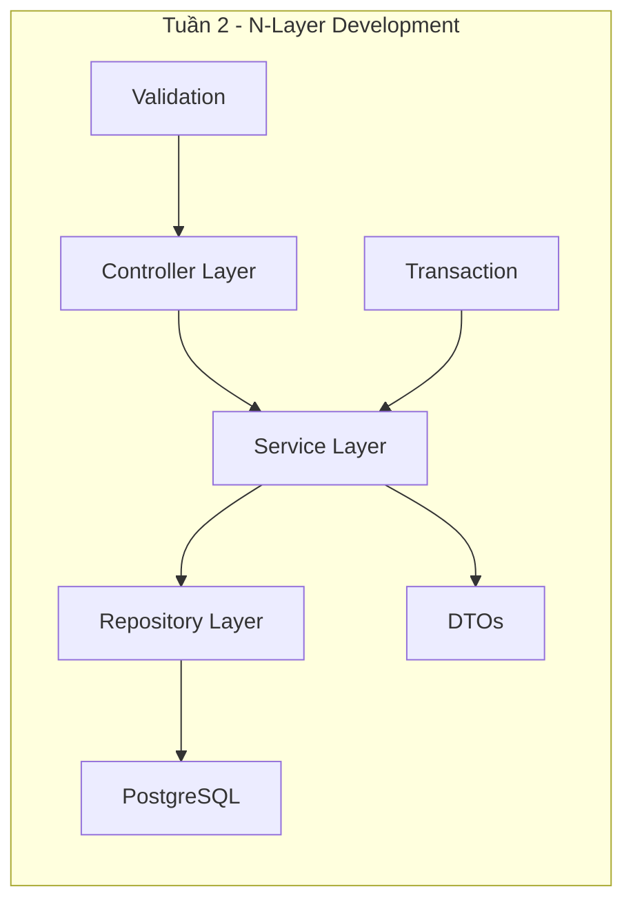

**Công việc chi tiết:**

**Thứ 2**
- TM1: AuthController hoàn chỉnh, JWT filter
- TM2: JobService (CRUD operations)
- TM3: API integration (login/register)
- TM4: API integration (login/register)

**Thứ 3**
- TM1: UserController, ProfileController
- TM2: ApplicationService (apply for job)
- TM3: JobList page, pagination
- TM4: JobList screen, pagination

**Thứ 4**
- TM1: DTOs, Request/Response validation
- TM2: SearchService cơ bản (JPA query)
- TM3: JobDetail page, Apply form
- TM4: JobDetail screen, Apply form

**Thứ 5**
- TM1: GlobalExceptionHandler, Custom exceptions
- TM2: CategoryService, CompanyService
- TM3: PostJob page (Recruiter)
- TM4: PostJob screen

**Thứ 6**
- TM1: Logging, Request/Response logging
- TM2: Optimistic locking, Versioning
- TM3: MyJobs page (Recruiter dashboard)
- TM4: MyApplications screen

**Thứ 7**
- Tất cả: Kiểm thử toàn bộ flow

**Kết quả đầu ra tuần 2:**
- Controller Layer hoàn chỉnh
- Service Layer với business logic
- Repository Layer với JPA queries
- Web và mobile có đầy đủ CRUD

---

#### TUẦN 3: SEARCH & CACHE LAYER

**Mục tiêu**: Tích hợp Elasticsearch và Redis vào N-Layer.

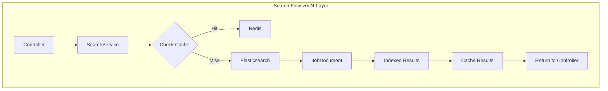

**Công việc chi tiết:**

**Thứ 2**
- TM1: RedisConfig, CacheManager setup
- TM2: ElasticsearchConfig, JobDocument setup
- TM3: Search page with filters
- TM4: Search screen with filters

**Thứ 3**
- TM1: @Cacheable, @CacheEvict annotation
- TM2: SearchService với Elasticsearch repository
- TM3: Filter components (salary, location, skills)
- TM4: Filter components

**Thứ 4**
- TM1: Rate Limiting với Redis
- TM2: Indexing strategy, sync with PostgreSQL
- TM3: Search results page
- TM4: Search results screen

**Thứ 5**
- TM1: Session management with Redis
- TM2: Full-text search, Vietnamese analyzer
- TM3: Saved jobs feature
- TM4: Saved jobs feature

**Thứ 6**
- TM1: Cache eviction strategy
- TM2: Search performance optimization
- TM3: UI optimization, loading states
- TM4: UI optimization, loading states

**Thứ 7**
- Tất cả: Kiểm thử search và cache

**Kết quả đầu ra tuần 3:**
- Elasticsearch tích hợp vào Data Access Layer
- Redis cache hoạt động
- Full-text search với filter
- Search response < 500ms

---

### GIAI ĐOẠN 2: MỞ RỘNG TÍNH NĂNG (Tuần 4-6)

---

#### TUẦN 4: CRAWLER & NOTIFICATION

**Mục tiêu**: Xây dựng crawler và notification system.

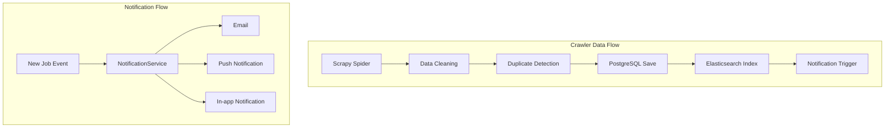

**Công việc chi tiết:**

**Thứ 2**
- TM1: NotificationService (email, push)
- TM2: Setup Scrapy project, spider cho vieclam.gov.vn
- TM3: Notification UI
- TM4: Notification UI

**Thứ 3**
- TM1: Email template, SMTP config
- TM2: Data cleaning pipeline
- TM3: API integration for notifications
- TM4: Push notification setup (Firebase)

**Thứ 4**
- TM1: In-app notification storage
- TM2: Duplicate detection, data quality
- TM3: Notification center page
- TM4: Notification screen

**Thứ 5**
- TM1: Scheduler (crawl job daily)
- TM2: Crawl 500+ jobs, optimize performance
- TM3: Notification preferences
- TM4: Notification preferences

**Thứ 6**
- TM1: FileStorageService (upload CV, avatar)
- TM2: Sync job data to Elasticsearch
- TM3: Upload CV feature
- TM4: Upload CV feature

**Thứ 7**
- Tất cả: Kiểm thử crawler và notification

**Kết quả đầu ra tuần 4:**
- Crawler hoạt động, crawl 500+ jobs
- NotificationService (email + push + in-app)
- FileStorageService
- Dữ liệu sẵn sàng cho tìm kiếm

---

#### TUẦN 5: ADMIN PANEL & SECURITY

**Mục tiêu**: Xây dựng Admin Panel và tăng cường bảo mật.

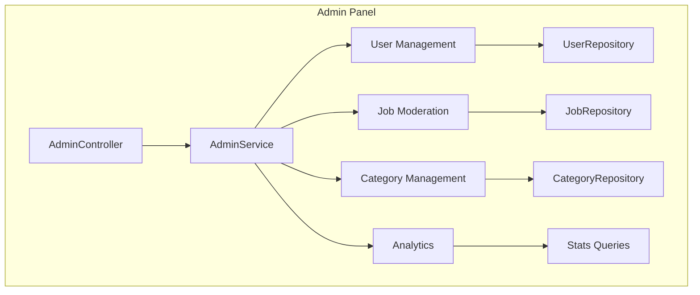

**Công việc chi tiết:**

**Thứ 2**
- TM1: AdminController, AdminService
- TM2: User management APIs
- TM3: Admin Panel layout
- TM4: Role-based navigation

**Thứ 3**
- TM1: Job moderation APIs (approve/reject)
- TM2: Category management APIs
- TM3: User management page
- TM4: User management (mobile)

**Thứ 4**
- TM1: Analytics APIs (stats, reports)
- TM2: Audit logging
- TM3: Job moderation page
- TM4: Analytics dashboard

**Thứ 5**
- TM1: Security hardening (CSP, XSS)
- TM2: SQL injection prevention
- TM3: Admin dashboard
- TM4: Security UI

**Thứ 6**
- TM1: SSL config, HTTPS
- TM2: Data encryption
- TM3: Role-based UI
- TM4: Secure storage

**Thứ 7**
- Tất cả: Security review, UAT

**Kết quả đầu ra tuần 5:**
- Admin Panel hoàn chỉnh
- Phân quyền (User/Recruiter/Admin)
- Security hardening
- Analytics dashboard

---

#### TUẦN 6: DATA PIPELINE & OPTIMIZATION

**Mục tiêu**: Hoàn thiện data pipeline và tối ưu hiệu năng.

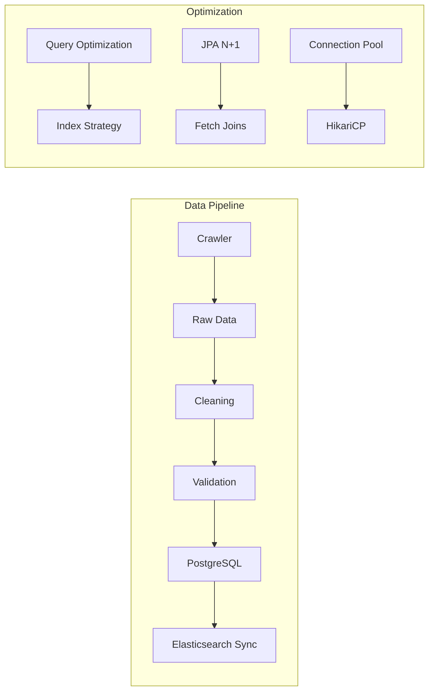

**Công việc chi tiết:**

**Thứ 2**
- TM1: Job scheduling (cron jobs)
- TM2: Data quality reports
- TM3: Performance monitoring UI
- TM4: Performance monitoring

**Thứ 3**
- TM1: Query optimization (EXPLAIN analyze)
- TM2: Database indexes
- TM3: Bundle size optimization
- TM4: App size optimization

**Thứ 4**
- TM1: Connection pool tuning (HikariCP)
- TM2: JPA N+1 problem fix
- TM3: Code splitting, lazy loading
- TM4: Image caching, reduce rebuilds

**Thứ 5**
- TM1: Batch processing
- TM2: Data synchronization
- TM3: Error boundaries
- TM4: Error handling

**Thứ 6**
- TM1: Backup strategy
- TM2: Data migration scripts
- TM3: Loading states, skeletons
- TM4: Loading states

**Thứ 7**
- Tất cả: Performance testing

**Kết quả đầu ra tuần 6:**
- Data pipeline hoàn chỉnh
- Query response < 50ms
- Bundle size < 500KB
- App size < 30MB

---

### GIAI ĐOẠN 3: TỐI ƯU & MỞ RỘNG (Tuần 7-10)

---

#### TUẦN 7: TESTING STRATEGY

**Mục tiêu**: Viết unit test, integration test cho N-Layer.

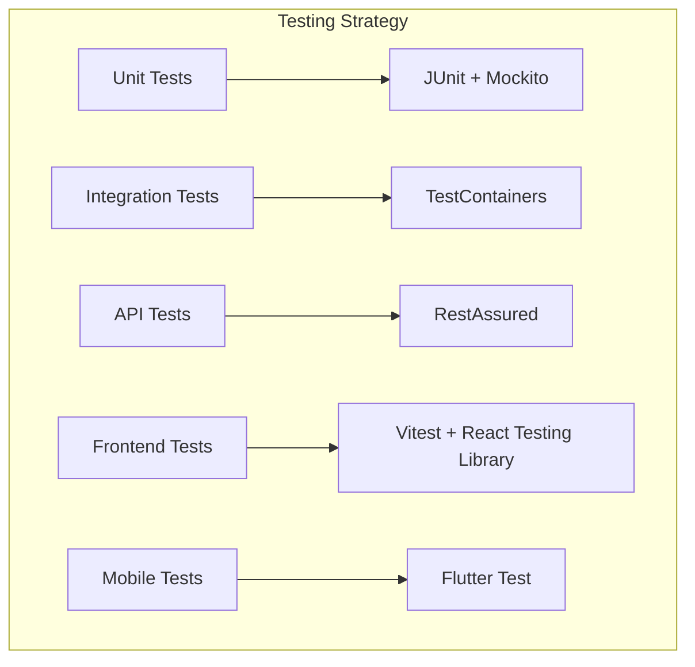

| Thành viên | Công việc |
|:---|:---|
| **TM1** | Service Layer unit tests, Security tests |
| **TM2** | Repository tests, Integration tests |
| **TM3** | Component tests (Vitest + React Testing Library), E2E tests (Playwright) |
| **TM4** | Widget tests, Integration tests (Flutter) |

**Kết quả đầu ra tuần 7:**
- Code coverage > 70%
- 100+ unit tests
- Integration tests passed
- CI pipeline green

---

#### TUẦN 8: MONITORING & LOGGING

**Mục tiêu**: Setup monitoring và logging cho monolithic app.

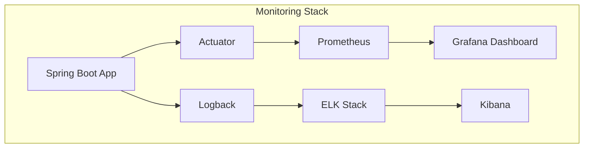

| Thành viên | Công việc |
|:---|:---|
| **TM1** | Prometheus + Grafana, Actuator endpoints |
| **TM2** | ELK Stack, Logback configuration |
| **TM3** | Frontend monitoring (Sentry) |
| **TM4** | Mobile crash reporting (Firebase) |

**Kết quả đầu ra tuần 8:**
- Grafana dashboard real-time
- ELK Stack hoạt động
- Alerts configured
- Crash reports collected

---

#### TUẦN 9: SCALING & PERFORMANCE

**Mục tiêu**: Tối ưu hiệu năng và scaling cho monolithic app.

| Thành viên | Công việc |
|:---|:---|
| **TM1** | Horizontal scaling (multiple instances), Load balancer |
| **TM2** | Read replicas, Connection pooling |
| **TM3** | CDN, Image optimization |
| **TM4** | Offline mode, Optimistic UI |

**Kết quả đầu ra tuần 9:**
- Multi-instance deployment
- Read replicas configured
- CDN enabled
- Offline mode working

---

#### TUẦN 10: FEATURE ENHANCEMENTS

**Mục tiêu**: Thêm tính năng nâng cao.

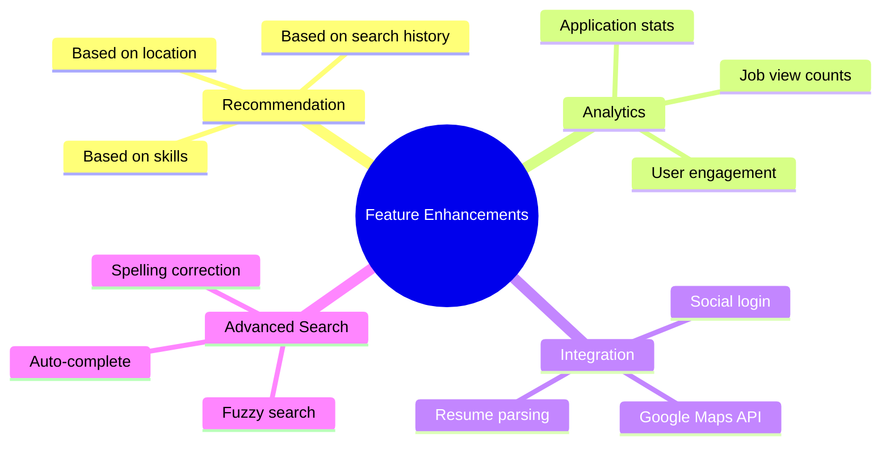

| Thành viên | Công việc |
|:---|:---|
| **TM1** | Recommendation engine, Analytics |
| **TM2** | Advanced search (fuzzy, auto-complete) |
| **TM3** | Social login, Google Maps integration |
| **TM4** | Resume parsing, Search history |

**Kết quả đầu ra tuần 10:**
- Recommendation engine hoạt động
- Advanced search
- Social login
- Resume parsing

---

### GIAI ĐOẠN 4: KIỂM THỬ & HOÀN THIỆN (Tuần 11-13)

---

#### TUẦN 11: LOAD TESTING & OPTIMIZATION

**Mục tiêu**: Load test và tối ưu.

| Ngày | Hoạt động |
|:---|:---|
| Thứ 2 | TM1+TM2: Load testing (k6, 500 concurrent users) |
| Thứ 3 | TM3: Cross-browser testing |
| Thứ 4 | TM4: Mobile device testing |
| Thứ 5 | Tất cả: Performance optimization |
| Thứ 6 | Tất cả: Bug fixing |
| Thứ 7 | Tất cả: Regression testing |

**Kết quả đầu ra tuần 11:**
- Load test report
- 500 concurrent users supported
- 95% requests < 2s
- All browsers tested

---

#### TUẦN 12: STAGING DEPLOYMENT

**Mục tiêu**: Deploy lên staging environment.

| Thành viên | Công việc |
|:---|:---|
| **TM1** | Deploy backend lên staging (AWS/GCP) |
| **TM2** | Setup data sync, crawl staging |
| **TM3** | Deploy web lên staging |
| **TM4** | Deploy mobile lên TestFlight |

**Kết quả đầu ra tuần 12:**
- Staging environment live
- 10+ users tested
- Feedback collected
- Bug list created

---

#### TUẦN 13: BUG FIXING & POLISHING

**Mục tiêu**: Sửa lỗi và hoàn thiện.

| Thành viên | Công việc |
|:---|:---|
| **TM1** | Sửa lỗi backend, optimize queries |
| **TM2** | Sửa lỗi crawler, data issues |
| **TM3** | Sửa lỗi web, UI polish |
| **TM4** | Sửa lỗi mobile, performance polish |

**Kết quả đầu ra tuần 13:**
- 95% bugs fixed
- UI polished
- Performance improved
- Ready for production

---

### GIAI ĐOẠN 5: TRIỂN KHAI & BÁO CÁO (Tuần 14-16)

---

#### TUẦN 14: PRODUCTION DEPLOYMENT

**Mục tiêu**: Deploy production.

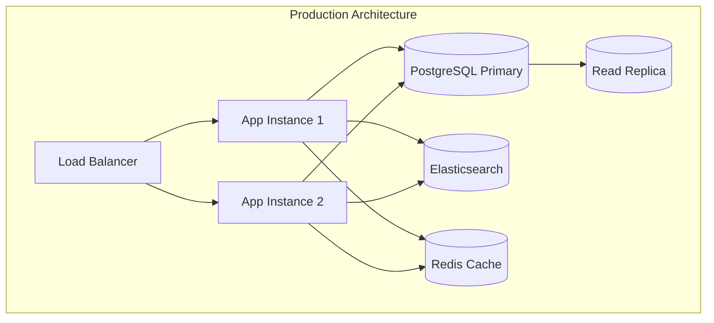

| Thành viên | Công việc |
|:---|:---|
| **TM1** | Deploy backend, SSL, Load balancer |
| **TM2** | Production data, Indexing |
| **TM3** | Deploy web production |
| **TM4** | Submit app stores |

**Kết quả đầu ra tuần 14:**
- Production live
- SSL configured
- Load balancer active
- Monitoring running

---

#### TUẦN 15: DOCUMENTATION

**Mục tiêu**: Viết tài liệu đầy đủ.

| Thành viên | Công việc |
|:---|:---|
| **TM1** | Technical documentation, Deployment guide |
| **TM2** | Database schema, Data pipeline doc |
| **TM3** | User manual (web), API integration guide |
| **TM4** | User manual (mobile), Installation guide |

**Kết quả đầu ra tuần 15:**
- Technical report
- User manual (Web + Mobile)
- Deployment guide
- API documentation (Swagger)

---

#### TUẦN 16: FINAL PRESENTATION

**Mục tiêu**: Chuẩn bị và thuyết trình.

| Ngày | Hoạt động |
|:---|:---|
| Thứ 2 | Tất cả: Tổng hợp báo cáo cuối cùng |
| Thứ 3 | Tất cả: Chuẩn bị slide |
| Thứ 4 | Tất cả: Chuẩn bị kịch bản demo |
| Thứ 5 | Tất cả: Rehearsal |
| Thứ 6 | Tất cả: Final presentation + Demo |
| Thứ 7 | Tất cả: Nộp báo cáo và source code |

**Kết quả đầu ra tuần 16:**
- Presentation slides
- Video demo (5-7 phút)
- Final report
- Source code

---

## 5. KIẾN TRÚC N-LAYER CHI TIẾT

### 5.1. Luồng xử lý request

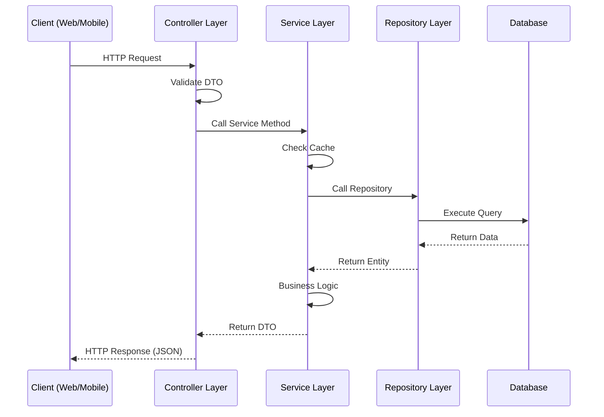

### 5.2. Exception Flow

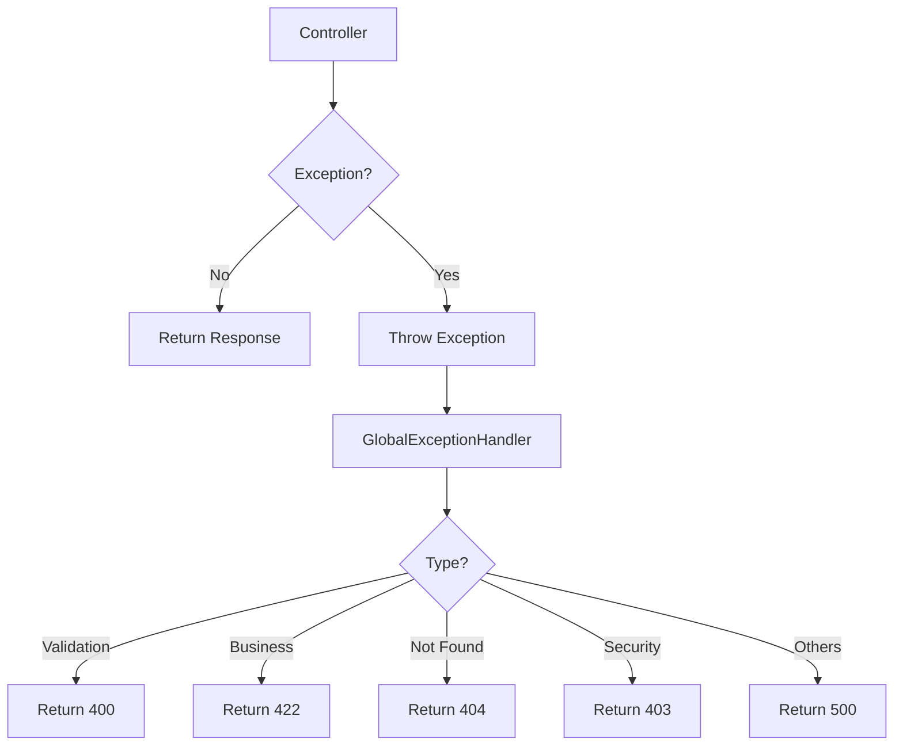

### 5.3. Data Access Flow

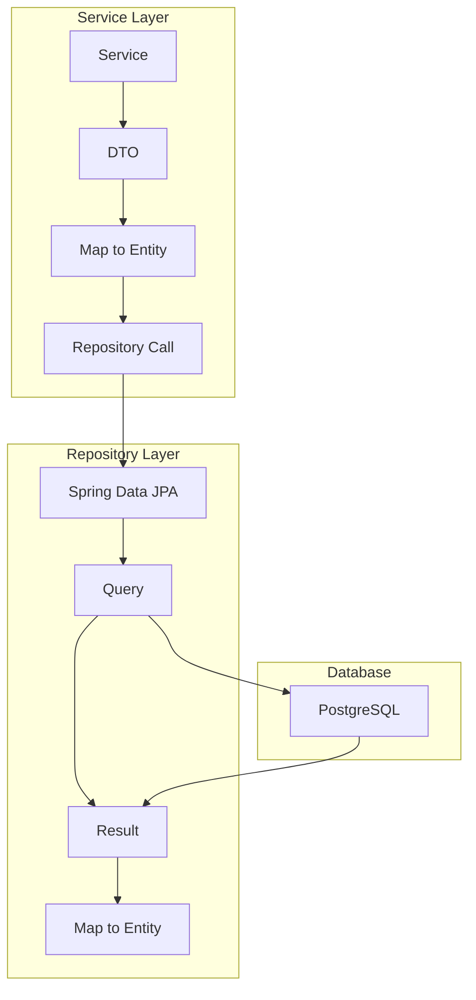

---

## 6. SO SÁNH N-LAYER VS MICROSERVICES

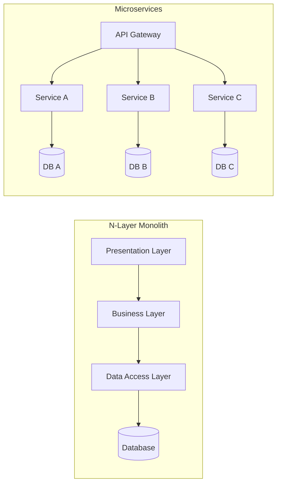

| Tiêu chí | N-Layer Monolith | Microservices |
|:---|:---|:---|
| **Độ phức tạp** | Thấp - Trung bình | Cao |
| **Triển khai** | Đơn giản (1 JAR) | Phức tạp (nhiều services) |
| **Database** | 1 database | Database per service |
| **Communication** | In-memory (fast) | Network (slower) |
| **Scaling** | Scale whole app | Scale per service |
| **Development** | Nhanh hơn | Chậm hơn |
| **Learning** | Dễ học | Khó hơn |
| **Phù hợp** | Dự án sinh viên, MVP | Large-scale enterprise |

---

## 7. TIMELINE TỔNG QUAN

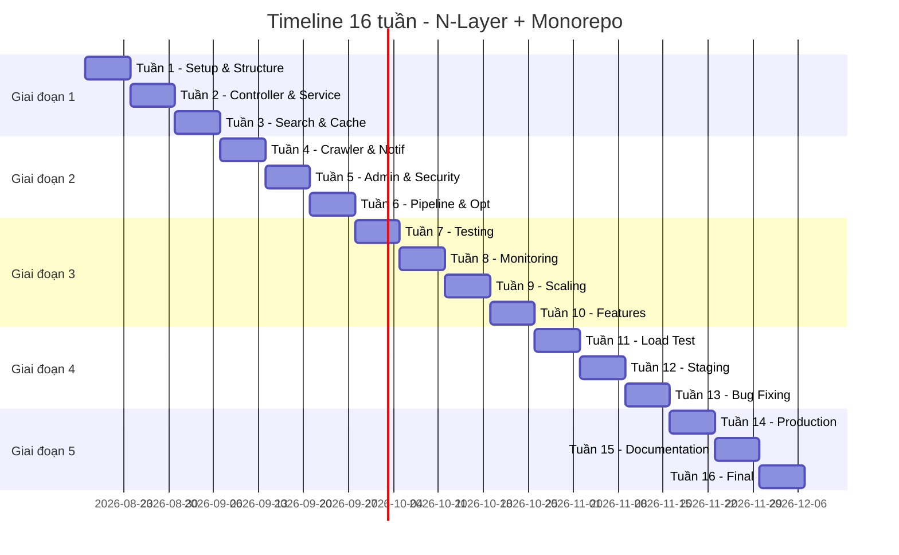

### Tóm tắt theo tuần

| Tuần | Mục tiêu chính | Deliverable chính |
|:---|:---|:---|
| 1 | Monorepo, N-Layer structure, Security | Structure, Auth API |
| 2 | Controller & Service Layer | CRUD APIs |
| 3 | Search & Cache Layer | Search API, Cache |
| 4 | Crawler & Notification | 500+ jobs, Notifications |
| 5 | Admin Panel & Security | Admin, Security |
| 6 | Data Pipeline & Optimization | Pipeline, Performance |
| 7 | Testing Strategy | 70% coverage |
| 8 | Monitoring & Logging | Grafana, ELK |
| 9 | Scaling & Performance | Multi-instance |
| 10 | Feature Enhancements | Recommendations |
| 11 | Load Testing | Performance report |
| 12 | Staging Deployment | Staging live |
| 13 | Bug Fixing | 95% fixed |
| 14 | Production Deployment | Production live |
| 15 | Documentation | Complete docs |
| 16 | Final Presentation | Slides, demo |

---

## 8. TIÊU CHÍ ĐÁNH GIÁ

### 8.1. Functional Requirements

- [ ] User đăng ký/đăng nhập được (Web + Mobile)
- [ ] Nhà tuyển dụng đăng tin được (Web)
- [ ] Ứng viên tìm kiếm được với filter (Web + Mobile)
- [ ] Ứng viên ứng tuyển và upload CV (Web + Mobile)
- [ ] Nhà tuyển dụng xem danh sách ứng viên (Web)
- [ ] Hệ thống gửi thông báo (Email + Push)
- [ ] Admin quản lý người dùng và tin (Web)
- [ ] Search hoạt động với 1000+ jobs

### 8.2. Non-functional Requirements

- [ ] Response time < 2s cho 95% requests
- [ ] System uptime > 99%
- [ ] Support 500 concurrent users
- [ ] Security: HTTPS, JWT, password hashing
- [ ] Code coverage > 70%
- [ ] Tài liệu API đầy đủ

### 8.3. Deliverables

- [ ] Source code trên GitHub (Monorepo)
- [ ] Docker Compose cho toàn bộ system
- [ ] Deployment script
- [ ] API Documentation (Swagger)
- [ ] User manual (Web + Mobile)
- [ ] Technical report
- [ ] Presentation slides
- [ ] Video demo (5-7 phút)

---

## 9. CÔNG CỤ & TÀI LIỆU THAM KHẢO

| Mục đích | Công cụ |
|:---|:---|
| Version Control | Git + GitHub (Monorepo) |
| Build Tool | Maven/Gradle |
| Testing | JUnit 5, Mockito, Testcontainers, Vitest, Playwright |
| API Testing | Postman, RestAssured |
| Performance | k6, JMeter |
| Monitoring | Prometheus, Grafana |
| Logging | ELK Stack |
| CI/CD | GitHub Actions |
| Documentation | Swagger, Markdown |

---

**Ngày bắt đầu:** 17/08/2026 (Thứ Hai)
**Ngày kết thúc:** 06/12/2026 (Chủ Nhật, sau 16 tuần)
**Phiên bản:** 4.1 - N-Layer + Monorepo (cập nhật 17/08/2026 — timeline và công nghệ theo best practice 2026)
**Người lập:** Đội ngũ phát triển