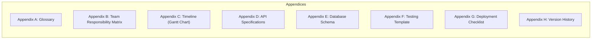
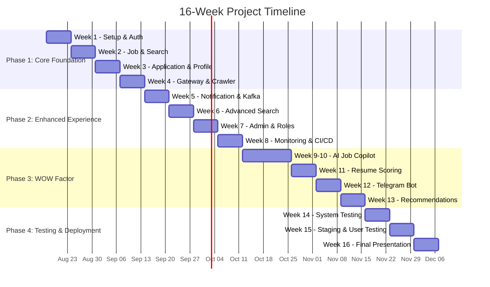

# Software Requirements Specification (SRS)
## Vietnam Job Platform - Microservices Architecture

**Version:** 1.0  
**Date:** August 17, 2026  
**Project:** Vietnam Job Platform (Nền tảng việc làm Việt Nam)  

---

## Part 10: Appendices

### 10.1 Overview

This section contains supplementary information that supports the main body of the SRS. The appendices provide detailed reference material, including glossaries, diagrams, templates, and additional documentation that may be referenced throughout the document.

---

## Appendix A: Glossary

This appendix defines technical terms, acronyms, and domain-specific terminology used throughout the SRS.

### A.1 Technical Terms

| Term | Definition |
|:-----|:-----------|
| **ACID** | Atomicity, Consistency, Isolation, Durability – properties ensuring reliable database transactions |
| **API** | Application Programming Interface – a set of rules for building and interacting with software applications |
| **Circuit Breaker** | A design pattern that prevents repeated failures by stopping requests to a failing service |
| **CORS** | Cross-Origin Resource Sharing – a mechanism that allows restricted resources to be requested from another domain |
| **CRUD** | Create, Read, Update, Delete – the four basic operations for persistent storage |
| **DTO** | Data Transfer Object – an object that carries data between processes |
| **Event-Driven Architecture** | A software architecture pattern where system components communicate through events |
| **FCM** | Firebase Cloud Messaging – a cross-platform messaging solution for push notifications |
| **HPA** | Horizontal Pod Autoscaler – a Kubernetes feature that automatically scales pod replicas |
| **JWT** | JSON Web Token – a compact, URL-safe token for securely transmitting information between parties |
| **KRaft** | Kafka Raft – the new consensus protocol used in Kafka 4.x, replacing ZooKeeper |
| **LTS** | Long Term Support – a release with extended support and maintenance |
| **Microservices** | An architectural style that structures an application as a collection of loosely coupled services |
| **Monorepo** | A single repository containing multiple projects or services |
| **RAG** | Retrieval-Augmented Generation – an AI technique that retrieves relevant documents to augment LLM responses |
| **RBAC** | Role-Based Access Control – a method of restricting system access based on user roles |
| **REST** | Representational State Transfer – an architectural style for designing networked applications |
| **SLA** | Service Level Agreement – a commitment to maintain a certain level of service |
| **SPA** | Single Page Application – a web application that loads a single HTML page and dynamically updates content |
| **TLS** | Transport Layer Security – a cryptographic protocol for secure communication over a network |
| **TTL** | Time-To-Live – a mechanism that limits the lifespan of data in a system |
| **VM** | Virtual Machine – a software-based emulation of a physical computer |
| **WebSocket** | A communication protocol providing full-duplex communication channels over a single TCP connection |
| **YARP** | Yet Another Reverse Proxy – a reverse proxy library for .NET |

### A.2 Domain Terms

| Term | Definition |
|:-----|:-----------|
| **Applicant** | A job seeker who has submitted an application for a job |
| **Application** | A formal request submitted by a job seeker for a specific job posting |
| **CV / Resume** | A document summarising a person's education, work experience, and skills |
| **Job Listing** | A published job opening with details about the position and requirements |
| **Job Seeker** | A user searching for employment opportunities on the platform |
| **Recruiter** | A user representing a company who posts jobs and manages applications |
| **Administrator** | A user with elevated privileges for managing the platform |

### A.3 Acronyms

| Acronym | Full Form |
|:--------|:----------|
| API | Application Programming Interface |
| CI/CD | Continuous Integration / Continuous Deployment |
| CORS | Cross-Origin Resource Sharing |
| CRUD | Create, Read, Update, Delete |
| DTO | Data Transfer Object |
| FCM | Firebase Cloud Messaging |
| HPA | Horizontal Pod Autoscaler |
| JWT | JSON Web Token |
| K8s | Kubernetes |
| LLM | Large Language Model |
| LTS | Long Term Support |
| ORM | Object-Relational Mapping |
| QA | Quality Assurance |
| RAG | Retrieval-Augmented Generation |
| RBAC | Role-Based Access Control |
| REST | Representational State Transfer |
| SPA | Single Page Application |
| SRS | Software Requirements Specification |
| TLS | Transport Layer Security |
| TTL | Time-To-Live |
| UI | User Interface |
| UX | User Experience |
| VM | Virtual Machine |
| WOW | Factor for bonus points (not an acronym) |
| YARP | Yet Another Reverse Proxy |

---

## Appendix B: Team Responsibility Matrix

This appendix provides a detailed breakdown of team member responsibilities across the 16-week project.

### B.1 Team Member Overview

| Code | Role | Primary Skills | Responsibilities |
|:-----|:-----|:---------------|:-----------------|
| **TM1** | Backend Lead + DevOps | Backend development, DevOps, Infrastructure | Auth Service, API Gateway, Docker, Kafka, CI/CD, Monitoring, Deployment |
| **TM2** | Backend + Search + AI | Backend, Search, Data, AI | Job Service, Search Service, Crawler, Elasticsearch, AI Service |
| **TM3** | Frontend Web (React) | React, TypeScript, UI/UX | Web application, Admin Panel, API integration, UI/UX |
| **TM4** | Mobile (Flutter) + QA | Flutter, Mobile, Testing | Mobile application, Push notifications, Testing, Bug tracking |

### B.2 Weekly Assignment Matrix

| Week | TM1 | TM2 | TM3 | TM4 |
|:-----|:----|:----|:----|:----|
| 1 | Docker Compose, Auth Service, JWT | Data schema, Crawler setup, Initial crawl | React + Vite setup, Login/Register | Flutter setup, Theme, Login/Register |
| 2 | Kafka config, Job Service | Search Service, Crawl 200+ jobs | Job List, Job Detail, Pagination | Job List, Job Detail, Apply form |
| 3 | File Storage, Application Service | Profile Service, Application status | Upload CV, Profile page | Upload CV, Profile, History |
| 4 | API Gateway, CI/CD | Crawler (500+ jobs), Search sync | API via Gateway, Admin Panel | Mobile via Gateway, Notifications |
| 5 | Notification Service, Kafka events | Event consumers, Search optimisation | In-app notifications, UI/UX | Push notifications, UI/UX |
| 6 | Redis cache, Monitoring | Advanced search, Analytics | Search UI, Admin dashboard | Search filters, Performance |
| 7 | Role-based access, Security | Admin APIs, Tests | Admin UI, Charts | Dark mode, Accessibility |
| 8 | Production config, Deploy | Performance optimisation | Production build, SEO | Release build, App size |
| 9 | AI API integration | AI Service setup, RAG pipeline | Chat UI (prep) | Chat screen (prep) |
| 10 | AI support | RAG optimisation, Chat API | Chat UI, Context | Chat screen, Streams |
| 11 | Telegram Bot | Resume Scoring API, PDF parsing | Scoring UI, Suggestions | Scoring screen, Suggestions |
| 12 | Kubernetes (optional) | Vector search (optional) | Recommendations UI | Recommendations screen |
| 13 | Performance tests | Bug fixing | UI polish | Bug fixes, Polish |
| 14 | Integration tests | Performance tests | Cross-browser tests | Mobile tests (iOS/Android) |
| 15 | Staging deployment | Data sync | User testing feedback | App store submission |
| 16 | Final report, Presentation | Documentation, Bug fixes | Video demo, Slides | Video demo, Slides |

### B.3 Skills Development Plan

| Team Member | Skills to Learn | Resources |
|:------------|:----------------|:----------|
| **TM1** | .NET 8/9, YARP, Docker, Kafka, Kubernetes | .NET documentation, Docker docs |
| **TM2** | .NET 8/9, Elasticsearch, Scrapy, AI/LangChain | Elasticsearch guide, Scrapy tutorial |
| **TM3** | React 19, Vite, Tailwind, React Query | React docs, Vite guide |
| **TM4** | Flutter, Firebase, Push notifications | Flutter docs, Firebase guide |

---

## Appendix C: Timeline (Gantt Chart)

This appendix provides a visual representation of the 16-week project timeline.

### C.1 Milestone Summary

| Milestone | Week | Description | Deliverable |
|:----------|:-----|:------------|:------------|
| M1 | 4 | Phase 1 Complete | 100% MUST HAVE features done |
| M2 | 8 | Phase 2 Complete | 100% SHOULD HAVE features done |
| M3 | 10 | AI Copilot Complete | Chatbot functioning |
| M4 | 13 | Phase 3 Complete | WOW features implemented |
| M5 | 14 | Testing Complete | Test report delivered |
| M6 | 15 | Staging Live | User testing completed |
| M7 | 16 | Project Complete | Final presentation and report |

---

## Appendix D: API Specifications

This appendix provides the API specifications for all services. Complete OpenAPI/Swagger documentation will be generated during development.

### D.1 API Endpoint Summary

| Service | Endpoint | Method | Description | Priority |
|:--------|:---------|:-------|:------------|:----------|
| **Auth** | `/api/auth/register` | POST | User registration | MUST |
| **Auth** | `/api/auth/login` | POST | User login | MUST |
| **Auth** | `/api/auth/refresh` | POST | Refresh JWT token | MUST |
| **Auth** | `/api/auth/logout` | POST | User logout | MUST |
| **Auth** | `/api/auth/me` | GET | Current user profile | MUST |
| **Job** | `/api/jobs` | POST | Create job | MUST |
| **Job** | `/api/jobs/recruiter` | GET | Get recruiter's jobs | MUST |
| **Job** | `/api/jobs/{id}` | PUT | Update job | MUST |
| **Job** | `/api/jobs/{id}` | DELETE | Delete job | MUST |
| **Job** | `/api/jobs/{id}` | GET | Get job details | MUST |
| **Job** | `/api/categories` | GET | Get job categories | MUST |
| **Search** | `/api/search/jobs` | GET | Search jobs | MUST |
| **Search** | `/api/search/suggest` | GET | Autocomplete suggestions | MUST |
| **Application** | `/api/applications` | POST | Apply for job | MUST |
| **Application** | `/api/applications/me` | GET | Applicant's history | MUST |
| **Application** | `/api/applications/{id}` | GET | Application details | MUST |
| **Application** | `/api/applications/job/{jobId}` | GET | Job applications (recruiter) | MUST |
| **Application** | `/api/applications/{id}/status` | PUT | Update application status | MUST |
| **Profile** | `/api/profile` | PUT | Update profile | MUST |
| **Profile** | `/api/profile/me` | GET | Get profile | MUST |
| **Profile** | `/api/profile/{userId}` | GET | Get public profile | MUST |
| **Profile** | `/api/profile/skills` | POST | Add skill | MUST |
| **Profile** | `/api/profile/experience` | POST | Add work experience | MUST |
| **Profile** | `/api/profile/education` | POST | Add education | MUST |
| **Notification** | `/api/notifications/history` | GET | Notification history | SHOULD |
| **Admin** | `/api/admin/users` | GET | User management | SHOULD |
| **Admin** | `/api/admin/jobs/pending` | GET | Pending jobs | SHOULD |
| **Admin** | `/api/admin/categories` | POST | Create category | SHOULD |
| **Admin** | `/api/admin/statistics` | GET | Platform statistics | SHOULD |
| **Admin** | `/api/admin/health` | GET | System health | SHOULD |
| **AI** | `/api/ai/chat` | POST | AI chatbot | NICE |
| **AI** | `/api/ai/score-resume` | POST | Resume scoring | NICE |

---

## Appendix E: Database Schema

This appendix provides the database schema for all services following the database-per-service pattern.

### E.1 Auth Database (auth_db)

| Table | Columns | Description |
|:------|:--------|:------------|
| **users** | id (UUID, PK), email (unique), password_hash, full_name, role, is_active, created_at, updated_at | User account information |
| **refresh_tokens** | id (UUID, PK), user_id (FK), token (unique), expiry_date, is_revoked, created_at | Refresh tokens for JWT rotation |

### E.2 Job Database (job_db)

| Table | Columns | Description |
|:------|:--------|:------------|
| **categories** | id (UUID, PK), name (unique), description, created_at | Job categories |
| **jobs** | id (UUID, PK), title, description, company, company_logo_url, location, salary_min, salary_max, salary_currency, category_id (FK), requirements, benefits, employment_type, experience_level, recruiter_id, status, view_count, created_at, updated_at | Job postings |
| **saved_jobs** | id (UUID, PK), user_id, job_id (FK), saved_at | Jobs saved by users |

### E.3 Application Database (app_db)

| Table | Columns | Description |
|:------|:--------|:------------|
| **applications** | id (UUID, PK), job_id, applicant_id, cover_letter, cv_url, status, recruiter_notes, score, created_at, updated_at | Job applications |
| **status_history** | id (UUID, PK), application_id (FK), status, note, changed_by, changed_at | Application status change history |

### E.4 Profile Database (profile_db)

| Table | Columns | Description |
|:------|:--------|:------------|
| **profiles** | id (UUID, PK), user_id (unique), full_name, phone, address, headline, summary, avatar_url, date_of_birth, created_at, updated_at | User profiles |
| **skills** | id (UUID, PK), profile_id (FK), name, proficiency (1-5), years_of_experience, created_at, updated_at | User skills |
| **work_experience** | id (UUID, PK), profile_id (FK), company, title, start_date, end_date, is_current, description, created_at, updated_at | Work experience |
| **education** | id (UUID, PK), profile_id (FK), institution, degree, field, start_date, end_date, grade, created_at, updated_at | Education history |

### E.5 Notification Database (notif_db)

| Table | Columns | Description |
|:------|:--------|:------------|
| **notifications** | id (UUID, PK), user_id, type, channel, subject, body, status, sent_at, error_message, created_at | Notification records |
| **email_logs** | id (UUID, PK), recipient_email, subject, template_name, status, sent_at, error_message, created_at | Email delivery logs |
| **user_preferences** | id (UUID, PK), user_id (unique), email_notifications_enabled, marketing_emails_enabled, created_at, updated_at | User notification preferences |

---

## Appendix F: Testing Template

This appendix provides templates for test cases and test reporting.

### F.1 Test Case Template

| Field | Description | Example |
|:------|:------------|:--------|
| **Test ID** | Unique identifier | TC-AUTH-001 |
| **Requirement ID** | Linked requirement | AUTH-01-02 |
| **Test Description** | What is being tested | User login with valid credentials |
| **Preconditions** | Setup required | User account exists |
| **Test Steps** | Step-by-step instructions | 1. Navigate to login page 2. Enter valid email 3. Enter valid password 4. Click submit |
| **Expected Result** | Expected outcome | User is redirected to dashboard, JWT received |
| **Actual Result** | Observed outcome | Pass/Fail |
| **Status** | Pass/Fail/Blocked | Pass |
| **Comments** | Additional notes | - |

### F.2 Test Report Template

| Section | Content |
|:--------|:--------|
| **Project** | Vietnam Job Platform |
| **Test Date** | Week 14 (November 2026) |
| **Tester** | Team Name |
| **Total Test Cases** | Number of test cases executed |
| **Passed** | Number passed |
| **Failed** | Number failed |
| **Blocked** | Number blocked |
| **Pass Rate** | Percentage (pass / total * 100) |
| **Summary** | Brief description of testing outcomes |
| **Critical Issues** | List of critical failures |
| **Recommendations** | Actions for improvement |

---

## Appendix G: Deployment Checklist

This appendix provides checklists for staging and production deployment.

### G.1 Staging Deployment Checklist

| Task | Status | Owner |
|:-----|:-------|:------|
| All services built successfully | [ ] | CI/CD |
| All unit tests passed | [ ] | CI/CD |
| Docker images built and tagged | [ ] | CI/CD |
| Images pushed to registry | [ ] | CI/CD |
| Staging environment provisioned | [ ] | TM1 |
| Services deployed to staging | [ ] | TM1 |
| Database migrations applied | [ ] | TM1 |
| Search index created | [ ] | TM2 |
| Sample data loaded | [ ] | TM2 |
| Smoke tests passed | [ ] | All |
| Health checks passing | [ ] | TM1 |
| Monitoring configured | [ ] | TM1 |
| Logging enabled | [ ] | TM1 |
| API documentation updated | [ ] | TM2 |
| User testing initiated | [ ] | All |

### G.2 Production Deployment Checklist

| Task | Status | Owner |
|:-----|:-------|:------|
| Staging validation complete | [ ] | All |
| Production environment provisioned | [ ] | TM1 |
| Database backup created (if applicable) | [ ] | TM1 |
| Services deployed to production | [ ] | TM1 |
| Database migrations applied | [ ] | TM1 |
| Search index synchronised | [ ] | TM2 |
| SSL/TLS configured | [ ] | TM1 |
| Domain pointed to production | [ ] | TM1 |
| Health checks passing | [ ] | TM1 |
| Monitoring active | [ ] | TM1 |
| Logging configured | [ ] | TM1 |
| CI/CD pipeline configured for production | [ ] | TM1 |
| Rollback plan documented | [ ] | TM1 |

### G.3 Rollback Checklist

| Step | Description | Owner |
|:-----|:------------|:------|
| 1 | Identify issue and severity | All |
| 2 | Notify team and stakeholders | TM1 |
| 3 | Revert to previous version | TM1 |
| 4 | Verify service health | TM1 |
| 5 | Validate data integrity | TM2 |
| 6 | Monitor for resolution | TM1 |
| 7 | Document incident | All |

---

## Appendix H: Version History

This appendix tracks all revisions made to the SRS document.

| Version | Date | Author | Changes | Status |
|:--------|:-----|:-------|:--------|:-------|
| 1.0 | 2026-08-17 | Development Team | Initial version created | Draft |
| 1.1 | 2026-08-17 | Development Team | Revised Parts 1-2 to remove technology-specific references | Draft |
| 1.2 | 2026-08-17 | Development Team | Revised Part 3 to remove implementation code | Draft |
| 1.3 | 2026-08-17 | Development Team | Added Parts 4-10 | Draft |

### H.1 Change Log

| Change ID | Date | Description | Affected Section |
|:----------|:-----|:------------|:-----------------|
| CHG-001 | 2026-08-17 | Removed technology-specific references from product scope | 1.4.1 |
| CHG-002 | 2026-08-17 | Removed YAML/JSON code blocks from requirements | 3.2-3.13 |
| CHG-003 | 2026-08-17 | Replaced SQL scripts with data model descriptions | 3.2-3.6 |
| CHG-004 | 2026-08-17 | Removed technology names from architecture diagrams | 2.1.2 |
| CHG-005 | 2026-08-17 | Added reference to Part 9 for zero-cost infrastructure | 2.4.3 |
| CHG-006 | 2026-08-17 | Added Social Login as Nice to Have user story | 2.6.3 |

---

**End of Part 10**

---

## SRS Document Complete

This concludes the Software Requirements Specification for the Vietnam Job Platform. The document is organised into 10 parts:

| Part | Title | Status |
|:-----|:------|:-------|
| 1 | Introduction | Complete |
| 2 | Overall Description | Complete |
| 3 | Functional Requirements - MUST HAVE | Complete |
| 4 | Functional Requirements - SHOULD HAVE | Complete |
| 5 | Functional Requirements - NICE TO HAVE | Complete |
| 6 | Non-Functional Requirements | Complete |
| 7 | External Interface Requirements | Complete |
| 8 | System Architecture | Complete |
| 9 | Infrastructure and Cost Analysis | Complete |
| 10 | Appendices | Complete |

---

**Document Information:**

| Attribute | Value |
|:----------|:------|
| **Document Title** | Software Requirements Specification - Vietnam Job Platform |
| **Version** | 1.0 |
| **Date** | August 17, 2026 |
| **Project** | Vietnam Job Platform (Nền tảng việc làm Việt Nam) |
| **Project Duration** | 16 weeks (August 17 - December 6, 2026) |
| **Team Size** | 4 members (TM1-TM4) |
| **Document Status** | Draft (Ready for Review) |