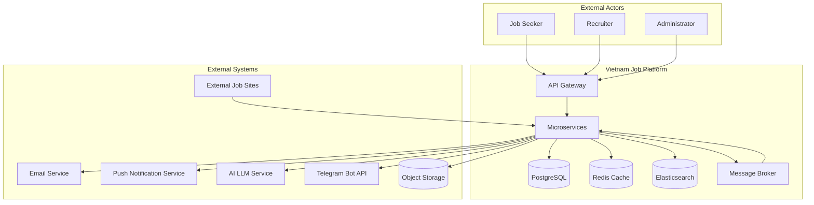
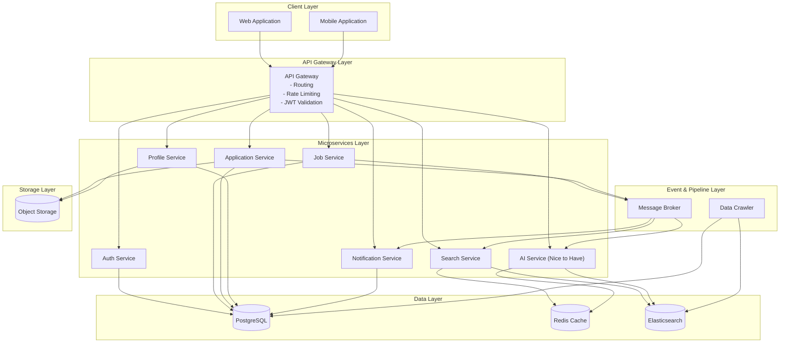

# Software Requirements Specification (SRS)
## Vietnam Job Platform - Microservices Architecture

**Version:** 1.0  
**Date:** August 17, 2026  
**Project:** Vietnam Job Platform (Nền tảng việc làm Việt Nam)  

---

## Part 2: Overall Description

### 2.1 Product Perspective

The Vietnam Job Platform is a new, standalone system designed to serve the Vietnamese employment market. It replaces no existing system but may compete with established platforms such as TopCV, VietnamWorks, and the government-operated vieclam.gov.vn. The system is built from scratch using a microservices architecture, providing both web and mobile interfaces.

#### 2.1.1 System Context

The platform interfaces with several external systems and services, as shown in the context diagram below. All interfaces use standard protocols and are designed to be loosely coupled.



#### 2.1.2 Architecture Overview

The system follows a microservices architecture with the following layers:

| Layer | Components | Primary Responsibilities |
|:------|:-----------|:-------------------------|
| **Client Layer** | Web Application, Mobile Application | User interface, user interaction |
| **Gateway Layer** | API Gateway | Request routing, authentication, rate limiting |
| **Service Layer** | 6+ microservices | Business logic, domain operations |
| **Data Layer** | Databases, Cache, Search Engine | Data persistence, caching, search indexing |
| **Event Layer** | Message Broker | Asynchronous communication, event-driven workflows |
| **Pipeline Layer** | Data Crawler | Data extraction from external sources |
| **Infrastructure** | Containerization, CI/CD, Monitoring | Environment management, automation, observability |



---

### 2.2 User Characteristics

The system serves three primary user types with distinct roles, permissions, and usage patterns.

#### 2.2.1 User Profiles

| User Type | Description | Technical Proficiency | Usage Frequency |
|:----------|:------------|:----------------------|:-----------------|
| **Job Seeker** | Individuals searching for employment opportunities in Vietnam | Low to Medium | High (daily to weekly) |
| **Recruiter** | Company representatives or HR professionals posting job openings | Medium | Medium (weekly to bi-weekly) |
| **Administrator** | System administrators managing the platform | High | Low (as needed) |

#### 2.2.2 User Personas

**Job Seeker - Nguyen Minh Anh**
- Age: 24, recent university graduate in Computer Science
- Goals: Find entry-level software development jobs in Ho Chi Minh City
- Skills: Basic computer literacy, English reading proficiency
- Devices: Android smartphone (primary), laptop (secondary)
- Pain points: Time-consuming job search, irrelevant results, lack of feedback
- Usage: Daily, 15-30 minutes per session

**Recruiter - Tran Thi Lan**
- Age: 35, HR Manager at a mid-sized tech company
- Goals: Post job openings efficiently, filter applications quickly
- Skills: Comfortable with web applications, HR software experience
- Devices: Laptop (primary), iOS smartphone (secondary)
- Pain points: Managing many applications, duplicate submissions, slow response times
- Usage: Weekly, 1-2 hours per session

**Administrator - Le Van Hung**
- Age: 28, System Administrator / Developer
- Goals: Ensure platform stability, manage users, monitor system health
- Skills: Strong technical background, familiar with monitoring tools
- Devices: Laptop (primary), occasional mobile access
- Pain points: Identifying issues quickly, managing spam/fake job posts
- Usage: As needed, 30 minutes per session

---

### 2.3 Operating Environment

The system operates in a cloud-native environment using containerization and managed services.

#### 2.3.1 Development Environment

| Component | Specification |
|:----------|:--------------|
| **OS** | Windows 10/11, macOS, or Linux |
| **IDE** | Modern IDE with language support (e.g., Visual Studio, VS Code) |
| **Container** | Docker Desktop 4.x+ |
| **Database** | PostgreSQL (local Docker) |
| **Cache** | Redis (local Docker) |
| **Search** | Elasticsearch (local Docker) |
| **Message Broker** | Kafka (local Docker) |
| **Version Control** | Git (GitHub) |
| **Build Tools** | Language-specific build tools (e.g., dotnet CLI, npm, Flutter CLI) |

#### 2.3.2 Staging Environment

| Component | Specification | Provider |
|:----------|:--------------|:---------|
| **Hosting** | 3 shared VMs (1 vCPU, 1-2 GB RAM each) | Fly.io (Free Tier) |
| **Database** | Managed PostgreSQL (500 MB) | Supabase |
| **Cache** | Managed Redis (10k commands/day) | Upstash |
| **Search** | Managed Elasticsearch (1 GB cluster) | Bonsai |
| **Message Broker** | Managed Kafka (Basic Tier) | Confluent Cloud |
| **Storage** | Object Storage (10 GB) | Cloudflare R2 |
| **CI/CD** | Automated Build/Test | GitHub Actions |

#### 2.3.3 Production Environment

| Component | Specification | Provider |
|:----------|:--------------|:---------|
| **Hosting** | 3 shared VMs (1-2 vCPU, 2-4 GB RAM each) | Fly.io / Railway |
| **Database** | Managed PostgreSQL (1-5 GB) | Supabase / Neon |
| **Cache** | Managed Redis (50k commands/day) | Upstash |
| **Search** | Managed Elasticsearch (1-5 GB cluster) | Bonsai / Elastic Cloud |
| **Message Broker** | Managed Kafka (Standard Tier) | Confluent Cloud |
| **Storage** | Object Storage (10-50 GB) | Cloudflare R2 |
| **CI/CD** | Automated Build/Test/Deploy | GitHub Actions |
| **Monitoring** | Metrics, Logs, Alerts | Grafana Cloud |

---

### 2.4 Design and Implementation Constraints

The following constraints govern the design and implementation of the system.

#### 2.4.1 Architectural Constraints

| Constraint | Description |
|:-----------|:------------|
| **Backend Architecture** | Microservices architecture with clear separation of concerns |
| **API Design** | RESTful API design for service communication |
| **Database Design** | Database-per-service pattern for data isolation |
| **Data Consistency** | Eventual consistency for cross-service operations |
| **Communication** | Synchronous (REST) and asynchronous (message broker) communication |
| **Security** | Token-based authentication and role-based access control |
| **Frontend Web** | Modern SPA framework with component-based architecture |
| **Mobile Framework** | Cross-platform mobile framework supporting iOS and Android |
| **Containerization** | All services containerised with Docker for consistency |

#### 2.4.2 Repository Structure Constraint

The project must be implemented as a **monorepo** with the following structure:

```
job-platform-monorepo/
├── .github/workflows/          # CI/CD pipelines
├── src/
│   ├── services/               # All backend microservices
│   │   ├── AuthService/
│   │   ├── JobService/
│   │   ├── SearchService/
│   │   ├── ApplicationService/
│   │   ├── ProfileService/
│   │   └── NotificationService/
│   ├── shared/                 # Shared libraries, DTOs, event contracts
│   │   ├── SharedKernel/
│   │   ├── EventContracts/
│   │   └── Infrastructure/
│   ├── gateway/                # API Gateway
│   └── web/                    # Web application
├── mobile/                     # Mobile application
├── crawler/                    # Data crawler
├── ai-service/                 # AI Service (Nice to Have)
├── infrastructure/docker/      # Docker Compose configurations
├── docs/                       # Documentation
└── README.md
```

#### 2.4.3 Zero-Cost Infrastructure Constraint

All production and staging infrastructure must leverage free tiers or promotional credits to achieve **$0 operational cost** for the 16-week project duration. This is detailed in Part 9: Infrastructure and Cost Analysis.

This requires the use of:

- Always Free tiers (GCP f1-micro, Supabase, Upstash, Cloudflare R2, Bonsai)
- Free trial credits (AWS/Azure/DigitalOcean, Railway)
- Free services (GitHub Actions, Grafana Cloud, Cloudflare Tunnel)
- Prudent AI API usage (Gemini free tier, OpenAI promotional credits)

#### 2.4.4 Security Constraints

| Constraint | Description |
|:-----------|:------------|
| **Authentication** | Token-based authentication with refresh token rotation |
| **Authorization** | Role-based access control (Admin, Recruiter, User) |
| **Transport** | All communication over TLS |
| **Passwords** | Hashed using industry-standard algorithms (e.g., bcrypt, PBKDF2) |
| **Input Validation** | All user inputs validated and sanitised |
| **Output Encoding** | All outputs encoded to prevent injection attacks |
| **SQL Injection** | Parameterised queries or ORM abstraction |
| **Cross-Origin Requests** | Properly configured cross-origin resource sharing policy |

---

### 2.5 Assumptions and Dependencies

#### 2.5.1 Assumptions

| ID | Assumption | Risk Level |
|:---|:-----------|:-----------|
| A-01 | The team has basic knowledge of modern web development, APIs, and databases | Medium |
| A-02 | The team can access the internet for cloud services and documentation | Low |
| A-03 | vieclam.gov.vn remains accessible and does not implement anti-crawling measures | Medium |
| A-04 | Free-tier services (Supabase, Upstash, etc.) will remain available with current limits | Low |
| A-05 | AI service providers (OpenAI/Gemini) maintain their free tier offerings | Medium |
| A-06 | All team members have capable development machines | Medium |
| A-07 | The project timeline of 16 weeks is adequate for the defined scope | High |

#### 2.5.2 Dependencies

| ID | Dependency | Impact if Unmet |
|:---|:-----------|:-----------------|
| D-01 | Version control repository availability | Cannot version control or collaborate |
| D-02 | Cloud provider free tier availability | Increased cost, potential budget overrun |
| D-03 | vieclam.gov.vn data availability | Limited test data for search and crawl features |
| D-04 | Third-party AI API availability | AI features cannot be implemented |
| D-05 | Push notification service availability | Mobile push notifications unusable |
| D-06 | Managed database uptime | Data persistence failure |

---

### 2.6 User Stories

The following user stories represent the primary functionality of the system, organised by priority.

#### 2.6.1 MUST HAVE User Stories

| ID | User Story | Acceptance Criteria |
|:---|:-----------|:-------------------|
| US-01 | As a **Job Seeker**, I want to **register** for an account so that I can access the platform | - Registration form with validation<br>- Account created in database<br>- Confirmation of successful registration |
| US-02 | As a **Job Seeker**, I want to **log in** so that I can access my account | - Login with email/password<br>- Token-based authentication<br>- Role-based redirection |
| US-03 | As a **Job Seeker**, I want to **search for jobs** by keyword and location | - Search bar on homepage<br>- Results with pagination<br>- Sort by date/relevance |
| US-04 | As a **Job Seeker**, I want to **view job details** so that I can assess the opportunity | - Job title, description, company<br>- Salary, location, requirements<br>- Application button |
| US-05 | As a **Job Seeker**, I want to **apply for a job** so that I can be considered | - Apply form with CV upload<br>- Application stored in database<br>- Status tracking |
| US-06 | As a **Job Seeker**, I want to **view my application history** | - List of applications with status<br>- Filter by status<br>- Application details |
| US-07 | As a **Recruiter**, I want to **post a new job** so that I can attract candidates | - Job posting form<br>- Category selection<br>- Publish/Draft states |
| US-08 | As a **Recruiter**, I want to **edit my job postings** | - Update form<br>- Changes saved to database<br>- Search index updated |
| US-09 | As a **Recruiter**, I want to **view applicants** for my jobs | - Applicant list per job<br>- Applicant details and CV<br>- Status update ability |
| US-10 | As an **Administrator**, I want to **approve job postings** | - Pending jobs list<br>- Approve/Reject actions<br>- Notification to recruiter |

#### 2.6.2 SHOULD HAVE User Stories

| ID | User Story | Acceptance Criteria |
|:---|:-----------|:-------------------|
| US-11 | As a **Job Seeker**, I want to **receive email notifications** on application status | - Email sent on status change<br>- HTML template<br>- Unsubscribe option |
| US-12 | As a **Job Seeker**, I want to **filter search results** by salary, skills, location | - Filter sidebar<br>- Multi-select filters<br>- Results update dynamically |
| US-13 | As a **Recruiter**, I want to **receive notifications** when someone applies | - Real-time notification<br>- Email notification<br>- Dashboard alert |
| US-14 | As an **Administrator**, I want to **manage users** (block/delete) | - User list with search<br>- Status toggle<br>- Audit log |
| US-15 | As an **Administrator**, I want to **view platform statistics** | - Total jobs, users, applications<br>- Recent activity<br>- Charts and graphs |

#### 2.6.3 NICE TO HAVE User Stories

| ID | User Story | Acceptance Criteria |
|:---|:-----------|:-------------------|
| US-16 | As a **Job Seeker**, I want to **chat with an AI assistant** for job advice | - Chat interface<br>- AI responds with job suggestions<br>- Context-aware conversation |
| US-17 | As a **Job Seeker**, I want to **see a match score** for my CV against a job | - Upload CV<br>- Score generated<br>- Improvement suggestions |
| US-18 | As a **Job Seeker**, I want to **receive job alerts via Telegram** | - Subscribe via Telegram bot<br>- Receive job alerts<br>- Unsubscribe command |
| US-19 | As a **Job Seeker**, I want **personalised job recommendations** | - Recommendation feed<br>- Based on history and skills<br>- Refreshable |
| US-20 | As a **User**, I want to **use the platform in Vietnamese or English** | - Language selector<br>- All UI translated<br>- Persisted preference |
| US-21 | As a **User**, I want to **login using Google or Facebook** | - Social login buttons<br>- OAuth flow<br>- Account linking |

---

### 2.7 Use Case Diagram

The following Mermaid diagram illustrates the primary use cases for each actor type.

```mermaid
flowchart TB
    subgraph Actors["Actors"]
        JS["Job Seeker"]
        RC["Recruiter"]
        AD["Administrator"]
    end

    subgraph UseCases["Use Cases"]
        Reg["Register"]
        Login["Login"]
        Search["Search Jobs"]
        ViewJob["View Job Details"]
        Apply["Apply for Job"]
        ViewApps["View Applications"]
        PostJob["Post Job"]
        EditJob["Edit Job"]
        ManageApps["Manage Applications"]
        ApproveJob["Approve Jobs"]
        ManageUsers["Manage Users"]
        ViewStats["View Statistics"]
        AI["AI Job Copilot (NICE)"]
        Resume["Resume Scoring (NICE)"]
        Telegram["Telegram Alerts (NICE)"]
        Social["Social Login (NICE)"]
    end

    JS --> Reg
    JS --> Login
    JS --> Search
    JS --> ViewJob
    JS --> Apply
    JS --> ViewApps
    JS --> AI
    JS --> Resume
    JS --> Telegram
    JS --> Social

    RC --> Reg
    RC --> Login
    RC --> PostJob
    RC --> EditJob
    RC --> ManageApps

    AD --> Login
    AD --> ApproveJob
    AD --> ManageUsers
    AD --> ViewStats
```



---

**End of Part 2**

---