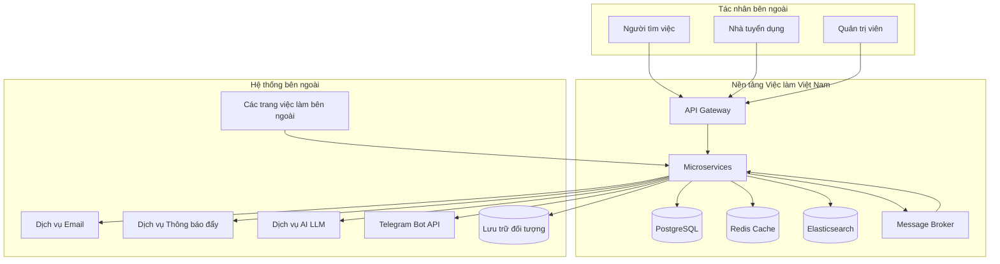
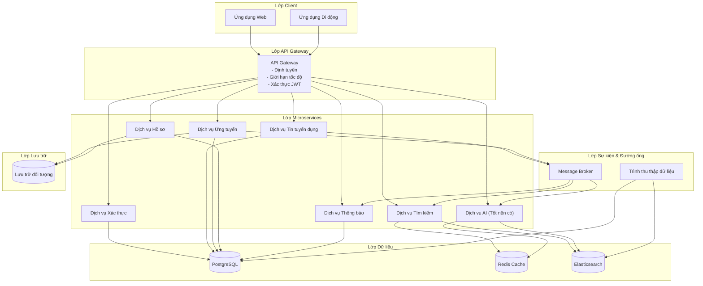

# Đặc tả Yêu cầu Phần mềm (SRS)

[English](2-overall-description.md) | [Tiếng Việt](2-overall-description.vi.md)

## Nền tảng Việc làm Việt Nam - Kiến trúc Microservices

**Phiên bản:** 1.0  
**Ngày:** 17 tháng 8 năm 2026  
**Dự án:** Nền tảng Việc làm Việt Nam (Vietnam Job Platform)  

---

## Phần 2: Mô tả tổng quan

### 2.1 Góc nhìn sản phẩm

Nền tảng Việc làm Việt Nam là một hệ thống mới, độc lập được thiết kế để phục vụ thị trường lao động Việt Nam. Nó không thay thế hệ thống hiện có nào nhưng có thể cạnh tranh với các nền tảng đã được thiết lập như TopCV, VietnamWorks và vieclam.gov.vn do chính phủ vận hành. Hệ thống được xây dựng từ đầu bằng kiến trúc microservices, cung cấp cả giao diện web và di động.

#### 2.1.1 Ngữ cảnh hệ thống

Nền tảng giao tiếp với một số hệ thống và dịch vụ bên ngoài, như được hiển thị trong sơ đồ ngữ cảnh dưới đây. Tất cả các giao diện đều sử dụng giao thức chuẩn và được thiết kế để kết nối lỏng lẻo.



#### 2.1.2 Tổng quan kiến trúc

Hệ thống tuân theo kiến trúc microservices với các lớp sau:

| Lớp | Thành phần | Trách nhiệm chính |
|:----|:-----------|:------------------|
| **Lớp Client** | Ứng dụng Web, Ứng dụng Di động | Giao diện người dùng, tương tác người dùng |
| **Lớp Gateway** | API Gateway | Định tuyến yêu cầu, xác thực, giới hạn tốc độ |
| **Lớp Dịch vụ** | 6+ microservices | Logic nghiệp vụ, thao tác miền |
| **Lớp Dữ liệu** | Cơ sở dữ liệu, Bộ nhớ đệm, Công cụ tìm kiếm | Lưu trữ dữ liệu, đệm, lập chỉ mục tìm kiếm |
| **Lớp Sự kiện** | Message Broker | Giao tiếp không đồng bộ, quy trình hướng sự kiện |
| **Lớp Đường ống** | Trình thu thập dữ liệu | Trích xuất dữ liệu từ các nguồn bên ngoài |
| **Hạ tầng** | Container hóa, CI/CD, Giám sát | Quản lý môi trường, tự động hóa, quan sát |



---

### 2.2 Đặc điểm người dùng

Hệ thống phục vụ ba loại người dùng chính với các vai trò, quyền hạn và mô hình sử dụng khác nhau.

#### 2.2.1 Hồ sơ người dùng

| Loại người dùng | Mô tả | Trình độ kỹ thuật | Tần suất sử dụng |
|:----------------|:------|:------------------|:-----------------|
| **Người tìm việc** | Cá nhân đang tìm kiếm cơ hội việc làm tại Việt Nam | Thấp đến Trung bình | Cao (hàng ngày đến hàng tuần) |
| **Nhà tuyển dụng** | Đại diện công ty hoặc chuyên viên nhân sự đăng tin tuyển dụng | Trung bình | Trung bình (hàng tuần đến hai tuần một lần) |
| **Quản trị viên** | Quản trị viên hệ thống quản lý nền tảng | Cao | Thấp (khi cần) |

#### 2.2.2 Chân dung người dùng

**Người tìm việc - Nguyễn Minh Anh**
- Tuổi: 24, sinh viên mới tốt nghiệp ngành Khoa học Máy tính
- Mục tiêu: Tìm việc làm lập trình trình độ sơ cấp tại Thành phố Hồ Chí Minh
- Kỹ năng: Sử dụng máy tính cơ bản, đọc hiểu tiếng Anh
- Thiết bị: Điện thoại Android (chính), máy tính xách tay (phụ)
- Điểm đau: Tìm kiếm việc làm mất nhiều thời gian, kết quả không liên quan, thiếu phản hồi
- Sử dụng: Hàng ngày, 15-30 phút mỗi phiên

**Nhà tuyển dụng - Trần Thị Lan**
- Tuổi: 35, Giám đốc Nhân sự tại công ty công nghệ vừa
- Mục tiêu: Đăng tin tuyển dụng hiệu quả, lọc ứng viên nhanh chóng
- Kỹ năng: Thành thạo ứng dụng web, có kinh nghiệm với phần mềm nhân sự
- Thiết bị: Máy tính xách tay (chính), điện thoại iOS (phụ)
- Điểm đau: Quản lý nhiều hồ sơ, hồ sơ trùng lặp, thời gian phản hồi chậm
- Sử dụng: Hàng tuần, 1-2 giờ mỗi phiên

**Quản trị viên - Lê Văn Hùng**
- Tuổi: 28, Quản trị viên hệ thống / Nhà phát triển
- Mục tiêu: Đảm bảo ổn định nền tảng, quản lý người dùng, giám sát sức khỏe hệ thống
- Kỹ năng: Nền tảng kỹ thuật vững chắc, quen thuộc với công cụ giám sát
- Thiết bị: Máy tính xách tay (chính), thỉnh thoảng truy cập di động
- Điểm đau: Xác định sự cố nhanh chóng, quản lý tin rác/tin tuyển dụng giả
- Sử dụng: Khi cần, 30 phút mỗi phiên

---

### 2.3 Môi trường vận hành

Hệ thống hoạt động trong môi trường cloud-native sử dụng container hóa và các dịch vụ được quản lý.

#### 2.3.1 Môi trường phát triển

| Thành phần | Thông số kỹ thuật |
|:-----------|:-------------------|
| **Hệ điều hành** | Windows 10/11, macOS hoặc Linux |
| **IDE** | IDE hiện đại hỗ trợ ngôn ngữ (ví dụ: Visual Studio, VS Code) |
| **Container** | Docker Desktop 4.x+ |
| **Cơ sở dữ liệu** | PostgreSQL (Docker cục bộ) |
| **Bộ nhớ đệm** | Redis (Docker cục bộ) |
| **Tìm kiếm** | Elasticsearch (Docker cục bộ) |
| **Message Broker** | Kafka (Docker cục bộ) |
| **Kiểm soát phiên bản** | Git (GitHub) |
| **Công cụ xây dựng** | Công cụ xây dựng theo ngôn ngữ (ví dụ: dotnet CLI, npm, Flutter CLI) |

#### 2.3.2 Môi trường Staging

| Thành phần | Thông số kỹ thuật | Nhà cung cấp |
|:-----------|:------------------|:-------------|
| **Hosting** | 3 VM dùng chung (1 vCPU, 1-2 GB RAM mỗi máy) | Fly.io (Gói Miễn phí) |
| **Cơ sở dữ liệu** | PostgreSQL được quản lý (500 MB) | Supabase |
| **Bộ nhớ đệm** | Redis được quản lý (10k lệnh/ngày) | Upstash |
| **Tìm kiếm** | Elasticsearch được quản lý (1 GB cluster) | Bonsai |
| **Message Broker** | Kafka được quản lý (Gói Cơ bản) | Confluent Cloud |
| **Lưu trữ** | Lưu trữ đối tượng (10 GB) | Cloudflare R2 |
| **CI/CD** | Xây dựng/Kiểm thử Tự động | GitHub Actions |

#### 2.3.3 Môi trường sản phẩm

| Thành phần | Thông số kỹ thuật | Nhà cung cấp |
|:-----------|:------------------|:-------------|
| **Hosting** | 3 VM dùng chung (1-2 vCPU, 2-4 GB RAM mỗi máy) | Fly.io / Railway |
| **Cơ sở dữ liệu** | PostgreSQL được quản lý (1-5 GB) | Supabase / Neon |
| **Bộ nhớ đệm** | Redis được quản lý (50k lệnh/ngày) | Upstash |
| **Tìm kiếm** | Elasticsearch được quản lý (1-5 GB cluster) | Bonsai / Elastic Cloud |
| **Message Broker** | Kafka được quản lý (Gói Tiêu chuẩn) | Confluent Cloud |
| **Lưu trữ** | Lưu trữ đối tượng (10-50 GB) | Cloudflare R2 |
| **CI/CD** | Xây dựng/Kiểm thử/Triển khai Tự động | GitHub Actions |
| **Giám sát** | Chỉ số, Nhật ký, Cảnh báo | Grafana Cloud |

---

### 2.4 Ràng buộc thiết kế và triển khai

Các ràng buộc sau đây chi phối thiết kế và triển khai hệ thống.

#### 2.4.1 Ràng buộc kiến trúc

| Ràng buộc | Mô tả |
|:----------|:------|
| **Kiến trúc phụ trợ** | Kiến trúc microservices với sự phân tách mối quan tâm rõ ràng |
| **Thiết kế API** | Thiết kế RESTful API cho giao tiếp dịch vụ |
| **Thiết kế cơ sở dữ liệu** | Mỗi dịch vụ một cơ sở dữ liệu để cô lập dữ liệu |
| **Nhất quán dữ liệu** | Nhất quán cuối cùng cho các thao tác xuyên dịch vụ |
| **Giao tiếp** | Giao tiếp đồng bộ (REST) và không đồng bộ (message broker) |
| **Bảo mật** | Xác thực dựa trên token và kiểm soát truy cập dựa trên vai trò |
| **Giao diện người dùng (Web)** | SPA hiện đại với kiến trúc dựa trên thành phần |
| **Mobile Framework** | Khung đa nền tảng hỗ trợ iOS và Android |
| **Container hóa** | Tất cả dịch vụ được container hóa với Docker để nhất quán |

#### 2.4.2 Ràng buộc cấu trúc kho lưu trữ

Dự án phải được triển khai dưới dạng **monorepo** với cấu trúc sau:

```
job-platform-monorepo/
├── .github/workflows/          # Đường ống CI/CD
├── src/
│   ├── services/               # Tất cả microservices phụ trợ
│   │   ├── AuthService/
│   │   ├── JobService/
│   │   ├── SearchService/
│   │   ├── ApplicationService/
│   │   ├── ProfileService/
│   │   └── NotificationService/
│   ├── shared/                 # Thư viện dùng chung, DTO, hợp đồng sự kiện
│   │   ├── SharedKernel/
│   │   ├── EventContracts/
│   │   └── Infrastructure/
│   ├── gateway/                # API Gateway
│   └── web/                    # Ứng dụng web
├── mobile/                     # Ứng dụng di động
├── crawler/                    # Trình thu thập dữ liệu
├── ai-service/                 # Dịch vụ AI (Tốt nên có)
├── infrastructure/docker/      # Cấu hình Docker Compose
├── docs/                       # Tài liệu
└── README.md
```

#### 2.4.3 Ràng buộc hạ tầng không chi phí

Tất cả hạ tầng sản phẩm và staging phải tận dụng các gói miễn phí hoặc tín dụng khuyến mãi để đạt **chi phí vận hành $0** trong suốt thời gian dự án 16 tuần. Điều này được trình bày chi tiết trong Phần 9: Hạ tầng và Phân tích chi phí.

Điều này yêu cầu sử dụng:

- Các gói Always Free (GCP f1-micro, Supabase, Upstash, Cloudflare R2, Bonsai)
- Tín dụng dùng thử miễn phí (AWS/Azure/DigitalOcean, Railway)
- Các dịch vụ miễn phí (GitHub Actions, Grafana Cloud, Cloudflare Tunnel)
- Sử dụng API AI hợp lý (Gemini free tier, tín dụng khuyến mãi OpenAI)

#### 2.4.4 Ràng buộc bảo mật

| Ràng buộc | Mô tả |
|:----------|:------|
| **Xác thực** | Xác thực dựa trên token với cơ chế làm mới token |
| **Phân quyền** | Kiểm soát truy cập dựa trên vai trò (Quản trị viên, Nhà tuyển dụng, Người dùng) |
| **Vận chuyển** | Tất cả giao tiếp qua TLS |
| **Mật khẩu** | Băm bằng các thuật toán tiêu chuẩn ngành (ví dụ: bcrypt, PBKDF2) |
| **Xác thực đầu vào** | Tất cả đầu vào của người dùng được xác thực và làm sạch |
| **Mã hóa đầu ra** | Tất cả đầu ra được mã hóa để ngăn chặn tấn công injection |
| **SQL Injection** | Truy vấn có tham số hoặc trừu tượng ORM |
| **Yêu cầu đa nguồn gốc** | Chính sách chia sẻ tài nguyên đa nguồn gốc được cấu hình đúng |

---

### 2.5 Giả định và phụ thuộc

#### 2.5.1 Giả định

| ID | Giả định | Mức độ rủi ro |
|:---|:---------|:--------------|
| A-01 | Nhóm có kiến thức cơ bản về phát triển web hiện đại, API và cơ sở dữ liệu | Trung bình |
| A-02 | Nhóm có thể truy cập internet cho các dịch vụ đám mây và tài liệu | Thấp |
| A-03 | vieclam.gov.vn vẫn có thể truy cập và không áp dụng biện pháp chống thu thập | Trung bình |
| A-04 | Các dịch vụ gói miễn phí (Supabase, Upstash, v.v.) sẽ duy trì các giới hạn hiện tại | Thấp |
| A-05 | Các nhà cung cấp dịch vụ AI (OpenAI/Gemini) duy trì các gói miễn phí của họ | Trung bình |
| A-06 | Tất cả thành viên nhóm đều có máy phát triển đủ năng lực | Trung bình |
| A-07 | Lộ trình 16 tuần là đủ cho phạm vi đã xác định | Cao |

#### 2.5.2 Phụ thuộc

| ID | Phụ thuộc | Tác động nếu không đạt được |
|:---|:----------|:---------------------------|
| D-01 | Sẵn có kho lưu trữ kiểm soát phiên bản | Không thể quản lý phiên bản hoặc cộng tác |
| D-02 | Sẵn có gói miễn phí từ nhà cung cấp đám mây | Tăng chi phí, có thể vượt ngân sách |
| D-03 | Sẵn có dữ liệu từ vieclam.gov.vn | Dữ liệu kiểm thử hạn chế cho tính năng tìm kiếm và thu thập |
| D-04 | Sẵn có API AI bên thứ ba | Không thể triển khai tính năng AI |
| D-05 | Sẵn có dịch vụ thông báo đẩy | Không sử dụng được thông báo đẩy trên di động |
| D-06 | Tính sẵn sàng của cơ sở dữ liệu được quản lý | Lỗi lưu trữ dữ liệu |

---

### 2.6 User Stories

Các user stories sau đây đại diện cho chức năng chính của hệ thống, được tổ chức theo mức độ ưu tiên.

#### 2.6.1 User Stories BẮT BUỘC PHẢI CÓ

| ID | User Story | Tiêu chí chấp nhận |
|:---|:-----------|:-------------------|
| US-01 | Với vai trò **Người tìm việc**, tôi muốn **đăng ký** tài khoản để có thể truy cập nền tảng | - Form đăng ký có xác thực<br>- Tài khoản được tạo trong cơ sở dữ liệu<br>- Xác nhận đăng ký thành công |
| US-02 | Với vai trò **Người tìm việc**, tôi muốn **đăng nhập** để truy cập tài khoản | - Đăng nhập bằng email/mật khẩu<br>- Xác thực dựa trên token<br>- Chuyển hướng dựa theo vai trò |
| US-03 | Với vai trò **Người tìm việc**, tôi muốn **tìm kiếm việc làm** theo từ khóa và địa điểm | - Thanh tìm kiếm trên trang chủ<br>- Kết quả có phân trang<br>- Sắp xếp theo ngày/độ liên quan |
| US-04 | Với vai trò **Người tìm việc**, tôi muốn **xem chi tiết công việc** để đánh giá cơ hội | - Tiêu đề, mô tả, công ty<br>- Lương, địa điểm, yêu cầu<br>- Nút ứng tuyển |
| US-05 | Với vai trò **Người tìm việc**, tôi muốn **ứng tuyển** vào một công việc để được xem xét | - Form ứng tuyển có tải CV lên<br>- Hồ sơ ứng tuyển được lưu trong cơ sở dữ liệu<br>- Theo dõi trạng thái |
| US-06 | Với vai trò **Người tìm việc**, tôi muốn **xem lịch sử ứng tuyển** | - Danh sách ứng tuyển với trạng thái<br>- Lọc theo trạng thái<br>- Chi tiết ứng tuyển |
| US-07 | Với vai trò **Nhà tuyển dụng**, tôi muốn **đăng tin tuyển dụng mới** để thu hút ứng viên | - Form đăng tin<br>- Chọn danh mục<br>- Trạng thái Xuất bản/Nháp |
| US-08 | Với vai trò **Nhà tuyển dụng**, tôi muốn **chỉnh sửa tin tuyển dụng** | - Form cập nhật<br>- Thay đổi được lưu vào cơ sở dữ liệu<br>- Cập nhật chỉ mục tìm kiếm |
| US-09 | Với vai trò **Nhà tuyển dụng**, tôi muốn **xem danh sách ứng viên** cho các tin tuyển dụng | - Danh sách ứng viên theo công việc<br>- Chi tiết ứng viên và CV<br>- Khả năng cập nhật trạng thái |
| US-10 | Với vai trò **Quản trị viên**, tôi muốn **phê duyệt tin tuyển dụng** | - Danh sách tin chờ duyệt<br>- Phê duyệt/Từ chối<br>- Thông báo đến nhà tuyển dụng |

#### 2.6.2 User Stories NÊN CÓ

| ID | User Story | Tiêu chí chấp nhận |
|:---|:-----------|:-------------------|
| US-11 | Với vai trò **Người tìm việc**, tôi muốn **nhận thông báo qua email** về trạng thái ứng tuyển | - Email gửi khi thay đổi trạng thái<br>- Mẫu HTML<br>- Tùy chọn hủy đăng ký |
| US-12 | Với vai trò **Người tìm việc**, tôi muốn **lọc kết quả tìm kiếm** theo lương, kỹ năng, địa điểm | - Thanh bên lọc<br>- Bộ lọc đa lựa chọn<br>- Cập nhật kết quả động |
| US-13 | Với vai trò **Nhà tuyển dụng**, tôi muốn **nhận thông báo** khi ai đó ứng tuyển | - Thông báo thời gian thực<br>- Thông báo email<br>- Cảnh báo trên bảng điều khiển |
| US-14 | Với vai trò **Quản trị viên**, tôi muốn **quản lý người dùng** (chặn/xóa) | - Danh sách người dùng có tìm kiếm<br>- Chuyển đổi trạng thái<br>- Nhật ký kiểm tra |
| US-15 | Với vai trò **Quản trị viên**, tôi muốn **xem thống kê nền tảng** | - Tổng số tin, người dùng, ứng tuyển<br>- Hoạt động gần đây<br>- Biểu đồ và đồ thị |

#### 2.6.3 User Stories TỐT NÊN CÓ

| ID | User Story | Tiêu chí chấp nhận |
|:---|:-----------|:-------------------|
| US-16 | Với vai trò **Người tìm việc**, tôi muốn **trò chuyện với trợ lý AI** để được tư vấn việc làm | - Giao diện chat<br>- AI phản hồi với gợi ý việc làm<br>- Hội thoại nhận biết ngữ cảnh |
| US-17 | Với vai trò **Người tìm việc**, tôi muốn **xem điểm số phù hợp** của CV với một công việc | - Tải CV lên<br>- Điểm số được tạo<br>- Gợi ý cải thiện |
| US-18 | Với vai trò **Người tìm việc**, tôi muốn **nhận cảnh báo việc làm qua Telegram** | - Đăng ký qua bot Telegram<br>- Nhận cảnh báo việc làm<br>- Lệnh hủy đăng ký |
| US-19 | Với vai trò **Người tìm việc**, tôi muốn **gợi ý việc làm cá nhân hóa** | - Nguồn gợi ý<br>- Dựa trên lịch sử và kỹ năng<br>- Có thể làm mới |
| US-20 | Với vai trò **Người dùng**, tôi muốn **sử dụng nền tảng bằng tiếng Việt hoặc tiếng Anh** | - Bộ chọn ngôn ngữ<br>- Tất cả giao diện được dịch<br>- Tùy chọn được lưu lại |
| US-21 | Với vai trò **Người dùng**, tôi muốn **đăng nhập bằng Google hoặc Facebook** | - Nút đăng nhập mạng xã hội<br>- Luồng OAuth<br>- Liên kết tài khoản |

---

### 2.7 Sơ đồ Use Case

Sơ đồ Mermaid sau đây minh họa các use case chính cho từng loại tác nhân.

```mermaid
flowchart TB
    subgraph Actors["Tác nhân"]
        JS["Người tìm việc"]
        RC["Nhà tuyển dụng"]
        AD["Quản trị viên"]
    end

    subgraph UseCases["Use Cases"]
        Reg["Đăng ký"]
        Login["Đăng nhập"]
        Search["Tìm kiếm việc làm"]
        ViewJob["Xem chi tiết công việc"]
        Apply["Ứng tuyển"]
        ViewApps["Xem ứng tuyển"]
        PostJob["Đăng tin"]
        EditJob["Sửa tin"]
        ManageApps["Quản lý ứng tuyển"]
        ApproveJob["Phê duyệt tin"]
        ManageUsers["Quản lý người dùng"]
        ViewStats["Xem thống kê"]
        AI["Trợ lý AI việc làm (TỐT NÊN CÓ)"]
        Resume["Chấm điểm CV (TỐT NÊN CÓ)"]
        Telegram["Cảnh báo Telegram (TỐT NÊN CÓ)"]
        Social["Đăng nhập mạng xã hội (TỐT NÊN CÓ)"]
    end

    JS --> Reg
    JS --> Login
    JS --> Search
    JS --> ViewJob
    JS --> Apply
    JS --> ViewApps
    JS --> AI
    JS --> Resume
    JS --> Telegram
    JS --> Social

    RC --> Reg
    RC --> Login
    RC --> PostJob
    RC --> EditJob
    RC --> ManageApps

    AD --> Login
    AD --> ApproveJob
    AD --> ManageUsers
    AD --> ViewStats
```



---

**Hết Phần 2**