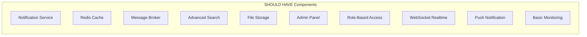
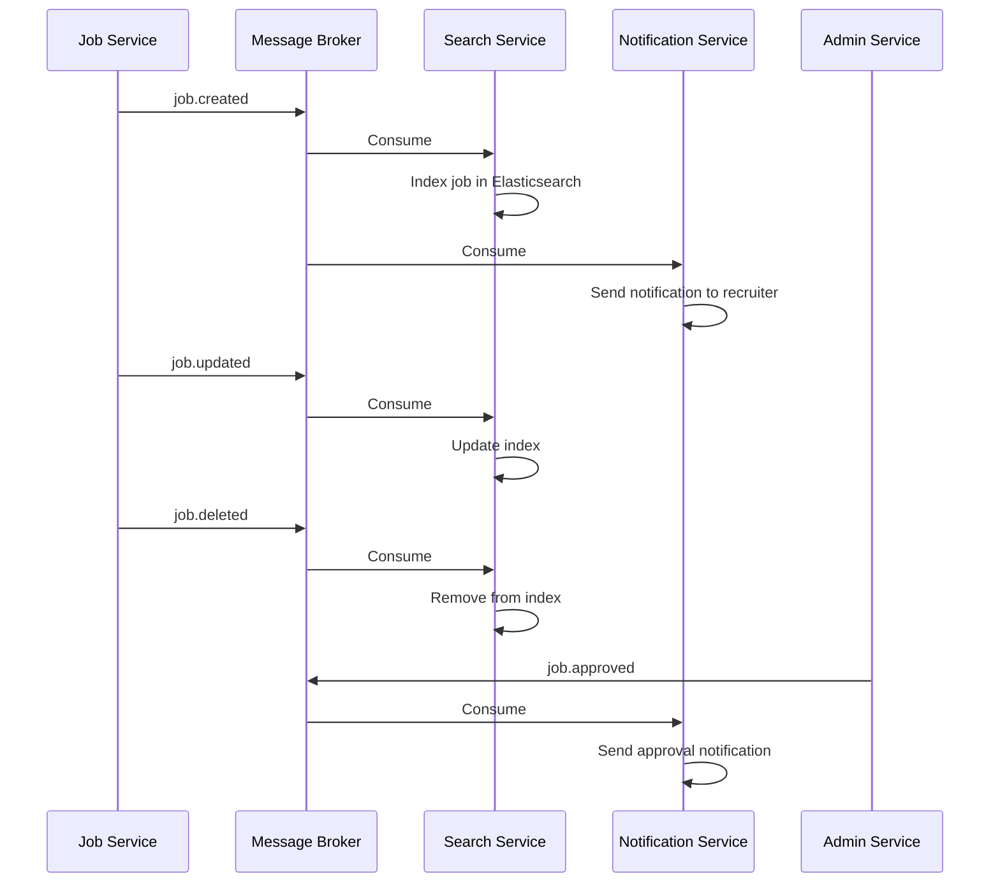
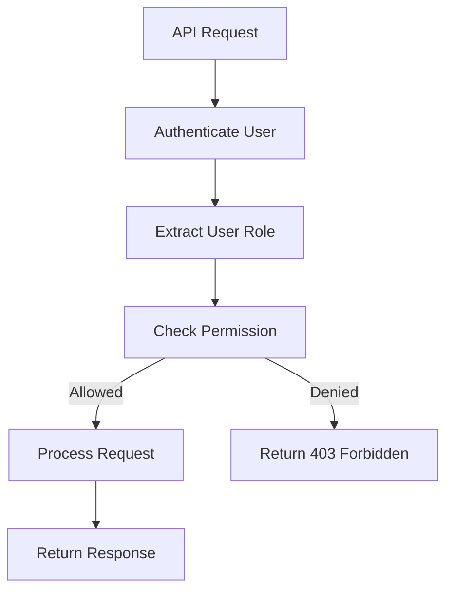
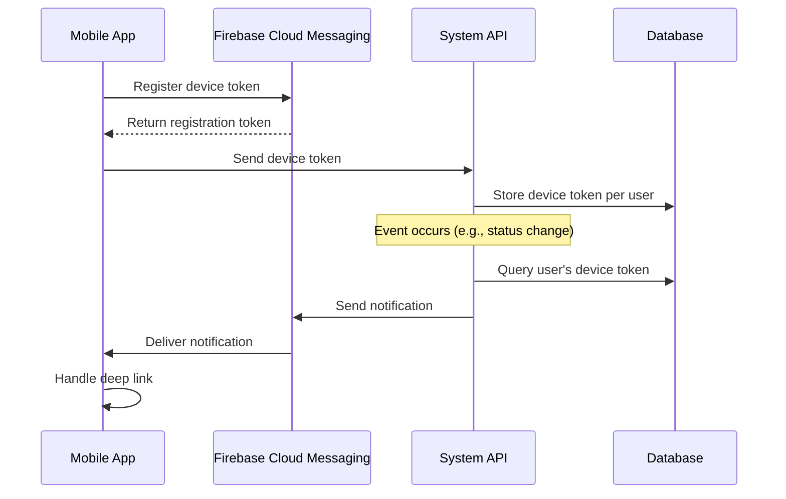

# Software Requirements Specification (SRS)

[English](4-should-have-fr.md) | [Tiếng Việt](4-should-have-fr.vi.md)

## Vietnam Job Platform - Microservices Architecture

**Version:** 1.0  
**Date:** August 17, 2026  
**Project:** Vietnam Job Platform (Nền tảng việc làm Việt Nam)  

---

## Part 4: Functional Requirements - SHOULD HAVE

### 4.1 Overview

This section documents all **SHOULD HAVE** functional requirements. These features significantly enhance user experience and system robustness but can be deferred if time constraints arise. They are highly desirable and should be completed by the end of Week 8, assuming all MUST HAVE requirements are stable.

The SHOULD HAVE features are organised into 10 components:



---

### 4.2 Notification Service

**Component ID:** NOTIF-01  
**Priority:** SHOULD HAVE  
**Owner:** TM1  
**Target Week:** Week 5  

#### 4.2.1 Description

The Notification Service manages all outbound communications from the system. It handles email notifications for application status changes, job post approvals, and other system events. It serves as the centralised notification hub, ensuring consistent messaging across different channels.

#### 4.2.2 Functional Requirements

| ID | Requirement | Acceptance Criteria |
|:---|:------------|:-------------------|
| NOTIF-01-01 | The system shall send email notifications when application status changes | - Email sent when status changes to reviewed, shortlisted, accepted, or rejected<br>- Email template includes: job title, company name, status, and next steps<br>- Email sent to applicant's registered email address |
| NOTIF-01-02 | The system shall send email notifications when a job posting is approved | - Email sent to recruiter when admin approves their job<br>- Email includes: job title, approval date, and link to the job<br>- Notification when job is rejected with reason |
| NOTIF-01-03 | The system shall send email notifications to recruiters when someone applies | - Email sent to recruiter when a new application is submitted<br>- Email includes: applicant name, job title, and link to application<br>- Batch notifications can be configured |
| NOTIF-01-04 | The system shall support HTML email templates | - Templates support formatting, images, and links<br>- Templates are configurable<br>- Plain text fallback for email clients without HTML support |
| NOTIF-01-05 | The system shall support email preferences | - Users can opt-in/opt-out of non-critical notifications<br>- Critical notifications (status changes) cannot be disabled<br>- Preferences persisted in database |
| NOTIF-01-06 | The system shall log all email deliveries | - Delivery status (sent, failed, bounced)<br>- Timestamp of delivery<br>- Error details for failed deliveries |

#### 4.2.3 API Specifications

| Endpoint | Method | Request Body | Response | Validation Rules |
|:---------|:-------|:-------------|:---------|:-----------------|
| `/api/notifications/email/preferences` | GET | - | `{ preferences }` | User must be authenticated |
| `/api/notifications/email/preferences` | PUT | `{ preferences }` | `{ message }` | User must be authenticated |
| `/api/notifications/history` | GET | Query: `page, size` | Paginated response | User must be authenticated |

#### 4.2.4 Data Model

| Entity | Required Attributes | Relationships |
|:-------|:--------------------|:--------------|
| Notification | id, user_id, type (email/push/in-app), channel, subject, body, status (pending/sent/failed), sent_at, error_message, created_at | Many Notifications belong to one User |
| Email Log | id, recipient_email, subject, template_name, status, sent_at, error_message, created_at | Independent audit log |
| User Preference | id, user_id, email_notifications_enabled, marketing_emails_enabled, created_at, updated_at | One User has one Preference |

---

### 4.3 Redis Cache

**Component ID:** CACHE-01  
**Priority:** SHOULD HAVE  
**Owner:** TM1  
**Target Week:** Week 6  

#### 4.3.1 Description

Redis Cache provides in-memory caching to improve application performance. It reduces database load by caching frequently accessed data, such as search results, user sessions, and rate-limiting counters.

#### 4.3.2 Functional Requirements

| ID | Requirement | Acceptance Criteria |
|:---|:------------|:-------------------|
| CACHE-01-01 | The system shall cache search results | - Search results cached with TTL (Time-To-Live) of 5 minutes<br>- Cache key based on search query and filters<br>- Cache invalidated when new jobs are posted |
| CACHE-01-02 | The system shall cache popular job postings | - Frequently viewed jobs cached with TTL of 1 hour<br>- View count updates do not invalidate cache<br>- Cache refreshes on background schedule |
| CACHE-01-03 | The system shall support session storage | - User session data (non-sensitive) cached<br>- TTL matches token expiry (1 hour)<br>- Session data includes: user_id, role, last_activity |
| CACHE-01-04 | The system shall support rate limiting | - Rate limit counters stored in Redis<br>- Per-IP and per-user rate limiting<br>- Counter TTL matches rate limit window (1 minute) |
| CACHE-01-05 | The system shall support cache invalidation | - On job creation/update, relevant search caches cleared<br>- On job deletion, all caches containing that job cleared<br>- Admin can manually clear cache |
| CACHE-01-06 | The system shall handle cache failures gracefully | - If cache unavailable, system falls back to database<br>- Cache failure logged<br>- No user-facing errors for cache failures |

#### 4.3.3 Cache Key Schema

| Use Case | Key Pattern | TTL | Invalidation Trigger |
|:---------|:------------|:----|:---------------------|
| Search Results | `search:{query}:{filters}:{page}` | 5 minutes | New job created or updated |
| Job Detail | `job:{id}` | 1 hour | Job updated or deleted |
| Session Data | `session:{token}` | 1 hour | Logout or token refresh |
| Rate Limit | `ratelimit:{ip}:{endpoint}` | 1 minute | TTL expiration |
| Recommendations | `recommend:{user_id}` | 6 hours | New application submitted |

---

### 4.4 Message Broker Event Bus

**Component ID:** KAFKA-01  
**Priority:** SHOULD HAVE  
**Owner:** TM1  
**Target Week:** Week 5  

#### 4.4.1 Description

The Message Broker Event Bus enables asynchronous, event-driven communication between microservices. It decouples services and enables eventual consistency for cross-service operations. The event bus handles event publishing and consumption with at-least-once delivery semantics.

#### 4.4.2 Functional Requirements

| ID | Requirement | Acceptance Criteria |
|:---|:------------|:-------------------|
| KAFKA-01-01 | The system shall publish events when jobs are created or updated | - Event: `job.created` published when new job is posted<br>- Event: `job.updated` published when job is modified<br>- Event: `job.deleted` published when job is removed |
| KAFKA-01-02 | The system shall publish events when applications are submitted | - Event: `application.submitted` published when user applies<br>- Event: `application.updated` published when status changes |
| KAFKA-01-03 | The Search Service shall consume job events to update the search index | - On `job.created`, job indexed in Elasticsearch<br>- On `job.updated`, job updated in index<br>- On `job.deleted`, job removed from index |
| KAFKA-01-04 | The Notification Service shall consume application events to send notifications | - On `application.submitted`, notification sent to recruiter<br>- On `application.updated`, notification sent to applicant |
| KAFKA-01-05 | The system shall support event replay | - Events persisted for a defined retention period (7 days)<br>- Ability to replay events for debugging<br>- Consumer groups with offset management |
| KAFKA-01-06 | The system shall handle message failures | - Failed message consumption retried (3 attempts)<br>- After retries, message sent to dead letter queue<br>- Failed messages logged and alerted |

#### 4.4.3 Event Schema

| Event Name | Publisher | Consumer(s) | Payload |
|:-----------|:----------|:------------|:--------|
| `job.created` | Job Service | Search Service, Notification Service | `{ job_id, title, company, location, recruiter_id, created_at }` |
| `job.updated` | Job Service | Search Service | `{ job_id, title, company, location, updated_at }` |
| `job.deleted` | Job Service | Search Service | `{ job_id, deleted_at }` |
| `application.submitted` | Application Service | Notification Service | `{ application_id, job_id, applicant_id, applicant_name, job_title, recruiter_id }` |
| `application.updated` | Application Service | Notification Service | `{ application_id, job_id, applicant_id, status, recruiter_id, updated_at }` |

#### 4.4.4 Event Flow Diagram



---

### 4.5 Advanced Search

**Component ID:** ADV-01  
**Priority:** SHOULD HAVE  
**Owner:** TM2  
**Target Week:** Week 6  

#### 4.5.1 Description

Advanced Search extends basic search capabilities with multiple filters, full-text Vietnamese language support, and faceted search results. It provides a more refined and accurate search experience for job seekers.

#### 4.5.2 Functional Requirements

| ID | Requirement | Acceptance Criteria |
|:---|:------------|:-------------------|
| ADV-01-01 | The system shall support salary range filtering | - Filter by minimum salary<br>- Filter by maximum salary<br>- Support VND and USD currencies<br>- Range sliders or input fields |
| ADV-01-02 | The system shall support skill-based filtering | - Filter by required skills<br>- Boolean AND/OR logic for multiple skills<br>- Skills auto-completion |
| ADV-01-03 | The system shall support location filtering | - Filter by city/province<br>- Filter by district (optional)<br>- Support "remote" as a location option |
| ADV-01-04 | The system shall support employment type filtering | - Filter by employment type: Full-time, Part-time, Contract, Internship, Freelance<br>- Multiple selection allowed<br>- Clear "Any" option |
| ADV-01-05 | The system shall support experience level filtering | - Filter by experience level: Entry, Junior, Mid, Senior, Lead<br>- Multiple selection allowed<br>- Clear "Any" option |
| ADV-01-06 | The system shall support Vietnamese full-text search | - Vietnamese text analysis (accent and diacritic handling)<br>- Stop word removal for common Vietnamese words<br>- Stemming for Vietnamese words |
| ADV-01-07 | The system shall support faceted search results | - Display filter counts with each result<br>- Number of jobs matching each filter value<br>- Dynamic updates on filter selection |
| ADV-01-08 | The system shall support sorting of search results | - Sort by relevance (default)<br>- Sort by date posted (newest first)<br>- Sort by salary (highest/lowest) |

#### 4.5.3 API Specifications

| Endpoint | Method | Query Parameters | Response | Validation Rules |
|:---------|:-------|:------------------|:---------|:-----------------|
| `/api/search/advanced` | GET | `q`, `location`, `salary_min`, `salary_max`, `skills`, `employment_type`, `experience_level`, `category`, `page`, `size`, `sort` | `{ items, total, page, size, totalPages, facets }` | Salary values must be valid; page >= 0; size between 1 and 100 |
| `/api/search/skills` | GET | `q` (optional) | `[ { id, name, count } ]` | Query parameter for autocomplete only |
| `/api/search/locations` | GET | `q` (optional) | `[ { id, name, count } ]` | Query parameter for autocomplete only |

#### 4.5.4 Faceted Search Fields

| Field | Type | Facet Values | Example |
|:------|:-----|:-------------|:--------|
| Salary Range | Numeric Range | VND: 0-5M, 5-10M, 10-20M, 20M+ | 10-20M |
| Location | Text | City/Province | Ho Chi Minh, Hanoi, Da Nang |
| Employment Type | Keyword | Full-time, Part-time, Contract, Internship, Freelance | Full-time |
| Experience Level | Keyword | Entry, Junior, Mid, Senior, Lead | Junior |
| Category | Keyword | IT, Finance, Marketing, Healthcare, etc. | IT |
| Skills | Keyword | JavaScript, Python, React, etc. | React |

---

### 4.6 File Storage

**Component ID:** STORE-01  
**Priority:** SHOULD HAVE  
**Owner:** TM1  
**Target Week:** Week 6  

#### 4.6.1 Description

File Storage provides persistent storage for user-uploaded files, including CVs (resumes), profile avatars, and company logos. It leverages object storage for scalability and cost-effectiveness.

#### 4.6.2 Functional Requirements

| ID | Requirement | Acceptance Criteria |
|:---|:------------|:-------------------|
| STORE-01-01 | The system shall support CV (resume) upload | - File types: PDF, DOC, DOCX<br>- Maximum file size: 5 MB<br>- Files stored in object storage with unique identifiers |
| STORE-01-02 | The system shall support profile avatar upload | - File types: JPG, PNG, GIF, WebP<br>- Maximum file size: 2 MB<br>- Image resized to standard dimensions (200x200) |
| STORE-01-03 | The system shall support company logo upload | - File types: JPG, PNG, SVG<br>- Maximum file size: 2 MB<br>- Image resized to standard dimensions (300x300) |
| STORE-01-04 | The system shall generate secure URLs for file access | - URLs with time-limited expiry (1 hour)<br>- Read-only access for download<br>- No public access to files |
| STORE-01-05 | The system shall support file deletion | - CVs deleted when application is withdrawn<br>- Avatar deleted when user changes to default<br>- Orphaned files cleaned up periodically |
| STORE-01-06 | The system shall enforce file type validation | - Files validated by MIME type (not just extension)<br>- Reject malicious files<br>- Validation error messages clear |

#### 4.6.3 API Specifications

| Endpoint | Method | Request Body | Response | Validation Rules |
|:---------|:-------|:-------------|:---------|:-----------------|
| `/api/storage/upload/cv` | POST | FormData: `file` | `{ fileId, url, message }` | User authenticated; file size <= 5MB; allowed file types |
| `/api/storage/upload/avatar` | POST | FormData: `file` | `{ fileId, url, message }` | User authenticated; file size <= 2MB; allowed image types |
| `/api/storage/upload/logo` | POST | FormData: `file` | `{ fileId, url, message }` | Recruiter role required; file size <= 2MB |
| `/api/storage/file/{fileId}` | GET | - | File download | Valid fileId; user has permission; URL not expired |
| `/api/storage/file/{fileId}` | DELETE | - | `{ message }` | User is file owner or admin |

#### 4.6.4 File Storage Summary

| File Type | Allowed Formats | Max Size | Purpose | Access Control |
|:----------|:----------------|:---------|:--------|:---------------|
| CV (Resume) | PDF, DOC, DOCX | 5 MB | Job application | Applicant and recruiter for that job |
| Avatar | JPG, PNG, GIF, WebP | 2 MB | User profile | Public (but generated URL) |
| Company Logo | JPG, PNG, SVG | 2 MB | Company profile | Public (but generated URL) |

---

### 4.7 Admin Panel

**Component ID:** ADMIN-01  
**Priority:** SHOULD HAVE  
**Owner:** TM1  
**Target Week:** Week 7  

#### 4.7.1 Description

The Admin Panel provides administrative interfaces for managing users, jobs, and platform operations. It enables administrators to maintain platform quality and enforce policies.

#### 4.7.2 Functional Requirements

| ID | Requirement | Acceptance Criteria |
|:---|:------------|:-------------------|
| ADMIN-01-01 | The system shall allow administrators to view all users | - User list with search and filters<br>- User details: email, role, registration date, status<br>- Pagination support |
| ADMIN-01-02 | The system shall allow administrators to manage user accounts | - Activate/deactivate user accounts<br>- Change user role (User ↔ Recruiter)<br>- View user activity history |
| ADMIN-01-03 | The system shall allow administrators to approve or reject job postings | - List of pending jobs<br>- Approve/Reject with optional reason<br>- Notification sent to recruiter on decision |
| ADMIN-01-04 | The system shall allow administrators to manage job categories | - Create, edit, delete categories<br>- Categories visible to all users<br>- Jobs reassigned when category deleted |
| ADMIN-01-05 | The system shall allow administrators to view platform statistics | - Total users, recruiters, job seekers<br>- Total jobs, applications, by category<br>- Daily/weekly/monthly activity trends |
| ADMIN-01-06 | The system shall allow administrators to view system health | - Service status (online/offline)<br>- Response times for key APIs<br>- Recent error logs |

#### 4.7.3 API Specifications

| Endpoint | Method | Request Body | Response | Validation Rules |
|:---------|:-------|:-------------|:---------|:-----------------|
| `/api/admin/users` | GET | Query: `q, role, status, page, size` | Paginated user list | Admin role required |
| `/api/admin/users/{userId}` | PUT | `{ role, is_active }` | `{ message }` | Admin role required |
| `/api/admin/jobs/pending` | GET | Query: `page, size` | Paginated job list | Admin role required |
| `/api/admin/jobs/{jobId}/approve` | POST | `{ approved, reason? }` | `{ message }` | Admin role required |
| `/api/admin/categories` | POST | `{ name, description }` | `{ id, message }` | Admin role required |
| `/api/admin/statistics` | GET | Query: `period` (daily/weekly/monthly) | StatisticsDTO | Admin role required |
| `/api/admin/health` | GET | - | HealthCheckDTO | Admin role required |

#### 4.7.4 Admin Statistics

| Metric | Description | Aggregation |
|:-------|:------------|:------------|
| User Growth | New users per day/week/month | Time-series chart |
| Job Postings | Jobs posted per day/week/month | Time-series chart |
| Applications | Applications submitted per day/week/month | Time-series chart |
| Category Distribution | Jobs by category | Pie chart/bar chart |
| Application Status | Applications by status (pending, reviewed, accepted, rejected) | Pie chart/bar chart |
| Active Users | Daily active users | Time-series chart |

---

### 4.8 Role-Based Access Control

**Component ID:** ROLES-01  
**Priority:** SHOULD HAVE  
**Owner:** TM1  
**Target Week:** Week 7  

#### 4.8.1 Description

Role-Based Access Control (RBAC) provides fine-grained permissions for different user roles. It ensures users can only access resources and perform actions appropriate to their role.

#### 4.8.2 Functional Requirements

| ID | Requirement | Acceptance Criteria |
|:---|:------------|:-------------------|
| ROLES-01-01 | The system shall support three primary roles | - Admin: Full system access<br>- Recruiter: Job management and application viewing<br>- User: Job search and application submission |
| ROLES-01-02 | The system shall enforce role-based permissions | - Admin only: User management, job approval, category management<br>- Recruiter only: Post jobs, edit own jobs, view applications<br>- User only: Search jobs, apply, view own applications |
| ROLES-01-03 | The system shall validate permissions on every API request | - Permission check before processing request<br>- 403 Forbidden if user lacks permission<br>- Consistent permission enforcement across all endpoints |
| ROLES-01-04 | The system shall support permission checks in the UI | - UI elements hidden based on user role<br>- Buttons and links conditionally displayed<br>- Consistent role-based navigation |
| ROLES-01-05 | The system shall support user role changes | - Admin can change user roles<br>- Notification sent to user on role change<br>- Session invalidated on role change |

#### 4.8.3 Role Permission Matrix

| Action | User | Recruiter | Admin |
|:-------|:-----|:----------|:------|
| View job listings | Yes | Yes | Yes |
| View job details | Yes | Yes | Yes |
| Apply for jobs | Yes | No | No |
| View own applications | Yes | Yes (as recruiter) | Yes |
| Post jobs | No | Yes | Yes |
| Edit own jobs | No | Yes | Yes |
| Delete own jobs | No | Yes | Yes |
| View applicants for own jobs | No | Yes | Yes |
| Manage all users | No | No | Yes |
| Approve/reject jobs | No | No | Yes |
| Manage categories | No | No | Yes |
| View platform statistics | No | No | Yes |
| View system health | No | No | Yes |

#### 4.8.4 Permission Check Flow



---

### 4.9 WebSocket Realtime Notifications

**Component ID:** WS-01  
**Priority:** SHOULD HAVE  
**Owner:** TM1  
**Target Week:** Week 7  

#### 4.9.1 Description

WebSocket Realtime Notifications provide instant, in-app notifications to users without requiring page refresh. This enhances user experience by delivering real-time updates on job postings, application status, and system events.

#### 4.9.2 Functional Requirements

| ID | Requirement | Acceptance Criteria |
|:---|:------------|:-------------------|
| WS-01-01 | The system shall support WebSocket connections for authenticated users | - WebSocket endpoint: `/ws/notifications`<br>- Connection established after JWT authentication<br>- Multiple connections per user supported |
| WS-01-02 | The system shall send real-time notifications to recruiters when someone applies | - Notification: "New application for [Job Title]"<br>- Includes applicant name and timestamp<br>- Link to application detail |
| WS-01-03 | The system shall send real-time notifications to job seekers on application status changes | - Notification: "Your application for [Job Title] has been [Status]"<br>- Includes status and timestamp<br>- Link to application detail |
| WS-01-04 | The system shall send real-time notifications when new jobs are posted (optional) | - Notification: "New job: [Job Title] at [Company]"<br>- For users who have saved searches or preferences<br>- Link to job detail |
| WS-01-05 | The system shall store notification history | - In-app notifications persisted to database<br>- Users can view past notifications<br>- Mark notifications as read |
| WS-01-06 | The system shall handle reconnection gracefully | - Automatically reconnect on connection loss<br>- Missed notifications delivered on reconnection<br>- No duplicate notifications |

#### 4.9.3 API Specifications

| Endpoint | Method | Request Body | Response | Validation Rules |
|:---------|:-------|:-------------|:---------|:-----------------|
| `/ws/notifications` | WebSocket | - | - | JWT token required in connection string |
| `/api/notifications` | GET | Query: `read, page, size` | Paginated notification list | User must be authenticated |
| `/api/notifications/{id}/read` | PUT | - | `{ message }` | User must be notification owner |
| `/api/notifications/mark-all-read` | PUT | - | `{ message }` | User must be authenticated |

#### 4.9.4 WebSocket Message Formats

| Message Type | Direction | Payload | Description |
|:-------------|:----------|:--------|:------------|
| `notification` | Server -> Client | `{ id, type, title, body, data, timestamp }` | New notification |
| `read` | Client -> Server | `{ notificationId }` | Mark notification as read |
| `read_all` | Client -> Server | - | Mark all notifications as read |
| `error` | Server -> Client | `{ code, message }` | WebSocket error message |
| `ping` | Client -> Server | - | Keep-alive message |

---

### 4.10 Push Notification

**Component ID:** PUSH-01  
**Priority:** SHOULD HAVE  
**Owner:** TM4  
**Target Week:** Week 7  

#### 4.10.1 Description

Push Notification enables the system to send notifications to mobile devices even when the app is not actively running. It leverages Firebase Cloud Messaging (FCM) for cross-platform push notification delivery to both iOS and Android devices.

#### 4.10.2 Functional Requirements

| ID | Requirement | Acceptance Criteria |
|:---|:------------|:-------------------|
| PUSH-01-01 | The system shall support push notifications on mobile devices | - Firebase Cloud Messaging integration<br>- Supports both iOS and Android<br>- Device token stored per user |
| PUSH-01-02 | The system shall send push notifications for application status changes | - Notification sent when application status changes<br>- Push payload includes: job title, status, and deep link<br>- Notification delivered immediately |
| PUSH-01-03 | The system shall send push notifications to recruiters when someone applies | - Notification sent to recruiter on new application<br>- Push payload includes: applicant name, job title, and deep link<br>- Notification delivered immediately |
| PUSH-01-04 | The system shall support push notification preferences | - Users can enable/disable push notifications<br>- Preferences synced across devices<br>- Preference changes reflected immediately |
| PUSH-01-05 | The system shall handle push notification delivery failures | - Retry failed deliveries (3 attempts)<br>- Log delivery failures<br>- Fallback to in-app notification if push fails |
| PUSH-01-06 | The system shall support deep linking in push notifications | - Tapping notification opens the app to relevant screen<br>- Deep link: `job://application/{id}`<br>- Deep link: `job://job/{id}` |

#### 4.10.3 Push Notification Flow



#### 4.10.4 Push Notification Types

| Type | Trigger | Recipient | Deep Link | Payload |
|:-----|:--------|:----------|:----------|:--------|
| Application Status Change | Status updated | Applicant | `job://application/{id}` | `{ appId, jobTitle, status }` |
| New Application | Application submitted | Recruiter | `job://application/{id}` | `{ appId, applicantName, jobTitle }` |
| Job Posted | New job approved | Subscribers | `job://job/{id}` | `{ jobId, title, company }` |

---

### 4.11 Basic Monitoring

**Component ID:** MON-01  
**Priority:** SHOULD HAVE  
**Owner:** TM1  
**Target Week:** Week 8  

#### 4.11.1 Description

Basic Monitoring provides visibility into system health and performance. It includes health checks, logging, and basic metrics to help the team identify and diagnose issues quickly.

#### 4.11.2 Functional Requirements

| ID | Requirement | Acceptance Criteria |
|:---|:------------|:-------------------|
| MON-01-01 | The system shall provide health check endpoints for all services | - Health endpoint: `GET /api/health` per service<br>- Returns: status (UP/DOWN), uptime, version<br>- Check: database connectivity, cache connectivity |
| MON-01-02 | The system shall provide an aggregated health dashboard | - Aggregated health endpoint: `GET /api/health` on gateway<br>- Returns status of all services<br>- Quick overview of system health |
| MON-01-03 | The system shall support structured logging | - Log format: JSON<br>- Includes: timestamp, level, service, message, context<br>- Logs sent to centralised logging system |
| MON-01-04 | The system shall log all API requests | - Request logging: method, path, status code, duration<br>- Error logging: stack traces for exceptions<br>- Audit logging: user actions for compliance |
| MON-01-05 | The system shall collect basic performance metrics | - Response times for key endpoints<br>- Request counts per endpoint<br>- Error rates (4xx, 5xx) |
| MON-01-06 | The system shall provide a simple metrics dashboard | - Dashboard displaying: service health, request counts, error rates<br>- Real-time updates<br>- Minimal configuration |

#### 4.11.3 Health Check Response

```json
{
  "status": "UP",
  "services": {
    "auth": { "status": "UP", "version": "1.0.0", "uptime": "2d 5h 12m" },
    "job": { "status": "UP", "version": "1.0.0", "uptime": "2d 5h 10m" },
    "search": { "status": "UP", "version": "1.0.0", "uptime": "2d 5h 8m" },
    "application": { "status": "UP", "version": "1.0.0", "uptime": "2d 5h 5m" },
    "profile": { "status": "UP", "version": "1.0.0", "uptime": "2d 5h 3m" },
    "notification": { "status": "DEGRADED", "message": "Email service unavailable" }
  },
  "timestamp": "2026-08-17T10:30:00Z"
}
```

#### 4.11.4 Logging Levels

| Level | Description | Example |
|:------|:------------|:--------|
| ERROR | System failures, exceptions, critical issues | Database connection failed |
| WARN | Potential issues, non-critical failures | Email delivery failed, retrying |
| INFO | Normal system operations, key events | User logged in, job created |
| DEBUG | Detailed debugging information | SQL query execution, cache hit/miss |
| TRACE | Very detailed debugging information | API request/response payloads |

---

### 4.12 SHOULD HAVE Requirements Summary

| Component | ID | Key Features | Target Week | Owner |
|:----------|:---|:-------------|:------------|:------|
| Notification Service | NOTIF-01 | Email notifications for status changes, HTML templates | 5 | TM1 |
| Redis Cache | CACHE-01 | Search caching, session storage, rate limiting | 6 | TM1 |
| Message Broker | KAFKA-01 | Event publishing, event consumption, event replay | 5 | TM1 |
| Advanced Search | ADV-01 | Salary, skill, location, employment type filters; Vietnamese full-text | 6 | TM2 |
| File Storage | STORE-01 | CV upload, avatar upload, company logo upload, secure URLs | 6 | TM1 |
| Admin Panel | ADMIN-01 | User management, job approval, category management, statistics | 7 | TM1 |
| Role-Based Access | ROLES-01 | Fine-grained permissions, role-based UI, permission checks | 7 | TM1 |
| WebSocket Realtime | WS-01 | Real-time in-app notifications, notification history | 7 | TM1 |
| Push Notification | PUSH-01 | FCM integration, deep linking, push preferences | 7 | TM4 |
| Basic Monitoring | MON-01 | Health checks, structured logging, metrics dashboard | 8 | TM1 |

---

**End of Part 4**

---