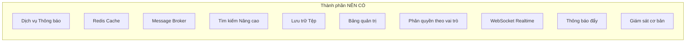
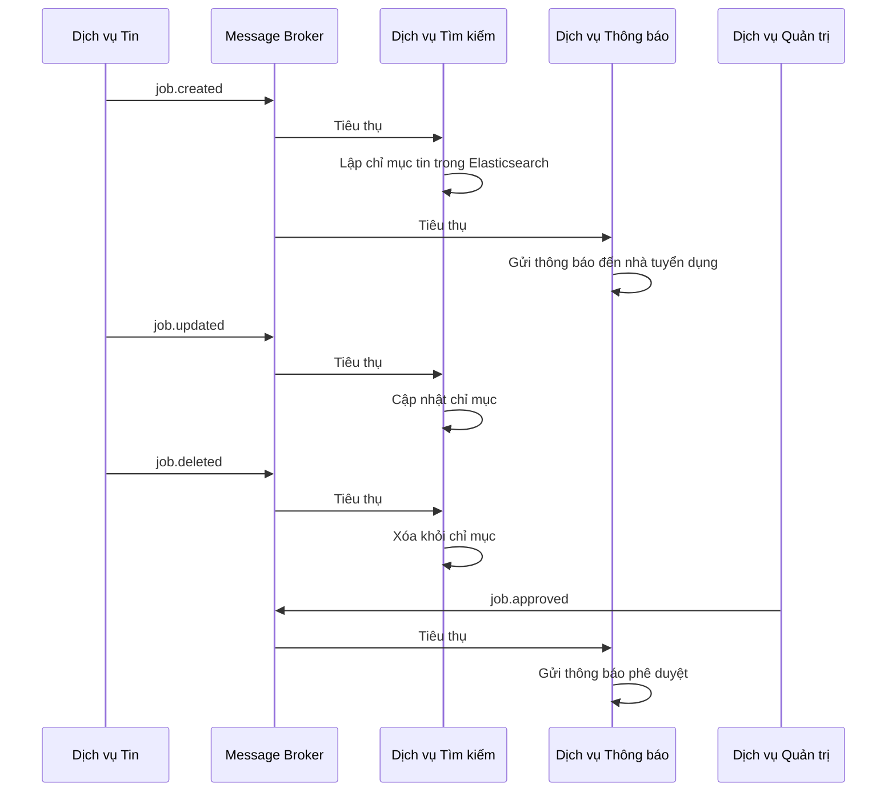
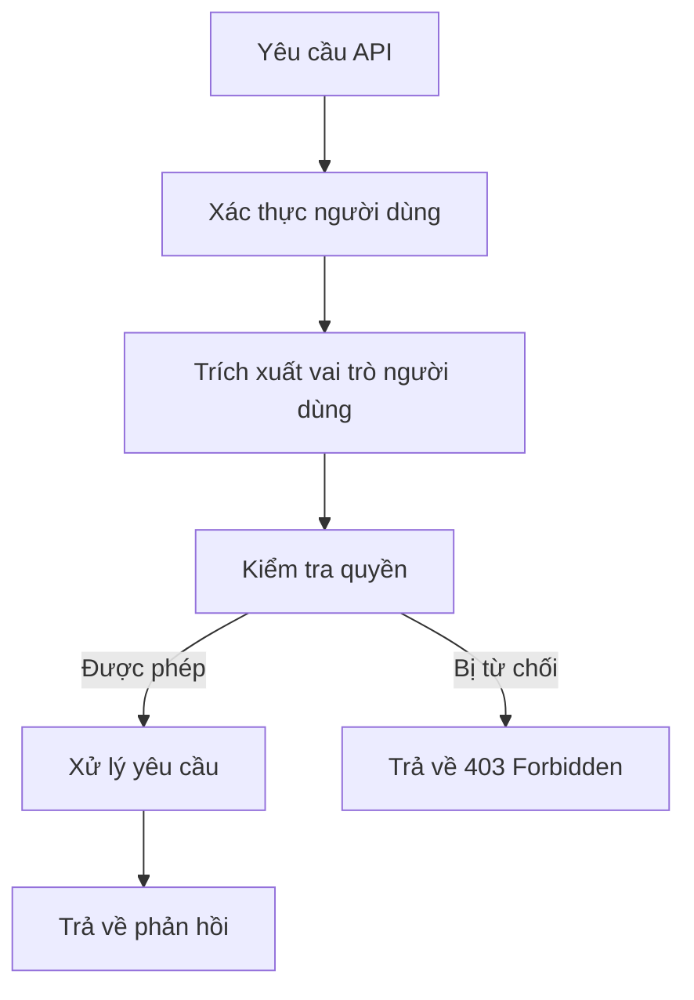
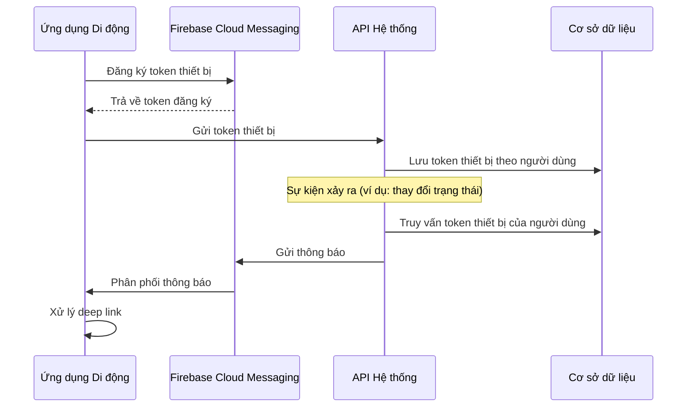

# Đặc tả Yêu cầu Phần mềm (SRS)

[English](4-should-have-fr.md) | [Tiếng Việt](4-should-have-fr.vi.md)

## Nền tảng Việc làm Việt Nam - Kiến trúc Microservices

**Phiên bản:** 1.0  
**Ngày:** 17 tháng 8 năm 2026  
**Dự án:** Nền tảng Việc làm Việt Nam (Vietnam Job Platform)  

---

## Phần 4: Yêu cầu chức năng - NÊN CÓ

### 4.1 Tổng quan

Phần này ghi lại tất cả các yêu cầu chức năng **NÊN CÓ**. Các tính năng này nâng cao đáng kể trải nghiệm người dùng và độ bền của hệ thống nhưng có thể lùi lại nếu có hạn chế về thời gian. Chúng rất đáng có và nên được hoàn thành vào cuối Tuần 8, với điều kiện tất cả các yêu cầu BẮT BUỘC PHẢI CÓ đã ổn định.

Các tính năng NÊN CÓ được tổ chức thành 10 thành phần:



---

### 4.2 Dịch vụ Thông báo

**ID thành phần:** NOTIF-01  
**Mức độ ưu tiên:** NÊN CÓ  
**Người phụ trách:** TM1  
**Tuần mục tiêu:** Tuần 5  

#### 4.2.1 Mô tả

Dịch vụ Thông báo quản lý tất cả các giao tiếp đi ra từ hệ thống. Nó xử lý thông báo email cho thay đổi trạng thái ứng tuyển, phê duyệt tin tuyển dụng và các sự kiện hệ thống khác. Nó đóng vai trò là trung tâm thông báo tập trung, đảm bảo nhắn tin nhất quán qua các kênh khác nhau.

#### 4.2.2 Yêu cầu chức năng

| ID | Yêu cầu | Tiêu chí chấp nhận |
|:---|:--------|:-------------------|
| NOTIF-01-01 | Hệ thống gửi thông báo email khi trạng thái ứng tuyển thay đổi | - Email gửi khi trạng thái thay đổi thành reviewed, shortlisted, accepted hoặc rejected<br>- Mẫu email bao gồm: tiêu đề công việc, tên công ty, trạng thái và các bước tiếp theo<br>- Email gửi đến địa chỉ email đã đăng ký của ứng viên |
| NOTIF-01-02 | Hệ thống gửi thông báo email khi tin tuyển dụng được phê duyệt | - Email gửi đến nhà tuyển dụng khi quản trị viên phê duyệt tin của họ<br>- Email bao gồm: tiêu đề công việc, ngày phê duyệt và liên kết đến công việc<br>- Thông báo khi tin bị từ chối kèm lý do |
| NOTIF-01-03 | Hệ thống gửi thông báo email đến nhà tuyển dụng khi có người ứng tuyển | - Email gửi đến nhà tuyển dụng khi có ứng tuyển mới được gửi<br>- Email bao gồm: tên ứng viên, tiêu đề công việc và liên kết đến ứng tuyển<br>- Có thể cấu hình gửi thông báo theo lô |
| NOTIF-01-04 | Hệ thống hỗ trợ mẫu email HTML | - Mẫu hỗ trợ định dạng, hình ảnh và liên kết<br>- Mẫu có thể cấu hình<br>- Dự phòng văn bản thuần cho các email client không hỗ trợ HTML |
| NOTIF-01-05 | Hệ thống hỗ trợ tùy chọn email | - Người dùng có thể chọn nhận/không nhận thông báo không quan trọng<br>- Thông báo quan trọng (thay đổi trạng thái) không thể tắt<br>- Tùy chọn được lưu trong cơ sở dữ liệu |
| NOTIF-01-06 | Hệ thống ghi nhật ký tất cả các lần gửi email | - Trạng thái gửi (đã gửi, thất bại, bị trả lại)<br>- Thời gian gửi<br>- Chi tiết lỗi cho các lần gửi thất bại |

#### 4.2.3 Đặc tả API

| Điểm cuối | Phương thức | Body yêu cầu | Phản hồi | Quy tắc xác thực |
|:----------|:------------|:-------------|:---------|:-----------------|
| `/api/notifications/email/preferences` | GET | - | `{ preferences }` | Người dùng phải được xác thực |
| `/api/notifications/email/preferences` | PUT | `{ preferences }` | `{ message }` | Người dùng phải được xác thực |
| `/api/notifications/history` | GET | Query: `page, size` | Phản hồi phân trang | Người dùng phải được xác thực |

#### 4.2.4 Mô hình dữ liệu

| Thực thể | Thuộc tính bắt buộc | Quan hệ |
|:---------|:--------------------|:--------|
| Notification | id, user_id, type (email/push/in-app), channel, subject, body, status (pending/sent/failed), sent_at, error_message, created_at | Nhiều Notifications thuộc về một User |
| Email Log | id, recipient_email, subject, template_name, status, sent_at, error_message, created_at | Nhật ký kiểm tra độc lập |
| User Preference | id, user_id, email_notifications_enabled, marketing_emails_enabled, created_at, updated_at | Một User có một Preference |

---

### 4.3 Redis Cache

**ID thành phần:** CACHE-01  
**Mức độ ưu tiên:** NÊN CÓ  
**Người phụ trách:** TM1  
**Tuần mục tiêu:** Tuần 6  

#### 4.3.1 Mô tả

Redis Cache cung cấp bộ nhớ đệm trong bộ nhớ để cải thiện hiệu năng ứng dụng. Nó giảm tải cơ sở dữ liệu bằng cách lưu đệm dữ liệu được truy cập thường xuyên, như kết quả tìm kiếm, phiên người dùng và bộ đếm giới hạn tốc độ.

#### 4.3.2 Yêu cầu chức năng

| ID | Yêu cầu | Tiêu chí chấp nhận |
|:---|:--------|:-------------------|
| CACHE-01-01 | Hệ thống lưu đệm kết quả tìm kiếm | - Kết quả tìm kiếm được đệm với TTL (Thời gian sống) là 5 phút<br>- Khóa đệm dựa trên truy vấn tìm kiếm và bộ lọc<br>- Đệm bị vô hiệu hóa khi tin tuyển dụng mới được đăng |
| CACHE-01-02 | Hệ thống lưu đệm các tin tuyển dụng phổ biến | - Các công việc được xem thường xuyên được đệm với TTL 1 giờ<br>- Cập nhật lượt xem không làm vô hiệu hóa đệm<br>- Đệm được làm mới theo lịch trình nền |
| CACHE-01-03 | Hệ thống hỗ trợ lưu trữ phiên | - Dữ liệu phiên người dùng (không nhạy cảm) được đệm<br>- TTL khớp với thời hạn token (1 giờ)<br>- Dữ liệu phiên bao gồm: user_id, role, last_activity |
| CACHE-01-04 | Hệ thống hỗ trợ giới hạn tốc độ | - Bộ đếm giới hạn tốc độ được lưu trong Redis<br>- Giới hạn tốc độ theo IP và theo người dùng<br>- TTL của bộ đếm khớp với cửa sổ giới hạn tốc độ (1 phút) |
| CACHE-01-05 | Hệ thống hỗ trợ vô hiệu hóa đệm | - Khi tạo/cập nhật tin, các đệm tìm kiếm liên quan bị xóa<br>- Khi xóa tin, tất cả đệm chứa tin đó bị xóa<br>- Quản trị viên có thể xóa đệm thủ công |
| CACHE-01-06 | Hệ thống xử lý lỗi đệm một cách mượt mà | - Nếu đệm không khả dụng, hệ thống chuyển sang cơ sở dữ liệu<br>- Lỗi đệm được ghi nhật ký<br>- Không có lỗi hiển thị cho người dùng do lỗi đệm |

#### 4.3.3 Lược đồ khóa đệm

| Trường hợp sử dụng | Mẫu khóa | TTL | Kích hoạt vô hiệu hóa |
|:-------------------|:---------|:----|:----------------------|
| Kết quả tìm kiếm | `search:{query}:{filters}:{page}` | 5 phút | Tin mới được tạo hoặc cập nhật |
| Chi tiết tin | `job:{id}` | 1 giờ | Tin được cập nhật hoặc xóa |
| Dữ liệu phiên | `session:{token}` | 1 giờ | Đăng xuất hoặc làm mới token |
| Giới hạn tốc độ | `ratelimit:{ip}:{endpoint}` | 1 phút | Hết hạn TTL |
| Gợi ý | `recommend:{user_id}` | 6 giờ | Ứng tuyển mới được gửi |

---

### 4.4 Message Broker Event Bus

**ID thành phần:** KAFKA-01  
**Mức độ ưu tiên:** NÊN CÓ  
**Người phụ trách:** TM1  
**Tuần mục tiêu:** Tuần 5  

#### 4.4.1 Mô tả

Message Broker Event Bus cho phép giao tiếp không đồng bộ, hướng sự kiện giữa các microservices. Nó tách biệt các dịch vụ và cho phép nhất quán cuối cùng cho các thao tác xuyên dịch vụ. Event bus xử lý xuất bản và tiêu thụ sự kiện với ngữ nghĩa giao hàng ít nhất một lần.

#### 4.4.2 Yêu cầu chức năng

| ID | Yêu cầu | Tiêu chí chấp nhận |
|:---|:--------|:-------------------|
| KAFKA-01-01 | Hệ thống xuất bản sự kiện khi tin tuyển dụng được tạo hoặc cập nhật | - Sự kiện: `job.created` được xuất bản khi tin mới được đăng<br>- Sự kiện: `job.updated` được xuất bản khi tin được sửa đổi<br>- Sự kiện: `job.deleted` được xuất bản khi tin bị xóa |
| KAFKA-01-02 | Hệ thống xuất bản sự kiện khi ứng tuyển được gửi | - Sự kiện: `application.submitted` được xuất bản khi người dùng ứng tuyển<br>- Sự kiện: `application.updated` được xuất bản khi trạng thái thay đổi |
| KAFKA-01-03 | Dịch vụ Tìm kiếm tiêu thụ sự kiện tin để cập nhật chỉ mục tìm kiếm | - Khi `job.created`, tin được lập chỉ mục trong Elasticsearch<br>- Khi `job.updated`, tin được cập nhật trong chỉ mục<br>- Khi `job.deleted`, tin bị xóa khỏi chỉ mục |
| KAFKA-01-04 | Dịch vụ Thông báo tiêu thụ sự kiện ứng tuyển để gửi thông báo | - Khi `application.submitted`, thông báo gửi đến nhà tuyển dụng<br>- Khi `application.updated`, thông báo gửi đến ứng viên |
| KAFKA-01-05 | Hệ thống hỗ trợ phát lại sự kiện | - Sự kiện được lưu trong thời gian lưu giữ xác định (7 ngày)<br>- Khả năng phát lại sự kiện để gỡ lỗi<br>- Nhóm người tiêu dùng với quản lý offset |
| KAFKA-01-06 | Hệ thống xử lý lỗi tin nhắn | - Tiêu thụ tin nhắn thất bại được thử lại (3 lần)<br>- Sau khi thử lại, tin nhắn được gửi đến hàng đợi dead letter<br>- Tin nhắn thất bại được ghi nhật ký và cảnh báo |

#### 4.4.3 Lược đồ sự kiện

| Tên sự kiện | Người xuất bản | Người tiêu dùng | Payload |
|:------------|:---------------|:---------------|:--------|
| `job.created` | Job Service | Search Service, Notification Service | `{ job_id, title, company, location, recruiter_id, created_at }` |
| `job.updated` | Job Service | Search Service | `{ job_id, title, company, location, updated_at }` |
| `job.deleted` | Job Service | Search Service | `{ job_id, deleted_at }` |
| `application.submitted` | Application Service | Notification Service | `{ application_id, job_id, applicant_id, applicant_name, job_title, recruiter_id }` |
| `application.updated` | Application Service | Notification Service | `{ application_id, job_id, applicant_id, status, recruiter_id, updated_at }` |

#### 4.4.4 Sơ đồ luồng sự kiện



---

### 4.5 Tìm kiếm Nâng cao

**ID thành phần:** ADV-01  
**Mức độ ưu tiên:** NÊN CÓ  
**Người phụ trách:** TM2  
**Tuần mục tiêu:** Tuần 6  

#### 4.5.1 Mô tả

Tìm kiếm Nâng cao mở rộng khả năng tìm kiếm cơ bản với nhiều bộ lọc, hỗ trợ ngôn ngữ tiếng Việt toàn văn và kết quả tìm kiếm phân khúc. Nó cung cấp trải nghiệm tìm kiếm tinh tế và chính xác hơn cho người tìm việc.

#### 4.5.2 Yêu cầu chức năng

| ID | Yêu cầu | Tiêu chí chấp nhận |
|:---|:--------|:-------------------|
| ADV-01-01 | Hệ thống hỗ trợ lọc theo khoảng lương | - Lọc theo lương tối thiểu<br>- Lọc theo lương tối đa<br>- Hỗ trợ tiền tệ VND và USD<br>- Thanh trượt hoặc trường nhập |
| ADV-01-02 | Hệ thống hỗ trợ lọc theo kỹ năng | - Lọc theo kỹ năng yêu cầu<br>- Logic AND/OR cho nhiều kỹ năng<br>- Tự động hoàn thành kỹ năng |
| ADV-01-03 | Hệ thống hỗ trợ lọc theo địa điểm | - Lọc theo thành phố/tỉnh<br>- Lọc theo quận/huyện (tùy chọn)<br>- Hỗ trợ tùy chọn "làm việc từ xa" |
| ADV-01-04 | Hệ thống hỗ trợ lọc theo loại hình công việc | - Lọc theo loại hình: Toàn thời gian, Bán thời gian, Hợp đồng, Thực tập, Freelance<br>- Cho phép chọn nhiều<br>- Tùy chọn "Bất kỳ" rõ ràng |
| ADV-01-05 | Hệ thống hỗ trợ lọc theo cấp độ kinh nghiệm | - Lọc theo cấp độ: Mới vào nghề, Junior, Trung cấp, Senior, Lead<br>- Cho phép chọn nhiều<br>- Tùy chọn "Bất kỳ" rõ ràng |
| ADV-01-06 | Hệ thống hỗ trợ tìm kiếm toàn văn tiếng Việt | - Phân tích văn bản tiếng Việt (xử lý dấu và thanh)<br>- Loại bỏ từ dừng cho các từ tiếng Việt phổ biến<br>- Stemming cho từ tiếng Việt |
| ADV-01-07 | Hệ thống hỗ trợ kết quả tìm kiếm phân khúc | - Hiển thị số lượng bộ lọc với mỗi kết quả<br>- Số lượng công việc khớp với mỗi giá trị bộ lọc<br>- Cập nhật động khi chọn bộ lọc |
| ADV-01-08 | Hệ thống hỗ trợ sắp xếp kết quả tìm kiếm | - Sắp xếp theo độ liên quan (mặc định)<br>- Sắp xếp theo ngày đăng (mới nhất)<br>- Sắp xếp theo lương (cao/thấp nhất) |

#### 4.5.3 Đặc tả API

| Điểm cuối | Phương thức | Tham số truy vấn | Phản hồi | Quy tắc xác thực |
|:----------|:------------|:-----------------|:---------|:-----------------|
| `/api/search/advanced` | GET | `q`, `location`, `salary_min`, `salary_max`, `skills`, `employment_type`, `experience_level`, `category`, `page`, `size`, `sort` | `{ items, total, page, size, totalPages, facets }` | Giá trị lương phải hợp lệ; page >= 0; size từ 1-100 |
| `/api/search/skills` | GET | `q` (tùy chọn) | `[ { id, name, count } ]` | Tham số truy vấn chỉ dùng cho tự động hoàn thành |
| `/api/search/locations` | GET | `q` (tùy chọn) | `[ { id, name, count } ]` | Tham số truy vấn chỉ dùng cho tự động hoàn thành |

#### 4.5.4 Trường tìm kiếm phân khúc

| Trường | Loại | Giá trị phân khúc | Ví dụ |
|:-------|:-----|:------------------|:------|
| Khoảng lương | Khoảng số | VND: 0-5M, 5-10M, 10-20M, 20M+ | 10-20M |
| Địa điểm | Văn bản | Thành phố/Tỉnh | Hồ Chí Minh, Hà Nội, Đà Nẵng |
| Loại hình công việc | Từ khóa | Toàn thời gian, Bán thời gian, Hợp đồng, Thực tập, Freelance | Toàn thời gian |
| Cấp độ kinh nghiệm | Từ khóa | Mới vào nghề, Junior, Trung cấp, Senior, Lead | Junior |
| Danh mục | Từ khóa | IT, Tài chính, Marketing, Y tế, v.v. | IT |
| Kỹ năng | Từ khóa | JavaScript, Python, React, v.v. | React |

---

### 4.6 Lưu trữ Tệp

**ID thành phần:** STORE-01  
**Mức độ ưu tiên:** NÊN CÓ  
**Người phụ trách:** TM1  
**Tuần mục tiêu:** Tuần 6  

#### 4.6.1 Mô tả

Lưu trữ Tệp cung cấp lưu trữ liên tục cho các tệp do người dùng tải lên, bao gồm CV (sơ yếu lý lịch), ảnh đại diện hồ sơ và logo công ty. Nó tận dụng lưu trữ đối tượng để có khả năng mở rộng và hiệu quả chi phí.

#### 4.6.2 Yêu cầu chức năng

| ID | Yêu cầu | Tiêu chí chấp nhận |
|:---|:--------|:-------------------|
| STORE-01-01 | Hệ thống hỗ trợ tải lên CV (sơ yếu lý lịch) | - Loại tệp: PDF, DOC, DOCX<br>- Kích thước tệp tối đa: 5 MB<br>- Tệp được lưu trong lưu trữ đối tượng với định danh duy nhất |
| STORE-01-02 | Hệ thống hỗ trợ tải lên ảnh đại diện | - Loại tệp: JPG, PNG, GIF, WebP<br>- Kích thước tệp tối đa: 2 MB<br>- Hình ảnh được thay đổi kích thước theo kích thước tiêu chuẩn (200x200) |
| STORE-01-03 | Hệ thống hỗ trợ tải lên logo công ty | - Loại tệp: JPG, PNG, SVG<br>- Kích thước tệp tối đa: 2 MB<br>- Hình ảnh được thay đổi kích thước theo kích thước tiêu chuẩn (300x300) |
| STORE-01-04 | Hệ thống tạo URL an toàn cho truy cập tệp | - URL có thời hạn giới hạn (1 giờ)<br>- Truy cập chỉ đọc để tải xuống<br>- Không có truy cập công khai vào tệp |
| STORE-01-05 | Hệ thống hỗ trợ xóa tệp | - CV bị xóa khi ứng tuyển bị rút lại<br>- Ảnh đại diện bị xóa khi người dùng đổi sang mặc định<br>- Các tệp mồ côi được dọn dẹp định kỳ |
| STORE-01-06 | Hệ thống thực thi xác thực loại tệp | - Tệp được xác thực theo loại MIME (không chỉ phần mở rộng)<br>- Từ chối tệp độc hại<br>- Thông báo lỗi xác thực rõ ràng |

#### 4.6.3 Đặc tả API

| Điểm cuối | Phương thức | Body yêu cầu | Phản hồi | Quy tắc xác thực |
|:----------|:------------|:-------------|:---------|:-----------------|
| `/api/storage/upload/cv` | POST | FormData: `file` | `{ fileId, url, message }` | Người dùng được xác thực; kích thước tệp <= 5MB; loại tệp được phép |
| `/api/storage/upload/avatar` | POST | FormData: `file` | `{ fileId, url, message }` | Người dùng được xác thực; kích thước tệp <= 2MB; loại ảnh được phép |
| `/api/storage/upload/logo` | POST | FormData: `file` | `{ fileId, url, message }` | Yêu cầu vai trò Nhà tuyển dụng; kích thước tệp <= 2MB |
| `/api/storage/file/{fileId}` | GET | - | Tải tệp xuống | fileId hợp lệ; người dùng có quyền; URL chưa hết hạn |
| `/api/storage/file/{fileId}` | DELETE | - | `{ message }` | Người dùng là chủ sở hữu tệp hoặc quản trị viên |

#### 4.6.4 Tóm tắt lưu trữ tệp

| Loại tệp | Định dạng cho phép | Kích thước tối đa | Mục đích | Kiểm soát truy cập |
|:---------|:-------------------|:-----------------|:---------|:-------------------|
| CV (Sơ yếu lý lịch) | PDF, DOC, DOCX | 5 MB | Ứng tuyển | Ứng viên và nhà tuyển dụng cho công việc đó |
| Ảnh đại diện | JPG, PNG, GIF, WebP | 2 MB | Hồ sơ người dùng | Công khai (nhưng URL được tạo) |
| Logo công ty | JPG, PNG, SVG | 2 MB | Hồ sơ công ty | Công khai (nhưng URL được tạo) |

---

### 4.7 Bảng quản trị

**ID thành phần:** ADMIN-01  
**Mức độ ưu tiên:** NÊN CÓ  
**Người phụ trách:** TM1  
**Tuần mục tiêu:** Tuần 7  

#### 4.7.1 Mô tả

Bảng quản trị cung cấp giao diện quản trị để quản lý người dùng, công việc và các hoạt động nền tảng. Nó cho phép quản trị viên duy trì chất lượng nền tảng và thực thi các chính sách.

#### 4.7.2 Yêu cầu chức năng

| ID | Yêu cầu | Tiêu chí chấp nhận |
|:---|:--------|:-------------------|
| ADMIN-01-01 | Hệ thống cho phép quản trị viên xem tất cả người dùng | - Danh sách người dùng với tìm kiếm và bộ lọc<br>- Chi tiết người dùng: email, vai trò, ngày đăng ký, trạng thái<br>- Hỗ trợ phân trang |
| ADMIN-01-02 | Hệ thống cho phép quản trị viên quản lý tài khoản người dùng | - Kích hoạt/hủy kích hoạt tài khoản người dùng<br>- Thay đổi vai trò người dùng (Người dùng ↔ Nhà tuyển dụng)<br>- Xem lịch sử hoạt động của người dùng |
| ADMIN-01-03 | Hệ thống cho phép quản trị viên phê duyệt hoặc từ chối tin tuyển dụng | - Danh sách tin đang chờ<br>- Phê duyệt/Từ chối với lý do tùy chọn<br>- Thông báo gửi đến nhà tuyển dụng khi có quyết định |
| ADMIN-01-04 | Hệ thống cho phép quản trị viên quản lý danh mục tin | - Tạo, chỉnh sửa, xóa danh mục<br>- Danh mục hiển thị cho tất cả người dùng<br>- Tin được chỉ định lại khi danh mục bị xóa |
| ADMIN-01-05 | Hệ thống cho phép quản trị viên xem thống kê nền tảng | - Tổng số người dùng, nhà tuyển dụng, người tìm việc<br>- Tổng số tin, ứng tuyển, theo danh mục<br>- Xu hướng hoạt động hàng ngày/tuần/tháng |
| ADMIN-01-06 | Hệ thống cho phép quản trị viên xem tình trạng hệ thống | - Trạng thái dịch vụ (trực tuyến/ngoại tuyến)<br>- Thời gian phản hồi của các API chính<br>- Nhật ký lỗi gần đây |

#### 4.7.3 Đặc tả API

| Điểm cuối | Phương thức | Body yêu cầu | Phản hồi | Quy tắc xác thực |
|:----------|:------------|:-------------|:---------|:-----------------|
| `/api/admin/users` | GET | Query: `q, role, status, page, size` | Danh sách người dùng phân trang | Yêu cầu vai trò Quản trị viên |
| `/api/admin/users/{userId}` | PUT | `{ role, is_active }` | `{ message }` | Yêu cầu vai trò Quản trị viên |
| `/api/admin/jobs/pending` | GET | Query: `page, size` | Danh sách tin phân trang | Yêu cầu vai trò Quản trị viên |
| `/api/admin/jobs/{jobId}/approve` | POST | `{ approved, reason? }` | `{ message }` | Yêu cầu vai trò Quản trị viên |
| `/api/admin/categories` | POST | `{ name, description }` | `{ id, message }` | Yêu cầu vai trò Quản trị viên |
| `/api/admin/statistics` | GET | Query: `period` (daily/weekly/monthly) | StatisticsDTO | Yêu cầu vai trò Quản trị viên |
| `/api/admin/health` | GET | - | HealthCheckDTO | Yêu cầu vai trò Quản trị viên |

#### 4.7.4 Thống kê quản trị

| Chỉ số | Mô tả | Tổng hợp |
|:-------|:------|:---------|
| Tăng trưởng người dùng | Người dùng mới mỗi ngày/tuần/tháng | Biểu đồ chuỗi thời gian |
| Tin tuyển dụng | Tin đăng mỗi ngày/tuần/tháng | Biểu đồ chuỗi thời gian |
| Ứng tuyển | Ứng tuyển được gửi mỗi ngày/tuần/tháng | Biểu đồ chuỗi thời gian |
| Phân phối danh mục | Tin theo danh mục | Biểu đồ tròn/biểu đồ cột |
| Trạng thái ứng tuyển | Ứng tuyển theo trạng thái (đang chờ, đã xem xét, được nhận, bị từ chối) | Biểu đồ tròn/biểu đồ cột |
| Người dùng hoạt động | Người dùng hoạt động hàng ngày | Biểu đồ chuỗi thời gian |

---

### 4.8 Phân quyền theo vai trò

**ID thành phần:** ROLES-01  
**Mức độ ưu tiên:** NÊN CÓ  
**Người phụ trách:** TM1  
**Tuần mục tiêu:** Tuần 7  

#### 4.8.1 Mô tả

Phân quyền theo vai trò (RBAC) cung cấp quyền chi tiết cho các vai trò người dùng khác nhau. Nó đảm bảo người dùng chỉ có thể truy cập tài nguyên và thực hiện hành động phù hợp với vai trò của họ.

#### 4.8.2 Yêu cầu chức năng

| ID | Yêu cầu | Tiêu chí chấp nhận |
|:---|:--------|:-------------------|
| ROLES-01-01 | Hệ thống hỗ trợ ba vai trò chính | - Quản trị viên: Truy cập toàn hệ thống<br>- Nhà tuyển dụng: Quản lý tin và xem ứng tuyển<br>- Người dùng: Tìm kiếm và ứng tuyển |
| ROLES-01-02 | Hệ thống thực thi quyền theo vai trò | - Chỉ Quản trị viên: Quản lý người dùng, phê duyệt tin, quản lý danh mục<br>- Chỉ Nhà tuyển dụng: Đăng tin, sửa tin của mình, xem ứng tuyển<br>- Chỉ Người dùng: Tìm kiếm, ứng tuyển, xem ứng tuyển của mình |
| ROLES-01-03 | Hệ thống xác thực quyền trên mọi yêu cầu API | - Kiểm tra quyền trước khi xử lý yêu cầu<br>- 403 Forbidden nếu người dùng thiếu quyền<br>- Thực thi quyền nhất quán trên tất cả điểm cuối |
| ROLES-01-04 | Hệ thống hỗ trợ kiểm tra quyền trong UI | - Phần tử UI ẩn dựa trên vai trò người dùng<br>- Nút và liên kết hiển thị có điều kiện<br>- Điều hướng nhất quán theo vai trò |
| ROLES-01-05 | Hệ thống hỗ trợ thay đổi vai trò người dùng | - Quản trị viên có thể thay đổi vai trò người dùng<br>- Thông báo gửi đến người dùng khi thay đổi vai trò<br>- Phiên bị vô hiệu hóa khi thay đổi vai trò |

#### 4.8.3 Ma trận quyền theo vai trò

| Hành động | Người dùng | Nhà tuyển dụng | Quản trị viên |
|:----------|:-----------|:---------------|:--------------|
| Xem danh sách việc làm | Có | Có | Có |
| Xem chi tiết việc làm | Có | Có | Có |
| Ứng tuyển | Có | Không | Không |
| Xem ứng tuyển của mình | Có | Có (với tư cách nhà tuyển dụng) | Có |
| Đăng tin | Không | Có | Có |
| Sửa tin của mình | Không | Có | Có |
| Xóa tin của mình | Không | Có | Có |
| Xem ứng viên cho tin của mình | Không | Có | Có |
| Quản lý tất cả người dùng | Không | Không | Có |
| Phê duyệt/từ chối tin | Không | Không | Có |
| Quản lý danh mục | Không | Không | Có |
| Xem thống kê nền tảng | Không | Không | Có |
| Xem tình trạng hệ thống | Không | Không | Có |

#### 4.8.4 Luồng kiểm tra quyền



---

### 4.9 WebSocket Realtime Notifications

**ID thành phần:** WS-01  
**Mức độ ưu tiên:** NÊN CÓ  
**Người phụ trách:** TM1  
**Tuần mục tiêu:** Tuần 7  

#### 4.9.1 Mô tả

WebSocket Realtime Notifications cung cấp thông báo trong ứng dụng tức thời cho người dùng mà không yêu cầu làm mới trang. Điều này nâng cao trải nghiệm người dùng bằng cách cung cấp cập nhật thời gian thực về tin tuyển dụng, trạng thái ứng tuyển và các sự kiện hệ thống.

#### 4.9.2 Yêu cầu chức năng

| ID | Yêu cầu | Tiêu chí chấp nhận |
|:---|:--------|:-------------------|
| WS-01-01 | Hệ thống hỗ trợ kết nối WebSocket cho người dùng đã xác thực | - Điểm cuối WebSocket: `/ws/notifications`<br>- Kết nối được thiết lập sau khi xác thực JWT<br>- Hỗ trợ nhiều kết nối trên mỗi người dùng |
| WS-01-02 | Hệ thống gửi thông báo thời gian thực đến nhà tuyển dụng khi có người ứng tuyển | - Thông báo: "Ứng tuyển mới cho [Tiêu đề công việc]"<br>- Bao gồm tên ứng viên và thời gian<br>- Liên kết đến chi tiết ứng tuyển |
| WS-01-03 | Hệ thống gửi thông báo thời gian thực đến người tìm việc khi trạng thái ứng tuyển thay đổi | - Thông báo: "Ứng tuyển của bạn cho [Tiêu đề công việc] đã được [Trạng thái]"<br>- Bao gồm trạng thái và thời gian<br>- Liên kết đến chi tiết ứng tuyển |
| WS-01-04 | Hệ thống gửi thông báo thời gian thực khi tin tuyển dụng mới được đăng (tùy chọn) | - Thông báo: "Việc làm mới: [Tiêu đề công việc] tại [Công ty]"<br>- Cho người dùng đã lưu tìm kiếm hoặc tùy chọn<br>- Liên kết đến chi tiết tin |
| WS-01-05 | Hệ thống lưu trữ lịch sử thông báo | - Thông báo trong ứng dụng được lưu vào cơ sở dữ liệu<br>- Người dùng có thể xem thông báo đã qua<br>- Đánh dấu thông báo đã đọc |
| WS-01-06 | Hệ thống xử lý kết nối lại một cách mượt mà | - Tự động kết nối lại khi mất kết nối<br>- Thông báo bị bỏ lỡ được gửi khi kết nối lại<br>- Không có thông báo trùng lặp |

#### 4.9.3 Đặc tả API

| Điểm cuối | Phương thức | Body yêu cầu | Phản hồi | Quy tắc xác thực |
|:----------|:------------|:-------------|:---------|:-----------------|
| `/ws/notifications` | WebSocket | - | - | Yêu cầu token JWT trong chuỗi kết nối |
| `/api/notifications` | GET | Query: `read, page, size` | Danh sách thông báo phân trang | Người dùng phải được xác thực |
| `/api/notifications/{id}/read` | PUT | - | `{ message }` | Người dùng phải là chủ sở hữu thông báo |
| `/api/notifications/mark-all-read` | PUT | - | `{ message }` | Người dùng phải được xác thực |

#### 4.9.4 Định dạng tin nhắn WebSocket

| Loại tin nhắn | Hướng | Payload | Mô tả |
|:--------------|:------|:--------|:------|
| `notification` | Server -> Client | `{ id, type, title, body, data, timestamp }` | Thông báo mới |
| `read` | Client -> Server | `{ notificationId }` | Đánh dấu thông báo đã đọc |
| `read_all` | Client -> Server | - | Đánh dấu tất cả thông báo đã đọc |
| `error` | Server -> Client | `{ code, message }` | Tin nhắn lỗi WebSocket |
| `ping` | Client -> Server | - | Tin nhắn giữ kết nối |

---

### 4.10 Thông báo đẩy

**ID thành phần:** PUSH-01  
**Mức độ ưu tiên:** NÊN CÓ  
**Người phụ trách:** TM4  
**Tuần mục tiêu:** Tuần 7  

#### 4.10.1 Mô tả

Thông báo đẩy cho phép hệ thống gửi thông báo đến thiết bị di động ngay cả khi ứng dụng không đang chạy tích cực. Nó tận dụng Firebase Cloud Messaging (FCM) để gửi thông báo đẩy đa nền tảng đến cả thiết bị iOS và Android.

#### 4.10.2 Yêu cầu chức năng

| ID | Yêu cầu | Tiêu chí chấp nhận |
|:---|:--------|:-------------------|
| PUSH-01-01 | Hệ thống hỗ trợ thông báo đẩy trên thiết bị di động | - Tích hợp Firebase Cloud Messaging<br>- Hỗ trợ cả iOS và Android<br>- Token thiết bị được lưu theo người dùng |
| PUSH-01-02 | Hệ thống gửi thông báo đẩy cho thay đổi trạng thái ứng tuyển | - Thông báo gửi khi trạng thái ứng tuyển thay đổi<br>- Payload đẩy bao gồm: tiêu đề công việc, trạng thái và deep link<br>- Thông báo được gửi ngay lập tức |
| PUSH-01-03 | Hệ thống gửi thông báo đẩy đến nhà tuyển dụng khi có người ứng tuyển | - Thông báo gửi đến nhà tuyển dụng khi có ứng tuyển mới<br>- Payload đẩy bao gồm: tên ứng viên, tiêu đề công việc và deep link<br>- Thông báo được gửi ngay lập tức |
| PUSH-01-04 | Hệ thống hỗ trợ tùy chọn thông báo đẩy | - Người dùng có thể bật/tắt thông báo đẩy<br>- Tùy chọn được đồng bộ giữa các thiết bị<br>- Thay đổi tùy chọn được phản ánh ngay lập tức |
| PUSH-01-05 | Hệ thống xử lý lỗi gửi thông báo đẩy | - Thử lại gửi thất bại (3 lần)<br>- Ghi nhật ký lỗi gửi<br>- Chuyển sang thông báo trong ứng dụng nếu đẩy thất bại |
| PUSH-01-06 | Hệ thống hỗ trợ deep link trong thông báo đẩy | - Chạm vào thông báo mở ứng dụng đến màn hình phù hợp<br>- Deep link: `job://application/{id}`<br>- Deep link: `job://job/{id}` |

#### 4.10.3 Luồng thông báo đẩy



#### 4.10.4 Các loại thông báo đẩy

| Loại | Kích hoạt | Người nhận | Deep Link | Payload |
|:-----|:----------|:-----------|:----------|:--------|
| Thay đổi trạng thái ứng tuyển | Trạng thái được cập nhật | Ứng viên | `job://application/{id}` | `{ appId, jobTitle, status }` |
| Ứng tuyển mới | Ứng tuyển được gửi | Nhà tuyển dụng | `job://application/{id}` | `{ appId, applicantName, jobTitle }` |
| Tin mới được đăng | Tin được phê duyệt | Người đăng ký | `job://job/{id}` | `{ jobId, title, company }` |

---

### 4.11 Giám sát cơ bản

**ID thành phần:** MON-01  
**Mức độ ưu tiên:** NÊN CÓ  
**Người phụ trách:** TM1  
**Tuần mục tiêu:** Tuần 8  

#### 4.11.1 Mô tả

Giám sát cơ bản cung cấp khả năng quan sát tình trạng và hiệu năng hệ thống. Nó bao gồm kiểm tra sức khỏe, ghi nhật ký và các chỉ số cơ bản để giúp nhóm xác định và chẩn đoán sự cố nhanh chóng.

#### 4.11.2 Yêu cầu chức năng

| ID | Yêu cầu | Tiêu chí chấp nhận |
|:---|:--------|:-------------------|
| MON-01-01 | Hệ thống cung cấp điểm cuối kiểm tra sức khỏe cho tất cả dịch vụ | - Điểm cuối sức khỏe: `GET /api/health` cho mỗi dịch vụ<br>- Trả về: status (UP/DOWN), uptime, version<br>- Kiểm tra: kết nối cơ sở dữ liệu, kết nối cache |
| MON-01-02 | Hệ thống cung cấp bảng điều khiển sức khỏe tổng hợp | - Điểm cuối sức khỏe tổng hợp: `GET /api/health` trên gateway<br>- Trả về trạng thái của tất cả dịch vụ<br>- Tổng quan nhanh về tình trạng hệ thống |
| MON-01-03 | Hệ thống hỗ trợ ghi nhật ký có cấu trúc | - Định dạng nhật ký: JSON<br>- Bao gồm: timestamp, level, service, message, context<br>- Nhật ký được gửi đến hệ thống ghi nhật ký tập trung |
| MON-01-04 | Hệ thống ghi nhật ký tất cả yêu cầu API | - Ghi nhật ký yêu cầu: method, path, status code, duration<br>- Ghi nhật ký lỗi: stack trace cho exceptions<br>- Ghi nhật ký kiểm tra: hành động người dùng cho tuân thủ |
| MON-01-05 | Hệ thống thu thập chỉ số hiệu năng cơ bản | - Thời gian phản hồi của các điểm cuối chính<br>- Số lượng yêu cầu cho mỗi điểm cuối<br>- Tỷ lệ lỗi (4xx, 5xx) |
| MON-01-06 | Hệ thống cung cấp bảng điều khiển chỉ số đơn giản | - Bảng điều khiển hiển thị: tình trạng dịch vụ, số lượng yêu cầu, tỷ lệ lỗi<br>- Cập nhật thời gian thực<br>- Cấu hình tối thiểu |

#### 4.11.3 Phản hồi kiểm tra sức khỏe

```json
{
  "status": "UP",
  "services": {
    "auth": { "status": "UP", "version": "1.0.0", "uptime": "2d 5h 12m" },
    "job": { "status": "UP", "version": "1.0.0", "uptime": "2d 5h 10m" },
    "search": { "status": "UP", "version": "1.0.0", "uptime": "2d 5h 8m" },
    "application": { "status": "UP", "version": "1.0.0", "uptime": "2d 5h 5m" },
    "profile": { "status": "UP", "version": "1.0.0", "uptime": "2d 5h 3m" },
    "notification": { "status": "DEGRADED", "message": "Dịch vụ email không khả dụng" }
  },
  "timestamp": "2026-08-17T10:30:00Z"
}
```

#### 4.11.4 Các cấp độ ghi nhật ký

| Cấp độ | Mô tả | Ví dụ |
|:-------|:------|:------|
| ERROR | Lỗi hệ thống, ngoại lệ, sự cố nghiêm trọng | Kết nối cơ sở dữ liệu thất bại |
| WARN | Sự cố tiềm ẩn, lỗi không nghiêm trọng | Gửi email thất bại, đang thử lại |
| INFO | Hoạt động hệ thống bình thường, sự kiện quan trọng | Người dùng đăng nhập, tin được tạo |
| DEBUG | Thông tin gỡ lỗi chi tiết | Thực thi truy vấn SQL, cache hit/miss |
| TRACE | Thông tin gỡ lỗi rất chi tiết | Payload yêu cầu/phản hồi API |

---

### 4.12 Tóm tắt yêu cầu NÊN CÓ

| Thành phần | ID | Tính năng chính | Tuần mục tiêu | Người phụ trách |
|:-----------|:---|:----------------|:--------------|:----------------|
| Dịch vụ Thông báo | NOTIF-01 | Thông báo email cho thay đổi trạng thái, mẫu HTML | 5 | TM1 |
| Redis Cache | CACHE-01 | Đệm tìm kiếm, lưu trữ phiên, giới hạn tốc độ | 6 | TM1 |
| Message Broker | KAFKA-01 | Xuất bản sự kiện, tiêu thụ sự kiện, phát lại sự kiện | 5 | TM1 |
| Tìm kiếm Nâng cao | ADV-01 | Bộ lọc lương, kỹ năng, địa điểm, loại hình; tìm kiếm toàn văn tiếng Việt | 6 | TM2 |
| Lưu trữ Tệp | STORE-01 | Tải CV, ảnh đại diện, logo công ty, URL an toàn | 6 | TM1 |
| Bảng quản trị | ADMIN-01 | Quản lý người dùng, phê duyệt tin, quản lý danh mục, thống kê | 7 | TM1 |
| Phân quyền theo vai trò | ROLES-01 | Quyền chi tiết, UI theo vai trò, kiểm tra quyền | 7 | TM1 |
| WebSocket Realtime | WS-01 | Thông báo trong ứng dụng thời gian thực, lịch sử thông báo | 7 | TM1 |
| Thông báo đẩy | PUSH-01 | Tích hợp FCM, deep linking, tùy chọn đẩy | 7 | TM4 |
| Giám sát cơ bản | MON-01 | Kiểm tra sức khỏe, ghi nhật ký có cấu trúc, bảng điều khiển chỉ số | 8 | TM1 |

---

**Hết Phần 4**