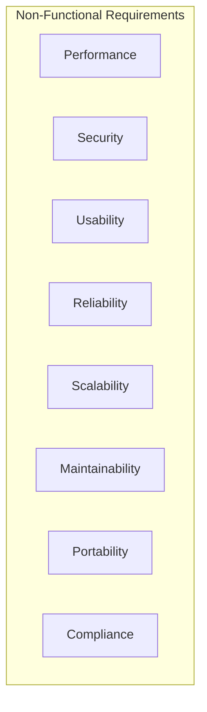

# Software Requirements Specification (SRS)
## Vietnam Job Platform - Microservices Architecture

**Version:** 1.0  
**Date:** August 17, 2026  
**Project:** Vietnam Job Platform (Nền tảng việc làm Việt Nam)  

---

## Part 6: Non-Functional Requirements

### 6.1 Overview

This section documents all non-functional requirements for the Vietnam Job Platform. These requirements define the quality attributes, performance characteristics, and constraints that the system must satisfy. Unlike functional requirements, which specify *what* the system does, non-functional requirements specify *how well* the system does it.

Non-functional requirements are grouped into the following categories:

---

### 6.2 Performance Requirements

Performance requirements define the system's responsiveness, throughput, and resource utilisation under specified conditions.

| ID | Requirement | Acceptance Criteria | Priority |
|:---|:------------|:-------------------|:----------|
| PERF-01 | The system shall respond to API requests within acceptable time limits | - 95% of requests complete within 500ms - 99% of requests complete within 1000ms - Response time measured at API Gateway | MUST |
| PERF-02 | The system shall handle search queries efficiently | - 95% of search queries complete within 200ms - 99% of search queries complete within 500ms - Measured from search service | SHOULD |
| PERF-03 | The system shall support concurrent users | - Support at least 100 concurrent users - Support at least 1,000 requests per minute - Performance degrades gracefully under load | MUST |
| PERF-04 | The web application shall load quickly | - First Contentful Paint (FCP) < 1.5 seconds - Largest Contentful Paint (LCP) < 2.5 seconds - Time to Interactive (TTI) < 3.0 seconds | SHOULD |
| PERF-05 | The mobile application shall be responsive | - App launches within 3 seconds (cold start) - Screen transitions < 300ms - Scrolling is smooth (60fps) | SHOULD |
| PERF-06 | The system shall use database connection pooling | - Connection pool size appropriate for expected load - Connection timeout < 30 seconds - No connection leaks | MUST |
| PERF-07 | The system shall utilise caching effectively | - Cache hit rate > 60% for search results - Cache hit rate > 80% for popular job listings - Cache miss penalty < 200ms | SHOULD |
| PERF-08 | The system shall optimise file uploads | - File upload time < 5 seconds for 1MB file - Upload progress indicator provided - Chunked upload for large files (> 5MB) | NICE |

---

### 6.3 Security Requirements

Security requirements define how the system protects data, prevents unauthorised access, and maintains user privacy.

| ID | Requirement | Acceptance Criteria | Priority |
|:---|:------------|:-------------------|:----------|
| SEC-01 | The system shall authenticate all users before granting access | - Token-based authentication required for all protected endpoints - Invalid tokens rejected - Session timeout after inactivity (1 hour) | MUST |
| SEC-02 | The system shall authorise access based on user roles | - Role-based access control (RBAC) enforced - Users cannot access resources outside their permissions - Admin-only endpoints protected | MUST |
| SEC-03 | The system shall encrypt all passwords | - Passwords hashed using bcrypt or PBKDF2 - Salt used for each password - Plain text passwords never stored | MUST |
| SEC-04 | The system shall use TLS for all communication | - TLS 1.2 or higher for all endpoints - Valid SSL certificate - Automatic redirect from HTTP to HTTPS | MUST |
| SEC-05 | The system shall protect against common web vulnerabilities | - SQL injection prevention (parameterised queries) - XSS prevention (output encoding) - CSRF protection (tokens) - Input validation on all user inputs | MUST |
| SEC-06 | The system shall implement rate limiting | - Rate limiting per IP address - Rate limiting per API key/user - 100 requests per minute default limit | SHOULD |
| SEC-07 | The system shall provide audit logging | - Log all authentication attempts (success/failure) - Log all authorisation failures - Log all administrative actions | SHOULD |
| SEC-08 | The system shall protect sensitive data | - Personal information encrypted at rest - CV files stored with restricted access - API keys and secrets not exposed | MUST |
| SEC-09 | The system shall implement secure session management | - JWT tokens with appropriate expiry (1 hour) - Refresh token rotation - Token revocation on logout | MUST |
| SEC-10 | The system shall implement proper CORS policy | - CORS configured for trusted origins only - Preflight requests handled correctly - Cross-origin requests validated | MUST |

---

### 6.4 Usability Requirements

Usability requirements define how easy and pleasant the system is for users to interact with.

| ID | Requirement | Acceptance Criteria | Priority |
|:---|:------------|:-------------------|:----------|
| USAB-01 | The system shall provide a consistent user experience | - Consistent navigation across all pages/screens - Consistent terminology throughout - Consistent visual style and branding | MUST |
| USAB-02 | The system shall provide clear error messages | - User-friendly error messages (not technical) - Suggested actions to resolve errors - Error messages in user's language | MUST |
| USAB-03 | The system shall provide feedback on user actions | - Loading indicators for async operations - Success/confirmation messages - Validation feedback in real-time | MUST |
| USAB-04 | The system shall be responsive on all devices | - Web application responsive (desktop, tablet, mobile) - Touch-friendly interface on mobile - Readable font sizes on all devices | MUST |
| USAB-05 | The system shall support accessible design | - WCAG 2.1 AA compliance (where practical) - Keyboard navigation support - Screen reader compatibility | NICE |
| USAB-06 | The system shall provide helpful onboarding | - New user guide or walkthrough - Tooltips for key features - Clear call-to-action buttons | SHOULD |
| USAB-07 | The system shall support efficient workflows | - Minimal clicks to complete tasks - Keyboard shortcuts (web) - Quick actions from search results | NICE |
| USAB-08 | The system shall provide intuitive navigation | - Clear navigation structure - Breadcrumbs on web - Bottom navigation on mobile | MUST |

---

### 6.5 Reliability Requirements

Reliability requirements define the system's stability, fault tolerance, and recovery capabilities.

| ID | Requirement | Acceptance Criteria | Priority |
|:---|:------------|:-------------------|:----------|
| REL-01 | The system shall maintain high availability | - Uptime > 99% during operating hours - Scheduled maintenance < 2 hours per month - No unscheduled downtime during demos | MUST |
| REL-02 | The system shall handle failures gracefully | - Service failures handled with graceful degradation - User-facing error pages for critical failures - Service recovery without manual intervention | SHOULD |
| REL-03 | The system shall implement circuit breakers | - Circuit breaker pattern for external service calls - Fallback responses when circuit is open - Automatic recovery when service becomes available | SHOULD |
| REL-04 | The system shall support data persistence | - Data persisted to database on all write operations - No data loss on service restart - Transaction support for data consistency | MUST |
| REL-05 | The system shall implement retry mechanisms | - Retry on transient failures (3 attempts) - Exponential backoff between retries - Configurable retry timeout | SHOULD |
| REL-06 | The system shall provide health check endpoints | - Health check endpoint per service - Aggregated health status via API Gateway - Dashboard for health monitoring | SHOULD |
| REL-07 | The system shall implement error handling | - Exception handling in all layers - User-friendly error pages (not stack traces) - Error logging for diagnostics | MUST |
| REL-08 | The system shall support graceful shutdown | - In-flight requests completed on shutdown - Connections closed properly - Clean resource cleanup | SHOULD |

---

### 6.6 Scalability Requirements

Scalability requirements define the system's ability to handle growing loads and user bases.

| ID | Requirement | Acceptance Criteria | Priority |
|:---|:------------|:-------------------|:----------|
| SCAL-01 | The system shall support horizontal scaling | - Services can be scaled independently - Stateless services for easy scaling - Load balancing across instances | SHOULD |
| SCAL-02 | The system shall handle data growth | - Database can handle growth to 10,000+ jobs - Search index can handle growth to 10,000+ jobs - Storage can handle 5,000+ CV files | MUST |
| SCAL-03 | The system shall support caching at scale | - Distributed cache (Redis) for shared state - Cache consistency across instances - Cache invalidation on data changes | SHOULD |
| SCAL-04 | The system shall support database scalability | - Database connections pooled - Query optimisation for large datasets - Indexes on frequently queried fields | MUST |
| SCAL-05 | The system shall support elastic scaling (Nice to Have) | - Auto-scaling based on load metrics - Horizontal Pod Autoscaling (Kubernetes) - Scale-down during low traffic | NICE |

---

### 6.7 Maintainability Requirements

Maintainability requirements define how easy it is to update, modify, and extend the system.

| ID | Requirement | Acceptance Criteria | Priority |
|:---|:------------|:-------------------|:----------|
| MAINT-01 | The system shall follow clean architecture principles | - Separation of concerns (API, Business Logic, Data) - Dependency inversion - Services with clear boundaries | MUST |
| MAINT-02 | The system shall maintain code quality | - Code coverage > 70% (unit tests) - Static code analysis passes - Linting rules enforced | SHOULD |
| MAINT-03 | The system shall maintain documentation | - API documentation (Swagger/OpenAPI) - Setup/installation guide - Architectural documentation | MUST |
| MAINT-04 | The system shall support version control | - All source code in version control - Feature branch workflow - Pull request reviews | MUST |
| MAINT-05 | The system shall support CI/CD | - Automated builds on code push - Automated tests on code push - Automated deployments (staging/prod) | SHOULD |
| MAINT-06 | The system shall support logging | - Structured logging (JSON format) - Configurable log levels - Log aggregation and centralised access | SHOULD |
| MAINT-07 | The system shall support monitoring | - Performance metrics collection - Error tracking and alerts - Dashboard for monitoring | SHOULD |
| MAINT-08 | The system shall support modular design | - Service independence (minimal coupling) - Shared libraries for common functionality - Contracts between services defined | MUST |

---

### 6.8 Portability Requirements

Portability requirements define the system's ability to run in different environments.

| ID | Requirement | Acceptance Criteria | Priority |
|:---|:------------|:-------------------|:----------|
| PORT-01 | The system shall run on multiple operating systems | - Development on Windows, macOS, Linux - Deployment on Linux-based cloud instances - No OS-specific dependencies | MUST |
| PORT-02 | The system shall support containerisation | - Docker containers for all services - Docker Compose for local development - Images run consistently across environments | MUST |
| PORT-03 | The system shall support multiple deployment environments | - Development environment (local) - Staging environment (Cloud) - Production environment (Cloud) | MUST |
| PORT-04 | The system shall be cloud-agnostic | - No vendor lock-in - Can run on AWS, GCP, Azure, or self-hosted - Uses standard cloud services | SHOULD |
| PORT-05 | The system shall use environment variables for configuration | - No hardcoded configuration values - Environment-specific settings via variables - Sensitive data via secrets management | MUST |

---

### 6.9 Compliance Requirements

Compliance requirements define the standards and regulations the system must adhere to.

| ID | Requirement | Acceptance Criteria | Priority |
|:---|:------------|:-------------------|:----------|
| COMP-01 | The system shall comply with personal data protection regulations | - User data collected only with consent - User can request data deletion - Data stored securely | MUST |
| COMP-02 | The system shall comply with copyright and licensing laws | - No unauthorised use of third-party code - Proper attribution for open-source libraries - Crawler respects robots.txt | MUST |
| COMP-03 | The system shall comply with accessibility guidelines (Nice to Have) | - Basic WCAG 2.1 compliance - Alt text on images - Keyboard navigation support | NICE |
| COMP-04 | The system shall maintain audit trails | - Administrative actions logged - Data access logged - User activity (sensitive) logged | SHOULD |
| COMP-05 | The system shall support Vietnamese language standards | - Vietnamese character support - Vietnamese date/time formats - Vietnamese currency (VND) formatting | MUST |

---

### 6.10 Non-Functional Requirements Summary

| Category | MUST | SHOULD | NICE | Total |
|:---------|:-----|:-------|:-----|:------|
| Performance | 3 | 3 | 1 | 7 |
| Security | 8 | 1 | 0 | 9 |
| Usability | 5 | 1 | 2 | 8 |
| Reliability | 3 | 4 | 0 | 7 |
| Scalability | 2 | 2 | 1 | 5 |
| Maintainability | 3 | 3 | 0 | 6 |
| Portability | 4 | 1 | 0 | 5 |
| Compliance | 3 | 1 | 1 | 5 |
| **Total** | **31** | **16** | **5** | **52** |

---

### 6.11 Non-Functional Requirements Traceability

The following table maps non-functional requirements to the functional requirements they support:

| NFR ID | Related Functional Components | Justification |
|:-------|:------------------------------|:--------------|
| PERF-01, PERF-02 | All API endpoints | All requests must respond quickly |
| PERF-03 | All services | System must handle concurrent users |
| PERF-04 | Web Application | Web UI must load quickly for good UX |
| PERF-05 | Mobile Application | Mobile UI must be responsive |
| SEC-01, SEC-02, SEC-09 | Authentication Service | Core security for all services |
| SEC-03, SEC-05 | All services | Security must be consistent across services |
| SEC-08 | File Storage, Profile Service | Sensitive data must be protected |
| USAB-01, USAB-02, USAB-03 | All services | Consistent UX across platform |
| REL-01, REL-02, REL-03 | All services | System must be reliable |
| SCAL-01, SCAL-02 | All services | System must handle growth |
| MAINT-01, MAINT-02 | All services | Code quality and maintainability |
| PORT-01, PORT-02 | All services | Portability across environments |

---

### 6.12 Measurement and Verification

| NFR Category | How to Measure | When to Verify | Tools/Methods |
|:-------------|:---------------|:---------------|:--------------|
| Performance | Response times, throughput, resource usage | Weekly during development | Load testing (k6), APM tools |
| Security | Security scans, penetration testing | Week 8 (Security Hardening) | OWASP ZAP, SonarQube |
| Usability | User testing, feedback, task completion | Week 15 (User Testing) | User surveys, usability testing |
| Reliability | Uptime, error rates, MTBF | Weekly monitoring | Monitoring dashboards |
| Scalability | Load testing, resource scaling | Week 14 (Performance Testing) | Load testing, Kubernetes HPA |
| Maintainability | Code coverage, complexity metrics | Weekly CI/CD | SonarQube, code coverage tools |
| Portability | Environment compatibility | Week 12 (Staging) | Environment testing |
| Compliance | Audit checks, regulatory review | Week 15 (Documentation) | Self-audit, team review |

---

**End of Part 6**

---