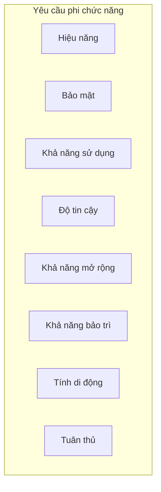

# Đặc tả Yêu cầu Phần mềm (SRS)

[English](6-nfr.md) | [Tiếng Việt](6-nfr.vi.md)

## Nền tảng Việc làm Việt Nam - Kiến trúc Microservices

**Phiên bản:** 1.0  
**Ngày:** 17 tháng 8 năm 2026  
**Dự án:** Nền tảng Việc làm Việt Nam (Vietnam Job Platform)  

---

## Phần 6: Yêu cầu phi chức năng

### 6.1 Tổng quan

Phần này ghi lại tất cả các yêu cầu phi chức năng cho Nền tảng Việc làm Việt Nam. Các yêu cầu này xác định các thuộc tính chất lượng, đặc điểm hiệu năng và các ràng buộc mà hệ thống phải đáp ứng. Không giống như yêu cầu chức năng chỉ định *hệ thống làm gì*, yêu cầu phi chức năng chỉ định *hệ thống làm tốt đến mức nào*.

Các yêu cầu phi chức năng được nhóm thành các danh mục sau:

---

### 6.2 Yêu cầu hiệu năng

Yêu cầu hiệu năng xác định khả năng phản hồi, thông lượng và sử dụng tài nguyên của hệ thống trong các điều kiện cụ thể.

| ID | Yêu cầu | Tiêu chí chấp nhận | Mức độ ưu tiên |
|:---|:--------|:-------------------|:---------------|
| PERF-01 | Hệ thống phản hồi các yêu cầu API trong thời gian chấp nhận được | - 95% yêu cầu hoàn thành trong 500ms - 99% yêu cầu hoàn thành trong 1000ms - Thời gian phản hồi được đo tại API Gateway | BẮT BUỘC |
| PERF-02 | Hệ thống xử lý truy vấn tìm kiếm hiệu quả | - 95% truy vấn tìm kiếm hoàn thành trong 200ms - 99% truy vấn tìm kiếm hoàn thành trong 500ms - Đo từ dịch vụ tìm kiếm | NÊN CÓ |
| PERF-03 | Hệ thống hỗ trợ người dùng đồng thời | - Hỗ trợ ít nhất 100 người dùng đồng thời - Hỗ trợ ít nhất 1.000 yêu cầu mỗi phút - Hiệu năng giảm dần một cách mượt mà khi có tải | BẮT BUỘC |
| PERF-04 | Ứng dụng web tải nhanh | - First Contentful Paint (FCP) < 1.5 giây - Largest Contentful Paint (LCP) < 2.5 giây - Time to Interactive (TTI) < 3.0 giây | NÊN CÓ |
| PERF-05 | Ứng dụng di động phản hồi nhanh | - Ứng dụng khởi động trong 3 giây (cold start) - Chuyển màn hình < 300ms - Cuộn mượt mà (60fps) | NÊN CÓ |
| PERF-06 | Hệ thống sử dụng nhóm kết nối cơ sở dữ liệu | - Kích thước nhóm kết nối phù hợp với tải dự kiến - Thời gian chờ kết nối < 30 giây - Không có rò rỉ kết nối | BẮT BUỘC |
| PERF-07 | Hệ thống sử dụng bộ nhớ đệm hiệu quả | - Tỷ lệ truy cập đệm > 60% cho kết quả tìm kiếm - Tỷ lệ truy cập đệm > 80% cho tin phổ biến - Hình phạt khi bỏ lỡ đệm < 200ms | NÊN CÓ |
| PERF-08 | Hệ thống tối ưu tải lên tệp | - Thời gian tải tệp < 5 giây cho tệp 1MB - Có chỉ báo tiến trình tải lên - Tải lên theo khúc cho tệp lớn (> 5MB) | TỐT NÊN CÓ |

---

### 6.3 Yêu cầu bảo mật

Yêu cầu bảo mật xác định cách hệ thống bảo vệ dữ liệu, ngăn chặn truy cập trái phép và duy trì quyền riêng tư của người dùng.

| ID | Yêu cầu | Tiêu chí chấp nhận | Mức độ ưu tiên |
|:---|:--------|:-------------------|:---------------|
| SEC-01 | Hệ thống xác thực tất cả người dùng trước khi cấp quyền truy cập | - Xác thực dựa trên token cho tất cả điểm cuối được bảo vệ - Token không hợp lệ bị từ chối - Hết phiên sau khi không hoạt động (1 giờ) | BẮT BUỘC |
| SEC-02 | Hệ thống phân quyền truy cập dựa trên vai trò người dùng | - Kiểm soát truy cập dựa trên vai trò (RBAC) được thực thi - Người dùng không thể truy cập tài nguyên ngoài quyền hạn - Các điểm cuối chỉ dành cho quản trị viên được bảo vệ | BẮT BUỘC |
| SEC-03 | Hệ thống mã hóa tất cả mật khẩu | - Mật khẩu được băm bằng bcrypt hoặc PBKDF2 - Salt được sử dụng cho mỗi mật khẩu - Mật khẩu dạng văn bản thuần không bao giờ được lưu | BẮT BUỘC |
| SEC-04 | Hệ thống sử dụng TLS cho tất cả giao tiếp | - TLS 1.2 hoặc cao hơn cho tất cả điểm cuối - Chứng chỉ SSL hợp lệ - Tự động chuyển hướng từ HTTP sang HTTPS | BẮT BUỘC |
| SEC-05 | Hệ thống bảo vệ chống lại các lỗ hổng web phổ biến | - Ngăn chặn SQL injection (truy vấn có tham số) - Ngăn chặn XSS (mã hóa đầu ra) - Bảo vệ CSRF (token) - Xác thực đầu vào trên tất cả đầu vào của người dùng | BẮT BUỘC |
| SEC-06 | Hệ thống triển khai giới hạn tốc độ | - Giới hạn tốc độ theo địa chỉ IP - Giới hạn tốc độ theo API key/người dùng - Giới hạn mặc định 100 yêu cầu mỗi phút | NÊN CÓ |
| SEC-07 | Hệ thống cung cấp ghi nhật ký kiểm tra | - Ghi nhật ký tất cả nỗ lực xác thực (thành công/thất bại) - Ghi nhật ký tất cả thất bại phân quyền - Ghi nhật ký tất cả hành động quản trị | NÊN CÓ |
| SEC-08 | Hệ thống bảo vệ dữ liệu nhạy cảm | - Thông tin cá nhân được mã hóa khi lưu trữ - Tệp CV được lưu với quyền truy cập hạn chế - API key và bí mật không bị lộ | BẮT BUỘC |
| SEC-09 | Hệ thống triển khai quản lý phiên an toàn | - Token JWT với thời gian hết hạn phù hợp (1 giờ) - Cơ chế làm mới token - Thu hồi token khi đăng xuất | BẮT BUỘC |
| SEC-10 | Hệ thống triển khai chính sách CORS đúng cách | - CORS được cấu hình chỉ cho các nguồn gốc đáng tin cậy - Yêu cầu Preflight được xử lý đúng - Yêu cầu đa nguồn gốc được xác thực | BẮT BUỘC |

---

### 6.4 Yêu cầu khả năng sử dụng

Yêu cầu khả năng sử dụng xác định mức độ dễ dàng và dễ chịu khi người dùng tương tác với hệ thống.

| ID | Yêu cầu | Tiêu chí chấp nhận | Mức độ ưu tiên |
|:---|:--------|:-------------------|:---------------|
| USAB-01 | Hệ thống cung cấp trải nghiệm người dùng nhất quán | - Điều hướng nhất quán trên tất cả trang/màn hình - Thuật ngữ nhất quán trong toàn bộ hệ thống - Phong cách hình ảnh và thương hiệu nhất quán | BẮT BUỘC |
| USAB-02 | Hệ thống cung cấp thông báo lỗi rõ ràng | - Thông báo lỗi thân thiện với người dùng (không kỹ thuật) - Hành động đề xuất để giải quyết lỗi - Thông báo lỗi bằng ngôn ngữ của người dùng | BẮT BUỘC |
| USAB-03 | Hệ thống cung cấp phản hồi về hành động của người dùng | - Chỉ báo tải cho các thao tác không đồng bộ - Thông báo thành công/xác nhận - Phản hồi xác thực theo thời gian thực | BẮT BUỘC |
| USAB-04 | Hệ thống phản hồi trên tất cả thiết bị | - Ứng dụng web phản hồi (máy tính để bàn, máy tính bảng, di động) - Giao diện thân thiện với cảm ứng trên di động - Cỡ chữ dễ đọc trên tất cả thiết bị | BẮT BUỘC |
| USAB-05 | Hệ thống hỗ trợ thiết kế có khả năng tiếp cận | - Tuân thủ WCAG 2.1 AA (nơi khả thi) - Hỗ trợ điều hướng bằng bàn phím - Tương thích với trình đọc màn hình | TỐT NÊN CÓ |
| USAB-06 | Hệ thống cung cấp hướng dẫn khởi đầu hữu ích | - Hướng dẫn cho người dùng mới - Tooltip cho các tính năng chính - Nút kêu gọi hành động rõ ràng | NÊN CÓ |
| USAB-07 | Hệ thống hỗ trợ quy trình làm việc hiệu quả | - Số lần nhấp tối thiểu để hoàn thành tác vụ - Phím tắt (web) - Hành động nhanh từ kết quả tìm kiếm | TỐT NÊN CÓ |
| USAB-08 | Hệ thống cung cấp điều hướng trực quan | - Cấu trúc điều hướng rõ ràng - Breadcrumbs trên web - Điều hướng đáy trên di động | BẮT BUỘC |

---

### 6.5 Yêu cầu độ tin cậy

Yêu cầu độ tin cậy xác định tính ổn định, khả năng chịu lỗi và khả năng phục hồi của hệ thống.

| ID | Yêu cầu | Tiêu chí chấp nhận | Mức độ ưu tiên |
|:---|:--------|:-------------------|:---------------|
| REL-01 | Hệ thống duy trì tính sẵn sàng cao | - Thời gian hoạt động > 99% trong giờ làm việc - Bảo trì theo lịch trình < 2 giờ mỗi tháng - Không có thời gian ngừng hoạt động ngoài kế hoạch trong các buổi demo | BẮT BUỘC |
| REL-02 | Hệ thống xử lý lỗi một cách mượt mà | - Lỗi dịch vụ được xử lý với suy giảm dần - Trang lỗi thân thiện với người dùng cho lỗi nghiêm trọng - Phục hồi dịch vụ mà không cần can thiệp thủ công | NÊN CÓ |
| REL-03 | Hệ thống triển khai cầu chì (circuit breaker) | - Mẫu cầu chì cho các lệnh gọi dịch vụ bên ngoài - Phản hồi dự phòng khi cầu chì mở - Tự động phục hồi khi dịch vụ có sẵn trở lại | NÊN CÓ |
| REL-04 | Hệ thống hỗ trợ lưu trữ dữ liệu bền vững | - Dữ liệu được lưu vào cơ sở dữ liệu cho tất cả thao tác ghi - Không mất dữ liệu khi khởi động lại dịch vụ - Hỗ trợ giao dịch cho tính nhất quán dữ liệu | BẮT BUỘC |
| REL-05 | Hệ thống triển khai cơ chế thử lại | - Thử lại khi lỗi tạm thời (3 lần) - Thời gian chờ tăng dần giữa các lần thử lại - Thời gian chờ thử lại có thể cấu hình | NÊN CÓ |
| REL-06 | Hệ thống cung cấp điểm cuối kiểm tra sức khỏe | - Điểm cuối kiểm tra sức khỏe cho mỗi dịch vụ - Trạng thái sức khỏe tổng hợp qua API Gateway - Bảng điều khiển để giám sát sức khỏe | NÊN CÓ |
| REL-07 | Hệ thống triển khai xử lý lỗi | - Xử lý ngoại lệ trong tất cả các lớp - Trang lỗi thân thiện với người dùng (không phải stack trace) - Ghi nhật ký lỗi để chẩn đoán | BẮT BUỘC |
| REL-08 | Hệ thống hỗ trợ tắt máy an toàn | - Các yêu cầu đang xử lý được hoàn thành khi tắt máy - Kết nối được đóng đúng cách - Dọn dẹp tài nguyên sạch sẽ | NÊN CÓ |

---

### 6.6 Yêu cầu khả năng mở rộng

Yêu cầu khả năng mở rộng xác định khả năng của hệ thống để xử lý tải trọng và cơ sở người dùng ngày càng tăng.

| ID | Yêu cầu | Tiêu chí chấp nhận | Mức độ ưu tiên |
|:---|:--------|:-------------------|:---------------|
| SCAL-01 | Hệ thống hỗ trợ mở rộng theo chiều ngang | - Các dịch vụ có thể được mở rộng độc lập - Dịch vụ không trạng thái để dễ dàng mở rộng - Cân bằng tải giữa các phiên bản | NÊN CÓ |
| SCAL-02 | Hệ thống xử lý tăng trưởng dữ liệu | - Cơ sở dữ liệu có thể xử lý tăng trưởng lên 10.000+ tin - Chỉ mục tìm kiếm có thể xử lý tăng trưởng lên 10.000+ tin - Lưu trữ có thể xử lý 5.000+ tệp CV | BẮT BUỘC |
| SCAL-03 | Hệ thống hỗ trợ bộ nhớ đệm ở quy mô lớn | - Bộ nhớ đệm phân tán (Redis) cho trạng thái chia sẻ - Tính nhất quán của đệm giữa các phiên bản - Vô hiệu hóa đệm khi dữ liệu thay đổi | NÊN CÓ |
| SCAL-04 | Hệ thống hỗ trợ khả năng mở rộng cơ sở dữ liệu | - Kết nối cơ sở dữ liệu được nhóm - Tối ưu truy vấn cho tập dữ liệu lớn - Chỉ mục trên các trường được truy vấn thường xuyên | BẮT BUỘC |
| SCAL-05 | Hệ thống hỗ trợ mở rộng đàn hồi (Tốt nên có) | - Tự động mở rộng dựa trên chỉ số tải - Tự động mở rộng pod theo chiều ngang (Kubernetes) - Thu nhỏ khi lưu lượng thấp | TỐT NÊN CÓ |

---

### 6.7 Yêu cầu khả năng bảo trì

Yêu cầu khả năng bảo trì xác định mức độ dễ dàng để cập nhật, sửa đổi và mở rộng hệ thống.

| ID | Yêu cầu | Tiêu chí chấp nhận | Mức độ ưu tiên |
|:---|:--------|:-------------------|:---------------|
| MAINT-01 | Hệ thống tuân theo nguyên tắc kiến trúc sạch | - Phân tách mối quan tâm (API, Logic nghiệp vụ, Dữ liệu) - Đảo ngược phụ thuộc - Các dịch vụ với ranh giới rõ ràng | BẮT BUỘC |
| MAINT-02 | Hệ thống duy trì chất lượng mã | - Độ phủ mã > 70% (kiểm thử đơn vị) - Phân tích mã tĩnh vượt qua - Quy tắc lint được thực thi | NÊN CÓ |
| MAINT-03 | Hệ thống duy trì tài liệu | - Tài liệu API (Swagger/OpenAPI) - Hướng dẫn cài đặt/thiết lập - Tài liệu kiến trúc | BẮT BUỘC |
| MAINT-04 | Hệ thống hỗ trợ kiểm soát phiên bản | - Tất cả mã nguồn trong kiểm soát phiên bản - Quy trình nhánh tính năng - Đánh giá yêu cầu kéo | BẮT BUỘC |
| MAINT-05 | Hệ thống hỗ trợ CI/CD | - Xây dựng tự động khi đẩy mã - Kiểm thử tự động khi đẩy mã - Triển khai tự động (staging/prod) | NÊN CÓ |
| MAINT-06 | Hệ thống hỗ trợ ghi nhật ký | - Ghi nhật ký có cấu trúc (định dạng JSON) - Cấp độ nhật ký có thể cấu hình - Tổng hợp nhật ký và truy cập tập trung | NÊN CÓ |
| MAINT-07 | Hệ thống hỗ trợ giám sát | - Thu thập chỉ số hiệu năng - Theo dõi lỗi và cảnh báo - Bảng điều khiển để giám sát | NÊN CÓ |
| MAINT-08 | Hệ thống hỗ trợ thiết kế mô-đun | - Độc lập dịch vụ (kết nối tối thiểu) - Thư viện dùng chung cho chức năng phổ biến - Hợp đồng giữa các dịch vụ được xác định | BẮT BUỘC |

---

### 6.8 Yêu cầu tính di động

Yêu cầu tính di động xác định khả năng của hệ thống để chạy trong các môi trường khác nhau.

| ID | Yêu cầu | Tiêu chí chấp nhận | Mức độ ưu tiên |
|:---|:--------|:-------------------|:---------------|
| PORT-01 | Hệ thống chạy trên nhiều hệ điều hành | - Phát triển trên Windows, macOS, Linux - Triển khai trên các phiên bản đám mây dựa trên Linux - Không có phụ thuộc cụ thể theo hệ điều hành | BẮT BUỘC |
| PORT-02 | Hệ thống hỗ trợ container hóa | - Container Docker cho tất cả dịch vụ - Docker Compose cho phát triển cục bộ - Hình ảnh chạy nhất quán trên các môi trường | BẮT BUỘC |
| PORT-03 | Hệ thống hỗ trợ nhiều môi trường triển khai | - Môi trường phát triển (cục bộ) - Môi trường staging (Đám mây) - Môi trường sản phẩm (Đám mây) | BẮT BUỘC |
| PORT-04 | Hệ thống độc lập với nhà cung cấp đám mây | - Không bị khóa nhà cung cấp - Có thể chạy trên AWS, GCP, Azure hoặc tự lưu trữ - Sử dụng dịch vụ đám mây tiêu chuẩn | NÊN CÓ |
| PORT-05 | Hệ thống sử dụng biến môi trường cho cấu hình | - Không có giá trị cấu hình được mã hóa cứng - Cài đặt theo môi trường qua biến - Dữ liệu nhạy cảm qua quản lý bí mật | BẮT BUỘC |

---

### 6.9 Yêu cầu tuân thủ

Yêu cầu tuân thủ xác định các tiêu chuẩn và quy định mà hệ thống phải tuân thủ.

| ID | Yêu cầu | Tiêu chí chấp nhận | Mức độ ưu tiên |
|:---|:--------|:-------------------|:---------------|
| COMP-01 | Hệ thống tuân thủ quy định bảo vệ dữ liệu cá nhân | - Dữ liệu người dùng chỉ được thu thập với sự đồng ý - Người dùng có thể yêu cầu xóa dữ liệu - Dữ liệu được lưu trữ an toàn | BẮT BUỘC |
| COMP-02 | Hệ thống tuân thủ luật bản quyền và cấp phép | - Không sử dụng trái phép mã của bên thứ ba - Ghi công đúng cho các thư viện mã nguồn mở - Trình thu thập tuân thủ robots.txt | BẮT BUỘC |
| COMP-03 | Hệ thống tuân thủ hướng dẫn khả năng tiếp cận (Tốt nên có) | - Tuân thủ WCAG 2.1 cơ bản - Văn bản thay thế trên hình ảnh - Hỗ trợ điều hướng bằng bàn phím | TỐT NÊN CÓ |
| COMP-04 | Hệ thống duy trì dấu vết kiểm tra | - Hành động quản trị được ghi nhật ký - Truy cập dữ liệu được ghi nhật ký - Hoạt động người dùng (nhạy cảm) được ghi nhật ký | NÊN CÓ |
| COMP-05 | Hệ thống hỗ trợ tiêu chuẩn ngôn ngữ Việt Nam | - Hỗ trợ ký tự tiếng Việt - Định dạng ngày/giờ tiếng Việt - Định dạng tiền tệ Việt Nam (VND) | BẮT BUỘC |

---

### 6.10 Tóm tắt yêu cầu phi chức năng

| Danh mục | BẮT BUỘC | NÊN CÓ | TỐT NÊN CÓ | Tổng |
|:---------|:---------|:-------|:-----------|:-----|
| Hiệu năng | 3 | 3 | 1 | 7 |
| Bảo mật | 8 | 1 | 0 | 9 |
| Khả năng sử dụng | 5 | 1 | 2 | 8 |
| Độ tin cậy | 3 | 4 | 0 | 7 |
| Khả năng mở rộng | 2 | 2 | 1 | 5 |
| Khả năng bảo trì | 3 | 3 | 0 | 6 |
| Tính di động | 4 | 1 | 0 | 5 |
| Tuân thủ | 3 | 1 | 1 | 5 |
| **Tổng** | **31** | **16** | **5** | **52** |

---

### 6.11 Truy xuất nguồn gốc yêu cầu phi chức năng

Bảng sau ánh xạ các yêu cầu phi chức năng đến các yêu cầu chức năng mà chúng hỗ trợ:

| ID NFR | Thành phần chức năng liên quan | Lý do |
|:-------|:------------------------------|:------|
| PERF-01, PERF-02 | Tất cả điểm cuối API | Tất cả yêu cầu phải phản hồi nhanh |
| PERF-03 | Tất cả dịch vụ | Hệ thống phải xử lý người dùng đồng thời |
| PERF-04 | Ứng dụng Web | Giao diện web phải tải nhanh để có UX tốt |
| PERF-05 | Ứng dụng Di động | Giao diện di động phải phản hồi nhanh |
| SEC-01, SEC-02, SEC-09 | Dịch vụ Xác thực | Bảo mật cốt lõi cho tất cả dịch vụ |
| SEC-03, SEC-05 | Tất cả dịch vụ | Bảo mật phải nhất quán trên các dịch vụ |
| SEC-08 | Lưu trữ Tệp, Dịch vụ Hồ sơ | Dữ liệu nhạy cảm phải được bảo vệ |
| USAB-01, USAB-02, USAB-03 | Tất cả dịch vụ | UX nhất quán trên toàn nền tảng |
| REL-01, REL-02, REL-03 | Tất cả dịch vụ | Hệ thống phải đáng tin cậy |
| SCAL-01, SCAL-02 | Tất cả dịch vụ | Hệ thống phải xử lý tăng trưởng |
| MAINT-01, MAINT-02 | Tất cả dịch vụ | Chất lượng mã và khả năng bảo trì |
| PORT-01, PORT-02 | Tất cả dịch vụ | Tính di động trên các môi trường |

---

### 6.12 Đo lường và xác minh

| Danh mục NFR | Cách đo lường | Khi xác minh | Công cụ/Phương pháp |
|:-------------|:--------------|:-------------|:--------------------|
| Hiệu năng | Thời gian phản hồi, thông lượng, sử dụng tài nguyên | Hàng tuần trong quá trình phát triển | Kiểm thử tải (k6), công cụ APM |
| Bảo mật | Quét bảo mật, kiểm thử xâm nhập | Tuần 8 (Tăng cường bảo mật) | OWASP ZAP, SonarQube |
| Khả năng sử dụng | Kiểm thử người dùng, phản hồi, thời gian hoàn thành tác vụ | Tuần 15 (Kiểm thử người dùng) | Khảo sát người dùng, kiểm thử khả năng sử dụng |
| Độ tin cậy | Thời gian hoạt động, tỷ lệ lỗi, MTBF | Giám sát hàng tuần | Bảng điều khiển giám sát |
| Khả năng mở rộng | Kiểm thử tải, mở rộng tài nguyên | Tuần 14 (Kiểm thử hiệu năng) | Kiểm thử tải, Kubernetes HPA |
| Khả năng bảo trì | Độ phủ mã, chỉ số độ phức tạp | CI/CD hàng tuần | SonarQube, công cụ đo độ phủ mã |
| Tính di động | Tương thích môi trường | Tuần 12 (Staging) | Kiểm thử môi trường |
| Tuân thủ | Kiểm tra tuân thủ, rà soát quy định | Tuần 15 (Tài liệu) | Tự kiểm tra, rà soát nhóm |

---

**Hết Phần 6**