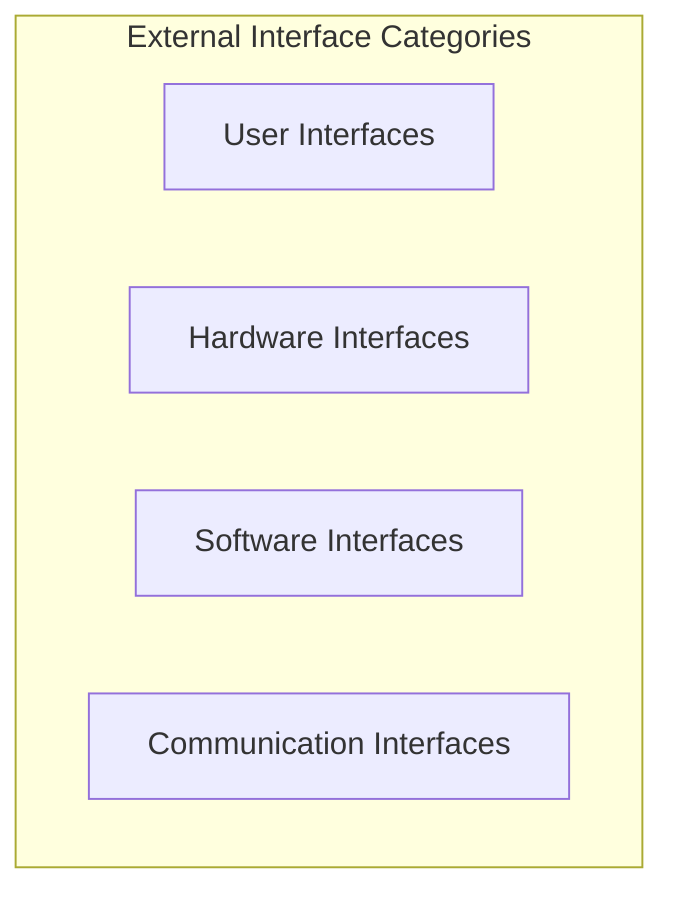
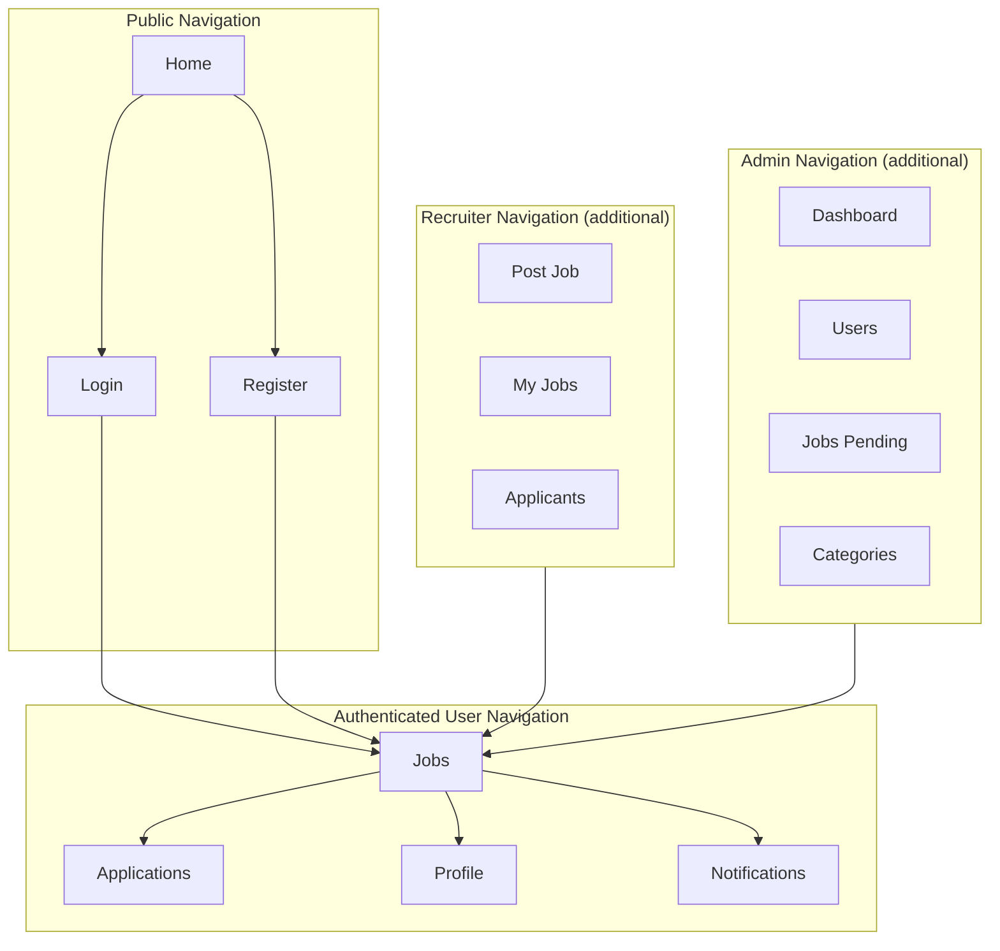
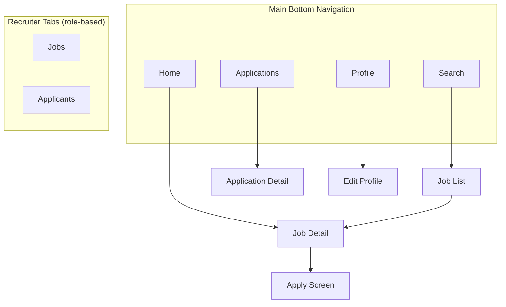

# Software Requirements Specification (SRS)
## Vietnam Job Platform - Microservices Architecture

**Version:** 1.0  
**Date:** August 17, 2026  
**Project:** Vietnam Job Platform (Nền tảng việc làm Việt Nam)  

---

## Part 7: External Interface Requirements

### 7.1 Overview

This section defines all interfaces between the Vietnam Job Platform and external entities. This includes user interfaces (web and mobile), hardware interfaces, software interfaces with external systems, and communication protocols. Clear interface specifications ensure proper integration, consistent user experience, and successful communication with third-party services.

The external interfaces are organised into the following categories:



---

### 7.2 User Interfaces

#### 7.2.1 Web Application Interface

The web application is a Single Page Application (SPA) accessible via modern web browsers. It provides a responsive, intuitive interface for all platform users.

| Attribute | Specification | Priority |
|:----------|:---------------|:----------|
| **Supported Browsers** | Chrome 90+, Firefox 88+, Safari 14+, Edge 90+ | MUST |
| **Screen Resolution** | Responsive: 320px to 1920px width | MUST |
| **Display Modes** | Desktop (≥ 1024px), Tablet (768-1023px), Mobile (< 768px) | MUST |
| **Font** | System font stack or Vietnamese-capable font (e.g., Roboto, Noto Sans) | MUST |
| **Language Support** | Vietnamese and English (NICE TO HAVE) | NICE |
| **Color Scheme** | Light theme (default), Dark theme (NICE TO HAVE) | NICE |

##### 7.2.1.1 Web Pages and Screens

| Page | User Type | Description | Priority |
|:-----|:----------|:------------|:----------|
| Home Page | All | Search bar, featured jobs, quick links, platform statistics | MUST |
| Login Page | All | Email/password form, validation, error messages, "Forgot Password" link | MUST |
| Register Page | All | Registration form, role selection (User/Recruiter), validation | MUST |
| Job List Page | All | Search results, filter sidebar, pagination, sort options | MUST |
| Job Detail Page | All | Full job details, company info, apply button, share options | MUST |
| Apply Page | Job Seeker | CV upload, cover letter, submit button, success confirmation | MUST |
| Profile Page | All | Personal info, skills, experience, education management | MUST |
| Application History | Job Seeker | Application list, status tracking, filter by status | MUST |
| Post Job Page | Recruiter | Job posting form, category selection, publish/draft options | MUST |
| Manage Jobs Page | Recruiter | List of posted jobs, edit/delete actions, applicant counts | MUST |
| Manage Applicants | Recruiter | Applicant list per job, status updates, CV view | MUST |
| Admin Dashboard | Admin | User management, job approval, statistics view | SHOULD |
| Notifications | All | Real-time notification list, mark as read, preferences | SHOULD |

##### 7.2.1.2 Web Navigation Structure



#### 7.2.2 Mobile Application Interface

The mobile application is a cross-platform app supporting iOS and Android. It provides a mobile-optimised interface with touch-friendly interactions.

| Attribute | Specification | Priority |
|:----------|:---------------|:----------|
| **Supported Platforms** | iOS 16+, Android 12+ | MUST |
| **Screen Orientation** | Portrait (primary), Landscape (optional) | MUST |
| **Touch Interactions** | Tap, swipe, long press, pinch-to-zoom (where applicable) | MUST |
| **Navigation** | Bottom navigation (primary), drawer (secondary) | MUST |
| **Font** | System font, Vietnamese-capable | MUST |
| **Language Support** | Vietnamese and English (NICE TO HAVE) | NICE |
| **Color Scheme** | Light theme (default), Dark theme (NICE TO HAVE) | NICE |

##### 7.2.2.1 Mobile Screens

| Screen | User Type | Description | Priority |
|:-------|:----------|:------------|:----------|
| Home Screen | All | Search bar, featured jobs, quick actions | MUST |
| Login Screen | All | Email/password form, validation, error messages | MUST |
| Register Screen | All | Registration form, role selection, validation | MUST |
| Job List Screen | All | Search results, filter options, infinite scrolling | MUST |
| Job Detail Screen | All | Full job details, company info, apply button | MUST |
| Apply Screen | Job Seeker | CV picker (from device), cover letter, submit | MUST |
| Profile Screen | All | Personal info, skills, experience, education | MUST |
| Application History | Job Seeker | Application list, status badges, details view | MUST |
| Post Job Screen | Recruiter | Job form, category selection, publish | MUST |
| Manage Jobs Screen | Recruiter | List of posted jobs, edit/delete actions | MUST |
| Notifications Screen | All | Notification list, mark as read | SHOULD |

##### 7.2.2.2 Mobile Navigation



---

### 7.3 Hardware Interfaces

The system is cloud-based and does not directly interact with physical hardware devices. Hardware interactions are limited to client devices.

| Device Type | Interface | Description | Priority |
|:------------|:----------|:------------|:----------|
| **Desktop/Laptop** | Web browser | Standard web interface with mouse/keyboard input | MUST |
| **Tablet** | Web browser or Mobile App | Responsive web or mobile app with touch input | MUST |
| **Smartphone** | Mobile App | Native mobile app with touch input, camera (for CV scan) | MUST |
| **Camera** | Mobile App (optional) | Document scanning (CV) via camera | NICE |
| **File System** | Web/Mobile | File picker for CV uploads (PDF, DOC, DOCX) | MUST |
| **Printer** | Web Browser (optional) | Print job details or CV | NICE |

---

### 7.4 Software Interfaces

Software interfaces define the interactions between the Vietnam Job Platform and external software systems, third-party services, and internal service-to-service communication.

#### 7.4.1 Service-to-Service Interfaces (Internal)

All microservices communicate via REST APIs for synchronous operations and message broker for asynchronous events.

| Interface | Protocol | Description | Direction | Priority |
|:----------|:---------|:------------|:----------|:----------|
| **API Gateway to Services** | HTTP/REST | Request routing and forwarding | API Gateway → Services | MUST |
| **Service to Database** | TCP/PostgreSQL | Database read/write operations | Services → PostgreSQL | MUST |
| **Service to Cache** | TCP/Redis | Cache read/write operations | Services → Redis | SHOULD |
| **Service to Search** | HTTP/Elasticsearch | Search indexing and queries | Services → Elasticsearch | MUST |
| **Service to Message Broker** | TCP/Kafka | Event publishing and consumption | Services ↔ Kafka | SHOULD |
| **Service to Service (Sync)** | HTTP/REST | Direct synchronous calls (if needed) | Service ↔ Service | SHOULD |

#### 7.4.2 API Gateway Interface

The API Gateway provides a unified entry point for all client requests.

| Attribute | Specification | Priority |
|:----------|:---------------|:----------|
| **Protocol** | HTTPS | MUST |
| **Authentication** | JWT Bearer token in `Authorization` header | MUST |
| **Request Format** | JSON (application/json) | MUST |
| **Response Format** | JSON (application/json) | MUST |
| **Rate Limiting** | 100 requests per minute per client IP | SHOULD |
| **CORS** | Configured for trusted origins only | MUST |

#### 7.4.3 Third-Party Service Interfaces

The system integrates with several external services. The following table documents all third-party interfaces.

| Service Provider | Purpose | Protocol | Data Format | Priority | Dependency Level |
|:-----------------|:--------|:---------|:------------|:----------|:-----------------|
| **Email Service (SMTP)** | Send email notifications | SMTP/ TLS | Email (HTML + Plain Text) | SHOULD | Medium |
| **Push Notification Service (FCM)** | Mobile push notifications | HTTP/ REST | JSON | SHOULD | Medium |
| **AI Service (OpenAI/Gemini)** | AI chatbot and resume scoring | HTTP/ REST | JSON | NICE | Low (Feature-specific) |
| **Telegram Bot API** | Job alerts via Telegram | HTTP/ Webhook | JSON | NICE | Low (Feature-specific) |
| **Object Storage (Cloudflare R2)** | Store CV files and avatars | S3-compatible API | Binary files | SHOULD | Medium |
| **Managed Database (Supabase)** | PostgreSQL database | TCP/ PostgreSQL | SQL | MUST | High |
| **Managed Cache (Upstash)** | Redis cache | TCP/ Redis | Redis protocol | SHOULD | Medium |
| **Managed Search (Bonsai)** | Elasticsearch search | HTTP/ REST | JSON | MUST | High |
| **Managed Kafka (Confluent)** | Message broker | TCP/ Kafka protocol | JSON/ Avro | SHOULD | Medium |

#### 7.4.4 Third-Party Interface Details

##### 7.4.4.1 Email Service (SMTP)

| Attribute | Specification |
|:----------|:---------------|
| **Protocol** | SMTP (Simple Mail Transfer Protocol) |
| **Authentication** | Username and password |
| **Encryption** | TLS (STARTTLS) |
| **Rate Limits** | Depends on provider (typically 100-500 per day for free tiers) |
| **Retry Policy** | 3 attempts with exponential backoff |
| **Fallback** | Log email content if delivery fails (for development) |

##### 7.4.4.2 Push Notification Service (Firebase Cloud Messaging)

| Attribute | Specification |
|:----------|:---------------|
| **Protocol** | HTTPS REST API |
| **Authentication** | Server key (API key) |
| **Platforms** | iOS (APNS) and Android (FCM) |
| **Payload Format** | JSON |
| **Deep Linking** | Supported via custom data payload |
| **Retry Policy** | 3 attempts (FCM automatically retries) |

##### 7.4.4.3 AI Service (OpenAI / Google Gemini)

| Attribute | Specification |
|:----------|:---------------|
| **Protocol** | HTTPS REST API |
| **Authentication** | API key |
| **Data Format** | JSON |
| **Rate Limits** | Gemini: ~60 requests/minute free; OpenAI: limited by credits |
| **Retry Policy** | 3 attempts with exponential backoff |
| **Fallback** | Cache responses where possible; return graceful error messages |

##### 7.4.4.4 Object Storage (Cloudflare R2)

| Attribute | Specification |
|:----------|:---------------|
| **Protocol** | S3-compatible API |
| **Authentication** | Access key and secret key |
| **Data Format** | Binary files (PDF, DOCX, JPG, PNG) |
| **File Size Limit** | 10 MB per file |
| **Retention** | Files kept indefinitely or until deleted |
| **Access Control** | Generated presigned URLs (1-hour expiry) |

##### 7.4.4.5 Managed Database (Supabase)

| Attribute | Specification |
|:----------|:---------------|
| **Protocol** | PostgreSQL protocol (TCP) |
| **Authentication** | Username and password (connection string) |
| **Storage Limit** | 500 MB (free tier) |
| **Connections** | Pooled connections (max 20) |
| **Backup** | Automated daily backups |

---

### 7.5 Communication Interfaces

Communication interfaces define the protocols and data formats used for system communication.

#### 7.5.1 Network Protocols

| Protocol | Usage | Description | Priority |
|:---------|:------|:------------|:----------|
| **HTTPS** | Client ↔ API Gateway | Encrypted REST API communication | MUST |
| **HTTP/2** | Client ↔ API Gateway | Modern HTTP version (where supported) | SHOULD |
| **WebSocket** | Client ↔ API Gateway | Real-time notifications | SHOULD |
| **TCP** | Internal services | Database, cache, message broker connections | MUST |
| **SMTP** | System ↔ Email Service | Email delivery | SHOULD |

#### 7.5.2 Data Formats

| Format | Usage | Description | Priority |
|:--------|:------|:------------|:----------|
| **JSON** | REST APIs | Primary data exchange format | MUST |
| **Form Data** | File Uploads | CV upload, avatar upload | MUST |
| **HTML** | Email Templates | Rich email notifications | SHOULD |
| **Plain Text** | Email Fallback | Fallback for HTML emails | SHOULD |
| **Binary** | File Storage | CV files, images | MUST |

#### 7.5.3 API Communication Standards

| Standard | Usage | Description | Priority |
|:---------|:------|:------------|:----------|
| **RESTful API** | Service communication | Resource-oriented API design | MUST |
| **OpenAPI 3.0** | API Documentation | API contract specification | MUST |
| **Event-driven** | Asynchronous communication | Kafka event publishing/consumption | SHOULD |

---

### 7.6 External Data Sources

The system consumes data from external sources, primarily for job listings.

| Data Source | Purpose | Frequency | Interface Type | Priority |
|:------------|:--------|:----------|:---------------|:----------|
| **vieclam.gov.vn** | Job listing data | Daily (crawler) | HTTP/Scraping | MUST |
| **TopCV** | Job listing data (optional) | 3 times/week | HTTP/Scraping | NICE |

#### 7.6.1 Data Source Interface

| Attribute | Specification |
|:----------|:---------------|
| **Method** | Web scraping (HTTP GET) |
| **User-Agent** | Rotating user agents (to avoid blocking) |
| **Rate Limiting** | 1 request per second (respectful scraping) |
| **Data Extraction** | HTML parsing (CSS selectors, XPath) |
| **Error Handling** | Retry up to 3 times on failure |
| **Data Cleaning** | Remove HTML, normalise dates, standardise formats |

---

### 7.7 Interface Error Handling

The system shall handle interface errors consistently across all external interfaces.

| Interface | Error Handling Strategy | Priority |
|:----------|:------------------------|:----------|
| **HTTP REST APIs** | Return standard HTTP status codes with error message in JSON body | MUST |
| **WebSocket** | Send error message over WebSocket; attempt reconnection on disconnect | SHOULD |
| **Database** | Use connection pooling; retry on transient failures | MUST |
| **Message Broker** | Use consumer groups with offset management; retry on failure | SHOULD |
| **Third-party APIs** | Use circuit breakers; retry with exponential backoff; fallback responses | SHOULD |
| **File Storage** | Retry failed uploads; provide user feedback on success/failure | SHOULD |

#### 7.7.1 HTTP Status Codes

| Status Code | Usage | Example |
|:------------|:------|:--------|
| **200 OK** | Successful request | Login success, job list retrieved |
| **201 Created** | Resource created | Job posted, user registered |
| **202 Accepted** | Request accepted for processing | File upload, async operation |
| **204 No Content** | Request successful, no content to return | Logout, delete |
| **400 Bad Request** | Client error | Invalid input, missing field |
| **401 Unauthorised** | Authentication required | Missing or invalid JWT token |
| **403 Forbidden** | Permission denied | User lacks required role |
| **404 Not Found** | Resource not found | Job ID doesn't exist |
| **409 Conflict** | Resource conflict | Duplicate application |
| **422 Unprocessable Entity** | Validation error | Invalid email format |
| **429 Too Many Requests** | Rate limit exceeded | Too many requests per minute |
| **500 Internal Server Error** | Server error | Unexpected exception |
| **503 Service Unavailable** | Service temporarily unavailable | Database connection failed |

#### 7.7.2 Error Response Format

```json
{
  "status": 400,
  "timestamp": "2026-08-17T10:30:00Z",
  "error": "Bad Request",
  "message": "Email is required",
  "path": "/api/auth/register",
  "details": {
    "field": "email",
    "issue": "Email cannot be empty"
  }
}
```

---

### 7.8 Interface Security Requirements

All interfaces shall meet the following security requirements:

| Requirement | Description | Priority |
|:------------|:------------|:----------|
| **TLS 1.2+** | All external communications must use TLS | MUST |
| **JWT Authentication** | All APIs (except login/register) require JWT | MUST |
| **API Rate Limiting** | Prevent abuse of external interfaces | SHOULD |
| **Input Validation** | Validate all incoming data from external interfaces | MUST |
| **Output Encoding** | Encode all outgoing data to prevent injection | MUST |
| **Secure Headers** | Implement security headers (HSTS, CSP, X-Frame-Options) | SHOULD |
| **CORS Policy** | Restrict cross-origin requests to trusted origins | MUST |

---

### 7.9 Interface Requirements Summary

| Category | Interfaces | MUST | SHOULD | NICE | Total |
|:---------|:-----------|:-----|:-------|:-----|:------|
| User Interfaces | Web Application, Mobile Application | 12 | 2 | 2 | 16 |
| Hardware Interfaces | Client devices, Camera, File System | 3 | 0 | 1 | 4 |
| Software Interfaces | Internal APIs, Third-party APIs | 3 | 5 | 1 | 9 |
| Communication | Protocols, Data Formats, Standards | 3 | 3 | 0 | 6 |
| External Data Sources | Job listing sources | 1 | 0 | 1 | 2 |
| **Total** | | **22** | **10** | **5** | **37** |

---

**End of Part 7**

---