# Software Requirements Specification (SRS)
## Vietnam Job Platform - Microservices Architecture

**Version:** 1.0  
**Date:** August 17, 2026  
**Project:** Vietnam Job Platform (Nền tảng việc làm Việt Nam)  

---

## Part 8: System Architecture

### 8.1 Overview

This section describes the system architecture of the Vietnam Job Platform. It provides a comprehensive view of the architectural decisions, component interactions, data flow, and deployment strategies. The architecture follows microservices principles to achieve scalability, maintainability, and independent deployability.

The architecture is organised into the following layers:

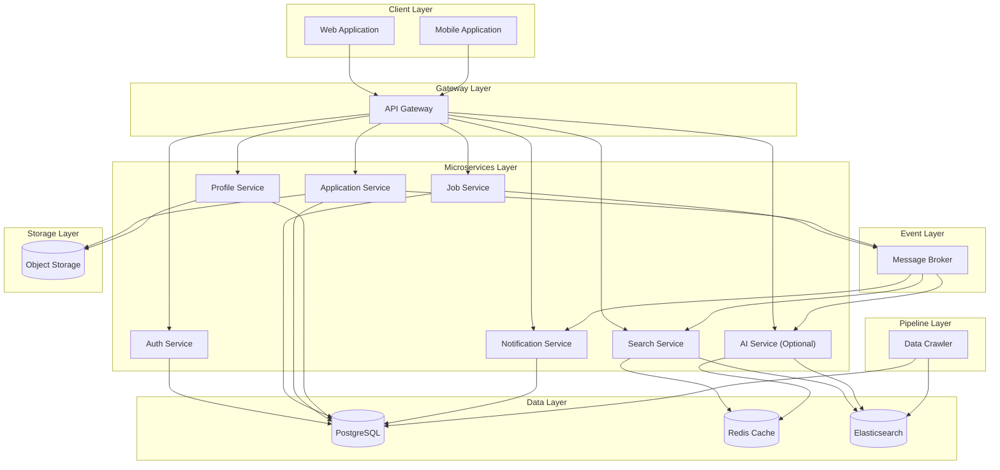

---

### 8.2 Architectural Principles

The system architecture is guided by the following principles:

| Principle | Description | Rationale |
|:----------|:------------|:----------|
| **Microservices** | Each business capability is implemented as an independent service | Enables independent development, deployment, and scaling |
| **Database per Service** | Each microservice has its own database/schema | Ensures loose coupling and data isolation |
| **API-First Design** | All service interactions are through well-defined APIs | Enables clear contracts and independent evolution |
| **Event-Driven Communication** | Asynchronous communication via message broker for cross-service events | Decouples services and enables eventual consistency |
| **Stateless Services** | Services do not maintain state between requests | Enables horizontal scaling and resilience |
| **Containerization** | All services run in containers | Ensures consistency across environments |
| **Infrastructure as Code** | All infrastructure defined in code | Enables reproducibility and version control |

---

### 8.3 Component Description

#### 8.3.1 Client Layer

The client layer consists of the user-facing applications that interact with the platform.

| Component | Description | Technology | Priority |
|:----------|:------------|:-----------|:----------|
| **Web Application** | Single Page Application (SPA) providing full platform interface | Modern SPA framework | MUST |
| **Mobile Application** | Cross-platform mobile app for iOS and Android | Cross-platform mobile framework | MUST |

**Responsibilities:**
- Render user interfaces
- Handle user interactions
- Make API calls to the backend
- Manage client-side state
- Provide offline capabilities (NICE TO HAVE)

#### 8.3.2 Gateway Layer

The gateway layer provides a single entry point for all client requests.

| Component | Description | Technology | Priority |
|:----------|:------------|:-----------|:----------|
| **API Gateway** | Reverse proxy handling routing, authentication, and rate limiting | Modern API Gateway framework | MUST |

**Responsibilities:**
- Route requests to appropriate microservices
- Validate JWT tokens
- Forward user claims to downstream services
- Enforce rate limiting
- Handle CORS
- Aggregate health checks

#### 8.3.3 Microservices Layer

The microservices layer contains all business logic services.

| Service | Description | Primary Responsibilities | Port | Priority |
|:--------|:------------|:------------------------|:-----|:----------|
| **Auth Service** | User authentication and authorisation | Registration, login, JWT generation, token refresh, logout | 5001 | MUST |
| **Job Service** | Job posting management | CRUD operations for jobs, category management | 5002 | MUST |
| **Search Service** | Job search and indexing | Elasticsearch indexing, search queries, filtering | 5003 | MUST |
| **Application Service** | Job application management | Apply, CV upload, status tracking, history | 5004 | MUST |
| **Profile Service** | User profile management | Profile CRUD, skills, experience, education | 5005 | MUST |
| **Notification Service** | Outbound communications | Email notifications, push notifications, in-app notifications | 5006 | SHOULD |
| **AI Service** | AI-powered features (optional) | Chatbot, resume scoring, recommendations | 6000 | NICE |

**Shared Responsibilities:**
- All services must authenticate requests via JWT
- All services must validate input data
- All services must log operations
- All services must expose health check endpoints

#### 8.3.4 Data Layer

The data layer provides persistence, caching, and search capabilities.

| Component | Description | Purpose | Priority |
|:----------|:------------|:--------|:----------|
| **PostgreSQL** | Relational database management system | Primary data storage for all services | MUST |
| **Redis Cache** | In-memory data store | Caching, session storage, rate limiting | SHOULD |
| **Elasticsearch** | Search and analytics engine | Full-text search, indexing, analytics | MUST |

**Data Layer Responsibilities:**
- Provide ACID transactions (PostgreSQL)
- Provide high-performance caching (Redis)
- Provide full-text search capabilities (Elasticsearch)
- Ensure data persistence and durability
- Support database-per-service pattern

#### 8.3.5 Event Layer

The event layer handles asynchronous communication between services.

| Component | Description | Purpose | Priority |
|:----------|:------------|:--------|:----------|
| **Message Broker** | Distributed messaging system | Event publishing and consumption | SHOULD |

**Event Layer Responsibilities:**
- Publish domain events (job created, application submitted)
- Enable event-driven workflows
- Decouple service dependencies
- Support eventual consistency

#### 8.3.6 Pipeline Layer

The pipeline layer handles data extraction and processing.

| Component | Description | Purpose | Priority |
|:----------|:------------|:--------|:----------|
| **Data Crawler** | Web scraping and data extraction | Extract job data from external sources | MUST |

**Pipeline Layer Responsibilities:**
- Scrape job data from external sources
- Clean and transform extracted data
- Load data into PostgreSQL and Elasticsearch
- Handle duplicates and errors

#### 8.3.7 Storage Layer

The storage layer provides object storage for files.

| Component | Description | Purpose | Priority |
|:----------|:------------|:--------|:----------|
| **Object Storage** | Scalable file storage | Store CV files, avatars, company logos | SHOULD |

**Storage Layer Responsibilities:**
- Store uploaded files (CVs, avatars, logos)
- Generate secure access URLs
- Enforce file size and type validation
- Handle file deletion

---

### 8.4 Data Architecture

#### 8.4.1 Database per Service Pattern

Each microservice owns its own database/schema to ensure loose coupling and data isolation.

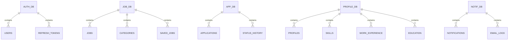

#### 8.4.2 Data Ownership

| Service | Owned Data | Shared Data (Read-Only) |
|:--------|:-----------|:-----------------------|
| Auth Service | User credentials, refresh tokens | None |
| Job Service | Jobs, categories, saved jobs | None |
| Application Service | Applications, status history | Jobs (via API) |
| Profile Service | Profiles, skills, experience, education | None |
| Search Service | Search index (Elasticsearch) | Jobs (via event) |
| Notification Service | Notification logs, email logs | None |
| AI Service | Chat history, scoring cache (Redis) | Jobs, profiles (via API) |

#### 8.4.3 Data Flow Patterns

```mermaid
flowchart TB
    subgraph Sync["Synchronous Data Flow"]
        API["Client API Request"] --> GW["API Gateway"]
        GW --> Svc["Microservice"]
        Svc --> DB["Database"]
        DB --> Svc
        Svc --> GW
        GW --> API
    end

    subgraph Async["Asynchronous Data Flow"]
        Pub["Service A"] --> Broker["Message Broker"]
        Broker --> Sub["Service B"]
        Sub --> Process["Process Event"]
    end

    subgraph Index["Search Indexing Flow"]
        Job["Job Service"] --> Broker2["Message Broker"]
        Broker2 --> Search["Search Service"]
        Search --> ES["Elasticsearch"]
    end
```

---

### 8.5 Event Architecture

#### 8.5.1 Event Types

| Event Name | Publisher | Consumer(s) | Trigger | Payload Key Fields |
|:-----------|:----------|:------------|:--------|:-------------------|
| `job.created` | Job Service | Search Service, Notification Service | New job posted | `job_id`, `title`, `company`, `location`, `recruiter_id` |
| `job.updated` | Job Service | Search Service | Job updated | `job_id`, `title`, `company`, `location` |
| `job.deleted` | Job Service | Search Service | Job deleted | `job_id` |
| `job.approved` | Admin Service | Notification Service | Job approved | `job_id`, `recruiter_id`, `status` |
| `application.submitted` | Application Service | Notification Service | Application submitted | `application_id`, `job_id`, `applicant_id`, `job_title` |
| `application.updated` | Application Service | Notification Service | Status changed | `application_id`, `job_id`, `applicant_id`, `status` |

#### 8.5.2 Event Flow Diagram

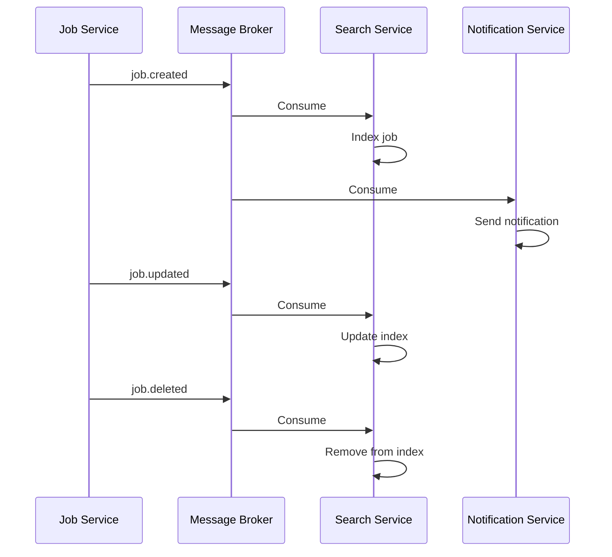

#### 8.5.3 Event Delivery Guarantees

| Guarantee | Implementation | Priority |
|:----------|:---------------|:----------|
| **At-least-once delivery** | Consumer offset management, idempotent consumers | SHOULD |
| **Message persistence** | Configurable retention period (7 days) | SHOULD |
| **Dead letter queue** | Messages that fail after retries go to DLQ | SHOULD |
| **Event replay** | Ability to replay events from retention period | NICE |

---

### 8.6 Deployment Architecture

#### 8.6.1 Development Environment (Local)

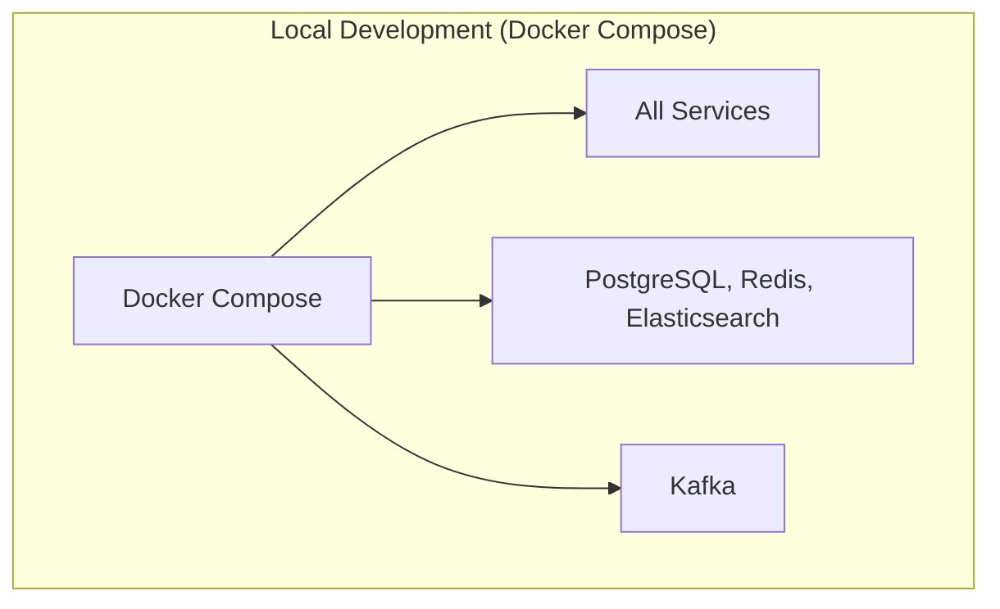

**Characteristics:**
- All services run in Docker containers
- Docker Compose orchestrates all containers
- Hot-reload for development
- Local volume mounts for code changes
- Environment variables for configuration

#### 8.6.2 Staging Environment (Cloud)

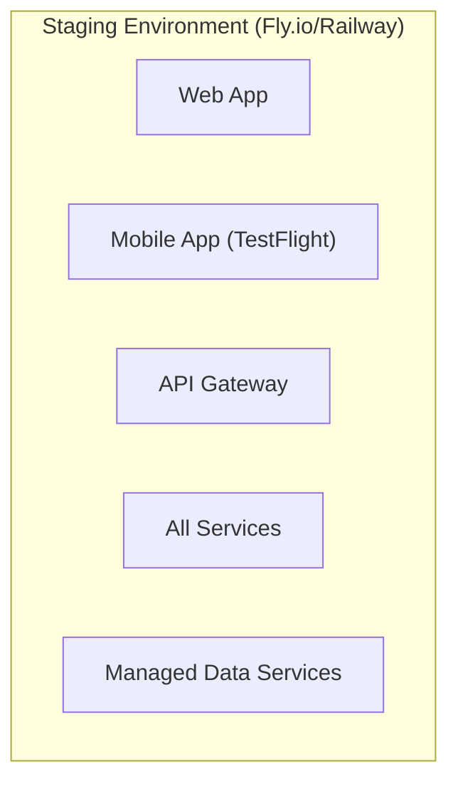

**Characteristics:**
- Deployed to cloud (Fly.io / Railway)
- Managed database and cache services
- Real data (sanitised copy of production data)
- Used for user testing and validation
- Separate from production environment

#### 8.6.3 Production Environment (Cloud)

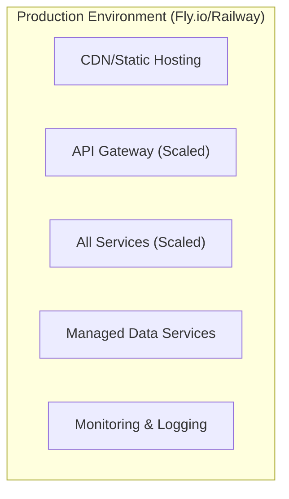

**Characteristics:**
- Deployed to cloud (Fly.io / Railway)
- Managed database and cache services
- Auto-scaling where supported
- Monitoring and alerting configured
- Backup and recovery procedures

#### 8.6.4 Deployment Strategy

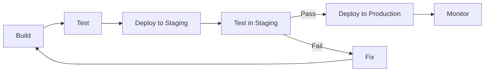

**Deployment Steps:**

| Step | Description | Frequency |
|:-----|:------------|:----------|
| Build | Build all services and applications | Every code push |
| Test | Run unit and integration tests | Every code push |
| Deploy Staging | Deploy to staging environment | Every main branch push |
| Test Staging | Run smoke tests and manual verification | Every staging deployment |
| Deploy Production | Deploy to production environment | Scheduled (manual trigger) |
| Monitor | Monitor after deployment for issues | Ongoing |

---

### 8.7 Monorepo Structure

#### 8.7.1 Source Code Organisation

```
job-platform-monorepo/
├── .github/
│   └── workflows/          # CI/CD pipeline definitions
│       ├── ci.yml          # Build and test
│       └── deploy.yml      # Deployment to staging/prod
│
├── src/                    # Main source code
│   ├── services/           # Backend microservices
│   │   ├── AuthService/
│   │   │   ├── API/        # Controllers, endpoints
│   │   │   ├── Core/       # Business logic, domain models
│   │   │   ├── Infrastructure/ # Database, external services
│   │   │   └── Tests/      # Unit and integration tests
│   │   ├── JobService/     # Same structure
│   │   ├── SearchService/  # Same structure
│   │   ├── ApplicationService/ # Same structure
│   │   ├── ProfileService/ # Same structure
│   │   └── NotificationService/ # Same structure
│   │
│   ├── shared/             # Shared code across services
│   │   ├── SharedKernel/   # DTOs, common interfaces
│   │   ├── EventContracts/ # Kafka event definitions
│   │   └── Infrastructure/ # Common DB, Redis, Kafka configs
│   │
│   ├── gateway/            # API Gateway
│   │   └── ApiGateway/
│   │
│   └── web/                # React Web Application
│       ├── src/
│       │   ├── components/
│       │   ├── pages/
│       │   ├── hooks/
│       │   ├── services/
│       │   └── utils/
│       ├── public/
│       └── package.json
│
├── mobile/                 # Flutter Mobile Application
│   └── lib/
│       ├── screens/
│       ├── widgets/
│       ├── models/
│       ├── services/
│       └── utils/
│
├── crawler/                # Python Scrapy Crawler
│   ├── spiders/
│   ├── pipelines/
│   ├── items.py
│   ├── settings.py
│   └── requirements.txt
│
├── ai-service/             # Python FastAPI AI Service (Optional)
│   ├── app/
│   ├── requirements.txt
│   └── Dockerfile
│
├── infrastructure/         # Infrastructure as Code
│   ├── docker/
│   │   ├── docker-compose.yml      # Local development
│   │   └── docker-compose.prod.yml # Production
│   ├── kubernetes/         # Kubernetes manifests (Optional)
│   │   ├── deployments/
│   │   ├── services/
│   │   └── ingress/
│   └── scripts/
│       ├── init-db.sh
│       └── seed-data.sh
│
├── docs/                   # Documentation
│   ├── api/                # Swagger/OpenAPI
│   └── architecture/       # Architecture diagrams
│
└── README.md
```

#### 8.7.2 Module Dependencies

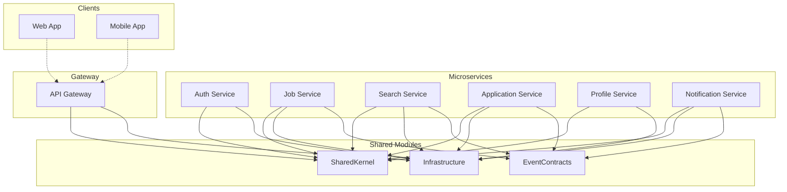

#### 8.7.3 Monorepo Benefits for This Project

| Benefit | Rationale |
|:---------|:-----------|
| **Simplified dependency management** | All code in one repository; shared libraries easily referenced |
| **Consistent code sharing** | SharedKernel, EventContracts easily shared across services |
| **Atomic commits** | Changes across multiple services in a single commit |
| **Unified CI/CD** | Single pipeline for all services reduces complexity |
| **Easier refactoring** | Cross-service changes can be made in one commit |
| **Simplified onboarding** | New developers see the entire system in one place |

---

### 8.8 Security Architecture

#### 8.8.1 Authentication Flow

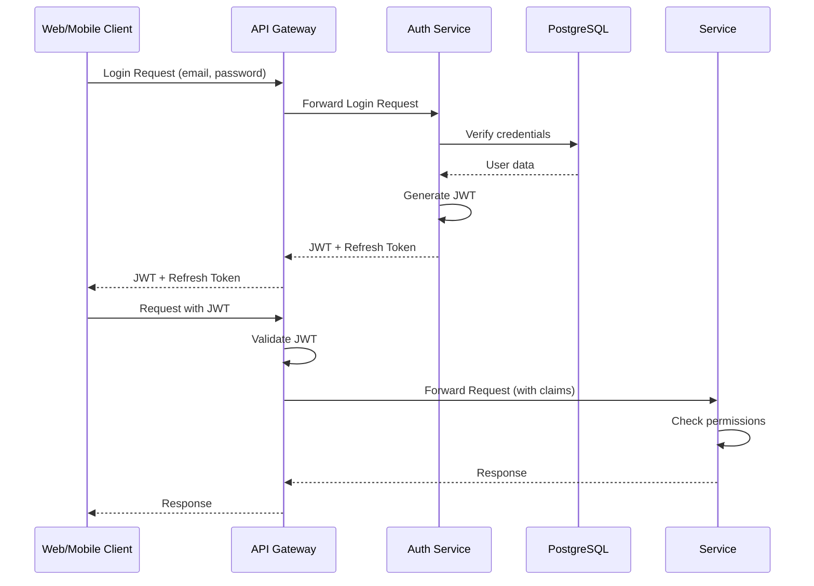

#### 8.8.2 Authorization Flow

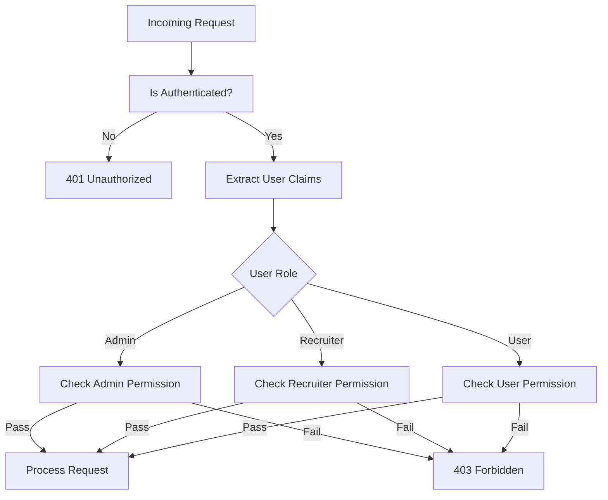

---

### 8.9 Technology Stack Summary

The following table summarises the technology choices for the system architecture. Note that the SRS defines requirements and interfaces, not specific implementations, but this summary is provided for context.

| Layer | Technology | Purpose | Priority |
|:------|:-----------|:--------|:----------|
| Backend Framework | Modern enterprise framework (.NET) | Service implementation | MUST |
| API Gateway | Modern API Gateway (YARP) | Request routing and auth | MUST |
| Web Frontend | Modern SPA framework (React + Vite) | Web interface | MUST |
| Mobile Framework | Cross-platform framework (Flutter) | Mobile interface | MUST |
| Database | PostgreSQL | Primary data store | MUST |
| Cache | Redis | Caching and session storage | SHOULD |
| Search Engine | Elasticsearch | Full-text search | MUST |
| Message Broker | Kafka | Event-driven communication | SHOULD |
| File Storage | S3-compatible (Cloudflare R2) | File storage | SHOULD |
| Containerisation | Docker + Docker Compose | Container management | MUST |
| CI/CD | GitHub Actions | Automation | MUST |
| Monitoring | Grafana + Prometheus | Observability | SHOULD |

---

**End of Part 8**

---