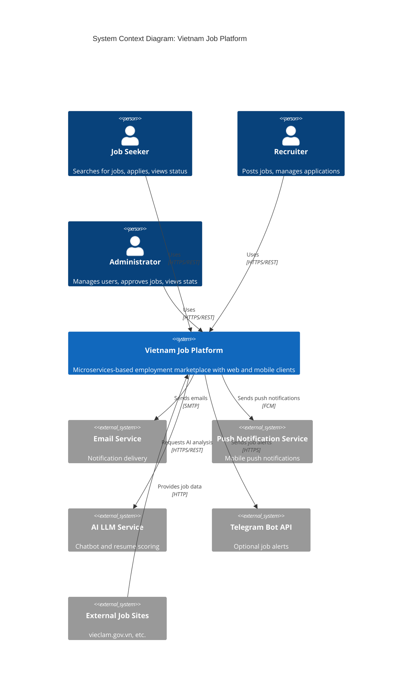

# Software Requirements Specification (SRS)

[English](1-introduction.md) | [Tiếng Việt](1-introduction.vi.md)

## Vietnam Job Platform - Microservices Architecture

**Version:** 1.0  
**Date:** August 17, 2026  
**Project:** Vietnam Job Platform (Nền tảng việc làm Việt Nam)  

---

## Part 1: Introduction

### 1.1 Purpose

This Software Requirements Specification (SRS) document provides a comprehensive description of the **Vietnam Job Platform** – a multi-platform employment marketplace that connects job seekers with employers in Vietnam. The system is designed as a microservices architecture supporting both web and mobile clients, with a focus on modern development practices, scalability, and cost-effective deployment suitable for a 16-week academic project.

The primary purposes of this document are:

- To define the functional and non-functional requirements of the system.
- To serve as a baseline for design, development, and testing activities.
- To align all stakeholders (developers, testers, instructors) on the scope and deliverables.
- To document the priority classification (Must Have, Should Have, Nice to Have) and the planned 16-week roadmap.
- To provide a clear reference for the development team to build the system according to specified requirements.

This document is derived from the *Master Plan – Vietnam Job Platform* and the *Cost Analysis Table: Zero-Cost Infrastructure*.

---

### 1.2 Document Conventions

| Convention | Meaning |
|:-----------|:--------|
| **Bold text** | Key terms, component names, or emphasis |
| *Italic text* | References to other sections or external documents |
| `monospace` | Code artifacts, file paths, API endpoints, commands |
| [REQ-XXX] | Requirement identifier used for traceability |
| (MUST) | Indicates a requirement classified as "Must Have" |
| (SHOULD) | Indicates a requirement classified as "Should Have" |
| (NICE) | Indicates a requirement classified as "Nice to Have" |
| Mermaid diagrams | Used to illustrate architecture, flows, and relationships |
| Tables | Used to present structured data and comparisons |

All requirements are traceable to the priority classifications defined in Section 1.4 (Product Scope) and detailed in Parts 3–5.

---

### 1.3 Intended Audience

This SRS is intended for:

| Audience | Role |
|:---------|:-----|
| **Development Team** | Four team members (TM1–TM4) who will implement the system. They will use this document to understand what to build and to what standard. |
| **Project Manager / Team Lead** | To monitor progress against requirements and ensure completeness. |
| **Quality Assurance (QA)** | To design test cases based on functional requirements. |
| **Instructors / Evaluators** | To assess the project against the defined scope, priorities, and deliverables. |
| **Future Maintainers** | To understand the system's intended behaviour and constraints. |

---

### 1.4 Product Scope

#### 1.4.1 System Overview

The **Vietnam Job Platform** is a microservices-based application that enables:

- **Job Seekers** to search for jobs, apply with CV upload, track application status, and receive notifications.
- **Employers (Recruiters)** to post job openings, manage applications, and communicate with candidates.
- **Administrators** to manage users, approve job posts, and view analytics.

The system must support both web and mobile interfaces, with a backend built on a modern enterprise framework. All services will be containerised for consistency across development, staging, and production environments. Communication between services will be handled via REST APIs, event-driven messaging, and WebSocket for real-time features.

#### 1.4.2 Priority Classifications

Requirements are categorised into three priority levels, as defined in the *Master Plan*:

- **MUST HAVE (MUST)** – Core features that are essential for the system to be considered functional. These are non-negotiable and must be 100% stable by the end of Week 4.
- **SHOULD HAVE (SHOULD)** – Features that significantly enhance user experience and system robustness. They are highly desirable but can be deferred if time constraints arise.
- **NICE TO HAVE (NICE)** – Innovative "WOW" features that provide competitive advantage and bonus points, but are not required for a pass.

#### 1.4.3 Scope Boundaries

| In-Scope | Out-of-Scope |
|:---------|:-------------|
| User registration, login, and token-based authentication | Advanced social login (Google/Facebook) – listed as Nice to Have |
| Job posting, editing, deletion, and category management | Complex salary negotiation or bidding systems |
| Basic keyword/location search with relevance ranking | Real-time chat between recruiter and applicant |
| Application submission with CV upload | Payment or subscription features |
| Application status tracking (pending, reviewed, accepted, rejected) | Integration with external HR systems |
| Admin user/job management and basic statistics | Full-fledged BI dashboard with advanced analytics |
| Notification via email and push (Firebase) | SMS or voice notifications |
| AI chatbot for job advice and resume scoring (optional) | Full autonomous AI recruiter |
| Telegram job alert bot (optional) | Integration with external job boards |

#### 1.4.4 Project Deliverables

By the end of the 16-week project, the team will deliver:

- Complete source code distributed across multiple repositories (multirepo), with a clear separation of backend, frontend, mobile, and supporting services.
- Infrastructure-as-code (Docker Compose) for local development and production.
- Deployment scripts for zero-cost staging and production environments (as detailed in Part 9).
- API documentation (Swagger/OpenAPI) for all services.
- User manuals for both web and mobile applications.
- A technical report and presentation slides summarising the project.
- A video demo (5–7 minutes) showcasing all implemented features, especially the "WOW" factors.

---

### 1.5 References

The following documents and resources were used in the preparation of this SRS:

| Reference | Description |
|:----------|:------------|
| [Master Plan] | *Master Plan – Vietnam Job Platform* (v4.0, August 17, 2026) – provides the 16-week roadmap, team assignments, and architecture overview. |
| [Cost Analysis] | *Cost Analysis Table: Zero-Cost Infrastructure* (v1.0, August 17, 2026) – details the free-tier services and cost strategy. |
| [OWASP Top 10] | OWASP security best practices (https://owasp.org/Top10) – referenced for security requirements. |

---

### 1.6 Product Context Diagram

The following Mermaid diagram illustrates the high-level context of the Vietnam Job Platform, showing interactions with external actors and systems.

---

**End of Part 1**

---