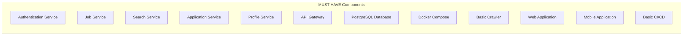
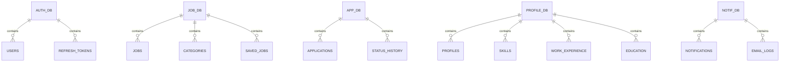
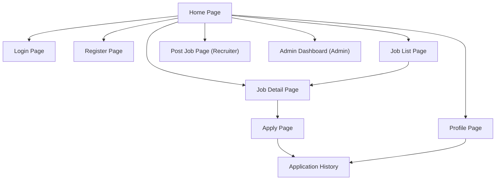
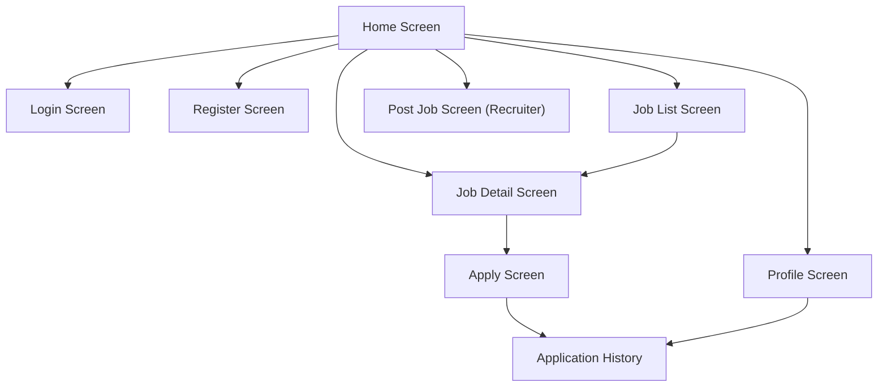

# Software Requirements Specification (SRS)

[English](3-must-have-fr.md) | [Tiếng Việt](../vi/3-must-have-fr.vi.md)

## Vietnam Job Platform - Microservices with .NET + Multirepo

**Version:** 1.0  
**Date:** August 17, 2026  
**Project:** Vietnam Job Platform (Nền tảng việc làm Việt Nam)  

---

## Part 3: Functional Requirements - MUST HAVE

### 3.1 Overview

This section documents all **MUST HAVE** functional requirements. These features are essential for the system to be considered functional and must be 100% stable by the end of Week 4. Each requirement is traceable to the Master Plan and includes acceptance criteria for validation.

The MUST HAVE features are organised into 12 core components:



---

### 3.2 Authentication Service

**Component ID:** AUTH-01  
**Priority:** MUST HAVE  
**Owner:** TM1  
**Target Week:** Week 1  

#### 3.2.1 Description

The Authentication Service manages user identity, registration, login, and session management using token-based authentication (JWT). It provides role-based access control (User, Recruiter) and secures all subsequent API calls.

#### 3.2.2 Functional Requirements

| ID | Requirement | Acceptance Criteria |
|:---|:------------|:-------------------|
| AUTH-01-01 | The system shall allow users to register with email, password, and basic profile information | - Registration endpoint: `POST /api/auth/register`<br>- Email format validated<br>- Password strength enforced (minimum 8 characters, at least 1 number, 1 uppercase letter)<br>- User data persisted to database with hashed password |
| AUTH-01-02 | The system shall allow users to login with email and password | - Login endpoint: `POST /api/auth/login`<br>- Returns access token and refresh token<br>- Invalid credentials return 401 Unauthorised |
| AUTH-01-03 | The system shall issue access tokens with a limited validity period | - Access token valid for 1 hour<br>- Token contains user ID, email, and role claims<br>- Token is cryptographically signed |
| AUTH-01-04 | The system shall support refresh token rotation | - Refresh endpoint: `POST /api/auth/refresh`<br>- Old refresh token invalidated on use<br>- New token pair returned |
| AUTH-01-05 | The system shall support logout (token invalidation) | - Logout endpoint: `POST /api/auth/logout`<br>- Refresh token invalidated<br>- Access token remains valid until expiry |
| AUTH-01-06 | The system shall assign roles during registration | - Role field in registration form<br>- Default role = User<br>- Recruiter role requires additional company information |

#### 3.2.3 API Specifications

| Endpoint | Method | Request Body | Response | Validation Rules |
|:---------|:-------|:-------------|:---------|:-----------------|
| `/api/auth/register` | POST | `{ email, password, fullName, role, companyName? }` | `{ userId, message }` | Email must be unique; password meets strength requirements; role must be valid |
| `/api/auth/login` | POST | `{ email, password }` | `{ accessToken, refreshToken, user }` | Credentials must match; account must be active |
| `/api/auth/refresh` | POST | `{ refreshToken }` | `{ accessToken, refreshToken }` | Token must be valid, not expired, and not revoked |
| `/api/auth/logout` | POST | `{ refreshToken }` | `{ message }` | Token must be valid and not already revoked |
| `/api/auth/me` | GET | (Bearer Token) | `{ user }` | Token must be valid; returns user profile |

#### 3.2.4 Data Model

| Entity | Required Attributes | Relationships |
|:-------|:--------------------|:--------------|
| User | id, email (unique), password_hash, full_name, role, is_active, created_at, updated_at | One User has many Refresh Tokens |
| Refresh Token | id, token (unique), user_id, expiry_date, is_revoked, created_at | Many Refresh Tokens belong to one User |

---

### 3.3 Job Service

**Component ID:** JOB-01  
**Priority:** MUST HAVE  
**Owner:** TM2  
**Target Week:** Week 2  

#### 3.3.1 Description

The Job Service provides CRUD operations for job postings and category management. It is the core business component of the platform, enabling recruiters to post jobs and job seekers to browse opportunities.

#### 3.3.2 Functional Requirements

| ID | Requirement | Acceptance Criteria |
|:---|:------------|:-------------------|
| JOB-01-01 | The system shall allow Recruiters to create job postings | - Create endpoint: `POST /api/jobs`<br>- Required fields: title, description, company, location, salary range, category, requirements<br>- Job saved to database with status = 'pending' or 'active' |
| JOB-01-02 | The system shall allow Recruiters to retrieve their own job postings | - Get recruiter jobs endpoint: `GET /api/jobs/recruiter`<br>- Pagination support (page, size)<br>- Filter by status |
| JOB-01-03 | The system shall allow Recruiters to update job postings | - Update endpoint: `PUT /api/jobs/{id}`<br>- Only the job owner can update<br>- Updated timestamp updated automatically |
| JOB-01-04 | The system shall allow Recruiters to delete job postings | - Delete endpoint: `DELETE /api/jobs/{id}`<br>- Only the job owner can delete<br>- Soft delete (marked as deleted, not physically removed) |
| JOB-01-05 | The system shall allow users to view job details by ID | - Get endpoint: `GET /api/jobs/{id}`<br>- Returns complete job details<br>- Only returns active/pending jobs (not deleted) |
| JOB-01-06 | The system shall support job categories | - Category management endpoints: `GET /api/categories`<br>- Predefined categories: IT, Finance, Marketing, Healthcare, Education, Engineering, Sales, Hospitality, Others<br>- Administrators can add/modify categories |

#### 3.3.3 API Specifications

| Endpoint | Method | Request Body | Response | Validation Rules |
|:---------|:-------|:-------------|:---------|:-----------------|
| `/api/jobs` | POST | JobCreateDTO | `{ id, message }` | User must have Recruiter role; all required fields must be present |
| `/api/jobs/recruiter` | GET | Query: `status, page, size` | Paginated response | User must have Recruiter role |
| `/api/jobs/{id}` | PUT | JobUpdateDTO | `{ message }` | User must be the job owner; valid job ID |
| `/api/jobs/{id}` | DELETE | - | `{ message }` | User must be the job owner; valid job ID |
| `/api/jobs/{id}` | GET | - | JobDetailDTO | Valid job ID; job must not be deleted |
| `/api/categories` | GET | - | `[ { id, name } ]` | No authentication required |

#### 3.3.4 Data Model

| Entity | Required Attributes | Relationships |
|:-------|:--------------------|:--------------|
| Category | id, name (unique), description, created_at | One Category has many Jobs |
| Job | id, title, description, company, company_logo_url, location, salary_min, salary_max, salary_currency, category_id, requirements, benefits, employment_type, experience_level, recruiter_id, status, view_count, created_at, updated_at | Many Jobs belong to one Category; One Recruiter has many Jobs |
| Saved Job | id, user_id, job_id, saved_at | Many Saved Jobs belong to one User and one Job |

---

### 3.4 Search Service

**Component ID:** SEARCH-01  
**Priority:** MUST HAVE  
**Owner:** TM2  
**Target Week:** Week 2  

#### 3.4.1 Description

The Search Service provides full-text search capabilities. It indexes job postings and supports keyword-based and location-based searches with pagination.

#### 3.4.2 Functional Requirements

| ID | Requirement | Acceptance Criteria |
|:---|:------------|:-------------------|
| SEARCH-01-01 | The system shall index job postings for search | - Jobs automatically indexed on creation/update<br>- Search index updated when job data changes |
| SEARCH-01-02 | The system shall provide keyword-based search | - Search endpoint: `GET /api/search/jobs?q={keyword}`<br>- Returns matching jobs with relevance scoring<br>- Handles Vietnamese text appropriately |
| SEARCH-01-03 | The system shall support location-based filtering | - Search endpoint: `GET /api/search/jobs?location={city}`<br>- Matches jobs in specified location<br>- Supports partial matching |
| SEARCH-01-04 | The system shall support pagination | - Pagination parameters: `page` (0-based), `size` (default 20, max 100)<br>- Returns total count and pages<br>- Consistent across results |
| SEARCH-01-05 | The system shall handle search with no results gracefully | - Empty results returned with status 200 OK<br>- Clear message: "No jobs found matching your criteria"<br>- Suggestions for broadening search |

#### 3.4.3 API Specifications

| Endpoint | Method | Query Parameters | Response | Validation Rules |
|:---------|:-------|:------------------|:---------|:-----------------|
| `/api/search/jobs` | GET | `q`, `location`, `page`, `size` | `{ items, total, page, size, totalPages }` | Page must be >= 0; size must be between 1 and 100 |
| `/api/search/suggest` | GET | `q` | `[ "suggestion1", ... ]` | Query parameter is required |

#### 3.4.4 Searchable Fields

The following fields shall be indexed and searchable:

| Field | Type | Searchable | Filterable | Sortable |
|:------|:-----|:-----------|:-----------|:---------|
| title | Text | Yes | No | Yes |
| description | Text | Yes | No | No |
| company | Text | Yes | Yes | Yes |
| location | Text | Yes | Yes | Yes |
| salary_min | Numeric | No | Yes (range) | No |
| salary_max | Numeric | No | Yes (range) | No |
| category | Keyword | No | Yes | Yes |
| employment_type | Keyword | No | Yes | Yes |
| created_at | Date | No | No | Yes |

---

### 3.5 Application Service

**Component ID:** APP-01  
**Priority:** MUST HAVE  
**Owner:** TM1  
**Target Week:** Week 3  

#### 3.5.1 Description

The Application Service manages the job application process. It allows job seekers to apply for jobs, upload CVs, track application status, and view their application history.

#### 3.5.2 Functional Requirements

| ID | Requirement | Acceptance Criteria |
|:---|:------------|:-------------------|
| APP-01-01 | The system shall allow job seekers to apply for a job | - Apply endpoint: `POST /api/applications`<br>- Submit: job_id, cover_letter (optional), CV file upload<br>- CV stored in object storage |
| APP-01-02 | The system shall prevent duplicate applications | - User can only apply once per job<br>- Returns 409 Conflict if already applied |
| APP-01-03 | The system shall allow job seekers to view their application history | - GET endpoint: `GET /api/applications/me`<br>- Pagination support<br>- Filters by status |
| APP-01-04 | The system shall allow job seekers to view application details | - GET endpoint: `GET /api/applications/{id}`<br>- Returns full application details<br>- Only accessible by the applicant |
| APP-01-05 | The system shall allow recruiters to view applications for their jobs | - GET endpoint: `GET /api/applications/job/{jobId}`<br>- Only recruiter who owns the job<br>- Pagination and status filters |
| APP-01-06 | The system shall support application status updates | - PUT endpoint: `PUT /api/applications/{id}/status`<br>- Valid statuses: pending, reviewed, shortlisted, accepted, rejected<br>- Recruiter can update status<br>- Applicant is notified of status change (SHOULD HAVE) |

#### 3.5.3 API Specifications

| Endpoint | Method | Request Body | Response | Validation Rules |
|:---------|:-------|:-------------|:---------|:-----------------|
| `/api/applications` | POST | FormData: job_id, cover_letter, cv_file | `{ id, message }` | User must be authenticated; job must exist; no duplicate application |
| `/api/applications/me` | GET | Query: status, page, size | Paginated response | User must be authenticated |
| `/api/applications/{id}` | GET | - | ApplicationDetailDTO | User must be applicant or job owner |
| `/api/applications/job/{jobId}` | GET | Query: status, page, size | Paginated response | User must be recruiter who owns the job |
| `/api/applications/{id}/status` | PUT | `{ status }` | `{ message }` | Status must be valid; user must be recruiter who owns the job |

#### 3.5.4 Data Model

| Entity | Required Attributes | Relationships |
|:-------|:--------------------|:--------------|
| Application | id, job_id, applicant_id, cover_letter, cv_url, status (pending/reviewed/shortlisted/accepted/rejected), recruiter_notes, score (optional), created_at, updated_at | One Application belongs to one Job; One Application belongs to one User (applicant) |
| Status History | id, application_id, status, note, changed_by, changed_at | One Status History belongs to one Application |

---

### 3.6 Profile Service

**Component ID:** PROFILE-01  
**Priority:** MUST HAVE  
**Owner:** TM2  
**Target Week:** Week 3  

#### 3.6.1 Description

The Profile Service manages user profiles, including personal information, skills, work experience, and education history. It provides a comprehensive view of a user's professional background.

#### 3.6.2 Functional Requirements

| ID | Requirement | Acceptance Criteria |
|:---|:------------|:-------------------|
| PROFILE-01-01 | The system shall allow users to create/update their profile | - PUT endpoint: `PUT /api/profile`<br>- Fields: full_name, phone, address, headline, summary<br>- User ID from authentication for authorisation |
| PROFILE-01-02 | The system shall allow users to add/update skills | - POST endpoint: `POST /api/profile/skills`<br>- Skills: name, proficiency (1-5), years_of_experience<br>- Skills linked to user profile |
| PROFILE-01-03 | The system shall allow users to manage work experience | - CRUD endpoints for experience entries<br>- Fields: company, title, start_date, end_date, description, is_current<br>- Multiple experiences per user |
| PROFILE-01-04 | The system shall allow users to manage education history | - CRUD endpoints for education entries<br>- Fields: institution, degree, field, start_date, end_date<br>- Multiple education entries per user |
| PROFILE-01-05 | The system shall allow users to view their own profile | - GET endpoint: `GET /api/profile/me`<br>- Returns complete profile with all sections<br>- Public view option for recruiters |
| PROFILE-01-06 | The system shall allow users to view other users' public profiles | - GET endpoint: `GET /api/profile/{userId}`<br>- Returns limited public information<br>- Does not include sensitive data |

#### 3.6.3 API Specifications

| Endpoint | Method | Request Body | Response | Validation Rules |
|:---------|:-------|:-------------|:---------|:-----------------|
| `/api/profile` | PUT | ProfileUpdateDTO | `{ message }` | User must be authenticated |
| `/api/profile/me` | GET | - | ProfileDetailDTO | User must be authenticated |
| `/api/profile/{userId}` | GET | - | PublicProfileDTO | Valid user ID |
| `/api/profile/skills` | POST | SkillDTO | `{ id, message }` | User must be authenticated; proficiency must be 1-5 |
| `/api/profile/skills/{id}` | DELETE | - | `{ message }` | User must be the skill owner |
| `/api/profile/experience` | POST | ExperienceDTO | `{ id, message }` | User must be authenticated |
| `/api/profile/education` | POST | EducationDTO | `{ id, message }` | User must be authenticated |

#### 3.6.4 Data Model

| Entity | Required Attributes | Relationships |
|:-------|:--------------------|:--------------|
| Profile | id, user_id (unique), full_name, phone, address, headline, summary, avatar_url, date_of_birth, created_at, updated_at | One Profile belongs to one User |
| Skill | id, profile_id, name, proficiency (1-5), years_of_experience, created_at, updated_at | Many Skills belong to one Profile |
| Work Experience | id, profile_id, company, title, start_date, end_date, is_current, description, created_at, updated_at | Many Work Experiences belong to one Profile |
| Education | id, profile_id, institution, degree, field, start_date, end_date, grade, created_at, updated_at | Many Education entries belong to one Profile |

---

### 3.7 API Gateway

**Component ID:** GW-01  
**Priority:** MUST HAVE  
**Owner:** TM1  
**Target Week:** Week 4  

#### 3.7.1 Description

The API Gateway acts as the single entry point for all client requests. It handles routing, JWT validation, rate limiting, and cross-cutting concerns.

#### 3.7.2 Functional Requirements

| ID | Requirement | Acceptance Criteria |
|:---|:------------|:-------------------|
| GW-01-01 | The gateway shall route requests to the appropriate microservice | - Path-based routing rules defined<br>- `/api/auth/*` routes to Auth Service<br>- `/api/jobs/*` routes to Job Service<br>- `/api/search/*` routes to Search Service<br>- `/api/applications/*` routes to Application Service<br>- `/api/profile/*` routes to Profile Service<br>- Route resolution works for all endpoints |
| GW-01-02 | The gateway shall validate JWT tokens on protected routes | - All routes except `/api/auth/login` and `/api/auth/register` require JWT<br>- Token validated: signature, expiry, audience<br>- 401 Unauthorised if token invalid |
| GW-01-03 | The gateway shall forward user claims to downstream services | - Claims (user_id, role) forwarded as headers<br>- Headers: X-User-Id, X-User-Role<br>- Services can use these for authorisation |
| GW-01-04 | The gateway shall support CORS configuration | - CORS policy allowing Web and Mobile origins<br>- Allowed methods: GET, POST, PUT, DELETE, OPTIONS<br>- Allowed headers: Authorisation, Content-Type |
| GW-01-05 | The gateway shall provide basic rate limiting | - Rate limiting per IP or API key<br>- Default: 100 requests per minute<br>- Returns 429 Too Many Requests when exceeded |
| GW-01-06 | The gateway shall handle service health checks | - Health check endpoint: GET /api/health<br>- Aggregates health status of all services<br>- Returns overall status and per-service status |

#### 3.7.3 Routing Rules

| Route Pattern | Target Service | Authentication Required |
|:--------------|:---------------|:-----------------------|
| `/api/auth/register` | Auth Service | No |
| `/api/auth/login` | Auth Service | No |
| `/api/auth/*` | Auth Service | Yes |
| `/api/jobs/*` | Job Service | Yes |
| `/api/search/*` | Search Service | Yes |
| `/api/applications/*` | Application Service | Yes |
| `/api/profile/*` | Profile Service | Yes |
| `/api/notifications/*` | Notification Service | Yes |
| `/api/health` | Gateway (aggregated) | No |

---

### 3.8 PostgreSQL Database

**Component ID:** DB-01  
**Priority:** MUST HAVE  
**Owner:** TM1  
**Target Week:** Week 1  

#### 3.8.1 Description

PostgreSQL serves as the primary relational database for all services, following the database-per-service pattern. Each microservice has its own dedicated database schema to maintain loose coupling.

#### 3.8.2 Functional Requirements

| ID | Requirement | Acceptance Criteria |
|:---|:------------|:-------------------|
| DB-01-01 | Each service shall have its own database/schema | - Auth uses auth_db<br>- Job uses job_db<br>- Application uses app_db<br>- Profile uses profile_db<br>- Notification uses notif_db |
| DB-01-02 | Databases shall support ACID transactions | - Transactions ensure all-or-nothing operations<br>- Data consistency across related operations<br>- Rollback on failure |
| DB-01-03 | Services shall use an ORM or data access layer for database operations | - Code-first database generation<br>- Migration support for schema changes<br>- Repository pattern or equivalent data access abstraction |
| DB-01-04 | Database schema changes shall be managed through migrations | - Schema versioning supported<br>- Migrations can be applied, rolled back, or tested<br>- No manual schema changes in production |
| DB-01-05 | Connection strings shall be managed via environment variables | - No hardcoded credentials in source code<br>- Environment variable override<br>- Different configurations for development, staging, and production |

#### 3.8.3 Data Model Overview



#### 3.8.4 Database-Per-Service Summary

| Service | Database Name | Primary Tables |
|:--------|:--------------|:---------------|
| Authentication | auth_db | users, refresh_tokens |
| Job | job_db | jobs, categories, saved_jobs |
| Application | app_db | applications, status_history |
| Profile | profile_db | profiles, skills, work_experience, education |
| Notification | notif_db | notifications, email_logs |

---

### 3.9 Docker Compose

**Component ID:** DOCK-01  
**Priority:** MUST HAVE  
**Owner:** TM1  
**Target Week:** Week 1  

#### 3.9.1 Description

Container orchestration enables the entire system to run on a single machine with minimal configuration, ensuring consistency across development environments.

#### 3.9.2 Functional Requirements

| ID | Requirement | Acceptance Criteria |
|:---|:------------|:-------------------|
| DOCK-01-01 | The system shall start all infrastructure services | - PostgreSQL database runs<br>- Redis cache runs<br>- Elasticsearch runs<br>- Kafka message broker runs<br>- All services connect successfully |
| DOCK-01-02 | The system shall start all microservices | - All .NET services (Auth, Job, Search, Application, Profile, Notification)<br>- Services communicate with each other<br>- Ready to accept requests |
| DOCK-01-03 | The system shall start the API Gateway | - Gateway service runs<br>- Routes to all microservices<br>- Environment variables configured |
| DOCK-01-04 | The system shall start the web application (optional) | - React development server runs<br>- Hot reload enabled<br>- Proxy configured for API |
| DOCK-01-05 | The system shall start the crawler (on-demand) | - Crawler can be triggered manually<br>- Connects to PostgreSQL and Elasticsearch |
| DOCK-01-06 | The system shall support environment-specific configuration | - Environment variables file for configuration<br>- Different configurations for development and production<br>- Override capability for local development |

---

### 3.10 Basic Crawler

**Component ID:** CRAWL-01  
**Priority:** MUST HAVE  
**Owner:** TM2  
**Target Week:** Week 4  

#### 3.10.1 Description

The crawler extracts job data from external sources, primarily vieclam.gov.vn (the Vietnamese government job portal). The crawler provides seed data for the platform and demonstrates automated data collection.

#### 3.10.2 Functional Requirements

| ID | Requirement | Acceptance Criteria |
|:---|:------------|:-------------------|
| CRAWL-01-01 | The crawler shall extract job data from vieclam.gov.vn | - Extracts: title, company, location, salary, description, requirements<br>- Crawls at least 500 jobs<br>- Respects robots.txt and rate limits |
| CRAWL-01-02 | The crawler shall clean and transform extracted data | - Remove HTML tags<br>- Normalise salary formats<br>- Standardise location names<br>- Handle missing data gracefully |
| CRAWL-01-03 | The crawler shall avoid duplicate entries | - Check existing jobs by URL or unique identifier<br>- Skip duplicates<br>- Update existing jobs if changed |
| CRAWL-01-04 | The crawler shall save data to PostgreSQL | - Jobs saved to database<br>- Categories mapped or created<br>- Duplicate detection prevents re-insertion |
| CRAWL-01-05 | The crawler shall index data in Elasticsearch | - After saving to PostgreSQL, sync to search index<br>- Searchable immediately |
| CRAWL-01-06 | The crawler shall handle errors and retry | - Retry on network errors (3 attempts)<br>- Log failures with detailed context<br>- Continue crawling after failures |

---

### 3.11 Web Application

**Component ID:** WEB-01  
**Priority:** MUST HAVE  
**Owner:** TM3  
**Target Week:** Weeks 1-3  

#### 3.11.1 Description

The web application is a Single Page Application (SPA) providing the full user interface for all platform features, optimised for desktop and laptop users.

#### 3.11.2 Functional Requirements

| ID | Requirement | Acceptance Criteria |
|:---|:------------|:-------------------|
| WEB-01-01 | The web app shall provide registration and login screens | - Registration form with validation<br>- Login form with error messages<br>- Redirect to dashboard after login |
| WEB-01-02 | The web app shall provide a job list page | - Search bar at top<br>- Job cards with title, company, location, salary<br>- Pagination controls |
| WEB-01-03 | The web app shall provide a job detail page | - Full job description<br>- Company information<br>- "Apply" button (if user is Job Seeker)<br>- "Edit" button (if Recruiter owns the job) |
| WEB-01-04 | The web app shall provide an application form | - Upload CV file<br>- Cover letter text area<br>- Submit button<br>- Success confirmation |
| WEB-01-05 | The web app shall provide a user profile page | - View profile information<br>- Edit profile form<br>- Skills, experience, education management |
| WEB-01-06 | The web app shall provide an application history page | - List of applications<br>- Status badges<br>- Detail view of each application |
| WEB-01-07 | The web app shall provide a job posting form (Recruiter) | - Job form with all required fields<br>- Category selection<br>- Submit with validation |
| WEB-01-08 | The web app shall have consistent navigation | - Header with logo, search, user menu<br>- Footer with links<br>- Breadcrumbs for deep pages |

#### 3.11.3 Page Flow



#### 3.11.4 Screen Requirements Summary

| Screen | User Type | Key Features |
|:-------|:----------|:-------------|
| Home | All | Search bar, featured jobs, quick links |
| Login | All | Email/password form, validation, error handling |
| Register | All | Registration form, role selection, validation |
| Job List | All | Search results, filters, pagination |
| Job Detail | All | Full job info, application button, edit button |
| Apply | Job Seeker | CV upload, cover letter, submit |
| Profile | All | Personal info, skills, experience, education |
| Application History | Job Seeker | Application list, status tracking |
| Post Job | Recruiter | Job form, category selection, publish |
| Admin Dashboard | Admin | User management, job approval, statistics |

---

### 3.12 Mobile Application

**Component ID:** MOB-01  
**Priority:** MUST HAVE  
**Owner:** TM4  
**Target Week:** Weeks 1-3  

#### 3.12.1 Description

The mobile application is a cross-platform app supporting both iOS and Android. It provides a mobile-optimised interface for all platform features, focusing on usability on smaller screens.

#### 3.12.2 Functional Requirements

| ID | Requirement | Acceptance Criteria |
|:---|:------------|:-------------------|
| MOB-01-01 | The mobile app shall provide registration and login screens | - Registration form with validation<br>- Login form with error messages<br>- Redirect to dashboard after login |
| MOB-01-02 | The mobile app shall provide a job list screen | - Search bar at top<br>- Job cards with title, company, location, salary<br>- Infinite scrolling or pagination |
| MOB-01-03 | The mobile app shall provide a job detail screen | - Full job description<br>- Company information<br>- "Apply" button (if user is Job Seeker) |
| MOB-01-04 | The mobile app shall provide an application form | - Upload CV file (pick from device)<br>- Cover letter text area<br>- Submit button<br>- Success confirmation |
| MOB-01-05 | The mobile app shall provide a user profile screen | - View profile information<br>- Edit profile form<br>- Skills, experience, education management |
| MOB-01-06 | The mobile app shall provide an application history screen | - List of applications<br>- Status badges<br>- Detail view of each application |
| MOB-01-07 | The mobile app shall have consistent bottom navigation | - Home, Search, Applications, Profile<br>- Role-based tabs (Recruiter sees Jobs tab) |
| MOB-01-08 | The mobile app shall support both iOS and Android | - Runs on iOS 16+<br>- Runs on Android 12+<br>- Platform-specific UI adaptations |

#### 3.12.3 Screen Flow



#### 3.12.4 Screen Requirements Summary

| Screen | User Type | Key Features |
|:-------|:----------|:-------------|
| Home | All | Search, featured jobs, quick actions |
| Login | All | Email/password form, validation |
| Register | All | Registration, role selection |
| Job List | All | Search results, filters, scrolling |
| Job Detail | All | Full job info, apply button |
| Apply | Job Seeker | CV picker, cover letter, submit |
| Profile | All | Personal info, skills, experience |
| Application History | Job Seeker | Status tracking, details |
| Post Job | Recruiter | Job form, publish |

---

### 3.13. Basic CI/CD (Multirepo Adaptation)

Since the project uses a multirepo architecture, CI/CD pipelines must be implemented **per repository** with a clear separation between **Shared Library Repo** and **Service Repos**.

#### 3.13.1. Shared Library CI/CD (`job-platform-shared`)

| Step | Action | Validation |
|:-----|:-------|:-----------|
| 1 | Build the .NET class library | Build succeeds |
| 2 | Run unit tests | All tests pass |
| 3 | Pack NuGet package (`dotnet pack`) | `.nupkg` file generated |
| 4 | Publish to private feed (GitHub Packages / Azure Artifacts) | Package appears in feed |
| 5 | Tag release with version number (SemVer) | Git tag created |

**Trigger:** On every push to `main` branch.

#### 3.13.2. Service CI/CD (`job-platform-*-svc`)

| Step | Action | Validation |
|:-----|:-------|:-----------|
| 1 | Restore NuGet packages (including shared library) | Restore succeeds |
| 2 | Build the service | Build succeeds |
| 3 | Run unit tests | All tests pass |
| 4 | Build Docker image | Image created successfully |
| 5 | Push to container registry (GHCR / Docker Hub) | Image pushed |
| 6 | Deploy to staging environment (Fly.io / Railway) | Service responds to health check |

**Trigger:** On every push to `main` branch.

#### 3.13.3. Dependency Management Between Repos

When the shared library (`job-platform-shared`) is updated and a new NuGet package version is published:

1. The shared repo pipeline automatically publishes the new version.
2. Each service repo must update its `PackageReference` to the new version.
3. This can be done manually (via Dependabot or Renovate) or automated using `repository_dispatch` events.

**Recommended:** Use **Dependabot** to automatically create pull requests in service repos when a new version of the shared package is available.

#### 3.13.4. CI/CD Pipeline Diagram (Multirepo)

```mermaid
flowchart TB
    subgraph Shared["Shared Library Repo"]
        SharedPush["Push to main"] -- SharedBuild["Build & Test"]
        SharedBuild -- SharedPack["Pack NuGet"]
        SharedPack -- SharedPublish["Publish to Feed"]
    end

    subgraph Service["Service Repo (e.g., Auth Service)"]
        ServicePush["Push to main"] -- ServiceRestore["Restore Packages"]
        ServiceRestore -- ServiceBuild["Build & Test"]
        ServiceBuild -- ServiceDocker["Build Docker Image"]
        ServiceDocker -- ServiceDeploy["Deploy to Staging"]
    end

    SharedPublish -.-|Dependabot PR| ServicePush
```

#### 3.13.5. CI/CD Implementation Requirements

| Requirement | Description | Priority |
|:------------|:------------|:----------|
| Each repo has its own GitHub Actions workflow | Independent CI/CD per repository | MUST |
| Shared library publishes NuGet to private feed | GitHub Packages or Azure Artifacts | MUST |
| Services reference shared library via PackageReference | No direct folder references | MUST |
| Dependabot enabled for shared library updates | Automatic PRs for version updates | SHOULD |
| Staging deployment automated on main branch push | Continuous delivery to staging | SHOULD |
| Production deployment manual (tag-based) | Controlled releases | SHOULD |

---

## 3.14 MUST HAVE Requirements Summary

| Component | ID | Key Features | Target Week | Owner |
|:----------|:---|:-------------|:------------|:------|
| Authentication Service | AUTH-01 | Register, Login, JWT, Refresh Tokens, Logout | 1 | TM1 |
| Job Service | JOB-01 | CRUD Jobs, Categories, Saved Jobs | 2 | TM2 |
| Search Service | SEARCH-01 | Keyword Search, Location Filter, Pagination | 2 | TM2 |
| Application Service | APP-01 | Apply, Upload CV, Status Tracking, History | 3 | TM1 |
| Profile Service | PROFILE-01 | Profile CRUD, Skills, Experience, Education | 3 | TM2 |
| API Gateway | GW-01 | Routing, JWT Validation, Rate Limiting, Health | 4 | TM1 |
| PostgreSQL Database | DB-01 | Database-per-service, Migrations | 1 | TM1 |
| Docker Compose | DOCK-01 | All Services Containerised | 1 | TM1 |
| Basic Crawler | CRAWL-01 | Scrape 500+ Jobs from vieclam.gov.vn | 4 | TM2 |
| Web Application | WEB-01 | Login, Register, Job List, Apply, Profile | 1-3 | TM3 |
| Mobile Application | MOB-01 | Login, Register, Job List, Apply, Profile | 1-3 | TM4 |
| Basic CI/CD | CICD-01 | Build, Test Automation | 4 | TM1 |

---

**End of Part 3**

---