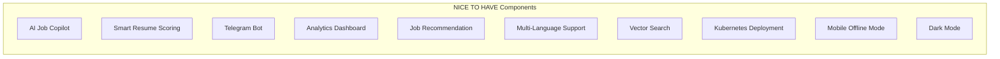
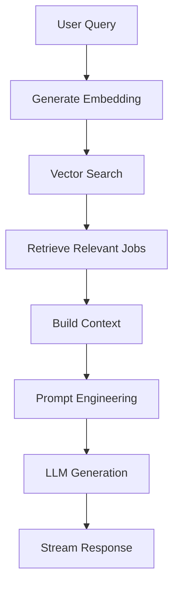
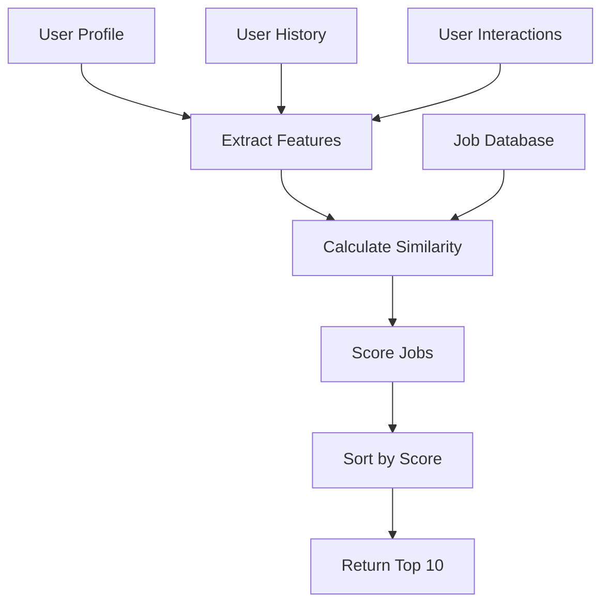
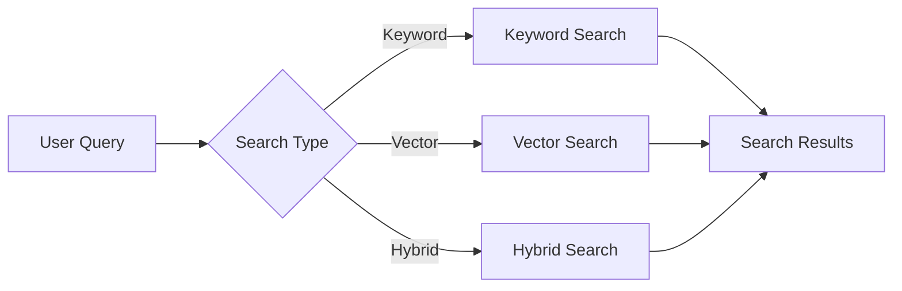
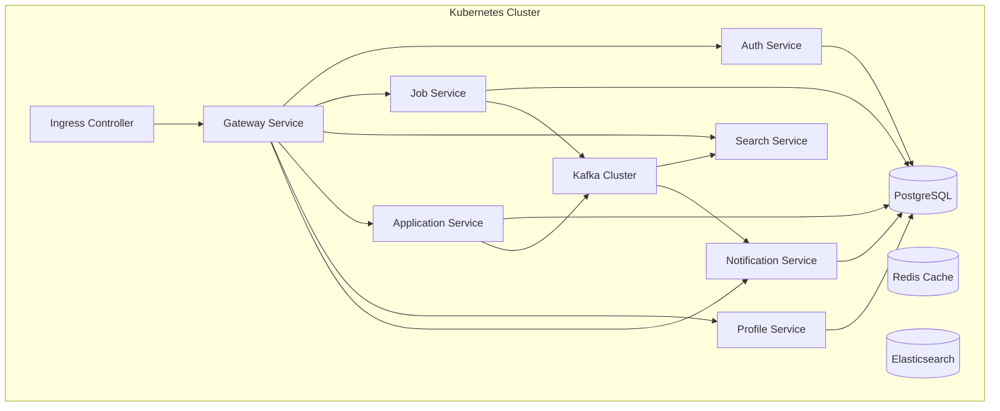
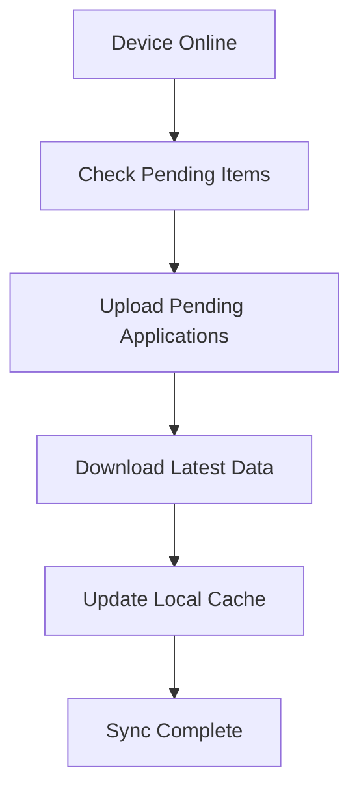

# Software Requirements Specification (SRS)

[English](5-nice-to-have-fr.md) | [Tiếng Việt](../vi/5-nice-to-have-fr.vi.md)

## Vietnam Job Platform - Microservices Architecture

**Version:** 1.0  
**Date:** August 17, 2026  
**Project:** Vietnam Job Platform (Nền tảng việc làm Việt Nam)  

---

## Part 5: Functional Requirements - NICE TO HAVE

### 5.1 Overview

This section documents all **NICE TO HAVE** functional requirements. These are innovative "WOW" features that provide competitive advantage and bonus points, but are not required for a passing grade. They should only be implemented after all MUST HAVE and SHOULD HAVE features are stable and complete.

The team should select **at least 2** NICE TO HAVE features to implement, with AI Job Copilot being the highest recommended. The NICE TO HAVE features are organised into 10 components:



---

### 5.2 AI Job Copilot (Chatbot)

**Component ID:** AI-01  
**Priority:** NICE TO HAVE  
**Owner:** TM2 (Primary) + TM1  
**Target Week:** Weeks 9–10  
**Difficulty:** 8/10  

#### 5.2.1 Description

The AI Job Copilot is a conversational assistant that helps job seekers with career-related queries. Using Retrieval-Augmented Generation (RAG), it provides context-aware responses based on job data, company information, and general career advice. This feature demonstrates modern AI integration and provides significant user value.

#### 5.2.2 Functional Requirements

| ID | Requirement | Acceptance Criteria |
|:---|:------------|:-------------------|
| AI-01-01 | The system shall provide a chat interface for job-related queries | - Chat endpoint: `POST /api/ai/chat`<br>- Users can ask questions about jobs, careers, companies<br>- Responses generated based on job data and general knowledge |
| AI-01-02 | The system shall support Retrieval-Augmented Generation (RAG) | - Job descriptions embedded and stored in vector database<br>- User queries converted to embeddings<br>- Relevant job contexts retrieved and used in response generation |
| AI-01-03 | The system shall maintain conversation context | - Session history stored per user<br>- Context maintained across multiple messages<br>- User can start a new conversation |
| AI-01-04 | The system shall support streaming responses | - Responses streamed token by token (Server-Sent Events)<br>- Users see responses as they are generated<br>- Cancel generation if needed |
| AI-01-05 | The system shall include job-specific responses | - When asked about jobs, responds with relevant job listings<br>- Includes job title, company, link to job<br>- Can explain job requirements in natural language |
| AI-01-06 | The system shall support career advice | - Answers questions about CV writing, interview tips<br>- Provides salary expectations by role and location<br>- Suggests career paths based on skills and experience |
| AI-01-07 | The system shall handle queries in Vietnamese and English | - Understands and responds in both languages<br>- Response language matches query language<br>- Handles Vietnamese diacritics and accents |
| AI-01-08 | The system shall include basic guardrails | - Refuses inappropriate or irrelevant queries<br>- Stays on-topic (career and jobs)<br>- Provides disclaimer about AI-generated content |

#### 5.2.3 API Specifications

| Endpoint | Method | Request Body | Response | Validation Rules |
|:---------|:-------|:-------------|:---------|:-----------------|
| `/api/ai/chat` | POST | `{ message, sessionId?, stream? }` | `{ response, sessionId }` or Server-Sent Events stream | User authenticated; message not empty |
| `/api/ai/session` | POST | - | `{ sessionId }` | User authenticated |
| `/api/ai/session/{sessionId}` | DELETE | - | `{ message }` | User owns session |
| `/api/ai/session/{sessionId}/history` | GET | - | `[ { role, content, timestamp } ]` | User owns session |

#### 5.2.4 RAG Pipeline Flow



#### 5.2.5 Example Queries

| User Query | Expected Response Type |
|:-----------|:----------------------|
| "What IT jobs are available in Ho Chi Minh City?" | List of job listings with summaries |
| "How do I prepare for a React developer interview?" | Interview tips and common questions |
| "What's the average salary for a senior developer in Hanoi?" | Salary range by role and location |
| "Tell me about FPT Software as an employer" | Company overview with key facts |
| "I have 2 years of Python experience, what jobs should I apply for?" | Career guidance and job suggestions |

---

### 5.3 Smart Resume Scoring

**Component ID:** SCORE-01  
**Priority:** NICE TO HAVE  
**Owner:** TM2  
**Target Week:** Week 11  
**Difficulty:** 7/10  

#### 5.3.1 Description

Smart Resume Scoring automatically evaluates a candidate's CV against job requirements and provides a match score with improvement suggestions. It helps job seekers understand their fit for a position and identify areas for improvement.

#### 5.3.2 Functional Requirements

| ID | Requirement | Acceptance Criteria |
|:---|:------------|:-------------------|
| SCORE-01-01 | The system shall parse uploaded CVs to extract text content | - Parse PDF and DOCX files<br>- Extract sections: personal info, skills, experience, education<br>- Handle multiple formats and layouts |
| SCORE-01-02 | The system shall calculate a match score against a job | - Score calculation endpoint: `POST /api/ai/score-resume`<br>- Score based on: skills match, experience match, education match<br>- Score range: 0-100 |
| SCORE-01-03 | The system shall identify matching skills | - Extract skills from both CV and job description<br>- Identify matching, missing, and extra skills<br>- Categorise skills by importance (required vs nice-to-have) |
| SCORE-01-04 | The system shall generate improvement suggestions | - Suggestions based on missing skills<br>- Recommendations for CV improvement<br>- Specific, actionable advice |
| SCORE-01-05 | The system shall cache scoring results | - Results cached for 24 hours<br>- Cache key: `cv_hash + job_id`<br>- Cached results returned for repeated requests |
| SCORE-01-06 | The system shall handle scoring errors gracefully | - If parsing fails, return error with guidance<br>- If job not found, return 404<br>- If service unavailable, return 503 with message |

#### 5.3.3 API Specifications

| Endpoint | Method | Request Body | Response | Validation Rules |
|:---------|:-------|:-------------|:---------|:-----------------|
| `/api/ai/score-resume` | POST | FormData: `cv_file`, `job_id` | `{ score, skills, suggestions }` | User authenticated; job exists; file size <= 5MB |
| `/api/ai/score-resume/{scoreId}` | GET | - | `{ score, skills, suggestions }` | User owns score |
| `/api/ai/score-resume/{scoreId}` | DELETE | - | `{ message }` | User owns score |

#### 5.3.4 Score Breakdown Structure

```json
{
  "overall_score": 78,
  "breakdown": {
    "skills": {
      "score": 85,
      "matching": ["React", "JavaScript", "TypeScript"],
      "missing": ["Node.js", "Docker"],
      "extra": ["Vue.js"]
    },
    "experience": {
      "score": 75,
      "years": 3,
      "required_years": 5,
      "relevance": "High"
    },
    "education": {
      "score": 70,
      "degree": "Bachelor's",
      "required_degree": "Bachelor's",
      "relevance": "Match"
    }
  },
  "suggestions": [
    "Add Node.js to your skills section",
    "Highlight Docker experience",
    "Expand on React project details",
    "Consider mentioning team leadership experience"
  ]
}
```

---

### 5.4 Telegram Job Alert Bot

**Component ID:** TELE-01  
**Priority:** NICE TO HAVE  
**Owner:** TM1  
**Target Week:** Week 12  
**Difficulty:** 4/10  

#### 5.4.1 Description

The Telegram Job Alert Bot allows users to subscribe to job notifications via Telegram, a popular messaging platform in Vietnam. This provides a convenient, real-time notification channel without requiring email or mobile app installation.

#### 5.4.2 Functional Requirements

| ID | Requirement | Acceptance Criteria |
|:---|:------------|:-------------------|
| TELE-01-01 | The system shall integrate with Telegram Bot API | - Telegram bot created via BotFather<br>- Webhook configured for the bot<br>- Bot responds to commands |
| TELE-01-02 | The system shall support subscription commands | - `/start` - Welcome message with instructions<br>- `/subscribe [keyword]` - Subscribe to job alerts<br>- `/unsubscribe` - Unsubscribe from all alerts<br>- `/help` - Show available commands |
| TELE-01-03 | The system shall send job alerts via Telegram | - When a new job matches user's subscription, send alert<br>- Alert includes: job title, company, location, salary<br>- Include link to job detail (deep link) |
| TELE-01-04 | The system shall store user subscriptions | - User Telegram ID stored<br>- Subscription keyword stored per user<br>- User can have multiple subscriptions |
| TELE-01-05 | The system shall handle Telegram webhook events | - Webhook receives updates from Telegram<br>- Process commands asynchronously<br>- Respond within timeout limits |
| TELE-01-06 | The system shall support multiple languages | - Bot messages available in Vietnamese and English<br>- Language preference stored per user<br>- Language selection command available |

#### 5.4.3 Telegram Bot Commands

| Command | Description | Example |
|:--------|:-------------|:--------|
| `/start` | Welcome and introduction | - |
| `/subscribe keyword` | Subscribe to job alerts for a keyword | `/subscribe React developer` |
| `/subscribe keyword location` | Subscribe with keyword and location | `/subscribe React HCM` |
| `/unsubscribe` | Unsubscribe from all alerts | - |
| `/list` | List current subscriptions | - |
| `/help` | Show available commands | - |
| `/language` | Change language | `/language vi` |

#### 5.4.4 Alert Message Format

```
🔥 New job alert!

💼 React Developer
🏢 FPT Software
📍 Ho Chi Minh City
💰 15-25M VND

📝 We're looking for a React developer with 3+ years of experience...

👉 View details: https://jobplatform.com/jobs/123

To unsubscribe: /unsubscribe
```

---

### 5.5 Analytics Dashboard

**Component ID:** ANALYTICS-01  
**Priority:** NICE TO HAVE  
**Owner:** TM3  
**Target Week:** Week 11  
**Difficulty:** 5/10  

#### 5.5.1 Description

The Analytics Dashboard provides visual insights into platform activity. It helps administrators understand user behaviour, job posting trends, and application patterns to make data-driven decisions.

#### 5.5.2 Functional Requirements

| ID | Requirement | Acceptance Criteria |
|:---|:------------|:-------------------|
| ANALYTICS-01-01 | The system shall provide user analytics | - Total users, recruiters, job seekers<br>- User growth over time (daily, weekly, monthly)<br>- Active users (daily, weekly, monthly) |
| ANALYTICS-01-02 | The system shall provide job analytics | - Total jobs, by category<br>- Jobs posted over time<br>- Average job views and applications per job |
| ANALYTICS-01-03 | The system shall provide application analytics | - Total applications<br>- Application status distribution<br>- Application trends over time |
| ANALYTICS-01-04 | The system shall provide search analytics | - Most searched keywords<br>- Most searched locations<br>- Search volume over time |
| ANALYTICS-01-05 | The system shall support time-based filtering | - Filters: Today, This Week, This Month, Custom Range<br>- All charts update based on time filter<br>- Consistent date handling |
| ANALYTICS-01-06 | The system shall provide visual charts and graphs | - Line charts for trends<br>- Bar charts for distribution<br>- Pie charts for composition |

#### 5.5.3 Analytics Dashboard Metrics

| Category | Metric | Chart Type |
|:---------|:-------|:-----------|
| Users | User growth over time | Line chart |
| Users | User distribution (Job Seeker vs Recruiter vs Admin) | Pie chart |
| Jobs | Job postings over time | Line chart |
| Jobs | Jobs by category | Bar chart |
| Jobs | Jobs by employment type | Pie chart |
| Applications | Applications over time | Line chart |
| Applications | Application status distribution | Bar chart |
| Jobs | Top 10 companies by job postings | Bar chart |
| Search | Top 10 search keywords | Bar chart |
| Search | Top 10 search locations | Bar chart |

#### 5.5.4 Analytics API Endpoints

| Endpoint | Method | Query Parameters | Response | Validation Rules |
|:---------|:-------|:------------------|:---------|:-----------------|
| `/api/analytics/users` | GET | `period, start_date, end_date` | UserAnalyticsDTO | Admin role required |
| `/api/analytics/jobs` | GET | `period, start_date, end_date` | JobAnalyticsDTO | Admin role required |
| `/api/analytics/applications` | GET | `period, start_date, end_date` | ApplicationAnalyticsDTO | Admin role required |
| `/api/analytics/search` | GET | `period, limit` | SearchAnalyticsDTO | Admin role required |

---

### 5.6 Job Recommendation

**Component ID:** RECOMMEND-01  
**Priority:** NICE TO HAVE  
**Owner:** TM2  
**Target Week:** Week 13  
**Difficulty:** 6/10  

#### 5.6.1 Description

Job Recommendation provides personalised job suggestions based on user behaviour, skills, application history, and interactions. This enhances user engagement and increases the likelihood of finding suitable jobs.

#### 5.6.2 Functional Requirements

| ID | Requirement | Acceptance Criteria |
|:---|:------------|:-------------------|
| RECOMMEND-01-01 | The system shall provide job recommendations for job seekers | - Recommendation endpoint: `GET /api/jobs/recommended`<br>- Recommendations based on user profile and history<br>- Return up to 10 recommendations |
| RECOMMEND-01-02 | The system shall use content-based filtering | - Based on user skills matching job requirements<br>- Based on user location and job locations<br>- Based on categories of previously viewed/applied jobs |
| RECOMMEND-01-03 | The system shall consider user behaviour | - Jobs viewed or saved<br>- Jobs applied for<br>- Searches performed |
| RECOMMEND-01-04 | The system shall provide explanations for recommendations | - Reason displayed with each recommendation<br>- Example: "Based on your React and JavaScript skills"<br>- Example: "Similar to jobs you've viewed" |
| RECOMMEND-01-05 | The system shall support recommendation refresh | - Recommendations regenerated periodically<br>- New recommendations on page refresh<br>- Cache with TTL of 6 hours |
| RECOMMEND-01-06 | The system shall handle cold start users | - For new users, recommend popular jobs<br>- For users with no history, show trending jobs<br>- Gradually refine as user behaviour is collected |

#### 5.6.3 Recommendation Flow



#### 5.6.4 Recommendation API

| Endpoint | Method | Query Parameters | Response | Validation Rules |
|:---------|:-------|:------------------|:---------|:-----------------|
| `/api/jobs/recommended` | GET | `limit`, `refresh` | `{ items, reasons }` | User must be authenticated; role must be Job Seeker |
| `/api/jobs/recommended/explain` | GET | `job_id` | `{ reason, score }` | User must be authenticated |

---

### 5.7 Multi-Language Support (i18n)

**Component ID:** I18N-01  
**Priority:** NICE TO HAVE  
**Owner:** TM3 (Web) + TM4 (Mobile)  
**Target Week:** Week 11  
**Difficulty:** 4/10  

#### 5.7.1 Description

Multi-language support enables users to interact with the platform in their preferred language. The initial focus is on Vietnamese (native) and English (international), with potential for additional languages in the future.

#### 5.7.2 Functional Requirements

| ID | Requirement | Acceptance Criteria |
|:---|:------------|:-------------------|
| I18N-01-01 | The system shall support Vietnamese and English | - All UI text available in both languages<br>- Language selector in the interface<br>- User preference persisted across sessions |
| I18N-01-02 | The system shall support language switching | - Language changes apply immediately (no page refresh required)<br>- All UI elements update with new language<br>- Consistent experience across the application |
| I18N-01-03 | The system shall handle pluralisation correctly | - Plural forms for English and Vietnamese<br>- Handles numbers correctly<br>- Consistent across languages |
| I18N-01-04 | The system shall handle date and number formatting | - Dates in local format (dd/mm/yyyy for Vietnamese)<br>- Currencies in local format<br>- Numbers with appropriate separators |
| I18N-01-05 | The system shall support language from user profile | - Default language from user profile<br>- Override by browser preference<br>- Language persists after logout |

#### 5.7.3 Language Coverage

| Component | Vietnamese | English |
|:----------|:-----------|:--------|
| UI Navigation | Yes | Yes |
| Job Listings | Yes (job data itself may be in Vietnamese) | No (English translations not required for job content) |
| Forms | Yes | Yes |
| Error Messages | Yes | Yes |
| Notifications | Yes | Yes |
| Admin Panel | Yes | Yes |

#### 5.7.4 Translation Management

| Aspect | Approach |
|:-------|:---------|
| Web Application | Translation files (JSON) with key-value pairs |
| Mobile Application | Language-specific resource files |
| Backend | Language preference stored per user |
| Notifications | Language based on user preference |
| Emails | Language based on user preference |

---

### 5.8 Elasticsearch Vector Search

**Component ID:** VECTOR-01  
**Priority:** NICE TO HAVE  
**Owner:** TM2  
**Target Week:** Week 12  
**Difficulty:** 7/10  

#### 5.8.1 Description

Vector Search extends Elasticsearch with semantic search capabilities. Instead of relying solely on keyword matching, it uses embeddings to find jobs with similar meaning, even if exact keywords don't match. This provides a more intelligent search experience.

#### 5.8.2 Functional Requirements

| ID | Requirement | Acceptance Criteria |
|:---|:------------|:-------------------|
| VECTOR-01-01 | The system shall generate embeddings for job descriptions | - Embeddings generated using AI service (OpenAI/Gemini)<br>- Embeddings stored in Elasticsearch vector field<br>- Embeddings refreshed when job is updated |
| VECTOR-01-02 | The system shall support semantic search | - User query embedded using the same model<br>- Vector similarity search in Elasticsearch<br>- Results ranked by semantic relevance |
| VECTOR-01-03 | The system shall support hybrid search | - Combine keyword search with vector search<br>- Weighted scoring (keyword 40%, vector 60%)<br>- Configurable weights |
| VECTOR-01-04 | The system shall support filtering with semantic search | - Apply filters (location, salary, etc.) with vector search<br>- Filters applied after vector search<br>- Performance acceptable (< 500ms) |
| VECTOR-01-05 | The system shall handle embedding failures gracefully | - If embedding service unavailable, fallback to keyword search<br>- Cache embeddings for frequently searched jobs<br>- Log embedding failures for monitoring |

#### 5.8.3 Vector Search Comparison

| Feature | Keyword Search | Vector Search |
|:--------|:---------------|:--------------|
| Search Type | Keyword matching | Semantic similarity |
| Example Query | "React developer" | "Frontend engineer with React experience" |
| Language Independence | Limited to exact words | Handles synonyms and variations |
| Accuracy | High for exact matches | High for meaning-based search |
| Performance | Fast (< 50ms) | Slower (< 200ms) |
| Requirements | Elasticsearch only | Elasticsearch + Embedding service |

#### 5.8.4 Search Types Comparison



---

### 5.9 Kubernetes Deployment

**Component ID:** K8S-01  
**Priority:** NICE TO HAVE  
**Owner:** TM1  
**Target Week:** Week 12  
**Difficulty:** 7/10  

#### 5.9.1 Description

Kubernetes Deployment enables the system to run on a Kubernetes cluster, providing advanced orchestration capabilities including auto-scaling, rolling updates, and self-healing. This demonstrates production-grade deployment practices.

#### 5.9.2 Functional Requirements

| ID | Requirement | Acceptance Criteria |
|:---|:------------|:-------------------|
| K8S-01-01 | The system shall be deployable on Kubernetes | - Kubernetes manifests for all services<br>- Deployment, Service, ConfigMap, Secret resources<br>- Namespace isolation (dev/staging/prod) |
| K8S-01-02 | The system shall support horizontal pod autoscaling | - HPA configuration for CPU-based scaling<br>- Scale based on custom metrics (requests per second)<br>- Minimum and maximum replicas defined |
| K8S-01-03 | The system shall support rolling updates | - Zero-downtime deployments<br>- Rolling update strategy<br>- Rollback capability |
| K8S-01-04 | The system shall support self-healing | - Health probes (liveness and readiness)<br>- Restart on failure<br>- Recreate pods on crash |
| K8S-01-05 | The system shall support environment-specific configuration | - ConfigMaps for non-sensitive configuration<br>- Secrets for sensitive data<br>- Different configs per environment |
| K8S-01-06 | The system shall support service discovery | - Kubernetes Service DNS<br>- Service-to-service communication via DNS<br>- Load balancing across pods |

#### 5.9.3 Kubernetes Resources

| Resource | Purpose | Example |
|:---------|:--------|:---------|
| Deployment | Manage pod lifecycle | AuthService, JobService, etc. |
| Service | Expose pods internally | ClusterIP for each service |
| Ingress | Expose services externally | API Gateway ingress |
| ConfigMap | Non-sensitive configuration | Database connection strings (without password) |
| Secret | Sensitive configuration | Database passwords, JWT secret |
| HPA | Auto-scaling | Scale based on CPU (50% target) |
| NetworkPolicy | Network security | Isolate services by namespace |

#### 5.9.4 Deployment Architecture



---

### 5.10 Mobile Offline Mode

**Component ID:** OFFLINE-01  
**Priority:** NICE TO HAVE  
**Owner:** TM4  
**Target Week:** Week 13  
**Difficulty:** 5/10  

#### 5.10.1 Description

Mobile Offline Mode allows users to access key platform features without an internet connection. This is particularly valuable in Vietnam where connectivity may be inconsistent. It enables users to view saved jobs, read cached content, and access basic functionality offline.

#### 5.10.2 Functional Requirements

| ID | Requirement | Acceptance Criteria |
|:---|:------------|:-------------------|
| OFFLINE-01-01 | The system shall support offline job viewing | - Users can view saved jobs without internet<br>- Jobs synced when online<br>- Cached jobs stored locally |
| OFFLINE-01-02 | The system shall support offline job search | - Search within saved jobs<br>- Simple keyword filtering<br>- Results from local cache only |
| OFFLINE-01-03 | The system shall support offline application | - Users can apply offline<br>- Application stored locally<br>- Submitted when network available |
| OFFLINE-01-04 | The system shall provide sync status | - Sync status indicator<br>- Number of items pending sync<br>- Manual sync option |
| OFFLINE-01-05 | The system shall handle sync conflicts | - Conflict resolution strategy<br>- Priority to server data<br>- User notification on conflicts |
| OFFLINE-01-06 | The system shall manage local storage efficiently | - Storage limit management<br>- Auto-cleanup of old items<br>- User can clear cached data |

#### 5.10.3 Offline Capabilities

| Feature | Online | Offline | Sync Behaviour |
|:--------|:-------|:--------|:---------------|
| View job details | Yes | Yes (cached) | Cached on view |
| Search jobs | Yes | Yes (saved only) | Filters saved jobs |
| Apply for jobs | Yes | Yes (pending) | Queued for upload |
| View applications | Yes | Yes (cached) | Cached on view |
| View profile | Yes | Yes (cached) | Cached on view |
| Update profile | Yes | No | Not supported |
| View notifications | Yes | Yes (cached) | Cached on receive |

#### 5.10.4 Sync Process



---

### 5.11 Dark Mode

**Component ID:** DARK-01  
**Priority:** NICE TO HAVE  
**Owner:** TM3 (Web) + TM4 (Mobile)  
**Target Week:** Week 13  
**Difficulty:** 3/10  

#### 5.11.1 Description

Dark Mode provides a dark-themed user interface option, reducing eye strain in low-light environments and improving battery life on OLED displays. This is a user experience enhancement that demonstrates attention to detail and accessibility.

#### 5.11.2 Functional Requirements

| ID | Requirement | Acceptance Criteria |
|:---|:------------|:-------------------|
| DARK-01-01 | The system shall support light and dark themes | - All UI components styled for both themes<br>- Consistent color scheme for each theme<br>- Accessibility maintained in both themes |
| DARK-01-02 | The system shall support automatic theme switching | - Follow system theme preference (OS setting)<br>- Detect system theme changes<br>- Apply theme immediately |
| DARK-01-03 | The system shall support manual theme switching | - Theme toggle in settings menu<br>- Override system preference<br>- Theme preference persisted |
| DARK-01-04 | The system shall maintain theme consistency across platforms | - Same color scheme for web and mobile<br>- Consistent experience across devices<br>- Theme preference stored per user |
| DARK-01-05 | The system shall handle theme switching without flash | - No white flash when loading<br>- Theme applied immediately<br>- No FOUC (Flash of Unstyled Content) |

#### 5.11.3 Theme Color Palette

| Element | Light Mode | Dark Mode |
|:--------|:-----------|:-----------|
| Background | White (#FFFFFF) | Dark Gray (#1A1A1A) |
| Surface | Light Gray (#F5F5F5) | Medium Dark (#2D2D2D) |
| Primary Text | Black (#000000) | White (#FFFFFF) |
| Secondary Text | Dark Gray (#666666) | Light Gray (#AAAAAA) |
| Primary Color | Blue (#007AFF) | Blue (#007AFF) |
| Border | Light Gray (#E0E0E0) | Dark Gray (#333333) |

---

### 5.12 NICE TO HAVE Requirements Summary

| Component | ID | Key Features | Target Week | Owner | Difficulty |
|:----------|:---|:-------------|:------------|:------|:-----------|
| AI Job Copilot | AI-01 | RAG chatbot, streaming responses, multi-language | 9-10 | TM2 + TM1 | 8/10 |
| Smart Resume Scoring | SCORE-01 | CV parsing, match scoring, improvement suggestions | 11 | TM2 | 7/10 |
| Telegram Bot | TELE-01 | Subscription commands, job alerts, multi-language | 12 | TM1 | 4/10 |
| Analytics Dashboard | ANALYTICS-01 | User/job/application analytics, visual charts | 11 | TM3 | 5/10 |
| Job Recommendation | RECOMMEND-01 | Content-based filtering, explanation UI | 13 | TM2 | 6/10 |
| Multi-Language | I18N-01 | Vietnamese/English support, translations | 11 | TM3 + TM4 | 4/10 |
| Vector Search | VECTOR-01 | Semantic search, hybrid search | 12 | TM2 | 7/10 |
| Kubernetes | K8S-01 | HPA, rolling updates, self-healing | 12 | TM1 | 7/10 |
| Offline Mode | OFFLINE-01 | Offline viewing, offline applications, sync | 13 | TM4 | 5/10 |
| Dark Mode | DARK-01 | Light/dark themes, automatic/manual switching | 13 | TM3 + TM4 | 3/10 |

---

### 5.13 Team Recommendations

| Recommended Selection | Justification |
|:----------------------|:--------------|
| **AI Job Copilot** | Highest WOW factor, demonstrates modern AI integration, provides real user value |
| **Smart Resume Scoring** | Complements AI Copilot, practical value for job seekers, showcases NLP capabilities |

**Alternative Selections:**

| Alternative | Reason |
|:------------|:-------|
| **Telegram Bot** + **Analytics Dashboard** | Lower difficulty, good combination of user-facing and administrative features |
| **Job Recommendation** + **Vector Search** | Search-focused improvements, enhances core search functionality |
| **Kubernetes** + **Dark Mode** | Demonstrates technical depth (K8s) and user experience attention (Dark Mode) |

---

**End of Part 5**

---