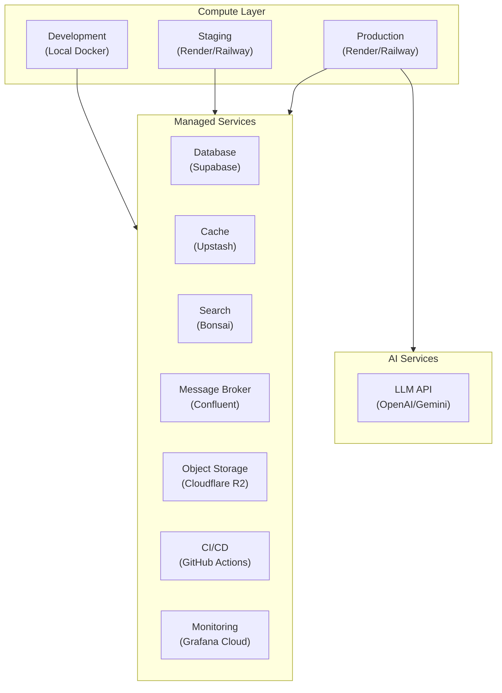
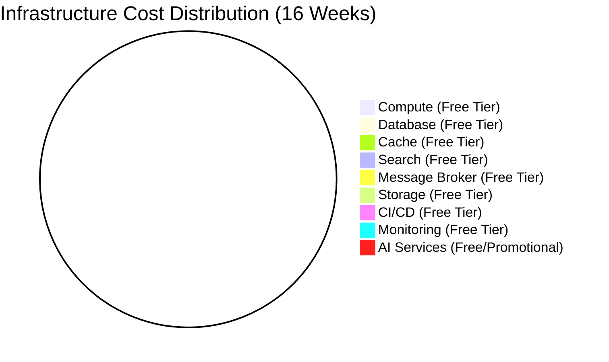
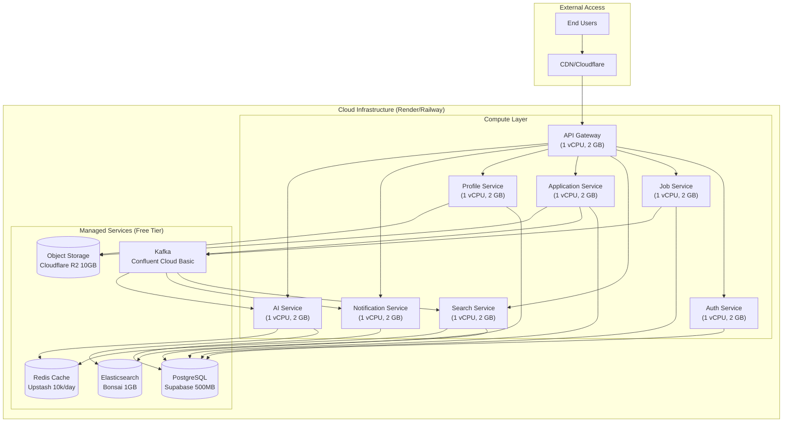
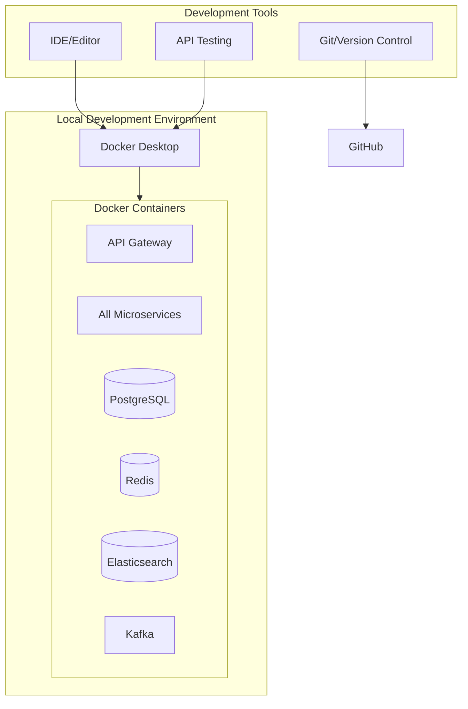
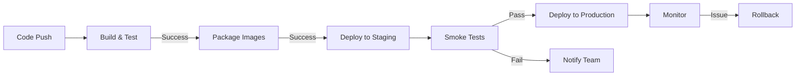

# Software Requirements Specification (SRS)

[English](9-infra-cost-analysis.md) | [Tiếng Việt](../vi/9-infra-cost-analysis.vi.md)

## Vietnam Job Platform - Microservices Architecture

**Version:** 1.0  
**Date:** August 17, 2026  
**Project:** Vietnam Job Platform (Nền tảng việc làm Việt Nam)  

---

## Part 9: Infrastructure and Cost Analysis

### 9.1 Overview

This section documents the infrastructure strategy and cost analysis for the Vietnam Job Platform. The infrastructure leverages free tiers and promotional credits from major cloud providers, achieving an effective cost of **$0** for the development, staging, and demonstration phases. This approach aligns with the project constraint of zero-cost infrastructure while maintaining the technical requirements for a production-grade microservices architecture.

The infrastructure is organised into the following layers:

---

### 9.2 Infrastructure Components

The following table documents all infrastructure components required for the system.

| Component Category | Component | Purpose | Provider | Priority |
|:-------------------|:----------|:--------|:---------|:----------|
| **Compute** | Development Environment | Local development and testing | Docker Compose (Local) | MUST |
| **Compute** | Staging Environment | Pre-production testing | Render / Railway | SHOULD |
| **Compute** | Production Environment | Live system deployment | Render / Railway | SHOULD |
| **Database** | PostgreSQL | Primary data storage | Supabase | MUST |
| **Cache** | Redis | Caching and session storage | Upstash | SHOULD |
| **Search Engine** | Elasticsearch | Full-text search and indexing | Bonsai / Elastic Cloud | MUST |
| **Message Broker** | Kafka | Event-driven communication | Confluent Cloud | SHOULD |
| **Object Storage** | S3-compatible Storage | File storage (CV, avatars) | Cloudflare R2 | SHOULD |
| **Container Registry** | Docker Registry | Container image storage | GitHub Container Registry | MUST |
| **CI/CD** | Automation Pipeline | Build, test, and deployment automation | GitHub Actions | MUST |
| **Monitoring** | Observability Stack | Metrics, logs, and alerts | Grafana Cloud | SHOULD |
| **AI Services** | LLM API | AI chatbot and resume scoring | OpenAI / Google Gemini | NICE |
| **Domain/Tunnel** | Public Exposure | Secure public access | Cloudflare Tunnel | SHOULD |

---

### 9.3 Cost Breakdown Analysis

The following table provides a detailed cost analysis for all infrastructure components over the 16-week project duration.

| Component Category | Service Provider | Free Tier / Promotional Offer | Validity Period | 16-Week Cost |
|:-------------------|:-----------------|:------------------------------|:----------------|:-------------|
| **Compute (VM)** | Google Cloud Platform | f1-micro instance: 0.2 vCPU, 0.6 GB RAM, 30 GB HDD | Always Free (within limits) | $0 |
| **Compute (VM)** | AWS / Azure | EC2 t2.micro (AWS) or B1S (Azure): 1 vCPU, 1 GB RAM | 12 months | $0 |
| **Compute (VM)** | DigitalOcean / Vultr | $200 - $250 promotional credits | 30-60 days | $0 |
| **Compute (Container)** | Render | Free 750h/mo 512 MB 0.1 CPU (spin-down 15m) + Vercel web | Free (spin-down) | $0 |
| **Compute (Container)** | Railway | $5 trial / $1 Free Hobby $5 | Promotional | $0 |
| **Managed Database** | Supabase | PostgreSQL: 500 MB storage, authentication, realtime features | Always Free (within limits) | $0 |
| **Managed Database** | Neon | PostgreSQL: 1 GB storage, branching | Always Free (within limits) | $0 |
| **Managed Cache** | Upstash | Redis: 10,000 commands per day | Always Free (within limits) | $0 |
| **Search Engine** | Bonsai | Elasticsearch: 1 GB cluster | Always Free (within limits) | $0 |
| **Search Engine** | Elastic Cloud | Elasticsearch: 1 GB cluster (trial) | 14-day trial (renewable) | $0 |
| **Message Broker** | Confluent Cloud | Kafka: Basic tier with limited throughput | Always Free (within limits) | $0 |
| **Object Storage** | Cloudflare R2 | 10 GB storage, unlimited egress (no bandwidth charges) | Always Free (within limits) | $0 |
| **Container Registry** | GitHub Container Registry | Unlimited public repositories | Always Free | $0 |
| **CI/CD Pipeline** | GitHub Actions | 2,000 free minutes/month (private repos), unlimited (public repos) | Always Free (within limits) | $0 |
| **Monitoring Stack** | Grafana Cloud | 10,000 Prometheus metrics, 50 GB logs, 50 GB traces/month | Always Free (within limits) | $0 |
| **AI Services (LLM)** | OpenAI | $5 free credits | Promotional / Limited | $0 |
| **AI Services (LLM)** | Google Gemini | ~60 requests/minute free | Always Free (within limits) | $0 |
| **Domain / Tunnel** | Cloudflare Tunnel | Secure public exposure without public IP or paid domain | Always Free | $0 |

---

### 9.4 Total Estimated Cost

**$0.00 USD** for the entire 16-week project lifecycle, including development, testing, staging, and demonstration phases.

---

### 9.5 Cost Optimisation Strategies

The following strategies are employed to achieve zero-cost infrastructure:

| Strategy | Description | Implementation |
|:---------|:------------|:---------------|
| **Free Tier Utilization** | Deploy foundational services using Always Free tiers | GCP f1-micro, Supabase, Upstash, Cloudflare R2, Bonsai |
| **Promotional Credits** | Leverage trial credits for additional compute resources | AWS/Azure credits, DigitalOcean/Vultr, Railway |
| **Egress Cost Avoidance** | Use services with free data transfer (egress) | Cloudflare R2 provides free egress |
| **AI API Cost Management** | Use free tier LLM providers strategically | Gemini for high-volume requests, OpenAI credits for prototyping |
| **Containerized Deployment** | Package all services using Docker | Deploy to Render or Railway free tiers |
| **Managed Services** | Use managed services instead of self-hosting | Reduces operational overhead and costs |
| **Infrastructure as Code** | Automate infrastructure provisioning | Reduces manual errors and management costs |

---

### 9.6 Infrastructure Architecture

#### 9.6.1 Staging and Production Architecture

#### 9.6.2 Development Architecture

---

### 9.7 Deployment Procedure

#### 9.7.1 Staging Deployment Steps

| Step | Action | Owner | Validation |
|:-----|:-------|:------|:-----------|
| 1 | Build all services and applications | CI/CD (GitHub Actions) | All builds pass |
| 2 | Run all automated tests | CI/CD (GitHub Actions) | All tests pass |
| 3 | Package Docker images and push to registry | CI/CD (GitHub Actions) | Images pushed successfully |
| 4 | Deploy to staging environment | TM1 | Services start successfully |
| 5 | Run smoke tests on staging | All | Key endpoints respond |
| 6 | Invite users for testing | All | Users can access staging |
| 7 | Collect and address feedback | All | Issues resolved |

#### 9.7.2 Production Deployment Steps

| Step | Action | Owner | Validation |
|:-----|:-------|:------|:-----------|
| 1 | Verify staging deployment is stable | All | Staging passes validation |
| 2 | Backup production database (if applicable) | TM1 | Backup created |
| 3 | Deploy to production environment | TM1 | Services start successfully |
| 4 | Run smoke tests on production | All | Key endpoints respond |
| 5 | Monitor production health | TM1 | No errors detected |
| 6 | Verify monitoring and logging are active | TM1 | Metrics and logs visible |
| 7 | Update documentation | All | Documentation reflects production |

#### 9.7.3 Deployment Pipeline

---

### 9.8 Free Tier Strategy

#### 9.8.1 Primary Services (Always Free)

| Service | Provider | Limit | Usage |
|:--------|:---------|:------|:------|
| **Compute** | GCP | f1-micro (0.2 vCPU, 0.6 GB RAM) | Lightweight gateway or monitoring |
| **Compute** | Render + Vercel | 750h/mo 512 MB + Vercel web CDN | All microservices + web |
| **Database** | Supabase | 500 MB storage | Application data |
| **Cache** | Upstash | 10,000 commands/day | Caching, rate limiting |
| **Search** | Bonsai | 1 GB cluster | Job search indexing |
| **Message Broker** | Confluent | Basic tier (limited throughput) | Event-driven communication |
| **Storage** | Cloudflare R2 | 10 GB storage | CV, avatar, logo storage |
| **CI/CD** | GitHub Actions | 2,000 minutes/month | Build and test automation |
| **Monitoring** | Grafana Cloud | 10,000 metrics | Observability |
| **Tunnel** | Cloudflare | Unlimited | Secure public exposure |

#### 9.8.2 Backup Services

| Service | Provider | Limit | When to Use |
|:--------|:---------|:------|:------------|
| **Compute** | AWS/Azure | 12-month free tier | If GCP/Render limits reached |
| **Compute** | DigitalOcean/Vultr | $200-$250 credits | If additional compute needed |
| **Database** | Neon | 1 GB storage | If Supabase limits exceeded |
| **Search** | Elastic Cloud | 14-day trial | If Bonsai limits exceeded |

---

### 9.9 Resource Monitoring

To ensure free tier limits are not exceeded, the following monitoring strategy is implemented:

| Resource | Metric | Alert Threshold | Action |
|:---------|:-------|:-----------------|:-------|
| **Supabase** | Storage usage | > 400 MB | Archive old data |
| **Supabase** | Database connections | > 15 | Increase pooling limits |
| **Upstash** | Commands/day | > 8,000 | Optimise caching strategy |
| **Bonsai** | Cluster size | > 800 MB | Delete old indexes |
| **Confluent** | Throughput | > 80% of limit | Throttle event publishing |
| **GitHub Actions** | Minutes/month | > 1,800 | Optimise CI pipeline |
| **Grafana** | Metrics | > 8,000 | Reduce metric collection |

---

### 9.10 Risk Considerations

| Risk | Probability | Impact | Mitigation Strategy |
|:-----|:------------|:-------|:-------------------|
| **Free tier resource exhaustion** | Medium | High | Monitor usage metrics; upgrade only if necessary |
| **Promotional credits expiration** | Medium | Medium | Prioritize Always Free services; credits used only for short-term needs |
| **API rate limiting (AI services)** | Medium | Low | Implement caching and rate limiting; use Gemini for high-volume requests |
| **Data persistence across service restarts** | Low | High | Use managed services (Supabase, Upstash) to ensure data durability |
| **Service provider changes free tier** | Low | High | Have backup providers identified |
| **Cloud service outage** | Low | Medium | Multi-region where possible; local development always available |
| **Database connection limits** | Medium | High | Connection pooling; monitor active connections |

---

### 9.11 Infrastructure Requirements Summary

| Category | MUST | SHOULD | NICE | Total |
|:---------|:-----|:-------|:-----|:------|
| Compute | 1 | 2 | 0 | 3 |
| Database | 1 | 0 | 0 | 1 |
| Cache | 0 | 1 | 0 | 1 |
| Search | 1 | 0 | 0 | 1 |
| Message Broker | 0 | 1 | 0 | 1 |
| Storage | 0 | 1 | 0 | 1 |
| Container Registry | 1 | 0 | 0 | 1 |
| CI/CD | 1 | 0 | 0 | 1 |
| Monitoring | 0 | 1 | 0 | 1 |
| AI Services | 0 | 0 | 1 | 1 |
| Domain/Tunnel | 0 | 1 | 0 | 1 |
| **Total** | **5** | **7** | **1** | **13** |

---

### 9.12 Post-Project Considerations

While the project is designed for zero-cost infrastructure during the 16-week period, the following considerations apply for potential future use:

| Consideration | Recommendation | Estimated Cost |
|:--------------|:----------------|:---------------|
| **Production Scale-Up** | Upgrade to paid tiers when user base grows | $50-200/month |
| **Data Growth** | Expand database and storage as needed | $10-50/month |
| **AI Features** | Subscribe to paid AI services for production | $20-100/month |
| **High Availability** | Deploy to multiple regions for redundancy | $100-300/month |
| **Professional Support** | Purchase support plans for critical services | $50-200/month |

---

**End of Part 9**

---