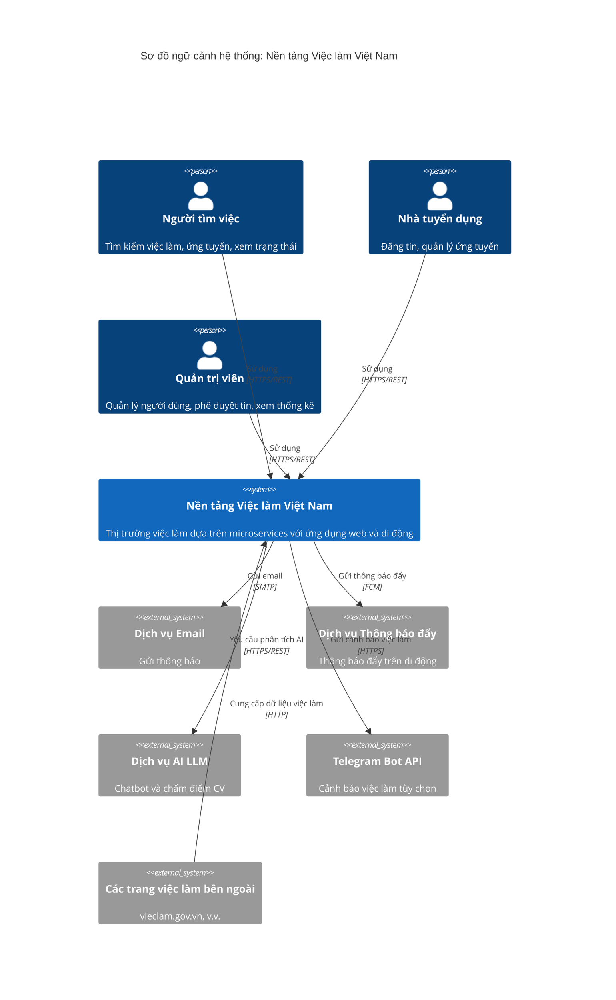

# Đặc tả Yêu cầu Phần mềm (SRS)

[English](../en/1-introduction.md) | [Tiếng Việt](1-introduction.vi.md)

## Nền tảng Việc làm Việt Nam - Kiến trúc Microservices

**Phiên bản:** 1.0  
**Ngày:** 17 tháng 8 năm 2026  
**Dự án:** Nền tảng Việc làm Việt Nam (Vietnam Job Platform)  

---

## Phần 1: Giới thiệu

### 1.1 Mục đích

Tài liệu Đặc tả Yêu cầu Phần mềm (SRS) này cung cấp mô tả đầy đủ về **Nền tảng Việc làm Việt Nam** – một thị trường việc làm đa nền tảng kết nối người tìm việc với nhà tuyển dụng tại Việt Nam. Hệ thống được thiết kế theo kiến trúc microservices hỗ trợ cả ứng dụng web và di động, tập trung vào các thực hành phát triển hiện đại, khả năng mở rộng và triển khai tiết kiệm chi phí phù hợp với dự án học thuật kéo dài 16 tuần.

Mục đích chính của tài liệu này là:

- Xác định các yêu cầu chức năng và phi chức năng của hệ thống.
- Làm cơ sở cho các hoạt động thiết kế, phát triển và kiểm thử.
- Điều chỉnh tất cả các bên liên quan (nhà phát triển, người kiểm thử, giảng viên) về phạm vi và kết quả bàn giao.
- Ghi lại phân loại ưu tiên (Bắt buộc phải có, Nên có, Tốt nên có) và lộ trình 16 tuần đã lên kế hoạch.
- Cung cấp tài liệu tham khảo rõ ràng cho nhóm phát triển để xây dựng hệ thống theo các yêu cầu đã chỉ định.

Tài liệu này được xây dựng dựa trên *Kế hoạch tổng thể – Nền tảng Việc làm Việt Nam* và *Bảng phân tích chi phí: Hạ tầng không chi phí*.

---

### 1.2 Quy ước tài liệu

| Quy ước | Ý nghĩa |
|:--------|:--------|
| **Văn bản in đậm** | Các thuật ngữ chính, tên thành phần hoặc nhấn mạnh |
| *Văn bản in nghiêng* | Tham chiếu đến các phần khác hoặc tài liệu bên ngoài |
| `monospace` | Các thành phần mã, đường dẫn tệp, điểm cuối API, lệnh |
| [REQ-XXX] | Mã định danh yêu cầu dùng để truy xuất nguồn gốc |
| (MUST) | Chỉ ra yêu cầu được phân loại là "Bắt buộc phải có" |
| (SHOULD) | Chỉ ra yêu cầu được phân loại là "Nên có" |
| (NICE) | Chỉ ra yêu cầu được phân loại là "Tốt nên có" |
| Sơ đồ Mermaid | Dùng để minh họa kiến trúc, luồng và mối quan hệ |
| Bảng biểu | Dùng để trình bày dữ liệu có cấu trúc và so sánh |

Tất cả các yêu cầu đều có thể truy xuất đến các phân loại ưu tiên được định nghĩa trong Phần 1.4 (Phạm vi sản phẩm) và được trình bày chi tiết trong Phần 3–5.

---

### 1.3 Đối tượng độc giả dự kiến

SRS này dành cho:

| Đối tượng | Vai trò |
|:----------|:--------|
| **Nhóm phát triển** | Bốn thành viên (TM1–TM4) sẽ triển khai hệ thống. Họ sẽ sử dụng tài liệu này để hiểu những gì cần xây dựng và tiêu chuẩn cần đạt được. |
| **Quản lý dự án / Trưởng nhóm** | Để theo dõi tiến độ so với các yêu cầu và đảm bảo tính đầy đủ. |
| **Đảm bảo chất lượng (QA)** | Để thiết kế các ca kiểm thử dựa trên các yêu cầu chức năng. |
| **Giảng viên / Người đánh giá** | Để đánh giá dự án dựa trên phạm vi đã xác định, mức độ ưu tiên và kết quả bàn giao. |
| **Người bảo trì trong tương lai** | Để hiểu hành vi dự kiến và các ràng buộc của hệ thống. |

---

### 1.4 Phạm vi sản phẩm

#### 1.4.1 Tổng quan hệ thống

**Nền tảng Việc làm Việt Nam** là một ứng dụng dựa trên microservices cho phép:

- **Người tìm việc** tìm kiếm việc làm, ứng tuyển kèm tải lên CV, theo dõi trạng thái ứng tuyển và nhận thông báo.
- **Nhà tuyển dụng** đăng tin tuyển dụng, quản lý hồ sơ ứng tuyển và giao tiếp với ứng viên.
- **Quản trị viên** quản lý người dùng, phê duyệt tin tuyển dụng và xem số liệu thống kê.

Hệ thống phải hỗ trợ cả giao diện web và di động, với phần phụ trợ được xây dựng trên nền tảng doanh nghiệp hiện đại. Tất cả các dịch vụ sẽ được container hóa để đảm bảo tính nhất quán giữa các môi trường phát triển, staging và sản phẩm. Giao tiếp giữa các dịch vụ sẽ được thực hiện thông qua REST API, nhắn tin hướng sự kiện và WebSocket cho các tính năng thời gian thực.

#### 1.4.2 Phân loại ưu tiên

Các yêu cầu được phân thành ba mức độ ưu tiên, như được định nghĩa trong *Kế hoạch tổng thể*:

- **BẮT BUỘC PHẢI CÓ (MUST)** – Các tính năng cốt lõi cần thiết để hệ thống được coi là hoạt động. Đây là các yêu cầu bắt buộc không thể thương lượng và phải ổn định 100% vào cuối Tuần 4.
- **NÊN CÓ (SHOULD)** – Các tính năng nâng cao đáng kể trải nghiệm người dùng và độ bền của hệ thống. Rất đáng có nhưng có thể lùi lại nếu có hạn chế về thời gian.
- **TỐT NÊN CÓ (NICE)** – Các tính năng "WOW" sáng tạo mang lại lợi thế cạnh tranh và điểm thưởng, nhưng không bắt buộc để đạt yêu cầu.

#### 1.4.3 Ranh giới phạm vi

| Trong phạm vi | Ngoài phạm vi |
|:--------------|:--------------|
| Đăng ký, đăng nhập và xác thực dựa trên token của người dùng | Đăng nhập xã hội nâng cao (Google/Facebook) – được liệt kê là Tốt nên có |
| Đăng tin, chỉnh sửa, xóa và quản lý danh mục tin tuyển dụng | Hệ thống thương lượng lương hoặc đấu giá phức tạp |
| Tìm kiếm từ khóa/vị trí cơ bản với xếp hạng mức độ liên quan | Trò chuyện thời gian thực giữa nhà tuyển dụng và ứng viên |
| Nộp đơn ứng tuyển kèm tải lên CV | Các tính năng thanh toán hoặc đăng ký |
| Theo dõi trạng thái ứng tuyển (đang chờ, đã xem xét, được nhận, bị từ chối) | Tích hợp với hệ thống HR bên ngoài |
| Quản lý người dùng/tin tuyển dụng và thống kê cơ bản cho quản trị viên | Bảng điều khiển BI đầy đủ với phân tích nâng cao |
| Thông báo qua email và đẩy (Firebase) | Thông báo SMS hoặc thoại |
| Chatbot AI tư vấn việc làm và chấm điểm CV (tùy chọn) | Trình tuyển dụng AI hoàn toàn tự động |
| Bot cảnh báo việc làm qua Telegram (tùy chọn) | Tích hợp với các bảng việc làm bên ngoài |

#### 1.4.4 Các kết quả bàn giao của dự án

Vào cuối dự án 16 tuần, nhóm sẽ bàn giao:

- Mã nguồn hoàn chỉnh được phân bố trên nhiều repository (multirepo), với sự phân chia rõ ràng giữa phụ trợ, giao diện người dùng, di động và các dịch vụ hỗ trợ.
- Hạ tầng dưới dạng mã (Docker Compose) cho phát triển cục bộ và sản phẩm.
- Các kịch bản triển khai cho môi trường staging và sản phẩm không chi phí (như được trình bày chi tiết trong Phần 9).
- Tài liệu API (Swagger/OpenAPI) cho tất cả dịch vụ.
- Hướng dẫn sử dụng cho cả ứng dụng web và di động.
- Báo cáo kỹ thuật và slide thuyết trình tóm tắt dự án.
- Video demo (5–7 phút) giới thiệu tất cả tính năng đã triển khai, đặc biệt là các yếu tố "WOW".

---

### 1.5 Tài liệu tham khảo

Các tài liệu và nguồn sau đây đã được sử dụng để chuẩn bị SRS này:

| Tham khảo | Mô tả |
|:----------|:------|
| [Kế hoạch tổng thể] | *Kế hoạch tổng thể – Nền tảng Việc làm Việt Nam* (v4.0, 17 tháng 8 năm 2026) – cung cấp lộ trình 16 tuần, phân công nhóm và tổng quan kiến trúc. |
| [Phân tích chi phí] | *Bảng phân tích chi phí: Hạ tầng không chi phí* (v1.0, 17 tháng 8 năm 2026) – trình bày chi tiết các dịch vụ miễn phí và chiến lược chi phí. |
| [OWASP Top 10] | Các thực hành tốt nhất về bảo mật OWASP (https://owasp.org/Top10) – được tham chiếu cho các yêu cầu bảo mật. |

---

### 1.6 Sơ đồ ngữ cảnh sản phẩm

Sơ đồ Mermaid sau đây minh họa ngữ cảnh cấp cao của Nền tảng Việc làm Việt Nam, thể hiện các tương tác với các tác nhân và hệ thống bên ngoài.

---

**Hết Phần 1**