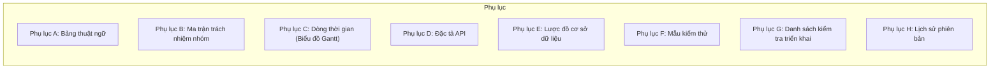
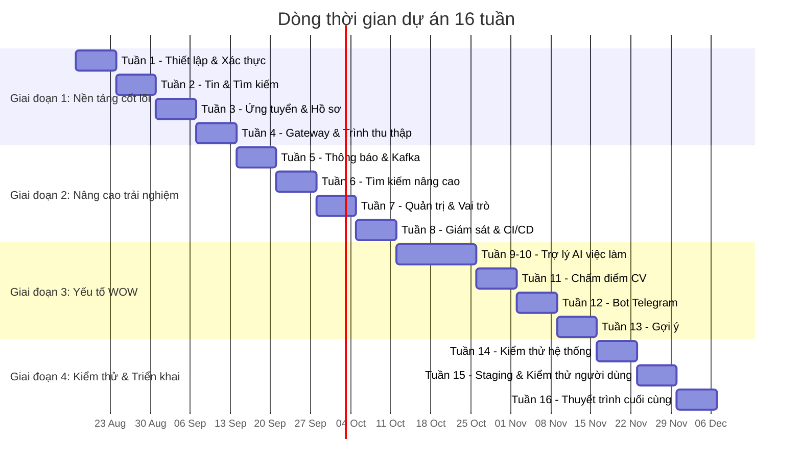

# Đặc tả Yêu cầu Phần mềm (SRS)

[English](../en/10-appendices.md) | [Tiếng Việt](10-appendices.vi.md)

## Nền tảng Việc làm Việt Nam - Kiến trúc Microservices

**Phiên bản:** 1.0  
**Ngày:** 17 tháng 8 năm 2026  
**Dự án:** Nền tảng Việc làm Việt Nam (Vietnam Job Platform)  

---

## Phần 10: Phụ lục

### 10.1 Tổng quan

Phần này chứa thông tin bổ sung hỗ trợ cho nội dung chính của SRS. Các phụ lục cung cấp tài liệu tham khảo chi tiết, bao gồm bảng thuật ngữ, sơ đồ, mẫu và tài liệu bổ sung có thể được tham chiếu xuyên suốt tài liệu.

---

## Phụ lục A: Bảng thuật ngữ

Phụ lục này định nghĩa các thuật ngữ kỹ thuật, từ viết tắt và thuật ngữ chuyên ngành được sử dụng trong toàn bộ SRS.

### A.1 Thuật ngữ kỹ thuật

| Thuật ngữ | Định nghĩa |
|:----------|:-----------|
| **ACID** | Atomicity, Consistency, Isolation, Durability – các thuộc tính đảm bảo giao dịch cơ sở dữ liệu đáng tin cậy |
| **API** | Giao diện lập trình ứng dụng – một tập hợp các quy tắc để xây dựng và tương tác với ứng dụng phần mềm |
| **Circuit Breaker** | Mẫu thiết kế ngăn chặn lỗi lặp lại bằng cách dừng yêu cầu đến dịch vụ đang gặp sự cố |
| **CORS** | Chia sẻ tài nguyên đa nguồn gốc – cơ chế cho phép yêu cầu tài nguyên bị hạn chế từ một tên miền khác |
| **CRUD** | Tạo, Đọc, Cập nhật, Xóa – bốn thao tác cơ bản cho lưu trữ bền vững |
| **DTO** | Đối tượng truyền dữ liệu – một đối tượng mang dữ liệu giữa các tiến trình |
| **Event-Driven Architecture** | Mẫu kiến trúc phần mềm nơi các thành phần hệ thống giao tiếp thông qua sự kiện |
| **FCM** | Firebase Cloud Messaging – giải pháp nhắn tin đa nền tảng cho thông báo đẩy |
| **HPA** | Bộ mở rộng pod tự động theo chiều ngang – tính năng Kubernetes tự động mở rộng bản sao pod |
| **JWT** | JSON Web Token – token nhỏ gọn, an toàn cho URL để truyền thông tin an toàn giữa các bên |
| **KRaft** | Kafka Raft – giao thức đồng thuận mới được sử dụng trong Kafka 4.x, thay thế ZooKeeper |
| **LTS** | Hỗ trợ dài hạn – phiên bản phát hành với hỗ trợ và bảo trì mở rộng |
| **Microservices** | Phong cách kiến trúc cấu trúc ứng dụng như một tập hợp các dịch vụ kết nối lỏng lẻo |
| **Multirepo** | Chiến lược phát triển sử dụng nhiều kho lưu trữ độc lập, mỗi kho chứa một dự án hoặc dịch vụ duy nhất |
| **RAG** | Tạo sinh tăng cường truy xuất – kỹ thuật AI truy xuất tài liệu liên quan để bổ sung phản hồi LLM |
| **RBAC** | Kiểm soát truy cập dựa trên vai trò – phương pháp hạn chế truy cập hệ thống dựa trên vai trò người dùng |
| **REST** | Chuyển trạng thái biểu diễn – một phong cách kiến trúc cho thiết kế ứng dụng mạng |
| **SLA** | Thỏa thuận cấp độ dịch vụ – cam kết duy trì một mức độ dịch vụ nhất định |
| **SPA** | Ứng dụng trang đơn – ứng dụng web tải một trang HTML duy nhất và cập nhật nội dung động |
| **TLS** | Bảo mật tầng giao vận – giao thức mật mã cho giao tiếp an toàn qua mạng |
| **TTL** | Thời gian sống – cơ chế giới hạn tuổi thọ của dữ liệu trong hệ thống |
| **VM** | Máy ảo – mô phỏng dựa trên phần mềm của một máy tính vật lý |
| **WebSocket** | Giao thức truyền thông cung cấp kênh truyền thông song công toàn phần qua một kết nối TCP duy nhất |
| **YARP** | Yet Another Reverse Proxy – thư viện reverse proxy cho .NET |

### A.2 Thuật ngữ miền

| Thuật ngữ | Định nghĩa |
|:----------|:-----------|
| **Ứng viên** | Người tìm việc đã gửi đơn ứng tuyển cho một công việc |
| **Đơn ứng tuyển** | Yêu cầu chính thức được gửi bởi người tìm việc cho một tin tuyển dụng cụ thể |
| **CV / Sơ yếu lý lịch** | Tài liệu tóm tắt trình độ học vấn, kinh nghiệm làm việc và kỹ năng của một người |
| **Tin tuyển dụng** | Vị trí tuyển dụng được đăng với chi tiết về vị trí và yêu cầu |
| **Người tìm việc** | Người dùng tìm kiếm cơ hội việc làm trên nền tảng |
| **Nhà tuyển dụng** | Người dùng đại diện cho công ty đăng tin và quản lý ứng tuyển |
| **Quản trị viên** | Người dùng có đặc quyền nâng cao để quản lý nền tảng |

### A.3 Từ viết tắt

| Từ viết tắt | Dạng đầy đủ |
|:------------|:-----------|
| API | Giao diện lập trình ứng dụng |
| CI/CD | Tích hợp liên tục / Triển khai liên tục |
| CORS | Chia sẻ tài nguyên đa nguồn gốc |
| CRUD | Tạo, Đọc, Cập nhật, Xóa |
| DTO | Đối tượng truyền dữ liệu |
| FCM | Firebase Cloud Messaging |
| HPA | Bộ mở rộng pod tự động theo chiều ngang |
| JWT | JSON Web Token |
| K8s | Kubernetes |
| LLM | Mô hình ngôn ngữ lớn |
| LTS | Hỗ trợ dài hạn |
| ORM | Ánh xạ đối tượng-quan hệ |
| QA | Đảm bảo chất lượng |
| RAG | Tạo sinh tăng cường truy xuất |
| RBAC | Kiểm soát truy cập dựa trên vai trò |
| REST | Chuyển trạng thái biểu diễn |
| SPA | Ứng dụng trang đơn |
| SRS | Đặc tả yêu cầu phần mềm |
| TLS | Bảo mật tầng giao vận |
| TTL | Thời gian sống |
| UI | Giao diện người dùng |
| UX | Trải nghiệm người dùng |
| VM | Máy ảo |
| WOW | Yếu tố gây ấn tượng (điểm thưởng) |
| YARP | Yet Another Reverse Proxy |

---

## Phụ lục B: Ma trận trách nhiệm nhóm

Phụ lục này cung cấp phân tích chi tiết về trách nhiệm của từng thành viên nhóm trong suốt dự án 16 tuần.

### B.1 Tổng quan thành viên nhóm

| Mã | Thành viên | Vai trò | Kỹ năng chính | Trách nhiệm |
|:---|:-----------|:--------|:--------------|:------------|
| **TM1** | **Nguyễn Văn Hoài** | Trưởng nhóm Backend + DevOps | Phát triển backend, DevOps, Hạ tầng | Dịch vụ Xác thực, API Gateway, Docker, Kafka, CI/CD, Giám sát, Triển khai |
| **TM2** | **Nguyễn Chí Thanh** | Backend + Tìm kiếm + AI | Backend, Tìm kiếm, Dữ liệu, AI | Dịch vụ Tin, Dịch vụ Tìm kiếm, Trình thu thập, Elasticsearch, Dịch vụ AI |
| **TM3** | **Nguyễn Chí Bảo** | Frontend Web (React) | React, TypeScript, UI/UX | Ứng dụng web, Bảng quản trị, Tích hợp API, UI/UX |
| **TM4** | **Phạm Minh Khoa** | Di động (Flutter) + QA | Flutter, Di động, Kiểm thử | Ứng dụng di động, Thông báo đẩy, Kiểm thử, Theo dõi lỗi |

### B.2 Ma trận phân công hàng tuần

| Tuần | TM1 – Nguyễn Văn Hoài | TM2 – Nguyễn Chí Thanh | TM3 – Nguyễn Chí Bảo | TM4 – Phạm Minh Khoa |
|:-----|:----|:----|:----|:----|
| 1 | Docker Compose, Dịch vụ Xác thực, JWT | Lược đồ dữ liệu, Thiết lập trình thu thập, Thu thập lần đầu | Thiết lập React + Vite, Đăng nhập/Đăng ký | Thiết lập Flutter, Theme, Đăng nhập/Đăng ký |
| 2 | Cấu hình Kafka, Dịch vụ Tin | Dịch vụ Tìm kiếm, Thu thập 200+ tin | Danh sách việc làm, Chi tiết việc làm, Phân trang | Danh sách việc làm, Chi tiết việc làm, Form ứng tuyển |
| 3 | Lưu trữ Tệp, Dịch vụ Ứng tuyển | Dịch vụ Hồ sơ, Trạng thái ứng tuyển | Tải CV lên, Trang hồ sơ | Tải CV lên, Hồ sơ, Lịch sử |
| 4 | API Gateway, CI/CD | Trình thu thập (500+ tin), Đồng bộ tìm kiếm | API qua Gateway, Bảng quản trị | Di động qua Gateway, Thông báo |
| 5 | Dịch vụ Thông báo, Sự kiện Kafka | Người tiêu dùng sự kiện, Tối ưu tìm kiếm | Thông báo trong ứng dụng, UI/UX | Thông báo đẩy, UI/UX |
| 6 | Redis cache, Giám sát | Tìm kiếm nâng cao, Phân tích | Giao diện tìm kiếm, Bảng điều khiển quản trị | Bộ lọc tìm kiếm, Hiệu năng |
| 7 | Phân quyền theo vai trò, Bảo mật | API Quản trị, Kiểm thử | Giao diện Quản trị, Biểu đồ | Chế độ tối, Khả năng tiếp cận |
| 8 | Cấu hình sản phẩm, Triển khai | Tối ưu hiệu năng | Bản dựng sản phẩm, SEO | Bản dựng phát hành, Kích thước ứng dụng |
| 9 | Tích hợp API AI | Thiết lập Dịch vụ AI, Đường ống RAG | Giao diện Chat (chuẩn bị) | Màn hình Chat (chuẩn bị) |
| 10 | Hỗ trợ AI | Tối ưu RAG, API Chat | Giao diện Chat, Ngữ cảnh | Màn hình Chat, Luồng |
| 11 | Bot Telegram | API Chấm điểm CV, Phân tích PDF | Giao diện Chấm điểm, Gợi ý | Màn hình Chấm điểm, Gợi ý |
| 12 | Kubernetes (tùy chọn) | Tìm kiếm Vector (tùy chọn) | Giao diện Gợi ý | Màn hình Gợi ý |
| 13 | Kiểm thử hiệu năng | Sửa lỗi | Hoàn thiện UI | Sửa lỗi, Hoàn thiện |
| 14 | Kiểm thử tích hợp | Kiểm thử hiệu năng | Kiểm thử đa trình duyệt | Kiểm thử di động (iOS/Android) |
| 15 | Triển khai staging | Đồng bộ dữ liệu | Phản hồi kiểm thử người dùng | Nộp lên App Store |
| 16 | Báo cáo cuối cùng, Thuyết trình | Tài liệu, Sửa lỗi | Video demo, Slide | Video demo, Slide |

### B.3 Kế hoạch phát triển kỹ năng

| Thành viên | Kỹ năng cần học | Tài nguyên |
|:-----------|:----------------|:-----------|
| **TM1 – Nguyễn Văn Hoài** | .NET 10 LTS, YARP, Docker, Kafka, Kubernetes | Tài liệu .NET, Tài liệu Docker |
| **TM2 – Nguyễn Chí Thanh** | .NET 10 LTS, Elasticsearch, Scrapy, AI/LangChain | Hướng dẫn Elasticsearch, Hướng dẫn Scrapy |
| **TM3 – Nguyễn Chí Bảo** | React 19, Vite, Tailwind, React Query | Tài liệu React, Hướng dẫn Vite |
| **TM4 – Phạm Minh Khoa** | Flutter, Firebase, Thông báo đẩy | Tài liệu Flutter, Hướng dẫn Firebase |

---

## Phụ lục C: Dòng thời gian (Biểu đồ Gantt)

Phụ lục này cung cấp biểu diễn trực quan về dòng thời gian dự án 16 tuần.

### C.1 Tóm tắt các mốc quan trọng

| Mốc | Tuần | Mô tả | Kết quả bàn giao |
|:----|:-----|:------|:-----------------|
| M1 | 4 | Hoàn thành Giai đoạn 1 | 100% tính năng BẮT BUỘC PHẢI CÓ hoàn thành |
| M2 | 8 | Hoàn thành Giai đoạn 2 | 100% tính năng NÊN CÓ hoàn thành |
| M3 | 10 | Hoàn thành Trợ lý AI | Chatbot hoạt động |
| M4 | 13 | Hoàn thành Giai đoạn 3 | Các tính năng WOW được triển khai |
| M5 | 14 | Hoàn thành Kiểm thử | Báo cáo kiểm thử được giao |
| M6 | 15 | Staging trực tiếp | Hoàn thành kiểm thử người dùng |
| M7 | 16 | Hoàn thành Dự án | Thuyết trình cuối cùng và báo cáo |

---

## Phụ lục D: Đặc tả API

Phụ lục này cung cấp đặc tả API cho tất cả dịch vụ. Tài liệu OpenAPI/Swagger đầy đủ sẽ được tạo trong quá trình phát triển.

### D.1 Tóm tắt điểm cuối API

| Dịch vụ | Điểm cuối | Phương thức | Mô tả | Mức độ ưu tiên |
|:--------|:----------|:------------|:------|:---------------|
| **Xác thực** | `/api/auth/register` | POST | Đăng ký người dùng | BẮT BUỘC |
| **Xác thực** | `/api/auth/login` | POST | Đăng nhập người dùng | BẮT BUỘC |
| **Xác thực** | `/api/auth/refresh` | POST | Làm mới token JWT | BẮT BUỘC |
| **Xác thực** | `/api/auth/logout` | POST | Đăng xuất người dùng | BẮT BUỘC |
| **Xác thực** | `/api/auth/me` | GET | Hồ sơ người dùng hiện tại | BẮT BUỘC |
| **Xác thực** | `/api/auth/forgot-password` | POST | Yêu cầu đặt lại mật khẩu (TTL 15 phút, one-time, rate-limit 5/IP/giờ) | BẮT BUỘC |
| **Xác thực** | `/api/auth/reset-password` | POST | Đặt lại mật khẩu bằng token | BẮT BUỘC |
| **Công ty** | `/api/companies` | POST | Tạo Company | BẮT BUỘC |
| **Công ty** | `/api/companies/{id}` | GET | Chi tiết Company | BẮT BUỘC |
| **Công ty** | `/api/companies` | GET | Danh sách / tìm kiếm Company | BẮT BUỘC |
| **Tin** | `/api/jobs` | POST | Tạo tin | BẮT BUỘC |
| **Tin** | `/api/jobs/recruiter` | GET | Lấy tin của nhà tuyển dụng | BẮT BUỘC |
| **Tin** | `/api/jobs/{id}` | PUT | Cập nhật tin | BẮT BUỘC |
| **Tin** | `/api/jobs/{id}` | DELETE | Xóa tin | BẮT BUỘC |
| **Tin** | `/api/jobs/{id}` | GET | Lấy chi tiết tin | BẮT BUỘC |
| **Tin** | `/api/categories` | GET | Lấy danh mục tin | BẮT BUỘC |
| **Tìm kiếm** | `/api/search/jobs` | GET | Tìm kiếm tin | BẮT BUỘC |
| **Tìm kiếm** | `/api/search/suggest` | GET | Gợi ý tự động hoàn thành | BẮT BUỘC |
| **Ứng tuyển** | `/api/applications` | POST | Ứng tuyển | BẮT BUỘC |
| **Ứng tuyển** | `/api/applications/me` | GET | Lịch sử của ứng viên | BẮT BUỘC |
| **Ứng tuyển** | `/api/applications/{id}` | GET | Chi tiết ứng tuyển | BẮT BUỘC |
| **Ứng tuyển** | `/api/applications/job/{jobId}` | GET | Ứng tuyển theo công việc (nhà tuyển dụng) | BẮT BUỘC |
| **Ứng tuyển** | `/api/applications/{id}/status` | PUT | Cập nhật trạng thái ứng tuyển | BẮT BUỘC |
| **Hồ sơ** | `/api/profile` | PUT | Cập nhật hồ sơ | BẮT BUỘC |
| **Hồ sơ** | `/api/profile/me` | GET | Lấy hồ sơ | BẮT BUỘC |
| **Hồ sơ** | `/api/profile/{userId}` | GET | Lấy hồ sơ công khai | BẮT BUỘC |
| **Hồ sơ** | `/api/profile/skills` | POST | Thêm kỹ năng | BẮT BUỘC |
| **Hồ sơ** | `/api/profile/experience` | POST | Thêm kinh nghiệm làm việc | BẮT BUỘC |
| **Hồ sơ** | `/api/profile/education` | POST | Thêm giáo dục | BẮT BUỘC |
| **Thông báo** | `/api/notifications/history` | GET | Lịch sử thông báo | NÊN CÓ |
| **Quản trị** | `/api/admin/users` | GET | Quản lý người dùng | NÊN CÓ |
| **Quản trị** | `/api/admin/jobs/pending` | GET | Tin đang chờ | NÊN CÓ |
| **Quản trị** | `/api/admin/categories` | POST | Tạo danh mục | NÊN CÓ |
| **Quản trị** | `/api/admin/statistics` | GET | Thống kê nền tảng | NÊN CÓ |
| **Quản trị** | `/api/admin/health` | GET | Sức khỏe hệ thống | NÊN CÓ |
| **AI** | `/api/ai/chat` | POST | Chatbot AI (context 20 tin / 8000 token, stream, 512 tokens, 20 req/h) | TỐT NÊN CÓ |
| **AI** | `/api/ai/session` | POST | Tạo phiên chat | TỐT NÊN CÓ |
| **AI** | `/api/ai/session/{sessionId}` | DELETE | Xóa phiên chat | TỐT NÊN CÓ |
| **AI** | `/api/ai/session/{sessionId}/history` | GET | Lịch sử phiên | TỐT NÊN CÓ |
| **AI** | `/api/ai/score-resume` | POST | Chấm điểm CV | TỐT NÊN CÓ |
| **Trình thu thập** | `/api/crawler/trigger` | POST | Kích hoạt crawl thủ công (Admin) | BẮT BUỘC |
| **Trình thu thập** | `/api/crawler/status` | GET | Trạng thái crawl + lỗi fallback | BẮT BUỘC |

---

## Phụ lục E: Lược đồ cơ sở dữ liệu

Phụ lục này cung cấp lược đồ cơ sở dữ liệu cho tất cả dịch vụ theo mô hình mỗi dịch vụ một cơ sở dữ liệu.

### E.1 Cơ sở dữ liệu Xác thực (auth_db)

| Bảng | Cột | Mô tả |
|:-----|:----|:------|
| **users** | id (UUID, PK), email (unique), password_hash, full_name, role, company_id (FK → companies.id, nullable, chỉ Recruiter), is_active, created_at, updated_at | Thông tin tài khoản người dùng; Recruiter thuộc một Company |
| **refresh_tokens** | id (UUID, PK), user_id (FK), token_hash (SHA-256, unique), expiry_date (TTL tuyệt đối 7 ngày, 30 ngày nếu rememberMe, indexed), is_revoked, created_at | Refresh tokens cho cơ chế làm mới JWT; purge cron hàng ngày |
| **password_reset_tokens** | id (UUID, PK), user_id (FK), token_hash (SHA-256, unique), expiry_date (TTL 15 phút, indexed), is_used, created_at | Token đặt lại mật khẩu (one-time) |
| **companies** | id (UUID, PK), name (unique), tax_code (unique, nullable), verified (bool, default false), logo_url, website, description, address, industry, size, created_at, updated_at | Hồ sơ Company; một Company có nhiều Users và nhiều Jobs |

### E.2 Cơ sở dữ liệu Tin (job_db)

| Bảng | Cột | Mô tả |
|:-----|:----|:------|
| **categories** | id (UUID, PK), name (unique), description, created_at | Danh mục tin tuyển dụng |
| **companies** | id (UUID, PK), name (unique), tax_code (unique, nullable), verified (bool, default false), logo_url, website, description, address, industry, size, created_at, updated_at | Hồ sơ Company (chuẩn hóa, thay free-text company) |
| **jobs** | id (UUID, PK), title, description, company_id (FK → companies.id), location, salary_min, salary_max, salary_currency, category_id (FK), requirements, benefits, employment_type, experience_level, recruiter_id, status, view_count, created_at, updated_at | Tin tuyển dụng; `company` free-text deprecated → thay bằng `company_id` |
| **saved_jobs** | id (UUID, PK), user_id, job_id (FK), saved_at | Tin được người dùng lưu |

### E.3 Cơ sở dữ liệu Ứng tuyển (app_db)

| Bảng | Cột | Mô tả |
|:-----|:----|:------|
| **applications** | id (UUID, PK), job_id, applicant_id, cover_letter, cv_url, status, recruiter_notes, score, created_at, updated_at | Đơn ứng tuyển |
| **status_history** | id (UUID, PK), application_id (FK), status, note, changed_by, changed_at | Lịch sử thay đổi trạng thái ứng tuyển |

### E.4 Cơ sở dữ liệu Hồ sơ (profile_db)

| Bảng | Cột | Mô tả |
|:-----|:----|:------|
| **profiles** | id (UUID, PK), user_id (unique), full_name, phone, address, headline, summary, avatar_url, date_of_birth, created_at, updated_at | Hồ sơ người dùng |
| **skills** | id (UUID, PK), profile_id (FK), name, proficiency (1-5), years_of_experience, created_at, updated_at | Kỹ năng của người dùng |
| **work_experience** | id (UUID, PK), profile_id (FK), company, title, start_date, end_date, is_current, description, created_at, updated_at | Kinh nghiệm làm việc |
| **education** | id (UUID, PK), profile_id (FK), institution, degree, field, start_date, end_date, grade, created_at, updated_at | Lịch sử giáo dục |

### E.5 Cơ sở dữ liệu Thông báo (notif_db)

| Bảng | Cột | Mô tả |
|:-----|:----|:------|
| **notifications** | id (UUID, PK), user_id, type, channel, subject, body, status, sent_at, error_message, created_at | Bản ghi thông báo |
| **email_logs** | id (UUID, PK), recipient_email, subject, template_name, status, sent_at, error_message, created_at | Nhật ký gửi email |
| **user_preferences** | id (UUID, PK), user_id (unique), email_notifications_enabled, marketing_emails_enabled, created_at, updated_at | Tùy chọn thông báo của người dùng |

---

## Phụ lục F: Mẫu kiểm thử

Phụ lục này cung cấp mẫu cho các ca kiểm thử và báo cáo kiểm thử.

### F.1 Mẫu ca kiểm thử

| Trường | Mô tả | Ví dụ |
|:-------|:------|:------|
| **ID kiểm thử** | Định danh duy nhất | TC-AUTH-001 |
| **ID yêu cầu** | Yêu cầu liên kết | AUTH-01-02 |
| **Mô tả kiểm thử** | Những gì đang được kiểm thử | Đăng nhập người dùng với thông tin đăng nhập hợp lệ |
| **Điều kiện tiên quyết** | Thiết lập cần thiết | Tài khoản người dùng tồn tại |
| **Các bước kiểm thử** | Hướng dẫn từng bước | 1. Điều hướng đến trang đăng nhập 2. Nhập email hợp lệ 3. Nhập mật khẩu hợp lệ 4. Nhấp gửi |
| **Kết quả dự kiến** | Kết quả dự kiến | Người dùng được chuyển hướng đến bảng điều khiển, nhận được JWT |
| **Kết quả thực tế** | Kết quả quan sát được | Đạt/Không đạt |
| **Trạng thái** | Đạt/Không đạt/Bị chặn | Đạt |
| **Nhận xét** | Ghi chú bổ sung | - |

### F.2 Mẫu báo cáo kiểm thử

| Phần | Nội dung |
|:-----|:---------|
| **Dự án** | Nền tảng Việc làm Việt Nam |
| **Ngày kiểm thử** | Tuần 14 (Tháng 11 năm 2026) |
| **Người kiểm thử** | Tên nhóm |
| **Tổng số ca kiểm thử** | Số ca kiểm thử đã thực hiện |
| **Đạt** | Số ca đạt |
| **Không đạt** | Số ca không đạt |
| **Bị chặn** | Số ca bị chặn |
| **Tỷ lệ đạt** | Phần trăm (đạt / tổng * 100) |
| **Tóm tắt** | Mô tả ngắn gọn về kết quả kiểm thử |
| **Vấn đề nghiêm trọng** | Danh sách lỗi nghiêm trọng |
| **Khuyến nghị** | Hành động cải thiện |

---

## Phụ lục G: Danh sách kiểm tra triển khai

Phụ lục này cung cấp danh sách kiểm tra cho triển khai staging và sản phẩm.

### G.1 Danh sách kiểm tra triển khai Staging

| Nhiệm vụ | Trạng thái | Người phụ trách |
|:---------|:-----------|:----------------|
| Tất cả dịch vụ được xây dựng thành công | [ ] | CI/CD |
| Tất cả kiểm thử đơn vị đạt | [ ] | CI/CD |
| Hình ảnh Docker được xây dựng và gắn thẻ | [ ] | CI/CD |
| Hình ảnh được đẩy lên registry | [ ] | CI/CD |
| Môi trường staging được cung cấp | [ ] | TM1 |
| Dịch vụ được triển khai lên staging | [ ] | TM1 |
| Migration cơ sở dữ liệu được áp dụng | [ ] | TM1 |
| Chỉ mục tìm kiếm được tạo | [ ] | TM2 |
| Dữ liệu mẫu được tải | [ ] | TM2 |
| Kiểm thử khói đạt | [ ] | Tất cả |
| Kiểm tra sức khỏe đạt | [ ] | TM1 |
| Giám sát được cấu hình | [ ] | TM1 |
| Ghi nhật ký được bật | [ ] | TM1 |
| Tài liệu API được cập nhật | [ ] | TM2 |
| Kiểm thử người dùng được bắt đầu | [ ] | Tất cả |

### G.2 Danh sách kiểm tra triển khai Sản phẩm

| Nhiệm vụ | Trạng thái | Người phụ trách |
|:---------|:-----------|:----------------|
| Xác nhận staging hoàn tất | [ ] | Tất cả |
| Môi trường sản phẩm được cung cấp | [ ] | TM1 |
| Sao lưu cơ sở dữ liệu được tạo (nếu có) | [ ] | TM1 |
| Dịch vụ được triển khai lên sản phẩm | [ ] | TM1 |
| Migration cơ sở dữ liệu được áp dụng | [ ] | TM1 |
| Chỉ mục tìm kiếm được đồng bộ | [ ] | TM2 |
| SSL/TLS được cấu hình | [ ] | TM1 |
| Tên miền được trỏ đến sản phẩm | [ ] | TM1 |
| Kiểm tra sức khỏe đạt | [ ] | TM1 |
| Giám sát hoạt động | [ ] | TM1 |
| Ghi nhật ký được cấu hình | [ ] | TM1 |
| Đường ống CI/CD được cấu hình cho sản phẩm | [ ] | TM1 |
| Kế hoạch quay lại được ghi lại | [ ] | TM1 |

### G.3 Danh sách kiểm tra quay lại

| Bước | Mô tả | Người phụ trách |
|:-----|:------|:----------------|
| 1 | Xác định vấn đề và mức độ nghiêm trọng | Tất cả |
| 2 | Thông báo cho nhóm và các bên liên quan | TM1 |
| 3 | Quay lại phiên bản trước | TM1 |
| 4 | Xác minh sức khỏe dịch vụ | TM1 |
| 5 | Xác thực tính toàn vẹn dữ liệu | TM2 |
| 6 | Giám sát để giải quyết | TM1 |
| 7 | Ghi lại sự cố | Tất cả |

---

## Phụ lục H: Lịch sử phiên bản

Phụ lục này theo dõi tất cả các bản sửa đổi đã thực hiện đối với tài liệu SRS.

| Phiên bản | Ngày | Tác giả | Thay đổi | Trạng thái |
|:----------|:-----|:--------|:---------|:-----------|
| 1.0 | 2026-08-17 | Nhóm phát triển | Phiên bản đầu tiên được tạo | Bản nháp |
| 1.1 | 2026-08-17 | Nhóm phát triển | Sửa đổi Phần 1-2 để loại bỏ tham chiếu công nghệ cụ thể | Bản nháp |
| 1.2 | 2026-08-17 | Nhóm phát triển | Sửa đổi Phần 3 để loại bỏ mã triển khai | Bản nháp |
| 1.3 | 2026-08-17 | Nhóm phát triển | Thêm Phần 4-10 | Bản nháp |

### H.1 Nhật ký thay đổi

| ID thay đổi | Ngày | Mô tả | Phần bị ảnh hưởng |
|:------------|:-----|:------|:------------------|
| CHG-001 | 2026-08-17 | Loại bỏ tham chiếu công nghệ cụ thể khỏi phạm vi sản phẩm | 1.4.1 |
| CHG-002 | 2026-08-17 | Loại bỏ khối mã YAML/JSON khỏi yêu cầu | 3.2-3.13 |
| CHG-003 | 2026-08-17 | Thay thế script SQL bằng mô tả mô hình dữ liệu | 3.2-3.6 |
| CHG-004 | 2026-08-17 | Loại bỏ tên công nghệ khỏi sơ đồ kiến trúc | 2.1.2 |
| CHG-005 | 2026-08-17 | Thêm tham chiếu đến Phần 9 cho hạ tầng không chi phí | 2.4.3 |
| CHG-006 | 2026-08-17 | Thêm Đăng nhập mạng xã hội như user story Tốt nên có | 2.6.3 |

---

**Hết Phần 10**

---

## Tài liệu SRS hoàn chỉnh

Đây là phần kết thúc của Đặc tả Yêu cầu Phần mềm cho Nền tảng Việc làm Việt Nam. Tài liệu được tổ chức thành 10 phần:

| Phần | Tiêu đề | Trạng thái |
|:-----|:--------|:-----------|
| 1 | Giới thiệu | Hoàn chỉnh |
| 2 | Mô tả tổng quan | Hoàn chỉnh |
| 3 | Yêu cầu chức năng - BẮT BUỘC PHẢI CÓ | Hoàn chỉnh |
| 4 | Yêu cầu chức năng - NÊN CÓ | Hoàn chỉnh |
| 5 | Yêu cầu chức năng - TỐT NÊN CÓ | Hoàn chỉnh |
| 6 | Yêu cầu phi chức năng | Hoàn chỉnh |
| 7 | Yêu cầu giao diện bên ngoài | Hoàn chỉnh |
| 8 | Kiến trúc hệ thống | Hoàn chỉnh |
| 9 | Hạ tầng và Phân tích chi phí | Hoàn chỉnh |
| 10 | Phụ lục | Hoàn chỉnh |

---

**Thông tin tài liệu:**

| Thuộc tính | Giá trị |
|:-----------|:--------|
| **Tiêu đề tài liệu** | Đặc tả Yêu cầu Phần mềm - Nền tảng Việc làm Việt Nam |
| **Phiên bản** | 1.0 |
| **Ngày** | 17 tháng 8 năm 2026 |
| **Dự án** | Nền tảng Việc làm Việt Nam (Vietnam Job Platform) |
| **Thời gian dự án** | 16 tuần (17 tháng 8 - 6 tháng 12 năm 2026) |
| **Quy mô nhóm** | 4 thành viên (TM1-TM4) |
| **Trạng thái tài liệu** | Bản nháp (Sẵn sàng để xem xét) |