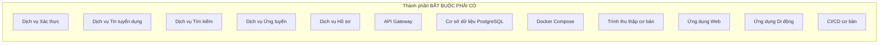
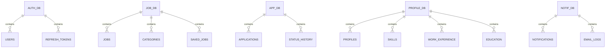
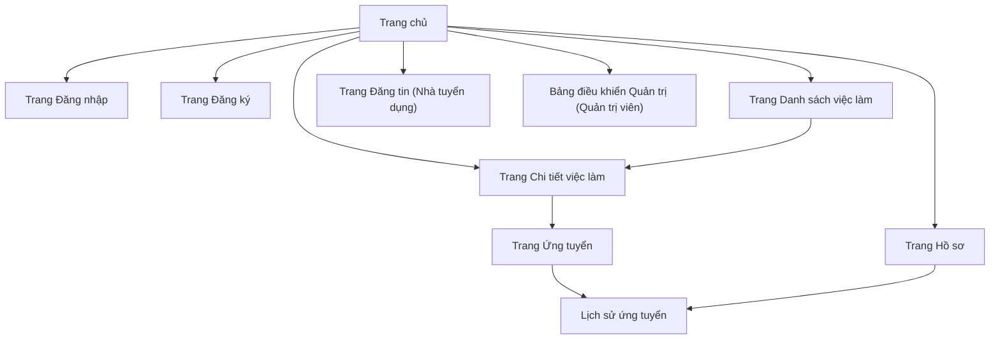
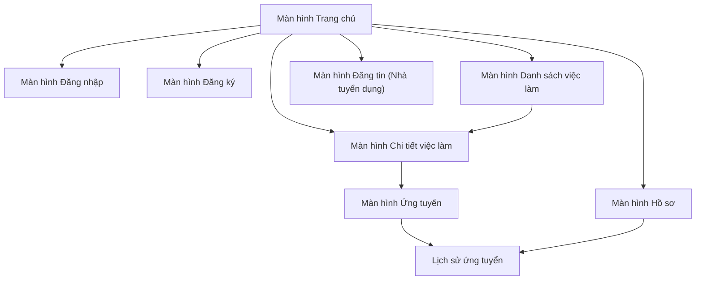
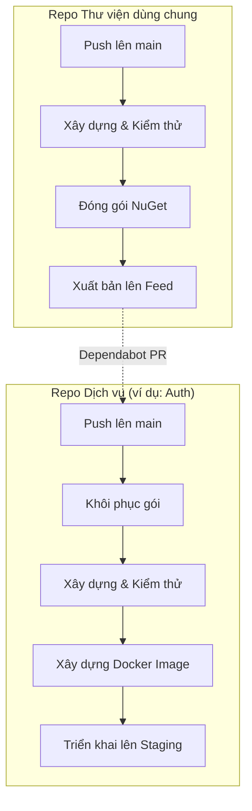

# Đặc tả Yêu cầu Phần mềm (SRS)

[English](../en/3-must-have-fr.md) | [Tiếng Việt](3-must-have-fr.vi.md)

## Nền tảng Việc làm Việt Nam - Microservices với .NET + Multirepo

**Phiên bản:** 1.0  
**Ngày:** 17 tháng 8 năm 2026  
**Dự án:** Nền tảng Việc làm Việt Nam (Vietnam Job Platform)  

---

## Phần 3: Yêu cầu chức năng - BẮT BUỘC PHẢI CÓ

### 3.1 Tổng quan

Phần này ghi lại tất cả các yêu cầu chức năng **BẮT BUỘC PHẢI CÓ**. Các tính năng này là thiết yếu để hệ thống được coi là hoạt động và phải ổn định 100% vào cuối Tuần 4. Mỗi yêu cầu đều có thể truy xuất đến Kế hoạch tổng thể và bao gồm các tiêu chí chấp nhận để xác nhận.

Các tính năng BẮT BUỘC PHẢI CÓ được tổ chức thành 12 thành phần cốt lõi:

---

### 3.2 Dịch vụ Xác thực

**ID thành phần:** AUTH-01  
**Mức độ ưu tiên:** BẮT BUỘC PHẢI CÓ  
**Người phụ trách:** TM1  
**Tuần mục tiêu:** Tuần 1  

#### 3.2.1 Mô tả

Dịch vụ Xác thực quản lý danh tính người dùng, đăng ký, đăng nhập và quản lý phiên sử dụng xác thực dựa trên token (JWT). Nó cung cấp kiểm soát truy cập dựa trên vai trò (Người dùng, Nhà tuyển dụng) và bảo mật tất cả các lệnh gọi API tiếp theo.

#### 3.2.2 Yêu cầu chức năng

| ID | Yêu cầu | Tiêu chí chấp nhận |
|:---|:--------|:-------------------|
| AUTH-01-01 | Hệ thống cho phép người dùng đăng ký với email, mật khẩu và thông tin hồ sơ cơ bản | - Điểm cuối đăng ký: `POST /api/auth/register` - Định dạng email được xác thực - Độ mạnh mật khẩu được thực thi (tối thiểu 8 ký tự, ít nhất 1 số, 1 chữ hoa) - Dữ liệu người dùng được lưu vào cơ sở dữ liệu với mật khẩu đã băm |
| AUTH-01-02 | Hệ thống cho phép người dùng đăng nhập với email và mật khẩu | - Điểm cuối đăng nhập: `POST /api/auth/login` - Trả về access token và refresh token - Thông tin đăng nhập không hợp lệ trả về 401 Unauthorised |
| AUTH-01-03 | Hệ thống cấp access token với thời gian hiệu lực giới hạn | - Access token có hiệu lực trong 1 giờ - Token chứa user ID, email và các claim về vai trò - Token được ký mã hóa bằng mật mã |
| AUTH-01-04 | Hệ thống hỗ trợ cơ chế làm mới token có thời hạn xác định | - Điểm cuối làm mới: `POST /api/auth/refresh` - Refresh token có hiệu lực **7 ngày** kể từ khi cấp (có thể cấu hình qua `REFRESH_TOKEN_TTL_DAYS`); nếu chọn “Ghi nhớ đăng nhập” → **30 ngày** (`REFRESH_TOKEN_REMEMBER_ME_TTL_DAYS`) - Refresh token được lưu dạng **hash SHA-256** với `expiry_date` (TTL tuyệt đối, không sliding) và `is_revoked`, index trên `expiry_date`, purge cron hàng ngày - Refresh token cũ bị vô hiệu hóa khi sử dụng (rotation); phát hiện reuse → thu hồi cả family và yêu cầu đăng nhập lại - Hết hạn → `401 Unauthorized` và yêu cầu đăng nhập lại; cặp token mới được trả về khi hợp lệ |
| AUTH-01-05 | Hệ thống hỗ trợ đăng xuất (vô hiệu hóa token) | - Điểm cuối đăng xuất: `POST /api/auth/logout` - Refresh token bị vô hiệu hóa - Access token vẫn có hiệu lực cho đến khi hết hạn (không blocklist; TTL ngắn 1 giờ) |
| AUTH-01-06 | Hệ thống gán vai trò và liên kết Company trong quá trình đăng ký | - Trường vai trò trong form đăng ký - Vai trò mặc định = Người dùng - Vai trò Nhà tuyển dụng yêu cầu `companyId` (FK → Company); nếu chưa có Company, client tạo trước qua `POST /api/companies` hoặc gửi `companyName` (deprecated) để server tự tạo Company |
| AUTH-01-07 | Hệ thống cho phép yêu cầu đặt lại mật khẩu qua email | - Điểm cuối: `POST /api/auth/forgot-password { email }` - Nếu email tồn tại, tạo reset_token (UUID), lưu **hash SHA-256** + `expiry_date` = 15 phút, `is_used=false` - Gửi email chứa link `{WEB_URL}/reset-password?token=...` (TTL 15 phút, one-time) - Luôn trả `200 OK` kể cả khi email không tồn tại (chống enumeration) - Rate-limit: 5 yêu cầu / IP / giờ |
| AUTH-01-08 | Hệ thống cho phép đặt lại mật khẩu bằng token | - Điểm cuối: `POST /api/auth/reset-password { token, newPassword }` - Token phải hợp lệ, chưa hết hạn, chưa dùng - `newPassword` phải thỏa mãn độ mạnh như AUTH-01-01 - Vô hiệu hóa token sau khi dùng (`is_used=true`), **thu hồi tất cả refresh tokens** của user (bắt đăng nhập lại trên thiết bị khác) - Trả về `200 OK` + hướng dẫn đăng nhập lại |

#### 3.2.3 Đặc tả API

| Điểm cuối | Phương thức | Body yêu cầu | Phản hồi | Quy tắc xác thực |
|:----------|:------------|:-------------|:---------|:-----------------|
| `/api/auth/register` | POST | `{ email, password, fullName, role, companyId?, companyName? (deprecated) }` | `{ userId, message }` | Email phải là duy nhất; mật khẩu đáp ứng yêu cầu độ mạnh; vai trò phải hợp lệ; nếu `role=Recruiter` phải có `companyId` hoặc `companyName`; `companyId` ưu tiên |
| `/api/auth/login` | POST | `{ email, password, rememberMe? }` | `{ accessToken, refreshToken, user }` | Thông tin đăng nhập phải khớp; tài khoản phải đang hoạt động; `rememberMe` quyết định TTL refresh (7 vs 30 ngày) |
| `/api/auth/refresh` | POST | `{ refreshToken }` | `{ accessToken, refreshToken }` | Token phải hợp lệ, chưa hết hạn (7/30 ngày) và chưa bị thu hồi; reuse → thu hồi family |
| `/api/auth/logout` | POST | `{ refreshToken }` | `{ message }` | Token phải hợp lệ và chưa bị thu hồi |
| `/api/auth/me` | GET | (Bearer Token) | `{ user }` | Token phải hợp lệ; trả về hồ sơ người dùng |
| `/api/auth/forgot-password` | POST | `{ email }` | `{ message }` | Luôn 200 OK; rate-limit 5/IP/giờ |
| `/api/auth/reset-password` | POST | `{ token, newPassword }` | `{ message }` | Token hợp lệ, chưa hết hạn (15 phút), chưa dùng; mật khẩu đạt độ mạnh |
| `/api/companies` | POST | `{ name, tax_code?, website?, description?, logo_url?, address?, industry?, size? }` | `{ id, message }` | Yêu cầu vai trò Nhà tuyển dụng hoặc Quản trị viên; `name` duy nhất; `tax_code` duy nhất nếu có |
| `/api/companies/{id}` | GET | - | CompanyDetailDTO | Public; id hợp lệ |
| `/api/companies` | GET | Query: `q, page, size` | Paginated `[Company]` | Public |

#### 3.2.4 Mô hình dữ liệu

| Thực thể | Thuộc tính bắt buộc | Quan hệ |
|:---------|:--------------------|:--------|
| User | id, email (duy nhất), password_hash, full_name, role, is_active, company_id (FK nullable, chỉ Recruiter), created_at, updated_at | Một User có nhiều Refresh Tokens; Một User (Recruiter) thuộc về một Company |
| Refresh Token | id, token_hash (duy nhất, SHA-256), user_id, expiry_date (TTL tuyệt đối 7 ngày, 30 ngày nếu rememberMe), is_revoked, created_at | Nhiều Refresh Tokens thuộc về một User |
| Password Reset Token | id, user_id (FK), token_hash (SHA-256, duy nhất), expiry_date (TTL 15 phút), is_used, created_at | Nhiều Password Reset Tokens thuộc về một User |
| Company | id, name (duy nhất), tax_code (duy nhất, nullable), verified (bool, mặc định false), logo_url, website, description, address, industry, size, created_at, updated_at | Một Company có nhiều Users (Recruiters); Một Company có nhiều Jobs |

---

### 3.3 Dịch vụ Tin tuyển dụng

**ID thành phần:** JOB-01  
**Mức độ ưu tiên:** BẮT BUỘC PHẢI CÓ  
**Người phụ trách:** TM2  
**Tuần mục tiêu:** Tuần 2  

#### 3.3.1 Mô tả

Dịch vụ Tin tuyển dụng cung cấp các thao tác CRUD cho tin tuyển dụng và quản lý danh mục. Đây là thành phần nghiệp vụ cốt lõi của nền tảng, cho phép nhà tuyển dụng đăng tin và người tìm việc tìm đến các cơ hội việc làm.

#### 3.3.2 Yêu cầu chức năng

| ID | Yêu cầu | Tiêu chí chấp nhận |
|:---|:--------|:-------------------|
| JOB-01-01 | Hệ thống cho phép Nhà tuyển dụng tạo tin tuyển dụng gắn với Company | - Điểm cuối tạo: `POST /api/jobs` - Các trường bắt buộc: title, description, company_id (FK), location, salary range, category, requirements - Tin tuyển dụng được lưu vào cơ sở dữ liệu với status = 'pending' hoặc 'active' và `company_id` tham chiếu Company đã xác minh |
| JOB-01-02 | Hệ thống cho phép Nhà tuyển dụng xem tin tuyển dụng của chính họ | - Điểm cuối xem tin của nhà tuyển dụng: `GET /api/jobs/recruiter` - Hỗ trợ phân trang (page, size) - Lọc theo trạng thái |
| JOB-01-03 | Hệ thống cho phép Nhà tuyển dụng cập nhật tin tuyển dụng | - Điểm cuối cập nhật: `PUT /api/jobs/{id}` - Chỉ chủ sở hữu tin mới có thể cập nhật - Thời gian cập nhật được tự động cập nhật |
| JOB-01-04 | Hệ thống cho phép Nhà tuyển dụng xóa tin tuyển dụng | - Điểm cuối xóa: `DELETE /api/jobs/{id}` - Chỉ chủ sở hữu tin mới có thể xóa - Xóa mềm (đánh dấu đã xóa, không xóa vật lý) |
| JOB-01-05 | Hệ thống cho phép người dùng xem chi tiết tin tuyển dụng theo ID | - Điểm cuối xem: `GET /api/jobs/{id}` - Trả về chi tiết đầy đủ tin tuyển dụng - Chỉ trả về tin đang hoạt động/đang chờ (không bị xóa) |
| JOB-01-06 | Hệ thống hỗ trợ danh mục tin tuyển dụng | - Điểm cuối quản lý danh mục: `GET /api/categories` - Danh mục được xác định trước: IT, Tài chính, Marketing, Y tế, Giáo dục, Kỹ thuật, Bán hàng, Khách sạn, Khác - Quản trị viên có thể thêm/sửa danh mục |

#### 3.3.3 Đặc tả API

| Điểm cuối | Phương thức | Body yêu cầu | Phản hồi | Quy tắc xác thực |
|:----------|:------------|:-------------|:---------|:-----------------|
| `/api/jobs` | POST | JobCreateDTO | `{ id, message }` | Người dùng phải có vai trò Nhà tuyển dụng; tất cả trường bắt buộc phải có |
| `/api/jobs/recruiter` | GET | Query: `status, page, size` | Phản hồi phân trang | Người dùng phải có vai trò Nhà tuyển dụng |
| `/api/jobs/{id}` | PUT | JobUpdateDTO | `{ message }` | Người dùng phải là chủ sở hữu tin; ID tin hợp lệ |
| `/api/jobs/{id}` | DELETE | - | `{ message }` | Người dùng phải là chủ sở hữu tin; ID tin hợp lệ |
| `/api/jobs/{id}` | GET | - | JobDetailDTO | ID tin hợp lệ; tin không được đánh dấu xóa |
| `/api/categories` | GET | - | `[ { id, name } ]` | Không yêu cầu xác thực |

#### 3.3.4 Mô hình dữ liệu

| Thực thể | Thuộc tính bắt buộc | Quan hệ |
|:---------|:--------------------|:--------|
| Category | id, name (duy nhất), description, created_at | Một Category có nhiều Jobs |
| Company | id, name (duy nhất), tax_code (duy nhất, nullable), verified (bool), logo_url, website, description, address, industry, size, created_at, updated_at | Một Company có nhiều Jobs; Một Company có nhiều Users (Recruiters) |
| Job | id, title, description, company_id (FK → Company.id), location, salary_min, salary_max, salary_currency, category_id, requirements, benefits, employment_type, experience_level, recruiter_id, status, view_count, created_at, updated_at | Nhiều Jobs thuộc về một Company và một Category; Một Recruiter có nhiều Jobs; `company` free-text đã deprecated, thay bằng `company_id` |
| Saved Job | id, user_id, job_id, saved_at | Nhiều Saved Jobs thuộc về một User và một Job |

---

### 3.4 Dịch vụ Tìm kiếm

**ID thành phần:** SEARCH-01  
**Mức độ ưu tiên:** BẮT BUỘC PHẢI CÓ  
**Người phụ trách:** TM2  
**Tuần mục tiêu:** Tuần 2  

#### 3.4.1 Mô tả

Dịch vụ Tìm kiếm cung cấp khả năng tìm kiếm toàn văn. Nó lập chỉ mục tin tuyển dụng và hỗ trợ tìm kiếm dựa trên từ khóa và địa điểm với phân trang.

#### 3.4.2 Yêu cầu chức năng

| ID | Yêu cầu | Tiêu chí chấp nhận |
|:---|:--------|:-------------------|
| SEARCH-01-01 | Hệ thống lập chỉ mục tin tuyển dụng cho tìm kiếm | - Tin tuyển dụng tự động được lập chỉ mục khi tạo/cập nhật - Chỉ mục tìm kiếm được cập nhật khi dữ liệu tin thay đổi |
| SEARCH-01-02 | Hệ thống cung cấp tìm kiếm dựa trên từ khóa | - Điểm cuối tìm kiếm: `GET /api/search/jobs?q={keyword}` - Trả về tin tuyển dụng phù hợp với điểm số mức độ liên quan - Xử lý văn bản tiếng Việt phù hợp |
| SEARCH-01-03 | Hệ thống hỗ trợ lọc theo địa điểm | - Điểm cuối tìm kiếm: `GET /api/search/jobs?location={city}` - Khớp tin tuyển dụng tại địa điểm đã chỉ định - Hỗ trợ khớp một phần |
| SEARCH-01-04 | Hệ thống hỗ trợ phân trang | - Tham số phân trang: `page` (bắt đầu từ 0), `size` (mặc định 20, tối đa 100) - Trả về tổng số lượng và số trang - Nhất quán giữa các kết quả |
| SEARCH-01-05 | Hệ thống xử lý tìm kiếm không có kết quả một cách mượt mà | - Kết quả rỗng trả về với trạng thái 200 OK - Thông báo rõ ràng: "Không tìm thấy công việc nào phù hợp với tiêu chí của bạn" - Gợi ý để mở rộng tìm kiếm |

#### 3.4.3 Đặc tả API

| Điểm cuối | Phương thức | Tham số truy vấn | Phản hồi | Quy tắc xác thực |
|:----------|:------------|:-----------------|:---------|:-----------------|
| `/api/search/jobs` | GET | `q`, `location`, `page`, `size` | `{ items, total, page, size, totalPages }` | Page phải >= 0; size phải nằm trong khoảng 1-100 |
| `/api/search/suggest` | GET | `q` | `[ "gợi ý1", ... ]` | Tham số truy vấn là bắt buộc |

#### 3.4.4 Các trường có thể tìm kiếm

Các trường sau đây sẽ được lập chỉ mục và có thể tìm kiếm:

| Trường | Loại | Có thể tìm kiếm | Có thể lọc | Có thể sắp xếp |
|:-------|:-----|:---------------|:-----------|:--------------|
| title | Text | Có | Không | Có |
| description | Text | Có | Không | Không |
| company | Text | Có | Có | Có |
| location | Text | Có | Có | Có |
| salary_min | Numeric | Không | Có (khoảng) | Không |
| salary_max | Numeric | Không | Có (khoảng) | Không |
| category | Keyword | Không | Có | Có |
| employment_type | Keyword | Không | Có | Có |
| created_at | Date | Không | Không | Có |

---

### 3.5 Dịch vụ Ứng tuyển

**ID thành phần:** APP-01  
**Mức độ ưu tiên:** BẮT BUỘC PHẢI CÓ  
**Người phụ trách:** TM1  
**Tuần mục tiêu:** Tuần 3  

#### 3.5.1 Mô tả

Dịch vụ Ứng tuyển quản lý quy trình ứng tuyển. Nó cho phép người tìm việc ứng tuyển vào công việc, tải CV lên, theo dõi trạng thái ứng tuyển và xem lịch sử ứng tuyển.

#### 3.5.2 Yêu cầu chức năng

| ID | Yêu cầu | Tiêu chí chấp nhận |
|:---|:--------|:-------------------|
| APP-01-01 | Hệ thống cho phép người tìm việc ứng tuyển vào một công việc | - Điểm cuối ứng tuyển: `POST /api/applications` - Gửi: job_id, cover_letter (tùy chọn), tải lên file CV - CV được lưu trong lưu trữ đối tượng |
| APP-01-02 | Hệ thống ngăn chặn ứng tuyển trùng lặp | - Người dùng chỉ có thể ứng tuyển một lần cho mỗi công việc - Trả về 409 Conflict nếu đã ứng tuyển |
| APP-01-03 | Hệ thống cho phép người tìm việc xem lịch sử ứng tuyển | - Điểm cuối GET: `GET /api/applications/me` - Hỗ trợ phân trang - Bộ lọc theo trạng thái |
| APP-01-04 | Hệ thống cho phép người tìm việc xem chi tiết ứng tuyển | - Điểm cuối GET: `GET /api/applications/{id}` - Trả về chi tiết đầy đủ ứng tuyển - Chỉ người nộp đơn mới có thể truy cập |
| APP-01-05 | Hệ thống cho phép nhà tuyển dụng xem ứng tuyển cho các tin của họ | - Điểm cuối GET: `GET /api/applications/job/{jobId}` - Chỉ nhà tuyển dụng sở hữu tin mới được xem - Phân trang và bộ lọc trạng thái |
| APP-01-06 | Hệ thống hỗ trợ cập nhật trạng thái ứng tuyển | - Điểm cuối PUT: `PUT /api/applications/{id}/status` - Trạng thái hợp lệ: pending, reviewed, shortlisted, accepted, rejected - Nhà tuyển dụng có thể cập nhật trạng thái - Ứng viên được thông báo về thay đổi trạng thái (NÊN CÓ) |

#### 3.5.3 Đặc tả API

| Điểm cuối | Phương thức | Body yêu cầu | Phản hồi | Quy tắc xác thực |
|:----------|:------------|:-------------|:---------|:-----------------|
| `/api/applications` | POST | FormData: job_id, cover_letter, cv_file | `{ id, message }` | Người dùng phải được xác thực; công việc phải tồn tại; không có ứng tuyển trùng lặp |
| `/api/applications/me` | GET | Query: status, page, size | Phản hồi phân trang | Người dùng phải được xác thực |
| `/api/applications/{id}` | GET | - | ApplicationDetailDTO | Người dùng phải là ứng viên hoặc chủ sở hữu công việc |
| `/api/applications/job/{jobId}` | GET | Query: status, page, size | Phản hồi phân trang | Người dùng phải là nhà tuyển dụng sở hữu công việc |
| `/api/applications/{id}/status` | PUT | `{ status }` | `{ message }` | Trạng thái phải hợp lệ; người dùng phải là nhà tuyển dụng sở hữu công việc |

#### 3.5.4 Mô hình dữ liệu

| Thực thể | Thuộc tính bắt buộc | Quan hệ |
|:---------|:--------------------|:--------|
| Application | id, job_id, applicant_id, cover_letter, cv_url, status (pending/reviewed/shortlisted/accepted/rejected), recruiter_notes, score (tùy chọn), created_at, updated_at | Một Application thuộc về một Job; Một Application thuộc về một User (ứng viên) |
| Status History | id, application_id, status, note, changed_by, changed_at | Một Status History thuộc về một Application |

---

### 3.6 Dịch vụ Hồ sơ

**ID thành phần:** PROFILE-01  
**Mức độ ưu tiên:** BẮT BUỘC PHẢI CÓ  
**Người phụ trách:** TM2  
**Tuần mục tiêu:** Tuần 3  

#### 3.6.1 Mô tả

Dịch vụ Hồ sơ quản lý hồ sơ người dùng, bao gồm thông tin cá nhân, kỹ năng, kinh nghiệm làm việc và lịch sử giáo dục. Nó cung cấp một cái nhìn toàn diện về lý lịch chuyên môn của người dùng.

#### 3.6.2 Yêu cầu chức năng

| ID | Yêu cầu | Tiêu chí chấp nhận |
|:---|:--------|:-------------------|
| PROFILE-01-01 | Hệ thống cho phép người dùng tạo/cập nhật hồ sơ | - Điểm cuối PUT: `PUT /api/profile` - Các trường: full_name, phone, address, headline, summary - User ID từ xác thực để phân quyền |
| PROFILE-01-02 | Hệ thống cho phép người dùng thêm/cập nhật kỹ năng | - Điểm cuối POST: `POST /api/profile/skills` - Kỹ năng: name, proficiency (1-5), years_of_experience - Kỹ năng được liên kết với hồ sơ người dùng |
| PROFILE-01-03 | Hệ thống cho phép người dùng quản lý kinh nghiệm làm việc | - Điểm cuối CRUD cho các mục kinh nghiệm - Các trường: company, title, start_date, end_date, description, is_current - Nhiều kinh nghiệm trên mỗi người dùng |
| PROFILE-01-04 | Hệ thống cho phép người dùng quản lý lịch sử giáo dục | - Điểm cuối CRUD cho các mục giáo dục - Các trường: institution, degree, field, start_date, end_date - Nhiều mục giáo dục trên mỗi người dùng |
| PROFILE-01-05 | Hệ thống cho phép người dùng xem hồ sơ của chính họ | - Điểm cuối GET: `GET /api/profile/me` - Trả về hồ sơ đầy đủ với tất cả các phần - Tùy chọn xem công khai cho nhà tuyển dụng |
| PROFILE-01-06 | Hệ thống cho phép người dùng xem hồ sơ công khai của người dùng khác | - Điểm cuối GET: `GET /api/profile/{userId}` - Trả về thông tin công khai giới hạn - Không bao gồm dữ liệu nhạy cảm |

#### 3.6.3 Đặc tả API

| Điểm cuối | Phương thức | Body yêu cầu | Phản hồi | Quy tắc xác thực |
|:----------|:------------|:-------------|:---------|:-----------------|
| `/api/profile` | PUT | ProfileUpdateDTO | `{ message }` | Người dùng phải được xác thực |
| `/api/profile/me` | GET | - | ProfileDetailDTO | Người dùng phải được xác thực |
| `/api/profile/{userId}` | GET | - | PublicProfileDTO | User ID hợp lệ |
| `/api/profile/skills` | POST | SkillDTO | `{ id, message }` | Người dùng phải được xác thực; proficiency phải là 1-5 |
| `/api/profile/skills/{id}` | DELETE | - | `{ message }` | Người dùng phải là chủ sở hữu kỹ năng |
| `/api/profile/experience` | POST | ExperienceDTO | `{ id, message }` | Người dùng phải được xác thực |
| `/api/profile/education` | POST | EducationDTO | `{ id, message }` | Người dùng phải được xác thực |

#### 3.6.4 Mô hình dữ liệu

| Thực thể | Thuộc tính bắt buộc | Quan hệ |
|:---------|:--------------------|:--------|
| Profile | id, user_id (duy nhất), full_name, phone, address, headline, summary, avatar_url, date_of_birth, created_at, updated_at | Một Profile thuộc về một User |
| Skill | id, profile_id, name, proficiency (1-5), years_of_experience, created_at, updated_at | Nhiều Skills thuộc về một Profile |
| Work Experience | id, profile_id, company, title, start_date, end_date, is_current, description, created_at, updated_at | Nhiều Work Experiences thuộc về một Profile |
| Education | id, profile_id, institution, degree, field, start_date, end_date, grade, created_at, updated_at | Nhiều Education entries thuộc về một Profile |

---

### 3.7 API Gateway

**ID thành phần:** GW-01  
**Mức độ ưu tiên:** BẮT BUỘC PHẢI CÓ  
**Người phụ trách:** TM1  
**Tuần mục tiêu:** Tuần 4  

#### 3.7.1 Mô tả

API Gateway đóng vai trò là điểm vào duy nhất cho tất cả yêu cầu của client. Nó xử lý định tuyến, xác thực JWT, giới hạn tốc độ và các mối quan tâm xuyên suốt.

#### 3.7.2 Yêu cầu chức năng

| ID | Yêu cầu | Tiêu chí chấp nhận |
|:---|:--------|:-------------------|
| GW-01-01 | Gateway định tuyến yêu cầu đến microservice phù hợp | - Quy tắc định tuyến dựa trên đường dẫn được xác định - `/api/auth/*` định tuyến đến Auth Service - `/api/jobs/*` định tuyến đến Job Service - `/api/search/*` định tuyến đến Search Service - `/api/applications/*` định tuyến đến Application Service - `/api/profile/*` định tuyến đến Profile Service - Giải quyết định tuyến hoạt động cho tất cả điểm cuối |
| GW-01-02 | Gateway xác thực token JWT trên các route được bảo vệ | - Tất cả route trừ `/api/auth/login` và `/api/auth/register` đều yêu cầu JWT - Token được xác thực: chữ ký, thời hạn, audience - 401 Unauthorised nếu token không hợp lệ |
| GW-01-03 | Gateway chuyển tiếp các claim của người dùng đến các dịch vụ hạ nguồn | - Các claim (user_id, role) được chuyển tiếp dưới dạng header - Headers: X-User-Id, X-User-Role - Các dịch vụ có thể sử dụng để phân quyền |
| GW-01-04 | Gateway hỗ trợ cấu hình CORS | - Chính sách CORS cho phép nguồn gốc từ Web và Mobile - Phương thức được phép: GET, POST, PUT, DELETE, OPTIONS - Headers được phép: Authorisation, Content-Type |
| GW-01-05 | Gateway cung cấp giới hạn tốc độ cơ bản | - Giới hạn tốc độ theo IP hoặc API key - Mặc định: 100 yêu cầu mỗi phút - Trả về 429 Too Many Requests khi vượt quá |
| GW-01-06 | Gateway xử lý kiểm tra sức khỏe dịch vụ | - Điểm cuối kiểm tra sức khỏe: GET /api/health - Tổng hợp trạng thái sức khỏe của tất cả dịch vụ - Trả về trạng thái tổng thể và trạng thái từng dịch vụ |

#### 3.7.3 Quy tắc định tuyến

| Mẫu route | Dịch vụ đích | Yêu cầu xác thực |
|:----------|:-------------|:-----------------|
| `/api/auth/register` | Auth Service | Không |
| `/api/auth/login` | Auth Service | Không |
| `/api/auth/*` | Auth Service | Có |
| `/api/jobs/*` | Job Service | Có |
| `/api/search/*` | Search Service | Có |
| `/api/applications/*` | Application Service | Có |
| `/api/profile/*` | Profile Service | Có |
| `/api/notifications/*` | Notification Service | Có |
| `/api/health` | Gateway (tổng hợp) | Không |

---

### 3.8 Cơ sở dữ liệu PostgreSQL

**ID thành phần:** DB-01  
**Mức độ ưu tiên:** BẮT BUỘC PHẢI CÓ  
**Người phụ trách:** TM1  
**Tuần mục tiêu:** Tuần 1  

#### 3.8.1 Mô tả

PostgreSQL đóng vai trò là cơ sở dữ liệu quan hệ chính cho tất cả dịch vụ, tuân theo mô hình mỗi dịch vụ một cơ sở dữ liệu (database-per-service). Mỗi microservice có schema cơ sở dữ liệu riêng để duy trì sự kết nối lỏng lẻo.

#### 3.8.2 Yêu cầu chức năng

| ID | Yêu cầu | Tiêu chí chấp nhận |
|:---|:--------|:-------------------|
| DB-01-01 | Mỗi dịch vụ có cơ sở dữ liệu/schema riêng | - Auth sử dụng auth_db - Job sử dụng job_db - Application sử dụng app_db - Profile sử dụng profile_db - Notification sử dụng notif_db |
| DB-01-02 | Cơ sở dữ liệu hỗ trợ giao dịch ACID | - Giao dịch đảm bảo tất cả hoặc không có gì - Tính nhất quán dữ liệu giữa các thao tác liên quan - Rollback khi thất bại |
| DB-01-03 | Các dịch vụ sử dụng ORM hoặc lớp truy cập dữ liệu cho thao tác cơ sở dữ liệu | - Tạo cơ sở dữ liệu theo mã (code-first) - Hỗ trợ migration cho thay đổi schema - Repository pattern hoặc tương đương để trừu tượng hóa truy cập dữ liệu |
| DB-01-04 | Thay đổi schema cơ sở dữ liệu được quản lý thông qua migration | - Hỗ trợ phiên bản schema - Có thể áp dụng, rollback hoặc kiểm thử migration - Không thay đổi schema thủ công trong sản phẩm |
| DB-01-05 | Chuỗi kết nối được quản lý qua biến môi trường | - Không có thông tin đăng nhập được mã hóa cứng trong mã nguồn - Có thể ghi đè bằng biến môi trường - Cấu hình khác nhau cho phát triển, staging và sản phẩm |

#### 3.8.3 Tổng quan mô hình dữ liệu

#### 3.8.4 Tóm tắt mỗi dịch vụ một cơ sở dữ liệu

| Dịch vụ | Tên cơ sở dữ liệu | Bảng chính |
|:--------|:------------------|:-----------|
| Authentication | auth_db | users, refresh_tokens |
| Job | job_db | jobs, categories, saved_jobs |
| Application | app_db | applications, status_history |
| Profile | profile_db | profiles, skills, work_experience, education |
| Notification | notif_db | notifications, email_logs |

---

### 3.9 Docker Compose

**ID thành phần:** DOCK-01  
**Mức độ ưu tiên:** BẮT BUỘC PHẢI CÓ  
**Người phụ trách:** TM1  
**Tuần mục tiêu:** Tuần 1  

#### 3.9.1 Mô tả

Điều phối container cho phép toàn bộ hệ thống chạy trên một máy duy nhất với cấu hình tối thiểu, đảm bảo tính nhất quán giữa các môi trường phát triển.

#### 3.9.2 Yêu cầu chức năng

| ID | Yêu cầu | Tiêu chí chấp nhận |
|:---|:--------|:-------------------|
| DOCK-01-01 | Hệ thống khởi động tất cả dịch vụ hạ tầng | - Cơ sở dữ liệu PostgreSQL chạy - Redis cache chạy - Elasticsearch chạy - Kafka message broker chạy - Tất cả dịch vụ kết nối thành công |
| DOCK-01-02 | Hệ thống khởi động tất cả microservices | - Tất cả dịch vụ .NET (Auth, Job, Search, Application, Profile, Notification) - Các dịch vụ giao tiếp với nhau - Sẵn sàng nhận yêu cầu |
| DOCK-01-03 | Hệ thống khởi động API Gateway | - Dịch vụ Gateway chạy - Định tuyến đến tất cả microservices - Biến môi trường được cấu hình |
| DOCK-01-04 | Hệ thống khởi động ứng dụng web (tùy chọn) | - Máy chủ phát triển React chạy - Hot reload được bật - Proxy được cấu hình cho API |
| DOCK-01-05 | Hệ thống khởi động trình thu thập (theo yêu cầu) | - Trình thu thập có thể được kích hoạt thủ công - Kết nối đến PostgreSQL và Elasticsearch |
| DOCK-01-06 | Hệ thống hỗ trợ cấu hình theo môi trường | - Tệp biến môi trường cho cấu hình - Cấu hình khác nhau cho phát triển và sản phẩm - Khả năng ghi đè cho phát triển cục bộ |

---

### 3.10 Trình thu thập cơ bản

**ID thành phần:** CRAWL-01  
**Mức độ ưu tiên:** BẮT BUỘC PHẢI CÓ  
**Người phụ trách:** TM2  
**Tuần mục tiêu:** Tuần 4  

#### 3.10.1 Mô tả

Trình thu thập trích xuất dữ liệu tin tuyển dụng từ các nguồn bên ngoài, chủ yếu là vieclam.gov.vn (cổng thông tin việc làm của chính phủ Việt Nam). Trình thu thập cung cấp dữ liệu mồi cho nền tảng và thể hiện khả năng thu thập dữ liệu tự động.

#### 3.10.2 Yêu cầu chức năng

| ID | Yêu cầu | Tiêu chí chấp nhận |
|:---|:--------|:-------------------|
| CRAWL-01-01 | Trình thu thập trích xuất dữ liệu tin tuyển dụng từ vieclam.gov.vn | - Trích xuất: title, company, location, salary, description, requirements - Thu thập ít nhất 500 tin - Tuân thủ robots.txt và giới hạn tốc độ: delay 1–3s giữa các request, tuân thủ `Crawl-Delay`, User-Agent định danh |
| CRAWL-01-02 | Trình thu thập làm sạch và chuyển đổi dữ liệu đã trích xuất | - Loại bỏ thẻ HTML - Chuẩn hóa định dạng lương - Chuẩn hóa tên địa điểm - Xử lý dữ liệu bị thiếu một cách mượt mà |
| CRAWL-01-03 | Trình thu thập tránh các mục trùng lặp | - Kiểm tra tin hiện có theo URL hoặc định danh duy nhất - Bỏ qua các mục trùng lặp - Cập nhật tin hiện có nếu thay đổi |
| CRAWL-01-04 | Trình thu thập lưu dữ liệu vào PostgreSQL | - Tin được lưu vào cơ sở dữ liệu - Danh mục được ánh xạ hoặc tạo mới - Phát hiện trùng lặp ngăn chặn chèn lại |
| CRAWL-01-05 | Trình thu thập lập chỉ mục dữ liệu trong Elasticsearch | - Sau khi lưu vào PostgreSQL, đồng bộ với chỉ mục tìm kiếm - Có thể tìm kiếm ngay lập tức |
| CRAWL-01-06 | Trình thu thập xử lý lỗi và thử lại | - Thử lại khi lỗi mạng (3 lần) với backoff hàm mũ - Ghi nhật ký thất bại với ngữ cảnh chi tiết (URL, status, HTML snippet) - Tiếp tục thu thập sau khi thất bại |
| CRAWL-01-07 | Trình thu thập xử lý khi bị chặn và fallback seed data | - Nếu gặp HTTP 403/429 hoặc parse thất bại >5 lần liên tiếp, dừng crawl và ghi log chi tiết - Tự động fallback: nạp dữ liệu mẫu từ `seed/jobs.json` trong repository `job-platform-crawler` (≥500 bản ghi mẫu) vào PostgreSQL và đồng bộ Elasticsearch để demo tìm kiếm không gián đoạn - Cảnh báo tới Admin qua log/email; `infra` mount seed khi triển khai |

---

### 3.11 Ứng dụng Web

**ID thành phần:** WEB-01  
**Mức độ ưu tiên:** BẮT BUỘC PHẢI CÓ  
**Người phụ trách:** TM3  
**Tuần mục tiêu:** Tuần 1-3  

#### 3.11.1 Mô tả

Ứng dụng web là một Ứng dụng Trang đơn (SPA) cung cấp giao diện người dùng đầy đủ cho tất cả tính năng nền tảng, được tối ưu cho người dùng máy tính để bàn và máy tính xách tay.

#### 3.11.2 Yêu cầu chức năng

| ID | Yêu cầu | Tiêu chí chấp nhận |
|:---|:--------|:-------------------|
| WEB-01-01 | Ứng dụng web cung cấp màn hình đăng ký và đăng nhập | - Form đăng ký với xác thực - Form đăng nhập với thông báo lỗi - Chuyển hướng đến bảng điều khiển sau khi đăng nhập |
| WEB-01-02 | Ứng dụng web cung cấp trang danh sách việc làm | - Thanh tìm kiếm ở trên cùng - Thẻ việc làm với tiêu đề, công ty, địa điểm, lương - Điều khiển phân trang |
| WEB-01-03 | Ứng dụng web cung cấp trang chi tiết việc làm | - Mô tả công việc đầy đủ - Thông tin công ty - Nút "Ứng tuyển" (nếu người dùng là Người tìm việc) - Nút "Chỉnh sửa" (nếu Nhà tuyển dụng sở hữu tin) |
| WEB-01-04 | Ứng dụng web cung cấp form ứng tuyển | - Tải lên file CV - Vùng nhập cover letter - Nút gửi - Xác nhận thành công |
| WEB-01-05 | Ứng dụng web cung cấp trang hồ sơ người dùng | - Xem thông tin hồ sơ - Form chỉnh sửa hồ sơ - Quản lý kỹ năng, kinh nghiệm, giáo dục |
| WEB-01-06 | Ứng dụng web cung cấp trang lịch sử ứng tuyển | - Danh sách ứng tuyển - Huy hiệu trạng thái - Xem chi tiết từng ứng tuyển |
| WEB-01-07 | Ứng dụng web cung cấp form đăng tin (Nhà tuyển dụng) | - Form tin với tất cả trường bắt buộc - Chọn danh mục - Gửi với xác thực |
| WEB-01-08 | Ứng dụng web có điều hướng nhất quán | - Header với logo, tìm kiếm, menu người dùng - Footer với liên kết - Breadcrumbs cho các trang sâu |

#### 3.11.3 Luồng trang

#### 3.11.4 Tóm tắt yêu cầu màn hình

| Màn hình | Loại người dùng | Tính năng chính |
|:---------|:----------------|:----------------|
| Trang chủ | Tất cả | Thanh tìm kiếm, việc làm nổi bật, liên kết nhanh |
| Đăng nhập | Tất cả | Form email/mật khẩu, xác thực, xử lý lỗi |
| Đăng ký | Tất cả | Form đăng ký, chọn vai trò, xác thực |
| Danh sách việc làm | Tất cả | Kết quả tìm kiếm, bộ lọc, phân trang |
| Chi tiết việc làm | Tất cả | Thông tin đầy đủ, nút ứng tuyển, nút chỉnh sửa |
| Ứng tuyển | Người tìm việc | Tải CV, cover letter, gửi |
| Hồ sơ | Tất cả | Thông tin cá nhân, kỹ năng, kinh nghiệm, giáo dục |
| Lịch sử ứng tuyển | Người tìm việc | Danh sách ứng tuyển, theo dõi trạng thái |
| Đăng tin | Nhà tuyển dụng | Form tin, chọn danh mục, xuất bản |
| Bảng điều khiển Quản trị | Quản trị viên | Quản lý người dùng, phê duyệt tin, thống kê |

---

### 3.12 Ứng dụng Di động

**ID thành phần:** MOB-01  
**Mức độ ưu tiên:** BẮT BUỘC PHẢI CÓ  
**Người phụ trách:** TM4  
**Tuần mục tiêu:** Tuần 1-3  

#### 3.12.1 Mô tả

Ứng dụng di động là một ứng dụng đa nền tảng hỗ trợ cả iOS và Android. Nó cung cấp giao diện được tối ưu cho di động cho tất cả tính năng nền tảng, tập trung vào khả năng sử dụng trên màn hình nhỏ.

#### 3.12.2 Yêu cầu chức năng

| ID | Yêu cầu | Tiêu chí chấp nhận |
|:---|:--------|:-------------------|
| MOB-01-01 | Ứng dụng di động cung cấp màn hình đăng ký và đăng nhập | - Form đăng ký với xác thực - Form đăng nhập với thông báo lỗi - Chuyển hướng đến bảng điều khiển sau khi đăng nhập |
| MOB-01-02 | Ứng dụng di động cung cấp màn hình danh sách việc làm | - Thanh tìm kiếm ở trên cùng - Thẻ việc làm với tiêu đề, công ty, địa điểm, lương - Cuộn vô hạn hoặc phân trang |
| MOB-01-03 | Ứng dụng di động cung cấp màn hình chi tiết việc làm | - Mô tả công việc đầy đủ - Thông tin công ty - Nút "Ứng tuyển" (nếu người dùng là Người tìm việc) |
| MOB-01-04 | Ứng dụng di động cung cấp form ứng tuyển | - Tải lên file CV (chọn từ thiết bị) - Vùng nhập cover letter - Nút gửi - Xác nhận thành công |
| MOB-01-05 | Ứng dụng di động cung cấp màn hình hồ sơ người dùng | - Xem thông tin hồ sơ - Form chỉnh sửa hồ sơ - Quản lý kỹ năng, kinh nghiệm, giáo dục |
| MOB-01-06 | Ứng dụng di động cung cấp màn hình lịch sử ứng tuyển | - Danh sách ứng tuyển - Huy hiệu trạng thái - Xem chi tiết từng ứng tuyển |
| MOB-01-07 | Ứng dụng di động có điều hướng đáy nhất quán | - Trang chủ, Tìm kiếm, Ứng tuyển, Hồ sơ - Tab theo vai trò (Nhà tuyển dụng thấy tab Tin) |
| MOB-01-08 | Ứng dụng di động hỗ trợ cả iOS và Android | - Chạy trên iOS 16+ - Chạy trên Android 12+ - Thích ứng UI theo nền tảng |

#### 3.12.3 Luồng màn hình

#### 3.12.4 Tóm tắt yêu cầu màn hình

| Màn hình | Loại người dùng | Tính năng chính |
|:---------|:----------------|:----------------|
| Trang chủ | Tất cả | Tìm kiếm, việc làm nổi bật, hành động nhanh |
| Đăng nhập | Tất cả | Form email/mật khẩu, xác thực |
| Đăng ký | Tất cả | Đăng ký, chọn vai trò |
| Danh sách việc làm | Tất cả | Kết quả tìm kiếm, bộ lọc, cuộn |
| Chi tiết việc làm | Tất cả | Thông tin đầy đủ, nút ứng tuyển |
| Ứng tuyển | Người tìm việc | Chọn CV, cover letter, gửi |
| Hồ sơ | Tất cả | Thông tin cá nhân, kỹ năng, kinh nghiệm |
| Lịch sử ứng tuyển | Người tìm việc | Theo dõi trạng thái, chi tiết |
| Đăng tin | Nhà tuyển dụng | Form tin, xuất bản |

---

### 3.13. CI/CD Cơ bản (Thích ứng với Multirepo)

Vì dự án sử dụng kiến trúc đa repo (multirepo), các đường ống CI/CD phải được triển khai **cho từng repository** với sự phân tách rõ ràng giữa **Repo Thư viện dùng chung** và **Repo Dịch vụ**.

#### 3.13.1. CI/CD cho Thư viện dùng chung (`job-platform-shared`)

| Bước | Hành động | Xác nhận |
|:-----|:----------|:---------|
| 1 | Xây dựng thư viện .NET Class Library | Xây dựng thành công |
| 2 | Chạy kiểm thử đơn vị | Tất cả kiểm thử đạt |
| 3 | Đóng gói NuGet (`dotnet pack`) | Tệp `.nupkg` được tạo |
| 4 | Xuất bản lên feed riêng tư (GitHub Packages / Azure Artifacts) | Gói xuất hiện trong feed |
| 5 | Gắn thẻ phiên bản (SemVer) | Git tag được tạo |

**Kích hoạt:** Mỗi lần đẩy lên nhánh `main`.

#### 3.13.2. CI/CD cho Dịch vụ (`job-platform-*-svc`)

| Bước | Hành động | Xác nhận |
|:-----|:----------|:---------|
| 1 | Khôi phục gói NuGet (bao gồm thư viện dùng chung) | Khôi phục thành công |
| 2 | Xây dựng dịch vụ | Xây dựng thành công |
| 3 | Chạy kiểm thử đơn vị | Tất cả kiểm thử đạt |
| 3b | Chạy kiểm thử hợp đồng (Contract Test) với phiên bản mới nhất của `job-platform-shared` | Không có breaking change; Event Schema tương thích |
| 4 | Xây dựng hình ảnh Docker | Hình ảnh được tạo thành công |
| 5 | Đẩy lên container registry (GHCR / Docker Hub) | Hình ảnh được đẩy |
| 6 | Triển khai lên môi trường staging (Fly.io / Railway) | Dịch vụ phản hồi kiểm tra sức khỏe |

**Kích hoạt:** Mỗi lần đẩy lên nhánh `main`.

#### 3.13.3. Quản lý phụ thuộc giữa các Repo

Khi thư viện dùng chung (`job-platform-shared`) được cập nhật và phiên bản NuGet mới được xuất bản:

1. Đường ống của repo shared tự động xuất bản phiên bản mới.
2. Mỗi repo dịch vụ phải cập nhật `PackageReference` lên phiên bản mới.
3. Việc này có thể thực hiện thủ công hoặc tự động bằng **Dependabot** hoặc sự kiện `repository_dispatch`.

**Khuyến nghị:** Sử dụng **Dependabot** để tự động tạo pull request trong các repo dịch vụ khi có phiên bản mới của gói shared.

#### 3.13.4. Sơ đồ đường ống CI/CD (Multirepo)

#### 3.13.5. Yêu cầu triển khai CI/CD

| Yêu cầu | Mô tả | Mức độ ưu tiên |
|:---------|:------|:---------------|
| Mỗi repo có workflow GitHub Actions riêng | CI/CD độc lập cho từng repository | BẮT BUỘC |
| Thư viện dùng chung xuất bản NuGet lên feed riêng tư | GitHub Packages hoặc Azure Artifacts | BẮT BUỘC |
| Các dịch vụ tham chiếu thư viện dùng chung qua PackageReference | Không tham chiếu thư mục trực tiếp | BẮT BUỘC |
| Kiểm thử hợp đồng (Contract Test) với `job-platform-shared` latest trước khi merge vào `main` | Consumer-driven contract test (Pact / Schema verifier); chặn merge nếu có breaking change về Event/DTO | BẮT BUỘC |
| Event Schema versioning theo SemVer | Breaking change → major version, hỗ trợ dual-read một phiên bản để tương thích lăn | NÊN CÓ |
| Bật Dependabot cho cập nhật thư viện dùng chung | Tự động tạo PR cho cập nhật phiên bản | NÊN CÓ |
| Tự động triển khai staging khi push lên main | Continuous delivery lên staging | NÊN CÓ |
| Triển khai sản phẩm thủ công (dựa trên tag) | Phát hành có kiểm soát | NÊN CÓ |

---

## 3.14 Tóm tắt yêu cầu BẮT BUỘC PHẢI CÓ

| Thành phần | ID | Tính năng chính | Tuần mục tiêu | Người phụ trách |
|:-----------|:---|:----------------|:--------------|:----------------|
| Dịch vụ Xác thực | AUTH-01 | Đăng ký, Đăng nhập, JWT, Làm mới Token (7/30 ngày), Đăng xuất, Quên/Đặt lại mật khẩu (TTL 15 phút) | 1 | TM1 |
| Dịch vụ Tin tuyển dụng | JOB-01 | CRUD Tin, Danh mục, Tin đã lưu | 2 | TM2 |
| Dịch vụ Tìm kiếm | SEARCH-01 | Tìm kiếm Từ khóa, Lọc Địa điểm, Phân trang | 2 | TM2 |
| Dịch vụ Ứng tuyển | APP-01 | Ứng tuyển, Tải CV, Theo dõi Trạng thái, Lịch sử | 3 | TM1 |
| Dịch vụ Hồ sơ | PROFILE-01 | CRUD Hồ sơ, Kỹ năng, Kinh nghiệm, Giáo dục | 3 | TM2 |
| API Gateway | GW-01 | Định tuyến, Xác thực JWT, Giới hạn Tốc độ, Sức khỏe | 4 | TM1 |
| Cơ sở dữ liệu PostgreSQL | DB-01 | Mỗi dịch vụ một cơ sở dữ liệu, Migrations | 1 | TM1 |
| Docker Compose | DOCK-01 | Tất cả Dịch vụ được Container hóa | 1 | TM1 |
| Trình thu thập cơ bản | CRAWL-01 | Thu thập 500+ Tin từ vieclam.gov.vn | 4 | TM2 |
| Ứng dụng Web | WEB-01 | Đăng nhập, Đăng ký, Danh sách việc làm, Ứng tuyển, Hồ sơ | 1-3 | TM3 |
| Ứng dụng Di động | MOB-01 | Đăng nhập, Đăng ký, Danh sách việc làm, Ứng tuyển, Hồ sơ | 1-3 | TM4 |
| CI/CD cơ bản | CICD-01 | Tự động Xây dựng, Kiểm thử | 4 | TM1 |

---

**Hết Phần 3**
