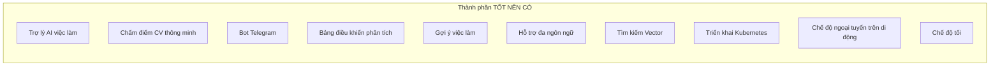
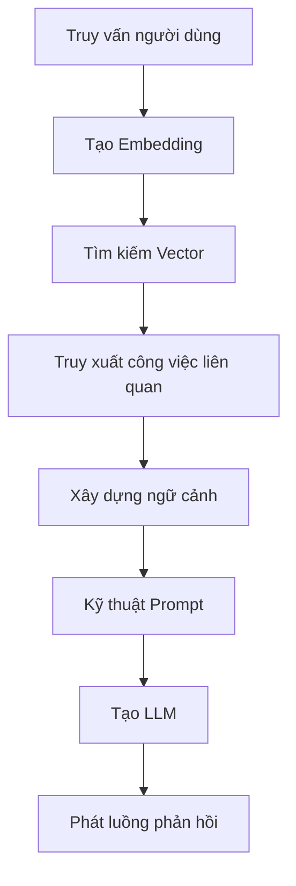
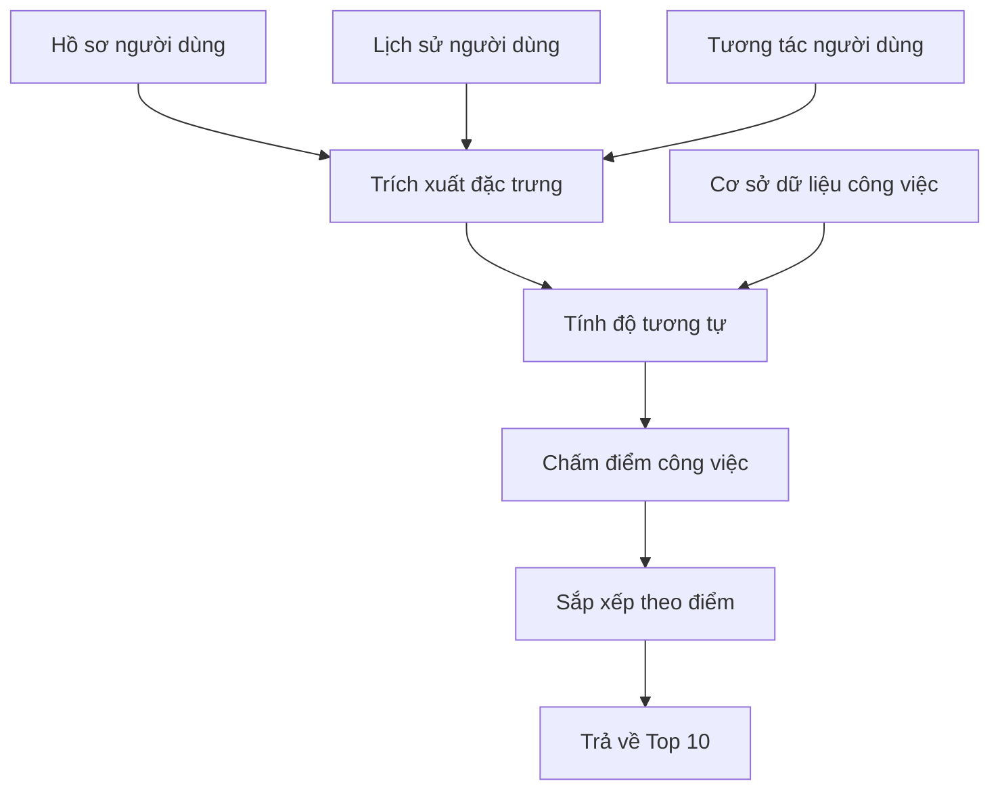
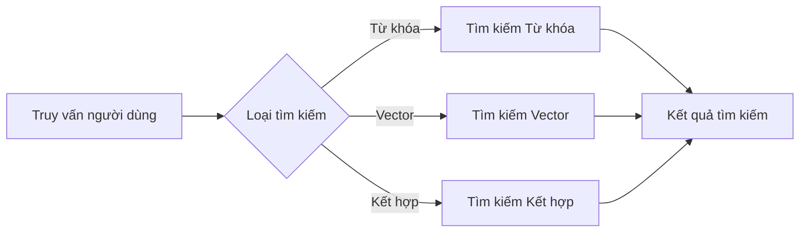
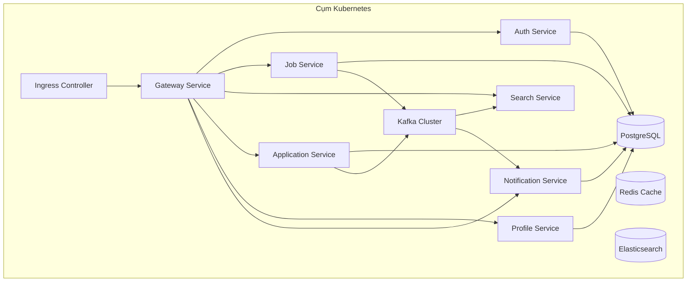
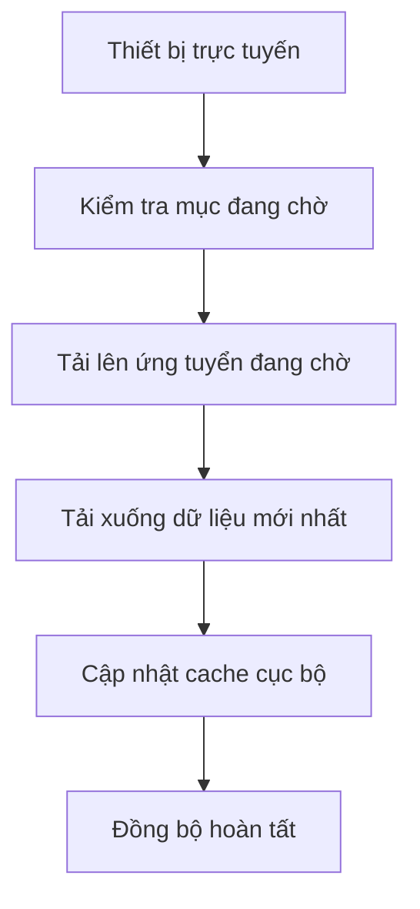

# Đặc tả Yêu cầu Phần mềm (SRS)

[English](../en/5-nice-to-have-fr.md) | [Tiếng Việt](5-nice-to-have-fr.vi.md)

## Nền tảng Việc làm Việt Nam - Kiến trúc Microservices

**Phiên bản:** 1.0  
**Ngày:** 17 tháng 8 năm 2026  
**Dự án:** Nền tảng Việc làm Việt Nam (Vietnam Job Platform)  

---

## Phần 5: Yêu cầu chức năng - TỐT NÊN CÓ

### 5.1 Tổng quan

Phần này ghi lại tất cả các yêu cầu chức năng **TỐT NÊN CÓ**. Đây là các tính năng "WOW" sáng tạo mang lại lợi thế cạnh tranh và điểm thưởng, nhưng không bắt buộc để đạt yêu cầu. Chúng chỉ nên được triển khai sau khi tất cả các tính năng BẮT BUỘC PHẢI CÓ và NÊN CÓ đã ổn định và hoàn chỉnh.

Nhóm nên chọn **ít nhất 2** tính năng TỐT NÊN CÓ để triển khai, với Trợ lý AI việc làm được khuyến nghị cao nhất. Các tính năng TỐT NÊN CÓ được tổ chức thành 10 thành phần:



---

### 5.2 Trợ lý AI việc làm (Chatbot)

**ID thành phần:** AI-01  
**Mức độ ưu tiên:** TỐT NÊN CÓ  
**Người phụ trách:** TM2 (Chính) + TM1  
**Tuần mục tiêu:** Tuần 9–10  
**Độ khó:** 8/10  

#### 5.2.1 Mô tả

Trợ lý AI việc làm là một trợ lý trò chuyện giúp người tìm việc với các câu hỏi liên quan đến sự nghiệp. Sử dụng Phương pháp Tăng cường Truy xuất (RAG), nó cung cấp phản hồi nhận biết ngữ cảnh dựa trên dữ liệu việc làm, thông tin công ty và lời khuyên nghề nghiệp chung. Tính năng này thể hiện tích hợp AI hiện đại và cung cấp giá trị đáng kể cho người dùng.

#### 5.2.2 Yêu cầu chức năng

| ID | Yêu cầu | Tiêu chí chấp nhận |
|:---|:--------|:-------------------|
| AI-01-01 | Hệ thống cung cấp giao diện trò chuyện cho các truy vấn liên quan đến việc làm | - Điểm cuối trò chuyện: `POST /api/ai/chat`<br>- Người dùng có thể đặt câu hỏi về công việc, nghề nghiệp, công ty<br>- Phản hồi được tạo dựa trên dữ liệu việc làm và kiến thức chung |
| AI-01-02 | Hệ thống hỗ trợ Phương pháp Tăng cường Truy xuất (RAG) | - Mô tả công việc được nhúng và lưu trong cơ sở dữ liệu vector<br>- Truy vấn người dùng được chuyển đổi thành embeddings<br>- Ngữ cảnh công việc liên quan được truy xuất và sử dụng trong tạo phản hồi |
| AI-01-03 | Hệ thống duy trì ngữ cảnh hội thoại có giới hạn | - Lịch sử phiên được lưu cho mỗi người dùng (Redis + PostgreSQL)<br>- **Cửa sổ ngữ cảnh: tối đa 20 tin nhắn gần nhất hoặc 8.000 token** (cấu hình theo LLM)<br>- Khi vượt ngưỡng, loại bỏ tin nhắn cũ nhất, ghi log sự kiện cắt ngữ cảnh; thông báo cho người dùng: “Hội thoại đã dài, tôi sẽ chỉ nhớ 20 tin nhắn gần nhất” và đề xuất bắt đầu phiên mới<br>- Ngữ cảnh được duy trì qua nhiều tin nhắn trong cùng `sessionId`; **TTL phiên 24 giờ không hoạt động** (Redis), tóm tắt lưu 30 ngày trong DB<br>- Người dùng có thể bắt đầu hội thoại mới (`DELETE /api/ai/session/{id}`) |
| AI-01-04 | Hệ thống hỗ trợ phản hồi luồng | - Phản hồi được phát luồng token theo token (Server-Sent Events)<br>- Người dùng thấy phản hồi khi chúng được tạo; first token < 500ms (PERF-01)<br>- Có thể hủy tạo phản hồi nếu cần |
| AI-01-05 | Hệ thống bao gồm phản hồi theo công việc cụ thể | - Khi được hỏi về công việc, phản hồi với danh sách việc làm liên quan<br>- Bao gồm tiêu đề công việc, công ty, liên kết đến công việc<br>- Có thể giải thích yêu cầu công việc bằng ngôn ngữ tự nhiên |
| AI-01-06 | Hệ thống hỗ trợ tư vấn nghề nghiệp | - Trả lời câu hỏi về viết CV, mẹo phỏng vấn<br>- Cung cấp kỳ vọng lương theo vai trò và địa điểm<br>- Đề xuất lộ trình nghề nghiệp dựa trên kỹ năng và kinh nghiệm |
| AI-01-07 | Hệ thống xử lý truy vấn bằng tiếng Việt và tiếng Anh | - Hiểu và phản hồi bằng cả hai ngôn ngữ<br>- Ngôn ngữ phản hồi khớp với ngôn ngữ truy vấn<br>- Xử lý dấu và thanh tiếng Việt |
| AI-01-08 | Hệ thống bao gồm các biện pháp bảo vệ cơ bản | - Từ chối các truy vấn không phù hợp hoặc không liên quan<br>- Giữ đúng chủ đề (nghề nghiệp và việc làm)<br>- Cung cấp tuyên bố miễn trừ về nội dung do AI tạo ra |
| AI-01-09 | Hệ thống tóm tắt ngữ cảnh cũ và giới hạn chi phí | - Khi vượt 20 tin / 8.000 token, tóm tắt lịch sử cũ bằng LLM thành system prompt để giữ ngữ cảnh dài hạn<br>- Mỗi phản hồi giới hạn **512 tokens**, **20 requests / user / giờ** (Redis rate-limit), vượt → `429 Too Many Requests`<br>- Ghi log token usage để giám sát chi phí (Gemini free tier / OpenAI credits) |

#### 5.2.3 Đặc tả API

| Điểm cuối | Phương thức | Body yêu cầu | Phản hồi | Quy tắc xác thực |
|:----------|:------------|:-------------|:---------|:-----------------|
| `/api/ai/chat` | POST | `{ message, sessionId?, stream?, maxTokens?, temperature? }` | `{ response, sessionId }` hoặc Server-Sent Events stream | Người dùng được xác thực; tin nhắn không rỗng; `429` khi vượt 20 req/giờ; `maxTokens` ≤ 512 |
| `/api/ai/session` | POST | - | `{ sessionId }` | Người dùng được xác thực |
| `/api/ai/session/{sessionId}` | DELETE | - | `{ message }` | Người dùng sở hữu phiên |
| `/api/ai/session/{sessionId}/history` | GET | - | `[ { role, content, timestamp } ]` | Người dùng sở hữu phiên |

#### 5.2.4 Luồng đường ống RAG



#### 5.2.5 Ví dụ truy vấn

| Truy vấn người dùng | Loại phản hồi dự kiến |
|:--------------------|:----------------------|
| "Có công việc IT nào tại Thành phố Hồ Chí Minh không?" | Danh sách việc làm với tóm tắt |
| "Làm thế nào để chuẩn bị cho phỏng vấn lập trình React?" | Mẹo phỏng vấn và câu hỏi thường gặp |
| "Mức lương trung bình cho lập trình viên senior tại Hà Nội là bao nhiêu?" | Khoảng lương theo vai trò và địa điểm |
| "Cho tôi biết về FPT Software với tư cách nhà tuyển dụng" | Tổng quan công ty với thông tin chính |
| "Tôi có 2 năm kinh nghiệm Python, tôi nên ứng tuyển công việc gì?" | Hướng dẫn nghề nghiệp và gợi ý công việc |

---

### 5.3 Chấm điểm CV thông minh

**ID thành phần:** SCORE-01  
**Mức độ ưu tiên:** TỐT NÊN CÓ  
**Người phụ trách:** TM2  
**Tuần mục tiêu:** Tuần 11  
**Độ khó:** 7/10  

#### 5.3.1 Mô tả

Chấm điểm CV thông minh tự động đánh giá CV của ứng viên so với yêu cầu công việc và cung cấp điểm số phù hợp kèm gợi ý cải thiện. Nó giúp người tìm việc hiểu được mức độ phù hợp của họ với vị trí và xác định các lĩnh vực cần cải thiện.

#### 5.3.2 Yêu cầu chức năng

| ID | Yêu cầu | Tiêu chí chấp nhận |
|:---|:--------|:-------------------|
| SCORE-01-01 | Hệ thống phân tích CV đã tải lên để trích xuất nội dung văn bản | - Phân tích file PDF và DOCX<br>- Trích xuất các phần: thông tin cá nhân, kỹ năng, kinh nghiệm, giáo dục<br>- Xử lý nhiều định dạng và bố cục |
| SCORE-01-02 | Hệ thống tính điểm phù hợp với một công việc | - Điểm cuối tính điểm: `POST /api/ai/score-resume`<br>- Điểm dựa trên: khớp kỹ năng, khớp kinh nghiệm, khớp giáo dục<br>- Khoảng điểm: 0-100 |
| SCORE-01-03 | Hệ thống xác định kỹ năng khớp | - Trích xuất kỹ năng từ cả CV và mô tả công việc<br>- Xác định kỹ năng khớp, thiếu và thừa<br>- Phân loại kỹ năng theo mức độ quan trọng (bắt buộc vs nên có) |
| SCORE-01-04 | Hệ thống tạo gợi ý cải thiện | - Gợi ý dựa trên kỹ năng thiếu<br>- Đề xuất cải thiện CV<br>- Lời khuyên cụ thể, có thể hành động |
| SCORE-01-05 | Hệ thống lưu đệm kết quả chấm điểm | - Kết quả được đệm trong 24 giờ<br>- Khóa đệm: `cv_hash + job_id`<br>- Kết quả đệm được trả về cho yêu cầu lặp lại |
| SCORE-01-06 | Hệ thống xử lý lỗi chấm điểm một cách mượt mà | - Nếu phân tích thất bại, trả về lỗi với hướng dẫn<br>- Nếu không tìm thấy công việc, trả về 404<br>- Nếu dịch vụ không khả dụng, trả về 503 với thông báo |

#### 5.3.3 Đặc tả API

| Điểm cuối | Phương thức | Body yêu cầu | Phản hồi | Quy tắc xác thực |
|:----------|:------------|:-------------|:---------|:-----------------|
| `/api/ai/score-resume` | POST | FormData: `cv_file`, `job_id` | `{ score, skills, suggestions }` | Người dùng được xác thực; công việc tồn tại; kích thước file <= 5MB |
| `/api/ai/score-resume/{scoreId}` | GET | - | `{ score, skills, suggestions }` | Người dùng sở hữu điểm số |
| `/api/ai/score-resume/{scoreId}` | DELETE | - | `{ message }` | Người dùng sở hữu điểm số |

#### 5.3.4 Cấu trúc phân tích điểm số

```json
{
  "overall_score": 78,
  "breakdown": {
    "skills": {
      "score": 85,
      "matching": ["React", "JavaScript", "TypeScript"],
      "missing": ["Node.js", "Docker"],
      "extra": ["Vue.js"]
    },
    "experience": {
      "score": 75,
      "years": 3,
      "required_years": 5,
      "relevance": "Cao"
    },
    "education": {
      "score": 70,
      "degree": "Cử nhân",
      "required_degree": "Cử nhân",
      "relevance": "Khớp"
    }
  },
  "suggestions": [
    "Thêm Node.js vào phần kỹ năng của bạn",
    "Làm nổi bật kinh nghiệm Docker",
    "Mở rộng chi tiết dự án React",
    "Cân nhắc đề cập đến kinh nghiệm lãnh đạo nhóm"
  ]
}
```

---

### 5.4 Bot cảnh báo việc làm qua Telegram

**ID thành phần:** TELE-01  
**Mức độ ưu tiên:** TỐT NÊN CÓ  
**Người phụ trách:** TM1  
**Tuần mục tiêu:** Tuần 12  
**Độ khó:** 4/10  

#### 5.4.1 Mô tả

Bot cảnh báo việc làm qua Telegram cho phép người dùng đăng ký nhận thông báo việc làm qua Telegram, một nền tảng nhắn tin phổ biến tại Việt Nam. Điều này cung cấp một kênh thông báo thời gian thực thuận tiện mà không yêu cầu cài đặt email hoặc ứng dụng di động.

#### 5.4.2 Yêu cầu chức năng

| ID | Yêu cầu | Tiêu chí chấp nhận |
|:---|:--------|:-------------------|
| TELE-01-01 | Hệ thống tích hợp với Telegram Bot API | - Bot Telegram được tạo qua BotFather<br>- Webhook được cấu hình cho bot<br>- Bot phản hồi các lệnh |
| TELE-01-02 | Hệ thống hỗ trợ lệnh đăng ký | - `/start` - Tin nhắn chào mừng với hướng dẫn<br>- `/subscribe [keyword]` - Đăng ký nhận cảnh báo việc làm<br>- `/unsubscribe` - Hủy đăng ký tất cả cảnh báo<br>- `/help` - Hiển thị lệnh khả dụng |
| TELE-01-03 | Hệ thống gửi cảnh báo việc làm qua Telegram | - Khi công việc mới khớp với đăng ký của người dùng, gửi cảnh báo<br>- Cảnh báo bao gồm: tiêu đề công việc, công ty, địa điểm, lương<br>- Bao gồm liên kết đến chi tiết công việc (deep link) |
| TELE-01-04 | Hệ thống lưu trữ đăng ký của người dùng | - ID Telegram người dùng được lưu<br>- Từ khóa đăng ký được lưu theo người dùng<br>- Người dùng có thể có nhiều đăng ký |
| TELE-01-05 | Hệ thống xử lý sự kiện webhook Telegram | - Webhook nhận cập nhật từ Telegram<br>- Xử lý lệnh không đồng bộ<br>- Phản hồi trong giới hạn thời gian chờ |
| TELE-01-06 | Hệ thống hỗ trợ nhiều ngôn ngữ | - Tin nhắn bot có sẵn bằng tiếng Việt và tiếng Anh<br>- Tùy chọn ngôn ngữ được lưu theo người dùng<br>- Lệnh chọn ngôn ngữ khả dụng |

#### 5.4.3 Lệnh Bot Telegram

| Lệnh | Mô tả | Ví dụ |
|:-----|:------|:------|
| `/start` | Chào mừng và giới thiệu | - |
| `/subscribe keyword` | Đăng ký nhận cảnh báo việc làm cho từ khóa | `/subscribe React developer` |
| `/subscribe keyword location` | Đăng ký với từ khóa và địa điểm | `/subscribe React HCM` |
| `/unsubscribe` | Hủy đăng ký tất cả cảnh báo | - |
| `/list` | Liệt kê đăng ký hiện tại | - |
| `/help` | Hiển thị lệnh khả dụng | - |
| `/language` | Thay đổi ngôn ngữ | `/language vi` |

#### 5.4.4 Định dạng tin nhắn cảnh báo

```
🔥 Cảnh báo việc làm mới!

💼 React Developer
🏢 FPT Software
📍 Thành phố Hồ Chí Minh
💰 15-25M VND

📝 Chúng tôi đang tìm kiếm lập trình viên React với 3+ năm kinh nghiệm...

👉 Xem chi tiết: https://jobplatform.com/jobs/123

Để hủy đăng ký: /unsubscribe
```

---

### 5.5 Bảng điều khiển phân tích

**ID thành phần:** ANALYTICS-01  
**Mức độ ưu tiên:** TỐT NÊN CÓ  
**Người phụ trách:** TM3  
**Tuần mục tiêu:** Tuần 11  
**Độ khó:** 5/10  

#### 5.5.1 Mô tả

Bảng điều khiển phân tích cung cấp thông tin trực quan về hoạt động nền tảng. Nó giúp quản trị viên hiểu hành vi người dùng, xu hướng đăng tin và mô hình ứng tuyển để đưa ra quyết định dựa trên dữ liệu.

#### 5.5.2 Yêu cầu chức năng

| ID | Yêu cầu | Tiêu chí chấp nhận |
|:---|:--------|:-------------------|
| ANALYTICS-01-01 | Hệ thống cung cấp phân tích người dùng | - Tổng người dùng, nhà tuyển dụng, người tìm việc<br>- Tăng trưởng người dùng theo thời gian (ngày, tuần, tháng)<br>- Người dùng hoạt động (ngày, tuần, tháng) |
| ANALYTICS-01-02 | Hệ thống cung cấp phân tích công việc | - Tổng số công việc, theo danh mục<br>- Công việc được đăng theo thời gian<br>- Lượt xem và ứng tuyển trung bình trên mỗi công việc |
| ANALYTICS-01-03 | Hệ thống cung cấp phân tích ứng tuyển | - Tổng số ứng tuyển<br>- Phân phối trạng thái ứng tuyển<br>- Xu hướng ứng tuyển theo thời gian |
| ANALYTICS-01-04 | Hệ thống cung cấp phân tích tìm kiếm | - Từ khóa được tìm kiếm nhiều nhất<br>- Địa điểm được tìm kiếm nhiều nhất<br>- Khối lượng tìm kiếm theo thời gian |
| ANALYTICS-01-05 | Hệ thống hỗ trợ lọc theo thời gian | - Bộ lọc: Hôm nay, Tuần này, Tháng này, Khoảng tùy chỉnh<br>- Tất cả biểu đồ cập nhật theo bộ lọc thời gian<br>- Xử lý ngày nhất quán |
| ANALYTICS-01-06 | Hệ thống cung cấp biểu đồ và đồ thị trực quan | - Biểu đồ đường cho xu hướng<br>- Biểu đồ cột cho phân phối<br>- Biểu đồ tròn cho thành phần |

#### 5.5.3 Chỉ số bảng điều khiển phân tích

| Danh mục | Chỉ số | Loại biểu đồ |
|:---------|:-------|:-------------|
| Người dùng | Tăng trưởng người dùng theo thời gian | Biểu đồ đường |
| Người dùng | Phân phối người dùng (Người tìm việc vs Nhà tuyển dụng vs Quản trị viên) | Biểu đồ tròn |
| Công việc | Đăng tin theo thời gian | Biểu đồ đường |
| Công việc | Công việc theo danh mục | Biểu đồ cột |
| Công việc | Công việc theo loại hình | Biểu đồ tròn |
| Ứng tuyển | Ứng tuyển theo thời gian | Biểu đồ đường |
| Ứng tuyển | Phân phối trạng thái ứng tuyển | Biểu đồ cột |
| Công việc | Top 10 công ty theo số lượng đăng tin | Biểu đồ cột |
| Tìm kiếm | Top 10 từ khóa tìm kiếm | Biểu đồ cột |
| Tìm kiếm | Top 10 địa điểm tìm kiếm | Biểu đồ cột |

#### 5.5.4 Điểm cuối API phân tích

| Điểm cuối | Phương thức | Tham số truy vấn | Phản hồi | Quy tắc xác thực |
|:----------|:------------|:-----------------|:---------|:-----------------|
| `/api/analytics/users` | GET | `period, start_date, end_date` | UserAnalyticsDTO | Yêu cầu vai trò Quản trị viên |
| `/api/analytics/jobs` | GET | `period, start_date, end_date` | JobAnalyticsDTO | Yêu cầu vai trò Quản trị viên |
| `/api/analytics/applications` | GET | `period, start_date, end_date` | ApplicationAnalyticsDTO | Yêu cầu vai trò Quản trị viên |
| `/api/analytics/search` | GET | `period, limit` | SearchAnalyticsDTO | Yêu cầu vai trò Quản trị viên |

---

### 5.6 Gợi ý việc làm

**ID thành phần:** RECOMMEND-01  
**Mức độ ưu tiên:** TỐT NÊN CÓ  
**Người phụ trách:** TM2  
**Tuần mục tiêu:** Tuần 13  
**Độ khó:** 6/10  

#### 5.6.1 Mô tả

Gợi ý việc làm cung cấp đề xuất công việc cá nhân hóa dựa trên hành vi người dùng, kỹ năng, lịch sử ứng tuyển và tương tác. Điều này nâng cao mức độ tương tác của người dùng và tăng khả năng tìm thấy công việc phù hợp.

#### 5.6.2 Yêu cầu chức năng

| ID | Yêu cầu | Tiêu chí chấp nhận |
|:---|:--------|:-------------------|
| RECOMMEND-01-01 | Hệ thống cung cấp gợi ý việc làm cho người tìm việc | - Điểm cuối gợi ý: `GET /api/jobs/recommended`<br>- Gợi ý dựa trên hồ sơ và lịch sử người dùng<br>- Trả về tối đa 10 gợi ý |
| RECOMMEND-01-02 | Hệ thống sử dụng lọc dựa trên nội dung | - Dựa trên kỹ năng người dùng khớp với yêu cầu công việc<br>- Dựa trên vị trí người dùng và vị trí công việc<br>- Dựa trên danh mục của công việc đã xem/ứng tuyển trước đó |
| RECOMMEND-01-03 | Hệ thống xem xét hành vi người dùng | - Công việc đã xem hoặc lưu<br>- Công việc đã ứng tuyển<br>- Tìm kiếm đã thực hiện |
| RECOMMEND-01-04 | Hệ thống cung cấp giải thích cho các gợi ý | - Lý do hiển thị với mỗi gợi ý<br>- Ví dụ: "Dựa trên kỹ năng React và JavaScript của bạn"<br>- Ví dụ: "Tương tự như công việc bạn đã xem" |
| RECOMMEND-01-05 | Hệ thống hỗ trợ làm mới gợi ý | - Gợi ý được tạo lại định kỳ<br>- Gợi ý mới khi làm mới trang<br>- Cache với TTL 6 giờ |
| RECOMMEND-01-06 | Hệ thống xử lý người dùng mới (cold start) | - Đối với người dùng mới, gợi ý công việc phổ biến<br>- Đối với người dùng không có lịch sử, hiển thị công việc xu hướng<br>- Tinh chỉnh dần khi hành vi người dùng được thu thập |

#### 5.6.3 Luồng gợi ý



#### 5.6.4 API Gợi ý

| Điểm cuối | Phương thức | Tham số truy vấn | Phản hồi | Quy tắc xác thực |
|:----------|:------------|:-----------------|:---------|:-----------------|
| `/api/jobs/recommended` | GET | `limit`, `refresh` | `{ items, reasons }` | Người dùng phải được xác thực; vai trò phải là Người tìm việc |
| `/api/jobs/recommended/explain` | GET | `job_id` | `{ reason, score }` | Người dùng phải được xác thực |

---

### 5.7 Hỗ trợ đa ngôn ngữ (i18n)

**ID thành phần:** I18N-01  
**Mức độ ưu tiên:** TỐT NÊN CÓ  
**Người phụ trách:** TM3 (Web) + TM4 (Di động)  
**Tuần mục tiêu:** Tuần 11  
**Độ khó:** 4/10  

#### 5.7.1 Mô tả

Hỗ trợ đa ngôn ngữ cho phép người dùng tương tác với nền tảng bằng ngôn ngữ ưa thích của họ. Trọng tâm ban đầu là tiếng Việt (bản địa) và tiếng Anh (quốc tế), với khả năng bổ sung thêm ngôn ngữ khác trong tương lai.

#### 5.7.2 Yêu cầu chức năng

| ID | Yêu cầu | Tiêu chí chấp nhận |
|:---|:--------|:-------------------|
| I18N-01-01 | Hệ thống hỗ trợ tiếng Việt và tiếng Anh | - Tất cả văn bản UI có sẵn trong cả hai ngôn ngữ<br>- Bộ chọn ngôn ngữ trong giao diện<br>- Tùy chọn người dùng được lưu qua các phiên |
| I18N-01-02 | Hệ thống hỗ trợ chuyển đổi ngôn ngữ | - Thay đổi ngôn ngữ áp dụng ngay lập tức (không yêu cầu làm mới trang)<br>- Tất cả phần tử UI cập nhật với ngôn ngữ mới<br>- Trải nghiệm nhất quán trên toàn ứng dụng |
| I18N-01-03 | Hệ thống xử lý dạng số nhiều một cách chính xác | - Dạng số nhiều cho tiếng Anh và tiếng Việt<br>- Xử lý số chính xác<br>- Nhất quán giữa các ngôn ngữ |
| I18N-01-04 | Hệ thống xử lý định dạng ngày và số | - Ngày theo định dạng địa phương (dd/mm/yyyy cho tiếng Việt)<br>- Tiền tệ theo định dạng địa phương<br>- Số với dấu phân cách phù hợp |
| I18N-01-05 | Hệ thống hỗ trợ ngôn ngữ từ hồ sơ người dùng | - Ngôn ngữ mặc định từ hồ sơ người dùng<br>- Ghi đè bằng tùy chọn trình duyệt<br>- Ngôn ngữ được lưu sau khi đăng xuất |

#### 5.7.3 Phạm vi ngôn ngữ

| Thành phần | Tiếng Việt | Tiếng Anh |
|:-----------|:-----------|:----------|
| Điều hướng UI | Có | Có |
| Danh sách công việc | Có (dữ liệu công việc có thể bằng tiếng Việt) | Không (không yêu cầu dịch nội dung công việc sang tiếng Anh) |
| Biểu mẫu | Có | Có |
| Thông báo lỗi | Có | Có |
| Thông báo | Có | Có |
| Bảng quản trị | Có | Có |

#### 5.7.4 Quản lý dịch thuật

| Khía cạnh | Cách tiếp cận |
|:----------|:--------------|
| Ứng dụng Web | Tệp dịch (JSON) với cặp khóa-giá trị |
| Ứng dụng Di động | Tệp tài nguyên theo ngôn ngữ |
| Phụ trợ | Tùy chọn ngôn ngữ được lưu theo người dùng |
| Thông báo | Ngôn ngữ dựa trên tùy chọn người dùng |
| Email | Ngôn ngữ dựa trên tùy chọn người dùng |

---

### 5.8 Tìm kiếm Vector Elasticsearch

**ID thành phần:** VECTOR-01  
**Mức độ ưu tiên:** TỐT NÊN CÓ  
**Người phụ trách:** TM2  
**Tuần mục tiêu:** Tuần 12  
**Độ khó:** 7/10  

#### 5.8.1 Mô tả

Tìm kiếm Vector mở rộng Elasticsearch với khả năng tìm kiếm ngữ nghĩa. Thay vì chỉ dựa vào khớp từ khóa, nó sử dụng embeddings để tìm công việc có ý nghĩa tương tự, ngay cả khi từ khóa chính xác không khớp. Điều này cung cấp trải nghiệm tìm kiếm thông minh hơn.

#### 5.8.2 Yêu cầu chức năng

| ID | Yêu cầu | Tiêu chí chấp nhận |
|:---|:--------|:-------------------|
| VECTOR-01-01 | Hệ thống tạo embeddings cho mô tả công việc | - Embeddings được tạo bằng dịch vụ AI (OpenAI/Gemini)<br>- Embeddings được lưu trong trường vector Elasticsearch<br>- Embeddings được làm mới khi công việc được cập nhật |
| VECTOR-01-02 | Hệ thống hỗ trợ tìm kiếm ngữ nghĩa | - Truy vấn người dùng được nhúng bằng cùng mô hình<br>- Tìm kiếm độ tương tự vector trong Elasticsearch<br>- Kết quả được xếp hạng theo mức độ liên quan ngữ nghĩa |
| VECTOR-01-03 | Hệ thống hỗ trợ tìm kiếm kết hợp | - Kết hợp tìm kiếm từ khóa với tìm kiếm vector<br>- Chấm điểm có trọng số (từ khóa 40%, vector 60%)<br>- Trọng số có thể cấu hình |
| VECTOR-01-04 | Hệ thống hỗ trợ lọc với tìm kiếm ngữ nghĩa | - Áp dụng bộ lọc (địa điểm, lương, v.v.) với tìm kiếm vector<br>- Bộ lọc được áp dụng sau tìm kiếm vector<br>- Hiệu năng chấp nhận được (< 500ms) |
| VECTOR-01-05 | Hệ thống xử lý lỗi nhúng một cách mượt mà | - Nếu dịch vụ nhúng không khả dụng, chuyển sang tìm kiếm từ khóa<br>- Lưu đệm embeddings cho công việc được tìm kiếm thường xuyên<br>- Ghi nhật ký lỗi nhúng để giám sát |

#### 5.8.3 So sánh tìm kiếm Vector

| Tính năng | Tìm kiếm Từ khóa | Tìm kiếm Vector |
|:----------|:-----------------|:----------------|
| Loại tìm kiếm | Khớp từ khóa | Độ tương tự ngữ nghĩa |
| Truy vấn ví dụ | "React developer" | "Frontend engineer với kinh nghiệm React" |
| Độc lập ngôn ngữ | Giới hạn ở từ chính xác | Xử lý từ đồng nghĩa và biến thể |
| Độ chính xác | Cao cho khớp chính xác | Cao cho tìm kiếm dựa trên ý nghĩa |
| Hiệu năng | Nhanh (< 50ms) | Chậm hơn (< 200ms) |
| Yêu cầu | Chỉ Elasticsearch | Elasticsearch + Dịch vụ nhúng |

#### 5.8.4 So sánh loại tìm kiếm



---

### 5.9 Triển khai Kubernetes

**ID thành phần:** K8S-01  
**Mức độ ưu tiên:** TỐT NÊN CÓ  
**Người phụ trách:** TM1  
**Tuần mục tiêu:** Tuần 12  
**Độ khó:** 7/10  

#### 5.9.1 Mô tả

Triển khai Kubernetes cho phép hệ thống chạy trên một cụm Kubernetes, cung cấp khả năng điều phối nâng cao bao gồm tự động mở rộng, cập nhật liên tục và tự phục hồi. Điều này thể hiện các thực hành triển khai cấp độ sản phẩm.

#### 5.9.2 Yêu cầu chức năng

| ID | Yêu cầu | Tiêu chí chấp nhận |
|:---|:--------|:-------------------|
| K8S-01-01 | Hệ thống có thể triển khai trên Kubernetes | - Manifests Kubernetes cho tất cả dịch vụ<br>- Tài nguyên Deployment, Service, ConfigMap, Secret<br>- Cô lập namespace (dev/staging/prod) |
| K8S-01-02 | Hệ thống hỗ trợ tự động mở rộng pod theo chiều ngang | - Cấu hình HPA cho mở rộng dựa trên CPU<br>- Mở rộng dựa trên chỉ số tùy chỉnh (yêu cầu mỗi giây)<br>- Số lượng bản sao tối thiểu và tối đa được xác định |
| K8S-01-03 | Hệ thống hỗ trợ cập nhật liên tục | - Triển khai không ngừng hoạt động<br>- Chiến lược cập nhật liên tục<br>- Khả năng quay lại phiên bản cũ |
| K8S-01-04 | Hệ thống hỗ trợ tự phục hồi | - Kiểm tra sức khỏe (liveness và readiness)<br>- Khởi động lại khi thất bại<br>- Tạo lại pod khi gặp sự cố |
| K8S-01-05 | Hệ thống hỗ trợ cấu hình theo môi trường | - ConfigMaps cho cấu hình không nhạy cảm<br>- Secrets cho dữ liệu nhạy cảm<br>- Cấu hình khác nhau cho mỗi môi trường |
| K8S-01-06 | Hệ thống hỗ trợ phát hiện dịch vụ | - DNS Service Kubernetes<br>- Giao tiếp dịch vụ với dịch vụ qua DNS<br>- Cân bằng tải giữa các pod |

#### 5.9.3 Tài nguyên Kubernetes

| Tài nguyên | Mục đích | Ví dụ |
|:-----------|:---------|:------|
| Deployment | Quản lý vòng đời pod | AuthService, JobService, v.v. |
| Service | Tiếp xúc pod nội bộ | ClusterIP cho mỗi dịch vụ |
| Ingress | Tiếp xúc dịch vụ bên ngoài | Ingress API Gateway |
| ConfigMap | Cấu hình không nhạy cảm | Chuỗi kết nối cơ sở dữ liệu (không có mật khẩu) |
| Secret | Cấu hình nhạy cảm | Mật khẩu cơ sở dữ liệu, JWT secret |
| HPA | Tự động mở rộng | Mở rộng dựa trên CPU (mục tiêu 50%) |
| NetworkPolicy | Bảo mật mạng | Cô lập dịch vụ theo namespace |

#### 5.9.4 Kiến trúc triển khai



---

### 5.10 Chế độ ngoại tuyến trên di động

**ID thành phần:** OFFLINE-01  
**Mức độ ưu tiên:** TỐT NÊN CÓ  
**Người phụ trách:** TM4  
**Tuần mục tiêu:** Tuần 13  
**Độ khó:** 5/10  

#### 5.10.1 Mô tả

Chế độ ngoại tuyến trên di động cho phép người dùng truy cập các tính năng chính của nền tảng mà không cần kết nối Internet. Điều này đặc biệt có giá trị tại Việt Nam nơi kết nối có thể không ổn định. Nó cho phép người dùng xem công việc đã lưu, đọc nội dung đã đệm và truy cập chức năng cơ bản khi ngoại tuyến.

#### 5.10.2 Yêu cầu chức năng

| ID | Yêu cầu | Tiêu chí chấp nhận |
|:---|:--------|:-------------------|
| OFFLINE-01-01 | Hệ thống hỗ trợ xem công việc ngoại tuyến | - Người dùng có thể xem công việc đã lưu khi không có Internet<br>- Công việc được đồng bộ khi trực tuyến<br>- Công việc đã đệm được lưu cục bộ |
| OFFLINE-01-02 | Hệ thống hỗ trợ tìm kiếm công việc ngoại tuyến | - Tìm kiếm trong công việc đã lưu<br>- Lọc từ khóa đơn giản<br>- Kết quả chỉ từ cache cục bộ |
| OFFLINE-01-03 | Hệ thống hỗ trợ ứng tuyển ngoại tuyến | - Người dùng có thể ứng tuyển khi ngoại tuyến<br>- Ứng tuyển được lưu cục bộ<br>- Được gửi khi có mạng |
| OFFLINE-01-04 | Hệ thống cung cấp trạng thái đồng bộ | - Chỉ báo trạng thái đồng bộ<br>- Số lượng mục chờ đồng bộ<br>- Tùy chọn đồng bộ thủ công |
| OFFLINE-01-05 | Hệ thống xử lý xung đột đồng bộ | - Chiến lược giải quyết xung đột<br>- Ưu tiên dữ liệu máy chủ<br>- Thông báo cho người dùng về xung đột |
| OFFLINE-01-06 | Hệ thống quản lý lưu trữ cục bộ hiệu quả | - Quản lý giới hạn lưu trữ<br>- Tự động dọn dẹp mục cũ<br>- Người dùng có thể xóa dữ liệu đã đệm |

#### 5.10.3 Khả năng ngoại tuyến

| Tính năng | Trực tuyến | Ngoại tuyến | Hành vi đồng bộ |
|:----------|:-----------|:------------|:----------------|
| Xem chi tiết công việc | Có | Có (đã đệm) | Được đệm khi xem |
| Tìm kiếm công việc | Có | Có (chỉ đã lưu) | Lọc công việc đã lưu |
| Ứng tuyển | Có | Có (đang chờ) | Xếp hàng để tải lên |
| Xem ứng tuyển | Có | Có (đã đệm) | Được đệm khi xem |
| Xem hồ sơ | Có | Có (đã đệm) | Được đệm khi xem |
| Cập nhật hồ sơ | Có | Không | Không hỗ trợ |
| Xem thông báo | Có | Có (đã đệm) | Được đệm khi nhận |

#### 5.10.4 Quy trình đồng bộ



---

### 5.11 Chế độ tối

**ID thành phần:** DARK-01  
**Mức độ ưu tiên:** TỐT NÊN CÓ  
**Người phụ trách:** TM3 (Web) + TM4 (Di động)  
**Tuần mục tiêu:** Tuần 13  
**Độ khó:** 3/10  

#### 5.11.1 Mô tả

Chế độ tối cung cấp tùy chọn giao diện người dùng với nền tối, giảm mỏi mắt trong môi trường ánh sáng yếu và cải thiện thời lượng pin trên màn hình OLED. Đây là một cải tiến trải nghiệm người dùng thể hiện sự chú ý đến chi tiết và khả năng tiếp cận.

#### 5.11.2 Yêu cầu chức năng

| ID | Yêu cầu | Tiêu chí chấp nhận |
|:---|:--------|:-------------------|
| DARK-01-01 | Hệ thống hỗ trợ giao diện sáng và tối | - Tất cả thành phần UI được tạo kiểu cho cả hai giao diện<br>- Bảng màu nhất quán cho mỗi giao diện<br>- Khả năng tiếp cận được duy trì trong cả hai giao diện |
| DARK-01-02 | Hệ thống hỗ trợ chuyển đổi giao diện tự động | - Theo dõi tùy chọn giao diện hệ thống (cài đặt OS)<br>- Phát hiện thay đổi giao diện hệ thống<br>- Áp dụng giao diện ngay lập tức |
| DARK-01-03 | Hệ thống hỗ trợ chuyển đổi giao diện thủ công | - Công tắc giao diện trong menu cài đặt<br>- Ghi đè tùy chọn hệ thống<br>- Tùy chọn giao diện được lưu trữ |
| DARK-01-04 | Hệ thống duy trì nhất quán giao diện trên các nền tảng | - Bảng màu giống nhau cho web và di động<br>- Trải nghiệm nhất quán trên các thiết bị<br>- Tùy chọn giao diện được lưu theo người dùng |
| DARK-01-05 | Hệ thống xử lý chuyển đổi giao diện không bị nhấp nháy | - Không có nhấp nháy trắng khi tải<br>- Giao diện được áp dụng ngay lập tức<br>- Không có FOUC (Flash of Unstyled Content) |

#### 5.11.3 Bảng màu giao diện

| Thành phần | Chế độ sáng | Chế độ tối |
|:-----------|:------------|:-----------|
| Nền | Trắng (#FFFFFF) | Xám đen (#1A1A1A) |
| Bề mặt | Xám nhạt (#F5F5F5) | Xám đen vừa (#2D2D2D) |
| Văn bản chính | Đen (#000000) | Trắng (#FFFFFF) |
| Văn bản phụ | Xám đen (#666666) | Xám nhạt (#AAAAAA) |
| Màu chính | Xanh dương (#007AFF) | Xanh dương (#007AFF) |
| Đường viền | Xám nhạt (#E0E0E0) | Xám đen (#333333) |

---

### 5.12 Tóm tắt yêu cầu TỐT NÊN CÓ

| Thành phần | ID | Tính năng chính | Tuần mục tiêu | Người phụ trách | Độ khó |
|:-----------|:---|:----------------|:--------------|:----------------|:-------|
| Trợ lý AI việc làm | AI-01 | Chatbot RAG, phản hồi luồng, đa ngôn ngữ | 9-10 | TM2 + TM1 | 8/10 |
| Chấm điểm CV thông minh | SCORE-01 | Phân tích CV, chấm điểm phù hợp, gợi ý cải thiện | 11 | TM2 | 7/10 |
| Bot Telegram | TELE-01 | Lệnh đăng ký, cảnh báo việc làm, đa ngôn ngữ | 12 | TM1 | 4/10 |
| Bảng điều khiển phân tích | ANALYTICS-01 | Phân tích người dùng/công việc/ứng tuyển, biểu đồ trực quan | 11 | TM3 | 5/10 |
| Gợi ý việc làm | RECOMMEND-01 | Lọc dựa trên nội dung, UI giải thích | 13 | TM2 | 6/10 |
| Đa ngôn ngữ | I18N-01 | Hỗ trợ tiếng Việt/Anh, dịch thuật | 11 | TM3 + TM4 | 4/10 |
| Tìm kiếm Vector | VECTOR-01 | Tìm kiếm ngữ nghĩa, tìm kiếm kết hợp | 12 | TM2 | 7/10 |
| Kubernetes | K8S-01 | HPA, cập nhật liên tục, tự phục hồi | 12 | TM1 | 7/10 |
| Chế độ ngoại tuyến | OFFLINE-01 | Xem ngoại tuyến, ứng tuyển ngoại tuyến, đồng bộ | 13 | TM4 | 5/10 |
| Chế độ tối | DARK-01 | Giao diện sáng/tối, chuyển đổi tự động/thủ công | 13 | TM3 + TM4 | 3/10 |

---

### 5.13 Khuyến nghị cho nhóm

| Lựa chọn được khuyến nghị | Lý do |
|:--------------------------|:------|
| **Trợ lý AI việc làm** | Yếu tố WOW cao nhất, thể hiện tích hợp AI hiện đại, mang lại giá trị thực cho người dùng |
| **Chấm điểm CV thông minh** | Bổ sung cho Trợ lý AI, giá trị thực tiễn cho người tìm việc, thể hiện khả năng NLP |

**Các lựa chọn thay thế:**

| Lựa chọn thay thế | Lý do |
|:------------------|:------|
| **Bot Telegram** + **Bảng điều khiển phân tích** | Độ khó thấp hơn, kết hợp tốt giữa tính năng đối diện người dùng và quản trị |
| **Gợi ý việc làm** + **Tìm kiếm Vector** | Cải tiến tập trung vào tìm kiếm, nâng cao chức năng tìm kiếm cốt lõi |
| **Kubernetes** + **Chế độ tối** | Thể hiện chiều sâu kỹ thuật (K8s) và sự chú ý đến trải nghiệm người dùng (Chế độ tối) |

---

**Hết Phần 5**