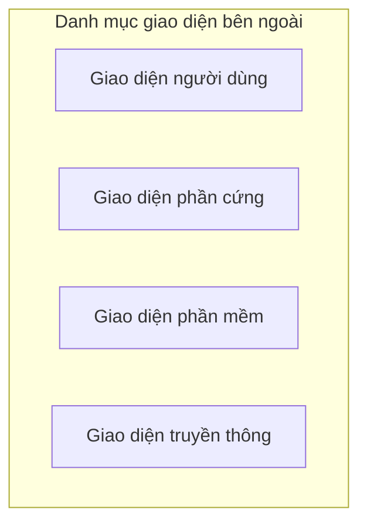
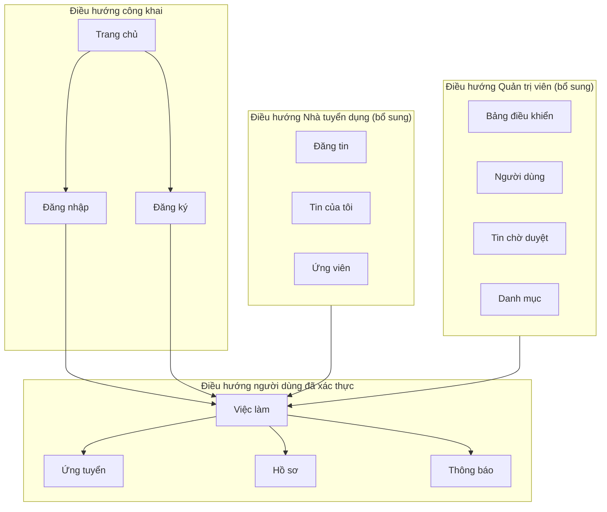
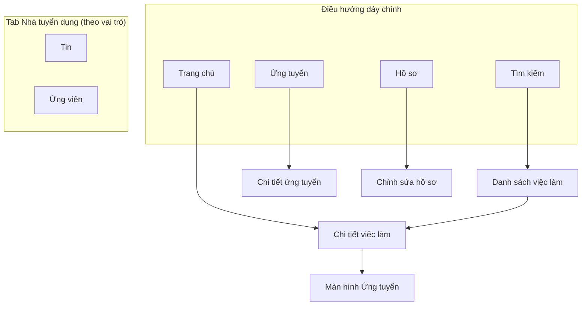

# Đặc tả Yêu cầu Phần mềm (SRS)

[English](../en/7-eir.md) | [Tiếng Việt](7-eir.vi.md)

## Nền tảng Việc làm Việt Nam - Kiến trúc Microservices

**Phiên bản:** 1.0  
**Ngày:** 17 tháng 8 năm 2026  
**Dự án:** Nền tảng Việc làm Việt Nam (Vietnam Job Platform)  

---

## Phần 7: Yêu cầu giao diện bên ngoài

### 7.1 Tổng quan

Phần này xác định tất cả các giao diện giữa Nền tảng Việc làm Việt Nam và các thực thể bên ngoài. Điều này bao gồm giao diện người dùng (web và di động), giao diện phần cứng, giao diện phần mềm với hệ thống bên ngoài và các giao thức truyền thông. Đặc tả giao diện rõ ràng đảm bảo tích hợp đúng cách, trải nghiệm người dùng nhất quán và giao tiếp thành công với các dịch vụ bên thứ ba.

Các giao diện bên ngoài được tổ chức thành các danh mục sau:



---

### 7.2 Giao diện người dùng

#### 7.2.1 Giao diện ứng dụng Web

Ứng dụng web là một Ứng dụng Trang đơn (SPA) có thể truy cập qua các trình duyệt web hiện đại. Nó cung cấp giao diện phản hồi, trực quan cho tất cả người dùng nền tảng.

| Thuộc tính | Đặc tả | Mức độ ưu tiên |
|:-----------|:-------|:---------------|
| **Trình duyệt hỗ trợ** | Chrome 90+, Firefox 88+, Safari 14+, Edge 90+ | BẮT BUỘC |
| **Độ phân giải màn hình** | Phản hồi: chiều rộng từ 320px đến 1920px | BẮT BUỘC |
| **Chế độ hiển thị** | Máy tính để bàn (≥ 1024px), Máy tính bảng (768-1023px), Di động (< 768px) | BẮT BUỘC |
| **Phông chữ** | Hệ thống phông chữ hoặc phông hỗ trợ tiếng Việt (ví dụ: Roboto, Noto Sans) | BẮT BUỘC |
| **Hỗ trợ ngôn ngữ** | Tiếng Việt và tiếng Anh (TỐT NÊN CÓ) | TỐT NÊN CÓ |
| **Bảng màu** | Giao diện sáng (mặc định), Giao diện tối (TỐT NÊN CÓ) | TỐT NÊN CÓ |

##### 7.2.1.1 Trang và màn hình Web

| Trang | Loại người dùng | Mô tả | Mức độ ưu tiên |
|:------|:----------------|:------|:---------------|
| Trang chủ | Tất cả | Thanh tìm kiếm, việc làm nổi bật, liên kết nhanh, thống kê nền tảng | BẮT BUỘC |
| Trang Đăng nhập | Tất cả | Form email/mật khẩu, xác thực, thông báo lỗi, liên kết "Quên mật khẩu" | BẮT BUỘC |
| Trang Đăng ký | Tất cả | Form đăng ký, chọn vai trò (Người dùng/Nhà tuyển dụng), xác thực | BẮT BUỘC |
| Trang Danh sách việc làm | Tất cả | Kết quả tìm kiếm, thanh bên lọc, phân trang, tùy chọn sắp xếp | BẮT BUỘC |
| Trang Chi tiết việc làm | Tất cả | Chi tiết đầy đủ công việc, thông tin công ty, nút ứng tuyển, tùy chọn chia sẻ | BẮT BUỘC |
| Trang Ứng tuyển | Người tìm việc | Tải CV, thư xin việc, nút gửi, xác nhận thành công | BẮT BUỘC |
| Trang Hồ sơ | Tất cả | Thông tin cá nhân, kỹ năng, kinh nghiệm, quản lý giáo dục | BẮT BUỘC |
| Lịch sử ứng tuyển | Người tìm việc | Danh sách ứng tuyển, theo dõi trạng thái, lọc theo trạng thái | BẮT BUỘC |
| Trang Đăng tin | Nhà tuyển dụng | Form đăng tin, chọn danh mục, tùy chọn xuất bản/nháp | BẮT BUỘC |
| Trang Quản lý tin | Nhà tuyển dụng | Danh sách tin đã đăng, hành động sửa/xóa, số lượng ứng viên | BẮT BUỘC |
| Quản lý ứng viên | Nhà tuyển dụng | Danh sách ứng viên theo công việc, cập nhật trạng thái, xem CV | BẮT BUỘC |
| Bảng điều khiển Quản trị | Quản trị viên | Quản lý người dùng, phê duyệt tin, xem thống kê | NÊN CÓ |
| Thông báo | Tất cả | Danh sách thông báo thời gian thực, đánh dấu đã đọc, tùy chọn | NÊN CÓ |

##### 7.2.1.2 Cấu trúc điều hướng Web



#### 7.2.2 Giao diện ứng dụng Di động

Ứng dụng di động là một ứng dụng đa nền tảng hỗ trợ iOS và Android. Nó cung cấp giao diện được tối ưu cho di động với các tương tác thân thiện với cảm ứng.

| Thuộc tính | Đặc tả | Mức độ ưu tiên |
|:-----------|:-------|:---------------|
| **Nền tảng hỗ trợ** | iOS 16+, Android 12+ | BẮT BUỘC |
| **Hướng màn hình** | Dọc (chính), Ngang (tùy chọn) | BẮT BUỘC |
| **Tương tác cảm ứng** | Chạm, vuốt, nhấn giữ, phóng to/thu nhỏ (nếu áp dụng) | BẮT BUỘC |
| **Điều hướng** | Điều hướng đáy (chính), ngăn kéo (phụ) | BẮT BUỘC |
| **Phông chữ** | Phông hệ thống, hỗ trợ tiếng Việt | BẮT BUỘC |
| **Hỗ trợ ngôn ngữ** | Tiếng Việt và tiếng Anh (TỐT NÊN CÓ) | TỐT NÊN CÓ |
| **Bảng màu** | Giao diện sáng (mặc định), Giao diện tối (TỐT NÊN CÓ) | TỐT NÊN CÓ |

##### 7.2.2.1 Màn hình Di động

| Màn hình | Loại người dùng | Mô tả | Mức độ ưu tiên |
|:---------|:----------------|:------|:---------------|
| Màn hình Trang chủ | Tất cả | Thanh tìm kiếm, việc làm nổi bật, hành động nhanh | BẮT BUỘC |
| Màn hình Đăng nhập | Tất cả | Form email/mật khẩu, xác thực, thông báo lỗi | BẮT BUỘC |
| Màn hình Đăng ký | Tất cả | Form đăng ký, chọn vai trò, xác thực | BẮT BUỘC |
| Màn hình Danh sách việc làm | Tất cả | Kết quả tìm kiếm, tùy chọn lọc, cuộn vô hạn | BẮT BUỘC |
| Màn hình Chi tiết việc làm | Tất cả | Chi tiết đầy đủ công việc, thông tin công ty, nút ứng tuyển | BẮT BUỘC |
| Màn hình Ứng tuyển | Người tìm việc | Chọn CV (từ thiết bị), thư xin việc, gửi | BẮT BUỘC |
| Màn hình Hồ sơ | Tất cả | Thông tin cá nhân, kỹ năng, kinh nghiệm, giáo dục | BẮT BUỘC |
| Lịch sử ứng tuyển | Người tìm việc | Danh sách ứng tuyển, huy hiệu trạng thái, xem chi tiết | BẮT BUỘC |
| Màn hình Đăng tin | Nhà tuyển dụng | Form tin, chọn danh mục, xuất bản | BẮT BUỘC |
| Màn hình Quản lý tin | Nhà tuyển dụng | Danh sách tin đã đăng, hành động sửa/xóa | BẮT BUỘC |
| Màn hình Thông báo | Tất cả | Danh sách thông báo, đánh dấu đã đọc | NÊN CÓ |

##### 7.2.2.2 Điều hướng Di động



---

### 7.3 Giao diện phần cứng

Hệ thống dựa trên đám mây và không tương tác trực tiếp với thiết bị phần cứng vật lý. Các tương tác phần cứng chỉ giới hạn ở thiết bị của client.

| Loại thiết bị | Giao diện | Mô tả | Mức độ ưu tiên |
|:--------------|:----------|:------|:---------------|
| **Máy tính để bàn/Máy tính xách tay** | Trình duyệt web | Giao diện web tiêu chuẩn với đầu vào chuột/bàn phím | BẮT BUỘC |
| **Máy tính bảng** | Trình duyệt web hoặc Ứng dụng Di động | Web phản hồi hoặc ứng dụng di động với đầu vào cảm ứng | BẮT BUỘC |
| **Điện thoại thông minh** | Ứng dụng Di động | Ứng dụng di động gốc với đầu vào cảm ứng, camera (để quét CV) | BẮT BUỘC |
| **Camera** | Ứng dụng Di động (tùy chọn) | Quét tài liệu (CV) qua camera | TỐT NÊN CÓ |
| **Hệ thống tệp** | Web/Di động | Trình chọn tệp để tải CV (PDF, DOC, DOCX) | BẮT BUỘC |
| **Máy in** | Trình duyệt Web (tùy chọn) | In chi tiết công việc hoặc CV | TỐT NÊN CÓ |

---

### 7.4 Giao diện phần mềm

Giao diện phần mềm xác định các tương tác giữa Nền tảng Việc làm Việt Nam và các hệ thống phần mềm bên ngoài, dịch vụ bên thứ ba và giao tiếp nội bộ giữa các dịch vụ.

#### 7.4.1 Giao diện dịch vụ với dịch vụ (Nội bộ)

Tất cả microservices giao tiếp qua REST API cho các thao tác đồng bộ và message broker cho các sự kiện không đồng bộ.

| Giao diện | Giao thức | Mô tả | Hướng | Mức độ ưu tiên |
|:----------|:----------|:------|:------|:---------------|
| **API Gateway đến Dịch vụ** | HTTP/REST | Định tuyến và chuyển tiếp yêu cầu | API Gateway → Dịch vụ | BẮT BUỘC |
| **Dịch vụ đến Cơ sở dữ liệu** | TCP/PostgreSQL | Thao tác đọc/ghi cơ sở dữ liệu | Dịch vụ → PostgreSQL | BẮT BUỘC |
| **Dịch vụ đến Bộ nhớ đệm** | TCP/Redis | Thao tác đọc/ghi bộ nhớ đệm | Dịch vụ → Redis | NÊN CÓ |
| **Dịch vụ đến Tìm kiếm** | HTTP/Elasticsearch | Lập chỉ mục và truy vấn tìm kiếm | Dịch vụ → Elasticsearch | BẮT BUỘC |
| **Dịch vụ đến Message Broker** | TCP/Kafka | Xuất bản và tiêu thụ sự kiện | Dịch vụ ↔ Kafka | NÊN CÓ |
| **Dịch vụ đến Dịch vụ (Đồng bộ)** | HTTP/REST | Lệnh gọi đồng bộ trực tiếp (nếu cần) | Dịch vụ ↔ Dịch vụ | NÊN CÓ |

#### 7.4.2 Giao diện API Gateway

API Gateway cung cấp một điểm vào thống nhất cho tất cả yêu cầu của client.

| Thuộc tính | Đặc tả | Mức độ ưu tiên |
|:-----------|:-------|:---------------|
| **Giao thức** | HTTPS | BẮT BUỘC |
| **Xác thực** | Token JWT Bearer trong header `Authorization` | BẮT BUỘC |
| **Định dạng yêu cầu** | JSON (application/json) | BẮT BUỘC |
| **Định dạng phản hồi** | JSON (application/json) | BẮT BUỘC |
| **Giới hạn tốc độ** | 100 yêu cầu mỗi phút cho mỗi IP client | NÊN CÓ |
| **CORS** | Được cấu hình cho các nguồn gốc đáng tin cậy | BẮT BUỘC |

#### 7.4.3 Giao diện dịch vụ bên thứ ba

Hệ thống tích hợp với một số dịch vụ bên ngoài. Bảng sau đây ghi lại tất cả giao diện bên thứ ba.

| Nhà cung cấp dịch vụ | Mục đích | Giao thức | Định dạng dữ liệu | Mức độ ưu tiên | Mức độ phụ thuộc |
|:---------------------|:---------|:----------|:------------------|:---------------|:-----------------|
| **Dịch vụ Email (SMTP)** | Gửi thông báo email | SMTP/ TLS | Email (HTML + Văn bản thuần) | NÊN CÓ | Trung bình |
| **Dịch vụ Thông báo đẩy (FCM)** | Thông báo đẩy trên di động | HTTP/ REST | JSON | NÊN CÓ | Trung bình |
| **Dịch vụ AI (OpenAI/Gemini)** | Chatbot AI và chấm điểm CV | HTTP/ REST | JSON | TỐT NÊN CÓ | Thấp (Theo tính năng) |
| **Telegram Bot API** | Cảnh báo việc làm qua Telegram | HTTP/ Webhook | JSON | TỐT NÊN CÓ | Thấp (Theo tính năng) |
| **Lưu trữ đối tượng (Cloudflare R2)** | Lưu tệp CV và ảnh đại diện | S3-compatible API | Tệp nhị phân | NÊN CÓ | Trung bình |
| **Cơ sở dữ liệu được quản lý (Supabase)** | Cơ sở dữ liệu PostgreSQL | TCP/ PostgreSQL | SQL | BẮT BUỘC | Cao |
| **Bộ nhớ đệm được quản lý (Upstash)** | Bộ nhớ đệm Redis | TCP/ Redis | Redis protocol | NÊN CÓ | Trung bình |
| **Tìm kiếm được quản lý (Bonsai)** | Tìm kiếm Elasticsearch | HTTP/ REST | JSON | BẮT BUỘC | Cao |
| **Kafka được quản lý (Confluent)** | Message broker | TCP/ Kafka protocol | JSON/ Avro | NÊN CÓ | Trung bình |

#### 7.4.4 Chi tiết giao diện bên thứ ba

##### 7.4.4.1 Dịch vụ Email (SMTP)

| Thuộc tính | Đặc tả |
|:-----------|:-------|
| **Giao thức** | SMTP (Simple Mail Transfer Protocol) |
| **Xác thực** | Tên người dùng và mật khẩu |
| **Mã hóa** | TLS (STARTTLS) |
| **Giới hạn tốc độ** | Phụ thuộc vào nhà cung cấp (thường 100-500 mỗi ngày cho gói miễn phí) |
| **Chính sách thử lại** | 3 lần với thời gian chờ tăng dần |
| **Dự phòng** | Ghi nhật ký nội dung email nếu gửi thất bại (cho phát triển) |

##### 7.4.4.2 Dịch vụ Thông báo đẩy (Firebase Cloud Messaging)

| Thuộc tính | Đặc tả |
|:-----------|:-------|
| **Giao thức** | HTTPS REST API |
| **Xác thực** | Server key (API key) |
| **Nền tảng** | iOS (APNS) và Android (FCM) |
| **Định dạng payload** | JSON |
| **Deep Linking** | Hỗ trợ qua payload dữ liệu tùy chỉnh |
| **Chính sách thử lại** | 3 lần (FCM tự động thử lại) |

##### 7.4.4.3 Dịch vụ AI (OpenAI / Google Gemini)

| Thuộc tính | Đặc tả |
|:-----------|:-------|
| **Giao thức** | HTTPS REST API |
| **Xác thực** | API key |
| **Định dạng dữ liệu** | JSON |
| **Giới hạn tốc độ** | Gemini: ~60 yêu cầu/phút miễn phí; OpenAI: giới hạn bởi tín dụng |
| **Chính sách thử lại** | 3 lần với thời gian chờ tăng dần |
| **Dự phòng** | Lưu đệm phản hồi khi có thể; trả về thông báo lỗi mượt mà |

##### 7.4.4.4 Lưu trữ đối tượng (Cloudflare R2)

| Thuộc tính | Đặc tả |
|:-----------|:-------|
| **Giao thức** | S3-compatible API |
| **Xác thực** | Access key và secret key |
| **Định dạng dữ liệu** | Tệp nhị phân (PDF, DOCX, JPG, PNG) |
| **Giới hạn kích thước tệp** | 10 MB mỗi tệp |
| **Lưu giữ** | Tệp được giữ vô thời hạn hoặc cho đến khi bị xóa |
| **Kiểm soát truy cập** | URL đã ký với thời hạn (1 giờ) |

##### 7.4.4.5 Cơ sở dữ liệu được quản lý (Supabase)

| Thuộc tính | Đặc tả |
|:-----------|:-------|
| **Giao thức** | Giao thức PostgreSQL (TCP) |
| **Xác thực** | Tên người dùng và mật khẩu (chuỗi kết nối) |
| **Giới hạn lưu trữ** | 500 MB (gói miễn phí) |
| **Kết nối** | Kết nối được nhóm (tối đa 20) |
| **Sao lưu** | Sao lưu tự động hàng ngày |

---

### 7.5 Giao diện truyền thông

Giao diện truyền thông xác định các giao thức và định dạng dữ liệu được sử dụng cho giao tiếp hệ thống.

#### 7.5.1 Giao thức mạng

| Giao thức | Sử dụng | Mô tả | Mức độ ưu tiên |
|:----------|:--------|:------|:---------------|
| **HTTPS** | Client ↔ API Gateway | Giao tiếp REST API mã hóa | BẮT BUỘC |
| **HTTP/2** | Client ↔ API Gateway | Phiên bản HTTP hiện đại (nếu được hỗ trợ) | NÊN CÓ |
| **WebSocket** | Client ↔ API Gateway | Thông báo thời gian thực | NÊN CÓ |
| **TCP** | Dịch vụ nội bộ | Kết nối cơ sở dữ liệu, bộ nhớ đệm, message broker | BẮT BUỘC |
| **SMTP** | Hệ thống ↔ Dịch vụ Email | Gửi email | NÊN CÓ |

#### 7.5.2 Định dạng dữ liệu

| Định dạng | Sử dụng | Mô tả | Mức độ ưu tiên |
|:----------|:--------|:------|:---------------|
| **JSON** | REST APIs | Định dạng trao đổi dữ liệu chính | BẮT BUỘC |
| **Form Data** | Tải tệp lên | Tải CV, tải ảnh đại diện | BẮT BUỘC |
| **HTML** | Mẫu Email | Thông báo email đa dạng | NÊN CÓ |
| **Văn bản thuần** | Dự phòng Email | Dự phòng cho email HTML | NÊN CÓ |
| **Nhị phân** | Lưu trữ Tệp | Tệp CV, hình ảnh | BẮT BUỘC |

#### 7.5.3 Tiêu chuẩn giao tiếp API

| Tiêu chuẩn | Sử dụng | Mô tả | Mức độ ưu tiên |
|:-----------|:--------|:------|:---------------|
| **RESTful API** | Giao tiếp dịch vụ | Thiết kế API theo hướng tài nguyên | BẮT BUỘC |
| **OpenAPI 3.0** | Tài liệu API | Đặc tả hợp đồng API | BẮT BUỘC |
| **Hướng sự kiện** | Giao tiếp không đồng bộ | Xuất bản/tiêu thụ sự kiện Kafka | NÊN CÓ |

---

### 7.6 Nguồn dữ liệu bên ngoài

Hệ thống tiêu thụ dữ liệu từ các nguồn bên ngoài, chủ yếu cho danh sách việc làm.

| Nguồn dữ liệu | Mục đích | Tần suất | Loại giao diện | Mức độ ưu tiên |
|:--------------|:---------|:---------|:---------------|:---------------|
| **vieclam.gov.vn** | Dữ liệu việc làm | Hàng ngày (trình thu thập) | HTTP/Thu thập | BẮT BUỘC |
| **TopCV** | Dữ liệu việc làm (tùy chọn) | 3 lần/tuần | HTTP/Thu thập | TỐT NÊN CÓ |

#### 7.6.1 Giao diện nguồn dữ liệu

| Thuộc tính | Đặc tả |
|:-----------|:-------|
| **Phương thức** | Thu thập web (HTTP GET) |
| **User-Agent** | Luân phiên user-agent (để tránh bị chặn) |
| **Giới hạn tốc độ** | 1 yêu cầu mỗi giây (thu thập tôn trọng) |
| **Trích xuất dữ liệu** | Phân tích HTML (CSS selectors, XPath) |
| **Xử lý lỗi** | Thử lại tối đa 3 lần khi thất bại |
| **Làm sạch dữ liệu** | Loại bỏ HTML, chuẩn hóa ngày tháng, chuẩn hóa định dạng |

---

### 7.7 Xử lý lỗi giao diện

Hệ thống phải xử lý lỗi giao diện một cách nhất quán trên tất cả các giao diện bên ngoài.

| Giao diện | Chiến lược xử lý lỗi | Mức độ ưu tiên |
|:----------|:---------------------|:---------------|
| **HTTP REST APIs** | Trả về mã trạng thái HTTP tiêu chuẩn với thông báo lỗi trong body JSON | BẮT BUỘC |
| **WebSocket** | Gửi thông báo lỗi qua WebSocket; thử kết nối lại khi mất kết nối | NÊN CÓ |
| **Cơ sở dữ liệu** | Sử dụng nhóm kết nối; thử lại khi lỗi tạm thời | BẮT BUỘC |
| **Message Broker** | Sử dụng nhóm người tiêu dùng với quản lý offset; thử lại khi thất bại | NÊN CÓ |
| **API bên thứ ba** | Sử dụng cầu chì; thử lại với thời gian chờ tăng dần; phản hồi dự phòng | NÊN CÓ |
| **Lưu trữ Tệp** | Thử lại khi tải lên thất bại; cung cấp phản hồi cho người dùng về thành công/thất bại | NÊN CÓ |

#### 7.7.1 Mã trạng thái HTTP

| Mã trạng thái | Sử dụng | Ví dụ |
|:--------------|:--------|:------|
| **200 OK** | Yêu cầu thành công | Đăng nhập thành công, lấy danh sách việc làm |
| **201 Created** | Tài nguyên được tạo | Đăng tin, đăng ký người dùng |
| **202 Accepted** | Yêu cầu được chấp nhận để xử lý | Tải tệp, thao tác không đồng bộ |
| **204 No Content** | Yêu cầu thành công, không có nội dung để trả về | Đăng xuất, xóa |
| **400 Bad Request** | Lỗi client | Đầu vào không hợp lệ, thiếu trường |
| **401 Unauthorised** | Yêu cầu xác thực | Thiếu hoặc token JWT không hợp lệ |
| **403 Forbidden** | Quyền bị từ chối | Người dùng thiếu vai trò yêu cầu |
| **404 Not Found** | Không tìm thấy tài nguyên | ID công việc không tồn tại |
| **409 Conflict** | Xung đột tài nguyên | Ứng tuyển trùng lặp |
| **422 Unprocessable Entity** | Lỗi xác thực | Định dạng email không hợp lệ |
| **429 Too Many Requests** | Vượt quá giới hạn tốc độ | Quá nhiều yêu cầu mỗi phút |
| **500 Internal Server Error** | Lỗi máy chủ | Ngoại lệ không mong đợi |
| **503 Service Unavailable** | Dịch vụ tạm thời không khả dụng | Kết nối cơ sở dữ liệu thất bại |

#### 7.7.2 Định dạng phản hồi lỗi

```json
{
  "status": 400,
  "timestamp": "2026-08-17T10:30:00Z",
  "error": "Bad Request",
  "message": "Email là bắt buộc",
  "path": "/api/auth/register",
  "details": {
    "field": "email",
    "issue": "Email không thể để trống"
  }
}
```

---

### 7.8 Yêu cầu bảo mật giao diện

Tất cả các giao diện phải đáp ứng các yêu cầu bảo mật sau:

| Yêu cầu | Mô tả | Mức độ ưu tiên |
|:---------|:------|:---------------|
| **TLS 1.2+** | Tất cả giao tiếp bên ngoài phải sử dụng TLS | BẮT BUỘC |
| **Xác thực JWT** | Tất cả API (trừ đăng nhập/đăng ký) yêu cầu JWT | BẮT BUỘC |
| **Giới hạn tốc độ API** | Ngăn chặn lạm dụng giao diện bên ngoài | NÊN CÓ |
| **Xác thực đầu vào** | Xác thực tất cả dữ liệu đến từ giao diện bên ngoài | BẮT BUỘC |
| **Mã hóa đầu ra** | Mã hóa tất cả dữ liệu ra để ngăn chặn injection | BẮT BUỘC |
| **Header bảo mật** | Triển khai header bảo mật (HSTS, CSP, X-Frame-Options) | NÊN CÓ |
| **Chính sách CORS** | Hạn chế yêu cầu đa nguồn gốc đến các nguồn đáng tin cậy | BẮT BUỘC |

---

### 7.9 Tóm tắt yêu cầu giao diện

| Danh mục | Giao diện | BẮT BUỘC | NÊN CÓ | TỐT NÊN CÓ | Tổng |
|:---------|:----------|:---------|:-------|:-----------|:-----|
| Giao diện người dùng | Ứng dụng Web, Ứng dụng Di động | 12 | 2 | 2 | 16 |
| Giao diện phần cứng | Thiết bị client, Camera, Hệ thống tệp | 3 | 0 | 1 | 4 |
| Giao diện phần mềm | API nội bộ, API bên thứ ba | 3 | 5 | 1 | 9 |
| Truyền thông | Giao thức, Định dạng dữ liệu, Tiêu chuẩn | 3 | 3 | 0 | 6 |
| Nguồn dữ liệu bên ngoài | Nguồn danh sách việc làm | 1 | 0 | 1 | 2 |
| **Tổng** | | **22** | **10** | **5** | **37** |

---

**Hết Phần 7**