# Đặc tả Yêu cầu Phần mềm (SRS)

[English](../en/8-system-architecture.md) | [Tiếng Việt](8-system-architecture.vi.md)

## Nền tảng Việc làm Việt Nam - Kiến trúc Microservices

**Phiên bản:** 1.0  
**Ngày:** 17 tháng 8 năm 2026  
**Dự án:** Nền tảng Việc làm Việt Nam (Vietnam Job Platform)  

---

## Phần 8: Kiến trúc hệ thống

### 8.1 Tổng quan

Phần này mô tả kiến trúc hệ thống của Nền tảng Việc làm Việt Nam. Nó cung cấp một cái nhìn toàn diện về các quyết định kiến trúc, tương tác thành phần, luồng dữ liệu và chiến lược triển khai. Kiến trúc tuân theo các nguyên tắc microservices để đạt được khả năng mở rộng, khả năng bảo trì và khả năng triển khai độc lập.

Kiến trúc được tổ chức thành các lớp sau:

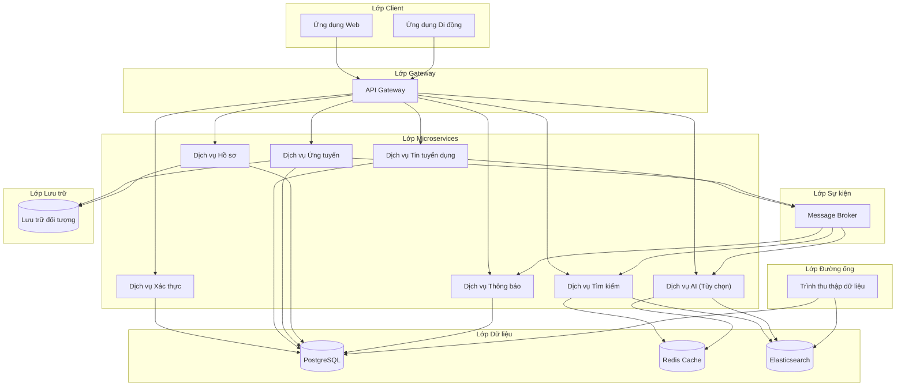

---

### 8.2 Nguyên tắc kiến trúc

Kiến trúc hệ thống được hướng dẫn bởi các nguyên tắc sau:

| Nguyên tắc | Mô tả | Lý do |
|:-----------|:------|:------|
| **Microservices** | Mỗi năng lực nghiệp vụ được triển khai như một dịch vụ độc lập | Cho phép phát triển, triển khai và mở rộng độc lập |
| **Mỗi dịch vụ một cơ sở dữ liệu** | Mỗi microservice có cơ sở dữ liệu/schema riêng | Đảm bảo kết nối lỏng lẻo và cô lập dữ liệu |
| **Thiết kế dựa trên API** | Tất cả tương tác dịch vụ thông qua API được xác định rõ | Cho phép hợp đồng rõ ràng và tiến hóa độc lập |
| **Giao tiếp hướng sự kiện** | Giao tiếp không đồng bộ qua message broker cho sự kiện xuyên dịch vụ | Tách biệt dịch vụ và cho phép nhất quán cuối cùng |
| **Dịch vụ không trạng thái** | Dịch vụ không duy trì trạng thái giữa các yêu cầu | Cho phép mở rộng theo chiều ngang và khả năng phục hồi |
| **Container hóa** | Tất cả dịch vụ chạy trong container | Đảm bảo nhất quán giữa các môi trường |
| **Hạ tầng dưới dạng mã** | Tất cả hạ tầng được định nghĩa trong mã | Cho phép tái tạo và kiểm soát phiên bản |

---

### 8.3 Mô tả thành phần

#### 8.3.1 Lớp Client

Lớp client bao gồm các ứng dụng đối diện người dùng tương tác với nền tảng.

| Thành phần | Mô tả | Công nghệ | Mức độ ưu tiên |
|:-----------|:------|:----------|:---------------|
| **Ứng dụng Web** | Ứng dụng Trang đơn (SPA) cung cấp giao diện đầy đủ nền tảng | Modern SPA framework | BẮT BUỘC |
| **Ứng dụng Di động** | Ứng dụng đa nền tảng cho iOS và Android | Cross-platform mobile framework | BẮT BUỘC |

**Trách nhiệm:**
- Hiển thị giao diện người dùng
- Xử lý tương tác người dùng
- Gọi API đến phần phụ trợ
- Quản lý trạng thái phía client
- Cung cấp khả năng ngoại tuyến (TỐT NÊN CÓ)

#### 8.3.2 Lớp Gateway

Lớp gateway cung cấp một điểm vào duy nhất cho tất cả yêu cầu của client.

| Thành phần | Mô tả | Công nghệ | Mức độ ưu tiên |
|:-----------|:------|:----------|:---------------|
| **API Gateway** | Reverse proxy xử lý định tuyến, xác thực và giới hạn tốc độ | Modern API Gateway framework | BẮT BUỘC |

**Trách nhiệm:**
- Định tuyến yêu cầu đến microservice phù hợp
- Xác thực token JWT
- Chuyển tiếp claim của người dùng đến dịch vụ hạ nguồn
- Thực thi giới hạn tốc độ
- Xử lý CORS
- Tổng hợp kiểm tra sức khỏe

#### 8.3.3 Lớp Microservices

Lớp microservices chứa tất cả dịch vụ logic nghiệp vụ.

| Dịch vụ | Mô tả | Trách nhiệm chính | Cổng | Mức độ ưu tiên |
|:--------|:------|:------------------|:-----|:---------------|
| **Dịch vụ Xác thực** | Xác thực và phân quyền người dùng | Đăng ký, đăng nhập, tạo JWT, làm mới token, đăng xuất | 5001 | BẮT BUỘC |
| **Dịch vụ Tin tuyển dụng** | Quản lý tin tuyển dụng | Thao tác CRUD cho tin, quản lý danh mục | 5002 | BẮT BUỘC |
| **Dịch vụ Tìm kiếm** | Tìm kiếm và lập chỉ mục | Lập chỉ mục Elasticsearch, truy vấn tìm kiếm, lọc | 5003 | BẮT BUỘC |
| **Dịch vụ Ứng tuyển** | Quản lý ứng tuyển | Ứng tuyển, tải CV, theo dõi trạng thái, lịch sử | 5004 | BẮT BUỘC |
| **Dịch vụ Hồ sơ** | Quản lý hồ sơ người dùng | CRUD hồ sơ, kỹ năng, kinh nghiệm, giáo dục | 5005 | BẮT BUỘC |
| **Dịch vụ Thông báo** | Giao tiếp đi ra | Thông báo email, thông báo đẩy, thông báo trong ứng dụng | 5006 | NÊN CÓ |
| **Dịch vụ AI** | Tính năng hỗ trợ AI (tùy chọn) | Chatbot, chấm điểm CV, gợi ý | 6000 | TỐT NÊN CÓ |

**Trách nhiệm chung:**
- Tất cả dịch vụ phải xác thực yêu cầu qua JWT
- Tất cả dịch vụ phải xác thực dữ liệu đầu vào
- Tất cả dịch vụ phải ghi nhật ký thao tác
- Tất cả dịch vụ phải cung cấp điểm cuối kiểm tra sức khỏe

#### 8.3.4 Lớp Dữ liệu

Lớp dữ liệu cung cấp khả năng lưu trữ, đệm và tìm kiếm.

| Thành phần | Mô tả | Mục đích | Mức độ ưu tiên |
|:-----------|:------|:---------|:---------------|
| **PostgreSQL** | Hệ thống quản lý cơ sở dữ liệu quan hệ | Lưu trữ dữ liệu chính cho tất cả dịch vụ | BẮT BUỘC |
| **Redis Cache** | Kho dữ liệu trong bộ nhớ | Đệm, lưu trữ phiên, giới hạn tốc độ | NÊN CÓ |
| **Elasticsearch** | Công cụ tìm kiếm và phân tích | Tìm kiếm toàn văn, lập chỉ mục, phân tích | BẮT BUỘC |

**Trách nhiệm lớp Dữ liệu:**
- Cung cấp giao dịch ACID (PostgreSQL)
- Cung cấp bộ nhớ đệm hiệu năng cao (Redis)
- Cung cấp khả năng tìm kiếm toàn văn (Elasticsearch)
- Đảm bảo lưu trữ và độ bền dữ liệu
- Hỗ trợ mô hình mỗi dịch vụ một cơ sở dữ liệu

#### 8.3.5 Lớp Sự kiện

Lớp sự kiện xử lý giao tiếp không đồng bộ giữa các dịch vụ.

| Thành phần | Mô tả | Mục đích | Mức độ ưu tiên |
|:-----------|:------|:---------|:---------------|
| **Message Broker** | Hệ thống nhắn tin phân tán | Xuất bản và tiêu thụ sự kiện | NÊN CÓ |

**Trách nhiệm lớp Sự kiện:**
- Xuất bản sự kiện miền (tin được tạo, ứng tuyển được gửi)
- Cho phép quy trình làm việc hướng sự kiện
- Tách biệt phụ thuộc dịch vụ
- Hỗ trợ nhất quán cuối cùng

#### 8.3.6 Lớp Đường ống

Lớp đường ống xử lý trích xuất và xử lý dữ liệu.

| Thành phần | Mô tả | Mục đích | Mức độ ưu tiên |
|:-----------|:------|:---------|:---------------|
| **Trình thu thập dữ liệu** | Thu thập web và trích xuất dữ liệu | Trích xuất dữ liệu tin từ nguồn bên ngoài | BẮT BUỘC |

**Trách nhiệm lớp Đường ống:**
- Thu thập dữ liệu tin từ nguồn bên ngoài
- Làm sạch và chuyển đổi dữ liệu đã trích xuất
- Tải dữ liệu vào PostgreSQL và Elasticsearch
- Xử lý trùng lặp và lỗi

#### 8.3.7 Lớp Lưu trữ

Lớp lưu trữ cung cấp lưu trữ đối tượng cho các tệp.

| Thành phần | Mô tả | Mục đích | Mức độ ưu tiên |
|:-----------|:------|:---------|:---------------|
| **Lưu trữ đối tượng** | Lưu trữ tệp có thể mở rộng | Lưu tệp CV, ảnh đại diện, logo công ty | NÊN CÓ |

**Trách nhiệm lớp Lưu trữ:**
- Lưu tệp tải lên (CV, ảnh đại diện, logo)
- Tạo URL truy cập an toàn
- Thực thi xác thực kích thước và loại tệp
- Xử lý xóa tệp

---

### 8.4 Kiến trúc dữ liệu

#### 8.4.1 Mô hình mỗi dịch vụ một cơ sở dữ liệu

Mỗi microservice sở hữu cơ sở dữ liệu/schema riêng để đảm bảo kết nối lỏng lẻo và cô lập dữ liệu.

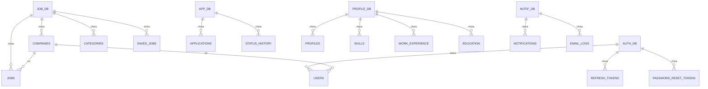

#### 8.4.2 Quyền sở hữu dữ liệu

| Dịch vụ | Dữ liệu sở hữu | Dữ liệu chia sẻ (Chỉ đọc) |
|:--------|:---------------|:------------------------|
| Dịch vụ Xác thực | Thông tin đăng nhập, refresh tokens (hash SHA-256, TTL 7/30 ngày), password reset tokens (TTL 15 phút) | Company (qua Job Service API) |
| Dịch vụ Tin tuyển dụng | Companies, Tin, danh mục, tin đã lưu | Users (qua Auth API) |
| Dịch vụ Ứng tuyển | Ứng tuyển, lịch sử trạng thái | Tin + Company (qua API) |
| Dịch vụ Hồ sơ | Hồ sơ (phone/address/DOB mã hóa AES-256-GCM), kỹ năng, kinh nghiệm, giáo dục | Không có |
| Dịch vụ Tìm kiếm | Chỉ mục tìm kiếm (Elasticsearch) | Tin + Company (qua sự kiện `job.created` chứa `company_id`) |
| Dịch vụ Thông báo | Nhật ký thông báo, nhật ký email | Không có |
| Dịch vụ AI | Lịch sử chat (TTL 24h Redis, 30 ngày DB tóm tắt), đệm chấm điểm (Redis), context window 20 tin / 8000 token | Tin, Company, hồ sơ (qua API) |

#### 8.4.3 Mô hình luồng dữ liệu

```mermaid
flowchart TB
    subgraph Sync["Luồng dữ liệu đồng bộ"]
        API["Yêu cầu API Client"] --> GW["API Gateway"]
        GW --> Svc["Microservice"]
        Svc --> DB["Cơ sở dữ liệu"]
        DB --> Svc
        Svc --> GW
        GW --> API
    end

    subgraph Async["Luồng dữ liệu không đồng bộ"]
        Pub["Dịch vụ A"] --> Broker["Message Broker"]
        Broker --> Sub["Dịch vụ B"]
        Sub --> Process["Xử lý sự kiện"]
    end

    subgraph Index["Luồng lập chỉ mục tìm kiếm"]
        Job["Dịch vụ Tin"] --> Broker2["Message Broker"]
        Broker2 --> Search["Dịch vụ Tìm kiếm"]
        Search --> ES["Elasticsearch"]
    end
```

---

### 8.5 Kiến trúc sự kiện

#### 8.5.1 Loại sự kiện

| Tên sự kiện | Người xuất bản | Người tiêu dùng | Kích hoạt | Trường chính trong Payload |
|:------------|:---------------|:----------------|:----------|:---------------------------|
| `job.created` | Dịch vụ Tin | Dịch vụ Tìm kiếm, Dịch vụ Thông báo | Tin mới được đăng | `job_id`, `title`, `company`, `location`, `recruiter_id` |
| `job.updated` | Dịch vụ Tin | Dịch vụ Tìm kiếm | Tin được cập nhật | `job_id`, `title`, `company`, `location` |
| `job.deleted` | Dịch vụ Tin | Dịch vụ Tìm kiếm | Tin bị xóa | `job_id` |
| `job.approved` | Dịch vụ Quản trị | Dịch vụ Thông báo | Tin được phê duyệt | `job_id`, `recruiter_id`, `status` |
| `application.submitted` | Dịch vụ Ứng tuyển | Dịch vụ Thông báo | Ứng tuyển được gửi | `application_id`, `job_id`, `applicant_id`, `job_title` |
| `application.updated` | Dịch vụ Ứng tuyển | Dịch vụ Thông báo | Trạng thái thay đổi | `application_id`, `job_id`, `applicant_id`, `status` |

#### 8.5.2 Sơ đồ luồng sự kiện

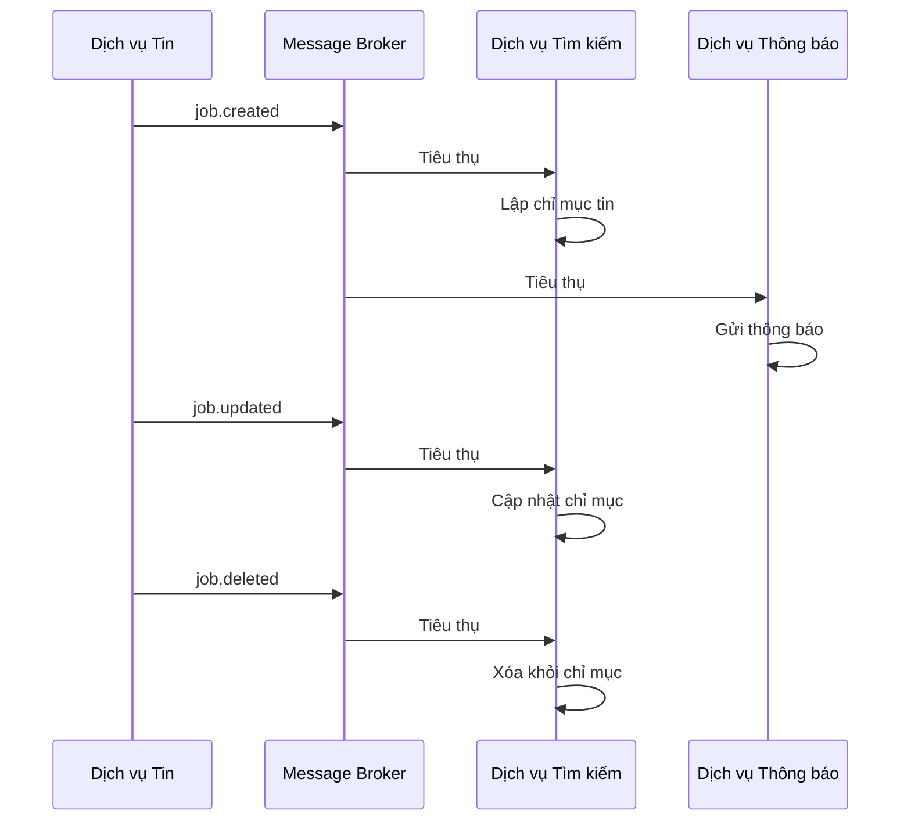

#### 8.5.3 Đảm bảo phân phối sự kiện

| Đảm bảo | Triển khai | Mức độ ưu tiên |
|:--------|:-----------|:---------------|
| **Phân phối ít nhất một lần** | Quản lý offset người tiêu dùng, người tiêu dùng đẳng hướng | NÊN CÓ |
| **Lưu trữ tin nhắn** | Thời gian lưu giữ có thể cấu hình (7 ngày) | NÊN CÓ |
| **Hàng đợi dead letter** | Tin nhắn thất bại sau khi thử lại được gửi đến DLQ | NÊN CÓ |
| **Phát lại sự kiện** | Khả năng phát lại sự kiện từ thời gian lưu giữ | TỐT NÊN CÓ |

---

### 8.6 Kiến trúc triển khai

#### 8.6.1 Môi trường phát triển (Cục bộ)

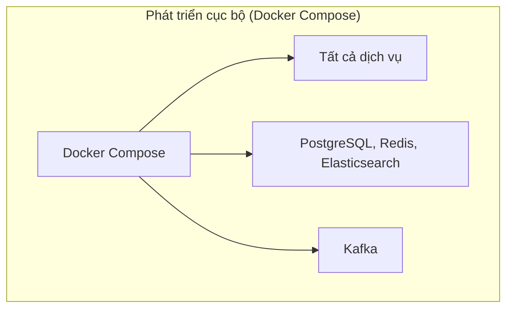

**Đặc điểm:**
- Tất cả dịch vụ chạy trong container Docker
- Docker Compose điều phối tất cả container
- Hot-reload cho phát triển
- Mount volume cục bộ cho thay đổi mã
- Biến môi trường cho cấu hình

#### 8.6.2 Môi trường Staging (Đám mây)

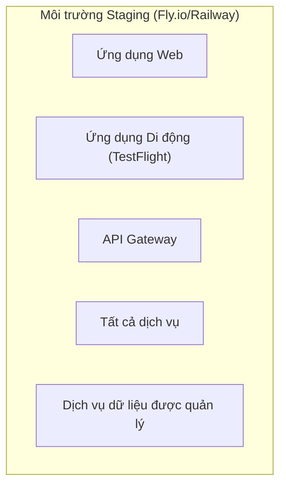

**Đặc điểm:**
- Triển khai lên đám mây (Fly.io / Railway)
- Dịch vụ cơ sở dữ liệu và cache được quản lý
- Dữ liệu thực (bản sao đã làm sạch của dữ liệu sản phẩm)
- Được sử dụng cho kiểm thử và xác nhận người dùng
- Tách biệt với môi trường sản phẩm

#### 8.6.3 Môi trường sản phẩm (Đám mây)

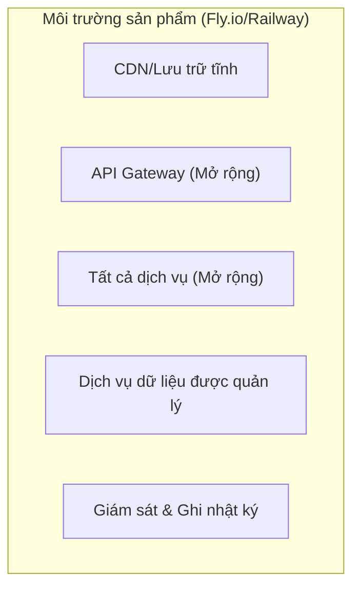

**Đặc điểm:**
- Triển khai lên đám mây (Fly.io / Railway)
- Dịch vụ cơ sở dữ liệu và cache được quản lý
- Tự động mở rộng nếu được hỗ trợ
- Giám sát và cảnh báo được cấu hình
- Quy trình sao lưu và phục hồi

#### 8.6.4 Chiến lược triển khai

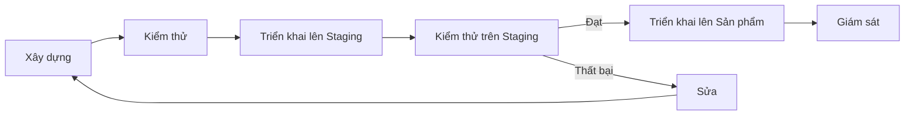

**Các bước triển khai:**

| Bước | Mô tả | Tần suất |
|:-----|:------|:---------|
| Xây dựng | Xây dựng tất cả dịch vụ và ứng dụng | Mỗi lần đẩy mã |
| Kiểm thử | Chạy kiểm thử đơn vị và tích hợp | Mỗi lần đẩy mã |
| Triển khai Staging | Triển khai lên môi trường staging | Mỗi lần đẩy nhánh chính |
| Kiểm thử Staging | Chạy kiểm thử khói và xác minh thủ công | Mỗi lần triển khai staging |
| Triển khai Sản phẩm | Triển khai lên môi trường sản phẩm | Theo lịch (kích hoạt thủ công) |
| Giám sát | Giám sát sau triển khai để phát hiện sự cố | Liên tục |

---

### 8.7 Cấu trúc Multirepo (Đa Repo)

#### 8.7.1 Tổ chức mã nguồn

Dự án được tổ chức theo mô hình **multirepo (đa repo)**: mỗi dịch vụ và ứng dụng nằm trong một repository riêng (xem Phần 2.4.2). Thư viện dùng chung (`job-platform-shared`) được xây dựng và xuất bản dưới dạng gói **NuGet**; tất cả các dịch vụ tham chiếu gói này thông qua `PackageReference` — không sử dụng tham chiếu thư mục trực tiếp.

```text
job-platform/                     # Tổ chức GitHub (hoặc namespace)
├── job-platform-docs/            # Kế hoạch tổng thể, SRS, chiến lược Git, quản trị, mẫu tài liệu
├── job-platform-shared/          # Shared kernel, DTO, EventContracts (gói NuGet)
├── job-platform-auth-svc/        # Dịch vụ Xác thực
├── job-platform-job-svc/         # Dịch vụ Tin
├── job-platform-search-svc/      # Dịch vụ Tìm kiếm
├── job-platform-app-svc/         # Dịch vụ Ứng tuyển
├── job-platform-profile-svc/     # Dịch vụ Hồ sơ
├── job-platform-notif-svc/       # Dịch vụ Thông báo
├── job-platform-gateway/         # API Gateway (YARP)
├── job-platform-web/             # Ứng dụng web React
├── job-platform-mobile/          # Ứng dụng di động Flutter
├── job-platform-crawler/         # Trình thu thập Python Scrapy
├── job-platform-ai-svc/          # Dịch vụ AI Python FastAPI (tùy chọn)
└── job-platform-infra/           # Docker Compose, manifest K8s, kịch bản triển khai
```

Mỗi repository dịch vụ tuân theo cùng một cấu trúc nội bộ (theo phong cách Clean Architecture):

```text
<service-repo>/
├── .github/workflows/            # Đường ống CI/CD cho từng repo
├── src/
│   ├── <Service>.Api/            # Controllers, endpoints
│   ├── <Service>.Core/           # Logic nghiệp vụ, mô hình miền
│   └── <Service>.Infrastructure/ # Cơ sở dữ liệu, dịch vụ bên ngoài
├── tests/
│   └── <Service>.Tests/          # Kiểm thử đơn vị và tích hợp
├── Dockerfile
└── README.md
```

#### 8.7.2 Phụ thuộc mô-đun

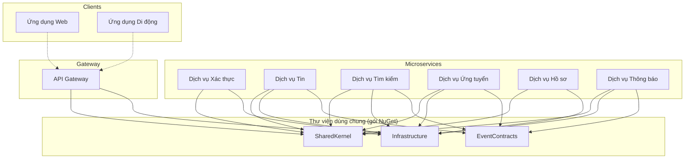

Tất cả các mô-đun dùng chung được tiêu thụ từ gói NuGet đã xuất bản thay vì tham chiếu từ một thư mục dùng chung; các phiên bản mới được lan truyền tới các repository dịch vụ thông qua Dependabot hoặc sự kiện `repository_dispatch`, như mô tả trong Phần 3.13.

#### 8.7.4 Kiểm thử hợp đồng và khả năng tương thích Event Schema

Để tránh lỗi runtime khi `job-platform-shared` thay đổi Event Schema (ví dụ: thêm/xóa trường trong `job.created`):

- **Contract Test bắt buộc:** Trong CI của mỗi dịch vụ, chạy consumer-driven contract test (Pact / schema verifier) với phiên bản `job-platform-shared` mới nhất trước khi merge vào `main`; chặn merge nếu có breaking change.
- **Versioning SemVer:** Breaking change → tăng major version; hỗ trợ **dual-read** (chấp nhận cả trường cũ và mới) trong một phiên bản để rolling update an toàn.
- **Chiến lược tương thích:** Consumer bỏ qua field lạ (ignore unknown fields), Producer chỉ thêm optional field trong minor version; mọi breaking change phải có ADR và migration guide.

#### 8.7.3 Lợi ích của Multirepo cho dự án này

| Lợi ích | Lý do |
|:--------|:------|
| **Quản lý phiên bản và triển khai độc lập** | Mỗi repository có lịch trình phát hành và triển khai riêng |
| **CI/CD cho từng repository** | Đường ống giới hạn trong một dịch vụ; một thay đổi chỉ xây dựng lại dịch vụ đó |
| **Quyền sở hữu của nhóm** | Mỗi thành viên sở hữu và quản lý repository của mình một cách độc lập |
| **Tuân thủ yêu cầu môn học** | Phân bố trên nhiều repository/tổ chức phù hợp với yêu cầu học thuật |
| **Ranh giới rõ ràng hơn** | Ranh giới dịch vụ và công nghệ được đảm bảo bởi cấu trúc repository |
| **Đơn giản hóa việc gia nhập** | Nhà phát triển mới tập trung vào một repository thay vì toàn bộ hệ thống |

**Đánh đổi:** Mã dùng chung được phân phối qua gói NuGet, vì vậy một thay đổi trong thư viện dùng chung đòi hỏi tăng phiên bản và cập nhật các dịch vụ phụ thuộc thay vì một cam kết nguyên tử.

---

### 8.8 Kiến trúc bảo mật

#### 8.8.1 Luồng xác thực

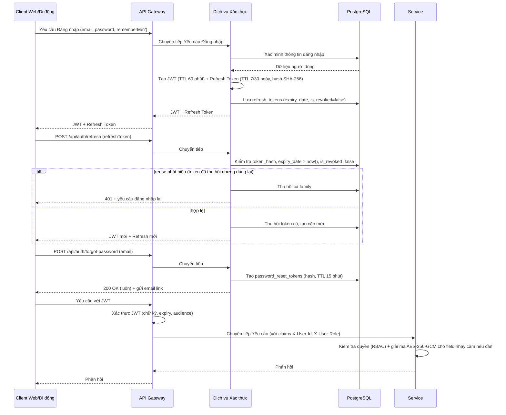

#### 8.8.1.1 Mã hóa dữ liệu nhạy cảm (SEC-08)

- Trường `phone`, `address`, `date_of_birth` trong `profile_db` được mã hóa **AES-256-GCM** ở tầng ứng dụng với IV riêng mỗi bản ghi; khóa lấy từ Secret Manager / Env Var, rotation 90 ngày (xem `6.3.1`).
- Mật khẩu băm `bcrypt cost 12`; CV truy cập qua pre-signed URL 1h; secret qua K8s Secret/Vault.

#### 8.8.2 Luồng phân quyền

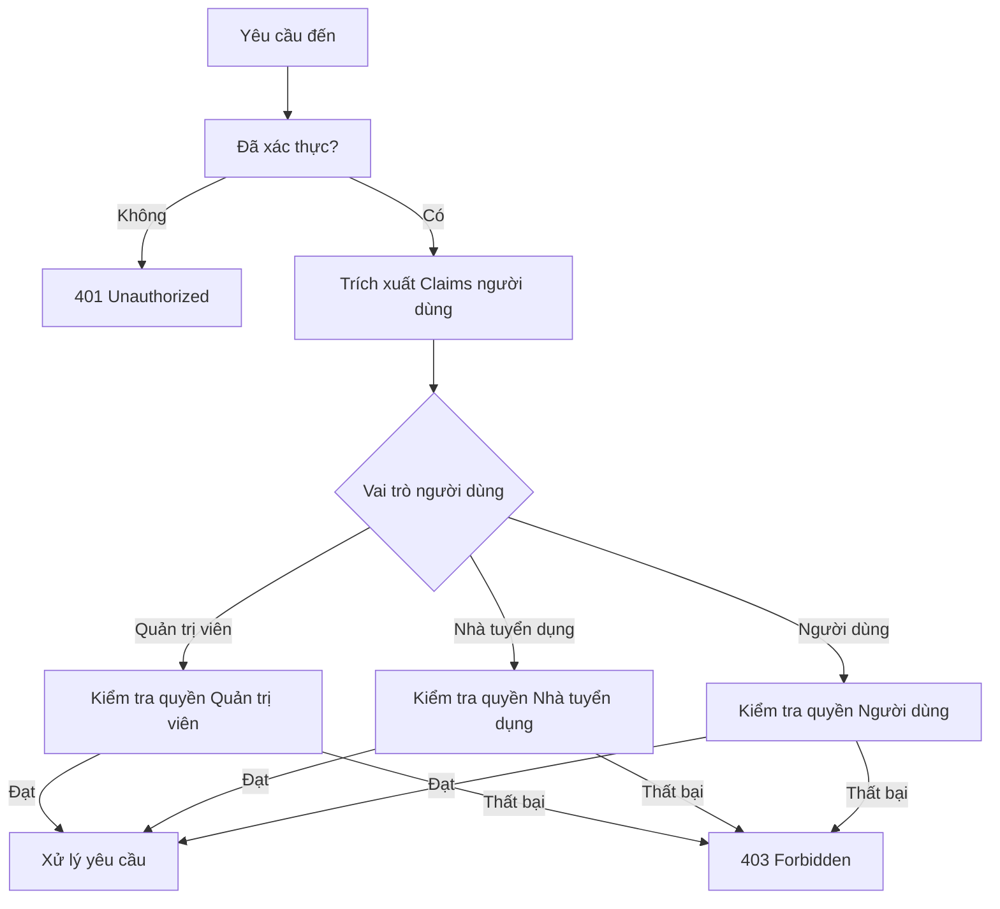

---

### 8.9 Tóm tắt ngăn xếp công nghệ

Bảng sau tóm tắt các lựa chọn công nghệ cho kiến trúc hệ thống. Lưu ý rằng SRS xác định yêu cầu và giao diện, không phải triển khai cụ thể, nhưng bản tóm tắt này được cung cấp cho ngữ cảnh.

| Lớp | Công nghệ | Mục đích | Mức độ ưu tiên |
|:-----|:----------|:---------|:---------------|
| Framework Phụ trợ | Modern enterprise framework (.NET) | Triển khai dịch vụ | BẮT BUỘC |
| API Gateway | Modern API Gateway (YARP) | Định tuyến và xác thực yêu cầu | BẮT BUỘC |
| Giao diện người dùng Web | Modern SPA framework (React + Vite) | Giao diện web | BẮT BUỘC |
| Framework Di động | Cross-platform framework (Flutter) | Giao diện di động | BẮT BUỘC |
| Cơ sở dữ liệu | PostgreSQL | Kho dữ liệu chính | BẮT BUỘC |
| Bộ nhớ đệm | Redis | Đệm và lưu trữ phiên | NÊN CÓ |
| Công cụ tìm kiếm | Elasticsearch | Tìm kiếm toàn văn | BẮT BUỘC |
| Message Broker | Kafka | Giao tiếp hướng sự kiện | NÊN CÓ |
| Lưu trữ tệp | S3-compatible (Cloudflare R2) | Lưu trữ tệp | NÊN CÓ |
| Container hóa | Docker + Docker Compose | Quản lý container | BẮT BUỘC |
| CI/CD | GitHub Actions | Tự động hóa | BẮT BUỘC |
| Giám sát | Grafana + Prometheus | Quan sát | NÊN CÓ |

---

**Hết Phần 8**