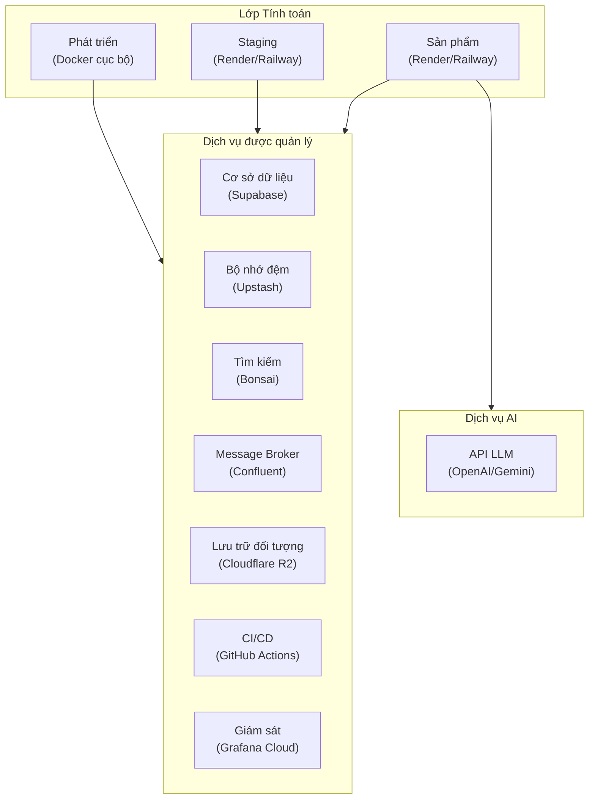
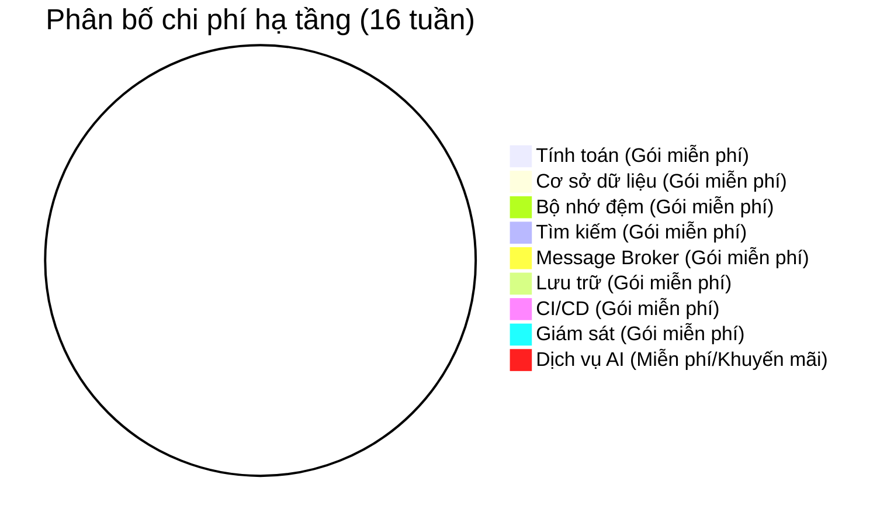
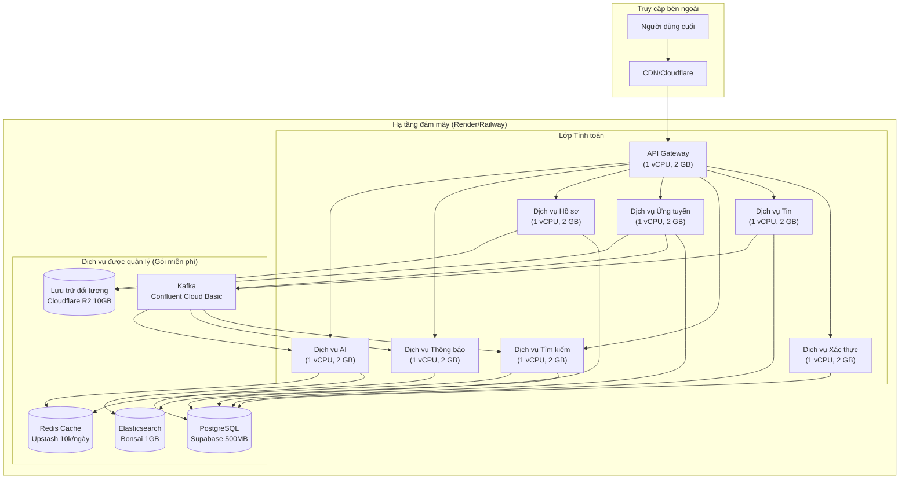
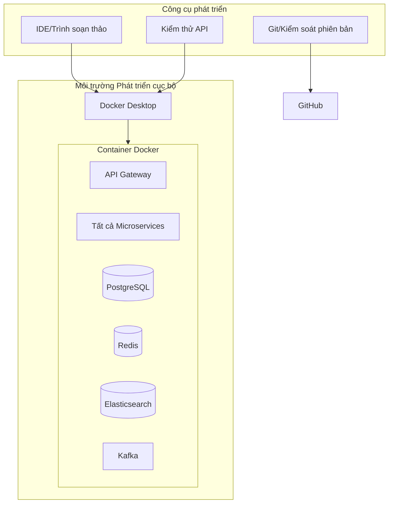
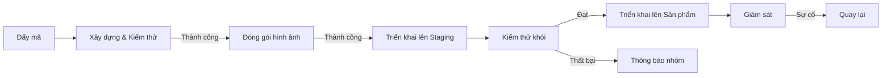

# Đặc tả Yêu cầu Phần mềm (SRS)

[English](../en/9-infra-cost-analysis.md) | [Tiếng Việt](9-infra-cost-analysis.vi.md)

## Nền tảng Việc làm Việt Nam - Kiến trúc Microservices

**Phiên bản:** 1.0  
**Ngày:** 17 tháng 8 năm 2026  
**Dự án:** Nền tảng Việc làm Việt Nam (Vietnam Job Platform)  

---

## Phần 9: Hạ tầng và Phân tích chi phí

### 9.1 Tổng quan

Phần này ghi lại chiến lược hạ tầng và phân tích chi phí cho Nền tảng Việc làm Việt Nam. Hạ tầng tận dụng các gói miễn phí và tín dụng khuyến mãi từ các nhà cung cấp đám mây lớn, đạt được chi phí hiệu quả là **$0** cho các giai đoạn phát triển, staging và trình diễn. Cách tiếp cận này phù hợp với ràng buộc của dự án về hạ tầng không chi phí trong khi vẫn duy trì các yêu cầu kỹ thuật cho kiến trúc microservices cấp độ sản phẩm.

Hạ tầng được tổ chức thành các lớp sau:

---

### 9.2 Thành phần hạ tầng

Bảng sau đây ghi lại tất cả các thành phần hạ tầng cần thiết cho hệ thống.

| Danh mục thành phần | Thành phần | Mục đích | Nhà cung cấp | Mức độ ưu tiên |
|:--------------------|:-----------|:---------|:-------------|:---------------|
| **Tính toán** | Môi trường Phát triển | Phát triển và kiểm thử cục bộ | Docker Compose (Cục bộ) | BẮT BUỘC |
| **Tính toán** | Môi trường Staging | Kiểm thử tiền sản phẩm | Render / Railway | NÊN CÓ |
| **Tính toán** | Môi trường Sản phẩm | Triển khai hệ thống trực tiếp | Render / Railway | NÊN CÓ |
| **Cơ sở dữ liệu** | PostgreSQL | Lưu trữ dữ liệu chính | Supabase | BẮT BUỘC |
| **Bộ nhớ đệm** | Redis | Đệm và lưu trữ phiên | Upstash | NÊN CÓ |
| **Công cụ tìm kiếm** | Elasticsearch | Tìm kiếm toàn văn và lập chỉ mục | Bonsai / Elastic Cloud | BẮT BUỘC |
| **Message Broker** | Kafka | Giao tiếp hướng sự kiện | Confluent Cloud | NÊN CÓ |
| **Lưu trữ đối tượng** | Lưu trữ tương thích S3 | Lưu trữ tệp (CV, ảnh đại diện) | Cloudflare R2 | NÊN CÓ |
| **Container Registry** | Docker Registry | Lưu trữ hình ảnh container | GitHub Container Registry | BẮT BUỘC |
| **CI/CD** | Đường ống Tự động hóa | Tự động hóa xây dựng, kiểm thử và triển khai | GitHub Actions | BẮT BUỘC |
| **Giám sát** | Ngăn xếp Quan sát | Chỉ số, nhật ký và cảnh báo | Grafana Cloud | NÊN CÓ |
| **Dịch vụ AI** | API LLM | Chatbot AI và chấm điểm CV | OpenAI / Google Gemini | TỐT NÊN CÓ |
| **Tên miền/Đường hầm** | Tiếp xúc Công khai | Truy cập công khai an toàn | Cloudflare Tunnel | NÊN CÓ |

---

### 9.3 Phân tích chi phí chi tiết

Bảng sau đây cung cấp phân tích chi phí chi tiết cho tất cả thành phần hạ tầng trong suốt thời gian dự án 16 tuần.

| Danh mục thành phần | Nhà cung cấp dịch vụ | Gói miễn phí / Khuyến mãi | Thời hạn hiệu lực | Chi phí 16 tuần |
|:--------------------|:---------------------|:--------------------------|:------------------|:----------------|
| **Tính toán (VM)** | Google Cloud Platform | f1-micro: 0.2 vCPU, 0.6 GB RAM, 30 GB HDD | Always Free (trong giới hạn) | $0 |
| **Tính toán (VM)** | AWS / Azure | EC2 t2.micro (AWS) hoặc B1S (Azure): 1 vCPU, 1 GB RAM | 12 tháng | $0 |
| **Tính toán (VM)** | DigitalOcean / Vultr | $200 - $250 tín dụng khuyến mãi | 30-60 ngày | $0 |
| **Tính toán (Container)** | Render | Free 750h/tháng 512 MB 0.1 CPU (tạm dừng 15m) + Vercel web | Free (tạm dừng) | $0 |
| **Tính toán (Container)** | Railway | $5 thử / $1 Free Hobby $5 | Khuyến mãi | $0 |
| **Cơ sở dữ liệu được quản lý** | Supabase | PostgreSQL: 500 MB lưu trữ, xác thực, tính năng realtime | Always Free (trong giới hạn) | $0 |
| **Cơ sở dữ liệu được quản lý** | Neon | PostgreSQL: 1 GB lưu trữ, nhánh | Always Free (trong giới hạn) | $0 |
| **Bộ nhớ đệm được quản lý** | Upstash | Redis: 10.000 lệnh mỗi ngày | Always Free (trong giới hạn) | $0 |
| **Công cụ tìm kiếm** | Bonsai | Elasticsearch: 1 GB cluster | Always Free (trong giới hạn) | $0 |
| **Công cụ tìm kiếm** | Elastic Cloud | Elasticsearch: 1 GB cluster (dùng thử) | 14 ngày (có thể gia hạn) | $0 |
| **Message Broker** | Confluent Cloud | Kafka: Gói Basic với thông lượng giới hạn | Always Free (trong giới hạn) | $0 |
| **Lưu trữ đối tượng** | Cloudflare R2 | 10 GB lưu trữ, egress không giới hạn | Always Free (trong giới hạn) | $0 |
| **Container Registry** | GitHub Container Registry | Kho lưu trữ công khai không giới hạn | Always Free | $0 |
| **Đường ống CI/CD** | GitHub Actions | 2.000 phút miễn phí/tháng (repo riêng), không giới hạn (repo công) | Always Free (trong giới hạn) | $0 |
| **Ngăn xếp Giám sát** | Grafana Cloud | 10.000 chỉ số Prometheus, 50 GB logs, 50 GB traces/tháng | Always Free (trong giới hạn) | $0 |
| **Dịch vụ AI (LLM)** | OpenAI | $5 tín dụng miễn phí | Khuyến mãi / Giới hạn | $0 |
| **Dịch vụ AI (LLM)** | Google Gemini | ~60 yêu cầu/phút miễn phí | Always Free (trong giới hạn) | $0 |
| **Tên miền / Đường hầm** | Cloudflare Tunnel | Tiếp xúc công khai an toàn không cần IP công khai hoặc tên miền trả phí | Always Free | $0 |

---

### 9.4 Tổng chi phí ước tính

**$0.00 USD** cho toàn bộ vòng đời dự án 16 tuần, bao gồm các giai đoạn phát triển, kiểm thử, staging và trình diễn.

---

### 9.5 Chiến lược tối ưu chi phí

Các chiến lược sau được sử dụng để đạt được hạ tầng không chi phí:

| Chiến lược | Mô tả | Triển khai |
|:-----------|:------|:-----------|
| **Tận dụng Gói miễn phí** | Triển khai dịch vụ nền tảng bằng các gói Always Free | GCP f1-micro, Supabase, Upstash, Cloudflare R2, Bonsai |
| **Tín dụng khuyến mãi** | Tận dụng tín dụng dùng thử cho tài nguyên tính toán bổ sung | Tín dụng AWS/Azure, DigitalOcean/Vultr, Railway |
| **Tránh chi phí Egress** | Sử dụng dịch vụ có chuyển dữ liệu miễn phí | Cloudflare R2 cung cấp egress miễn phí |
| **Quản lý chi phí API AI** | Sử dụng nhà cung cấp LLM gói miễn phí một cách chiến lược | Gemini cho yêu cầu số lượng lớn, tín dụng OpenAI cho tạo mẫu |
| **Triển khai Container hóa** | Đóng gói tất cả dịch vụ bằng Docker | Triển khai lên Render hoặc Railway gói miễn phí |
| **Dịch vụ được quản lý** | Sử dụng dịch vụ được quản lý thay vì tự lưu trữ | Giảm chi phí vận hành và quản lý |
| **Hạ tầng dưới dạng mã** | Tự động hóa cung cấp hạ tầng | Giảm lỗi thủ công và chi phí quản lý |

---

### 9.6 Kiến trúc hạ tầng

#### 9.6.1 Kiến trúc Staging và Sản phẩm

#### 9.6.2 Kiến trúc phát triển

---

### 9.7 Quy trình triển khai

#### 9.7.1 Các bước triển khai Staging

| Bước | Hành động | Người phụ trách | Xác nhận |
|:-----|:----------|:---------------|:---------|
| 1 | Xây dựng tất cả dịch vụ và ứng dụng | CI/CD (GitHub Actions) | Tất cả bản xây dựng thành công |
| 2 | Chạy tất cả kiểm thử tự động | CI/CD (GitHub Actions) | Tất cả kiểm thử thành công |
| 3 | Đóng gói hình ảnh Docker và đẩy lên registry | CI/CD (GitHub Actions) | Hình ảnh được đẩy thành công |
| 4 | Triển khai lên môi trường staging | TM1 | Dịch vụ khởi động thành công |
| 5 | Chạy kiểm thử khói trên staging | Tất cả | Các điểm cuối chính phản hồi |
| 6 | Mời người dùng kiểm thử | Tất cả | Người dùng có thể truy cập staging |
| 7 | Thu thập và xử lý phản hồi | Tất cả | Các vấn đề được giải quyết |

#### 9.7.2 Các bước triển khai Sản phẩm

| Bước | Hành động | Người phụ trách | Xác nhận |
|:-----|:----------|:---------------|:---------|
| 1 | Xác minh triển khai staging ổn định | Tất cả | Staging vượt qua xác nhận |
| 2 | Sao lưu cơ sở dữ liệu sản phẩm (nếu có) | TM1 | Sao lưu được tạo |
| 3 | Triển khai lên môi trường sản phẩm | TM1 | Dịch vụ khởi động thành công |
| 4 | Chạy kiểm thử khói trên sản phẩm | Tất cả | Các điểm cuối chính phản hồi |
| 5 | Giám sát sức khỏe sản phẩm | TM1 | Không phát hiện lỗi |
| 6 | Xác minh giám sát và ghi nhật ký đang hoạt động | TM1 | Chỉ số và nhật ký hiển thị |
| 7 | Cập nhật tài liệu | Tất cả | Tài liệu phản ánh sản phẩm |

#### 9.7.3 Đường ống triển khai

---

### 9.8 Chiến lược Gói miễn phí

#### 9.8.1 Dịch vụ chính (Always Free)

| Dịch vụ | Nhà cung cấp | Giới hạn | Sử dụng |
|:--------|:-------------|:---------|:--------|
| **Tính toán** | GCP | f1-micro (0.2 vCPU, 0.6 GB RAM) | Gateway hoặc giám sát nhẹ |
| **Tính toán** | Render + Vercel | 750h/tháng 512 MB + Vercel web CDN | Tất cả microservices + web |
| **Cơ sở dữ liệu** | Supabase | 500 MB lưu trữ | Dữ liệu ứng dụng |
| **Bộ nhớ đệm** | Upstash | 10.000 lệnh/ngày | Đệm, giới hạn tốc độ |
| **Tìm kiếm** | Bonsai | 1 GB cluster | Lập chỉ mục tìm kiếm việc làm |
| **Message Broker** | Confluent | Gói Basic (thông lượng giới hạn) | Giao tiếp hướng sự kiện |
| **Lưu trữ** | Cloudflare R2 | 10 GB lưu trữ | Lưu CV, ảnh đại diện, logo |
| **CI/CD** | GitHub Actions | 2.000 phút/tháng | Tự động hóa xây dựng và kiểm thử |
| **Giám sát** | Grafana Cloud | 10.000 chỉ số | Quan sát |
| **Đường hầm** | Cloudflare | Không giới hạn | Tiếp xúc công khai an toàn |

#### 9.8.2 Dịch vụ dự phòng

| Dịch vụ | Nhà cung cấp | Giới hạn | Khi sử dụng |
|:--------|:-------------|:---------|:------------|
| **Tính toán** | AWS/Azure | Gói miễn phí 12 tháng | Nếu GCP/Render đạt giới hạn |
| **Tính toán** | DigitalOcean/Vultr | $200-$250 tín dụng | Nếu cần thêm tài nguyên tính toán |
| **Cơ sở dữ liệu** | Neon | 1 GB lưu trữ | Nếu vượt quá giới hạn Supabase |
| **Tìm kiếm** | Elastic Cloud | Dùng thử 14 ngày | Nếu vượt quá giới hạn Bonsai |

---

### 9.9 Giám sát tài nguyên

Để đảm bảo giới hạn gói miễn phí không bị vượt quá, chiến lược giám sát sau được triển khai:

| Tài nguyên | Chỉ số | Ngưỡng cảnh báo | Hành động |
|:-----------|:-------|:-----------------|:----------|
| **Supabase** | Sử dụng lưu trữ | > 400 MB | Lưu trữ dữ liệu cũ |
| **Supabase** | Kết nối cơ sở dữ liệu | > 15 | Tăng giới hạn nhóm |
| **Upstash** | Lệnh/ngày | > 8.000 | Tối ưu chiến lược đệm |
| **Bonsai** | Kích thước cluster | > 800 MB | Xóa chỉ mục cũ |
| **Confluent** | Thông lượng | > 80% giới hạn | Giảm tốc độ xuất bản sự kiện |
| **GitHub Actions** | Phút/tháng | > 1.800 | Tối ưu đường ống CI |
| **Grafana** | Chỉ số | > 8.000 | Giảm thu thập chỉ số |

---

### 9.10 Cân nhắc rủi ro

| Rủi ro | Xác suất | Tác động | Chiến lược giảm thiểu |
|:-------|:---------|:---------|:----------------------|
| **Cạn kiệt tài nguyên gói miễn phí** | Trung bình | Cao | Giám sát chỉ số sử dụng; nâng cấp chỉ khi cần thiết |
| **Hết hạn tín dụng khuyến mãi** | Trung bình | Trung bình | Ưu tiên dịch vụ Always Free; tín dụng chỉ dùng cho nhu cầu ngắn hạn |
| **Giới hạn tốc độ API (dịch vụ AI)** | Trung bình | Thấp | Triển khai đệm và giới hạn tốc độ; sử dụng Gemini cho yêu cầu số lượng lớn |
| **Lưu trữ dữ liệu khi khởi động lại dịch vụ** | Thấp | Cao | Sử dụng dịch vụ được quản lý (Supabase, Upstash) để đảm bảo độ bền dữ liệu |
| **Nhà cung cấp dịch vụ thay đổi gói miễn phí** | Thấp | Cao | Đã xác định nhà cung cấp dự phòng |
| **Gián đoạn dịch vụ đám mây** | Thấp | Trung bình | Đa khu vực nếu có thể; phát triển cục bộ luôn sẵn sàng |
| **Giới hạn kết nối cơ sở dữ liệu** | Trung bình | Cao | Nhóm kết nối; giám sát kết nối đang hoạt động |

---

### 9.11 Tóm tắt yêu cầu hạ tầng

| Danh mục | BẮT BUỘC | NÊN CÓ | TỐT NÊN CÓ | Tổng |
|:---------|:---------|:-------|:-----------|:-----|
| Tính toán | 1 | 2 | 0 | 3 |
| Cơ sở dữ liệu | 1 | 0 | 0 | 1 |
| Bộ nhớ đệm | 0 | 1 | 0 | 1 |
| Tìm kiếm | 1 | 0 | 0 | 1 |
| Message Broker | 0 | 1 | 0 | 1 |
| Lưu trữ | 0 | 1 | 0 | 1 |
| Container Registry | 1 | 0 | 0 | 1 |
| CI/CD | 1 | 0 | 0 | 1 |
| Giám sát | 0 | 1 | 0 | 1 |
| Dịch vụ AI | 0 | 0 | 1 | 1 |
| Tên miền/Đường hầm | 0 | 1 | 0 | 1 |
| **Tổng** | **5** | **7** | **1** | **13** |

---

### 9.12 Cân nhắc sau dự án

Mặc dù dự án được thiết kế cho hạ tầng không chi phí trong thời gian 16 tuần, các cân nhắc sau áp dụng cho khả năng sử dụng trong tương lai:

| Cân nhắc | Khuyến nghị | Chi phí ước tính |
|:---------|:------------|:-----------------|
| **Mở rộng quy mô sản phẩm** | Nâng cấp lên gói trả phí khi cơ sở người dùng phát triển | $50-200/tháng |
| **Tăng trưởng dữ liệu** | Mở rộng cơ sở dữ liệu và lưu trữ khi cần | $10-50/tháng |
| **Tính năng AI** | Đăng ký dịch vụ AI trả phí cho sản phẩm | $20-100/tháng |
| **Tính sẵn sàng cao** | Triển khai đa khu vực để dự phòng | $100-300/tháng |
| **Hỗ trợ chuyên nghiệp** | Mua gói hỗ trợ cho dịch vụ quan trọng | $50-200/tháng |

---

**Hết Phần 9**